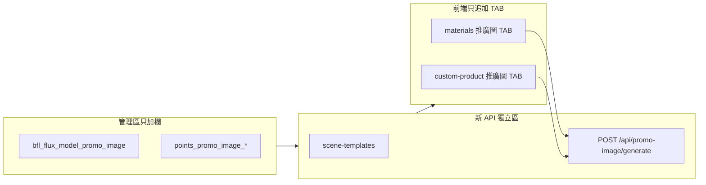

# 產品推廣圖 — 實作規劃（執行順序）

> **依據**：[`PLAN-product-promo-image-generator.md`](./PLAN-product-promo-image-generator.md)  
> **硬性約束**：§0.0 隔離原則 — **不得影響任何現有功能**  
> **日期**：2026-07-19

---

## 總覽



| 原則 | 做法 |
|------|------|
| 只加不改 | 新 SQL／新 key／新 route／新 TAB／新 panel／新 JS 區塊 |
| 可複製不可改壞 | 計價抄圖樣提取「精神」；選圖**呼叫**寫實化 picker，不改其狀態 |
| 失敗可回滾 | 每階段可獨立 commit；前端 TAB 掛不上也不影響舊 TAB |

---

## 階段 0 — 文件與契約（不寫業務邏輯）

**產出**：本檔 + 產品規劃已齊；實作前凍結以下契約。

| 項目 | 契約 |
|------|------|
| 模型槽 | `bfl_flux_model_promo_image` → 預設 `flux-2-pro` |
| 點數 | `points_promo_image_base`=20；`points_promo_image_per_extra_mp`=10 |
| 消耗類型 | `consumeUserCredits(..., 'promo_image', ...)`（新 reason，勿複用既有） |
| 廠商 TAB | `id="tab-promo"` / `data-kind="promo"` / `#panel-promo` |
| 設計 TAB | `id="tab-promo-image"` / `#panel-promo-image` |
| 生圖 | 僅 `getBflFluxEndpointForConfigKey('bfl_flux_model_promo_image')` + `bflPlaygroundImageEdit` |

**禁止動到的檔案／函式（除非只「追加」一行 config）**：

- `composeGeneratePromptWithReferences`、材料 optimize、寫實化 `runDesignToPhysicalFlux` 本體
- 既有 `points_design_to_physical*`、`points_pattern_extract*` 的預設值與讀取邏輯（只允許在 **membership 列表尾端追加** 兩個新 key）
- `manufacturer-materials` 的 `prototype`／`part`／`material` 切換與上傳／編輯／重繪／放大流程
- `custom-product` 既有五個 TAB 的 panel 與產生按鈕

---

## 階段 1 — 資料庫與設定鍵（零前端）

### 1.1 SQL（新建檔）

`docs/add-product-promo-image.sql`：

1. `promo_scene_templates`（情境模板 + 5 筆 seed）
2. `product_promo_generations`（生成紀錄，可選；MVP 可先寫紀錄或僅記 ledger）
3. `payment_config` upsert：
   - `points_promo_image_base` = `20`
   - `points_promo_image_per_extra_mp` = `10`
   - （模型槽可不必 SQL 預插；後台第一次儲存才寫入亦可）

**執行**：使用者在 Supabase SQL Editor 跑；Agent 不擅自改線上 DB。

### 1.2 驗收

- [ ] 表存在；seed 5 筆模板
- [ ] 兩點數 key 可讀
- [ ] **無**既有表結構變更（除新表／新 upsert）

---

## 階段 2 — 後端：模型槽 + 點數 + API（不碰前端頁）

### 2.1 模型槽（最小 diff）

| 檔案 | 動作 |
|------|------|
| `server.js` `BFL_FLUX_MODEL_CONFIG` | **追加一行** `bfl_flux_model_promo_image: 'flux-2-pro'` |
| `public/admin/ai-settings.html` | FLUX 區塊**追加一欄** `#bflFluxModelPromoImage`；load／save／hint **追加**，不改其他欄 id |

`GET`/`PATCH /api/admin/ai-config` 已遍歷 `BFL_FLUX_MODEL_CONFIG` → 理論上加 key 即通。

### 2.2 點數（對齊圖樣提取，獨立函式）

在 `server.js` **新增**：

```text
getPointsPromoImageBase()
getPointsPromoImagePerExtraMp()
promoImageMegapixelsFromResolution(w, h)   // 可複製 patternExtractMegapixels 邏輯，獨立函式勿共用改名
getPointsPromoImageForResolution(w, h)
```

`GET`/`PATCH` 會員點數 admin API + `membership.html`：**列表尾端追加**兩欄，不改既有列。

### 2.3 Prompt 組裝（全新函式）

```text
buildPromoImagePrompt({ sceneTemplate, userPrompt, photographySetId })
```

- 讀 `promo_scene_templates` + 可選 `photography_prompt_sets.body_text`
- **禁止**呼叫或修改 `composeGeneratePromptWithReferences` / 寫實化 prompt builder

### 2.4 API（全新路由，建議集中在 `server.js` 末段或獨立區塊註解）

| Method | Path | 說明 |
|--------|------|------|
| GET | `/api/promo-image/scene-templates` | 啟用中模板列表（可公開或需登入） |
| GET | `/api/promo-image/points-preview?w=&h=` | 回傳預估點數（前端顯示用） |
| GET | `/api/photography-prompt-sets` 或沿用既有公開讀取 | 若已有前端可讀 API 則**重用 URL，不改實作**；沒有再**新增**唯讀 endpoint |
| POST | `/api/promo-image/generate` | body：image（url/base64）、aspect／w／h、scene_template_key、user_prompt、photography_set_id、source_type、source_id |

**`POST /api/promo-image/generate` 流程**（對齊寫實化：成功才扣點）：

1. 登入檢查  
2. 解析尺寸 → 算點 → 餘額檢查  
3. 組 prompt  
4. `bflPlaygroundImageEdit`（獨立槽）  
5. 成功 → `consumeUserCredits(..., 'promo_image', ...)`  
6. 回傳 `imageData` + `points_deducted`  
7. （可選）寫入 `product_promo_generations`

失敗：不扣點。

### 2.5 驗收

- [ ] 後台可存／載推廣圖模型，**其他模型欄不變**
- [ ] curl／本機打 generate：1MP 扣 20；失敗不扣
- [ ] 產品設計生圖、寫實化、圖樣提取 API 手動 smoke 仍 OK

---

## 階段 3 — 共用前端模組（可選但建議）

新建 **`public/js/matchdo-promo-image.js`**（僅新檔）：

- 比例 presets、點數預覽呼叫
- 情境／攝影參數下拉 HTML
- `generatePromoImage(payload)` fetch 封裝
- **不**依賴、不修改 `matchdo-upscale-scale.js`／pending 卡片邏輯

兩頁各自 include + `?v=` cache bust。

若為降低風險，也可先把邏輯各寫在兩頁內、之後再抽模組（仍遵守隔離）。

---

## 階段 4 — 設計頁 TAB（`custom-product.html`）

### 4.1 DOM（只追加）

1. `#designTabs` 在「寫實化」`<li>` **之後**插入「推廣圖」`<li>`（同款 `nav-link`，不換色）  
2. `#designTabContent` **追加** `#panel-promo-image`（結構可仿寫實化左右欄：選圖｜結果）

### 4.2 選圖

- 「本機上傳」：獨立 `input[type=file]`（自己的 id）  
- 「從數位資產」：**觸發既有** asset picker 的開啟方式；選完回寫到**推廣圖自己的** preview state  
- 禁止改 `#designToPhysical*` 的變數與 handler

### 4.3 面板欄位

情境模板｜比例／解析度｜點數顯示｜攝影參數｜使用者提示詞｜生成鈕｜結果圖下載

### 4.4 JS

獨立 IIFE／區塊，`tab` show 時才綁或一次綁但只操作 promo 節點。

### 4.5 驗收

- [ ] 切換舊五 TAB 行為不變  
- [ ] 寫實化選圖／扣點／結果仍正常  
- [ ] 推廣圖 1MP 顯示 20 點並可生成

---

## 階段 5 — 廠商素材庫 TAB（`manufacturer-materials.html`）

### 5.1 DOM（只追加）

1. `#asset-kind-tabs` 在「材料/顏色」**之後**插入異色「推廣圖」  
2. 追加 `#panel-promo`（`asset-kind-panel d-none`）

### 5.2 kind 切換（高風險點 — 務必最小改）

現有切換多半是：讀 `data-kind` ∈ {prototype, part, material} → 顯示對應 panel。

**允許的改法**（擇一，優先 A）：

- **A**：在 switch 函式末尾加 `else if (kind === 'promo')` 顯示 `#panel-promo`、隱藏其他；**既有三分支一字不改**  
- **B**：若現有是白名單陣列，**陣列尾端 push `'promo'`**，並確保 upload form 不會對 `promo` 跑新增流程

**禁止**：重構整個 kind 切換、改 `prototype` 預設 active、改 URL hash 語意若會弄壞書籤（若支援 `?kind=`，僅允許 promo 為新值）。

### 5.3 選產品卡 → 帶入全部圖

- 讀既有 list API／記憶體中的 assets（prototype／part；材料是否納入：**MVP 建議僅 prototype + part**，材料不做推廣主戰場，避免與材料 AI 優化混淆）  
- 點卡片 → 右側／下方列出該卡 `image_url` + gallery 全部縮圖，勾選 1 張當來源  
- **不**在列表卡片上加按鈕；**不**改 `renderPendingImages`／編輯 gallery 卡片 UI

### 5.4 CSS

僅 `#tab-promo` / `#panel-promo` 範圍（異色 tab），禁止動 `#asset-kind-tabs .nav-link` 全域規則到影響舊 TAB（若必須加異色，用 `#tab-promo.nav-link` 高優先級單獨寫）。

### 5.5 驗收

- [ ] 三 kind 上傳／列表／編輯／重繪／放大／寫實化回歸 OK  
- [ ] 推廣 TAB 可選卡、帶全圖、生成  
- [ ] 材料 TAB 外觀與切換不受異色 CSS 波及

---

## 階段 6 — 管理區點數 UI + 文案

| 檔案 | 動作 |
|------|------|
| `public/admin/membership.html` | 點數表**尾端追加**「推廣圖 1MP」「推廣圖每多 1MP」 |
| （可選）i18n | 新 key 另加；舊 key 不改 |

---

## 階段 7 — 回歸清單（上線前必過）

### 設計頁

- [ ] 產品設計生圖  
- [ ] 廠商版型  
- [ ] 實境模擬  
- [ ] 圖樣提取（含 MP 計價）  
- [ ] 寫實化（20 點）  

### 廠商素材庫

- [ ] 原型／配件／材料：上傳、編輯、封面、移除  
- [ ] AI 重繪／放大／寫實化（廠商點數）同格 UI 不變  

### 管理區

- [ ] 既有 FLUX 模型欄仍可存  
- [ ] 既有點數鍵數值未被覆蓋  

### 推廣圖本身

- [ ] 兩入口可生成；失敗不扣點；1MP=20  

---

## 建議 commit 切片（便於回滾）

1. `docs: 推廣圖 SQL + 實作規劃`  
2. `feat: 推廣圖模型槽 + 點數 + generate API`  
3. `feat: 設計頁推廣圖 TAB`  
4. `feat: 廠商素材庫推廣圖 TAB`  
5. `feat: membership 推廣圖點數欄`  

每片 push 前跑對應回歸；**禁止**把 2～4 揉成超大 commit 難以還原。

---

## 預估工期（單人）

| 階段 | 預估 |
|------|------|
| 1 SQL | 0.5h |
| 2 後端 | 0.5～1d |
| 3 共用 JS | 0.5d（可併入 4） |
| 4 設計 TAB | 0.5～1d |
| 5 廠商 TAB | 1d（kind 切換最需小心） |
| 6～7 管理＋回歸 | 0.5d |

---

## MVP 刻意不做（避免拖累／誤傷）

- 卡片上的推廣按鈕  
- 批次多情境一次生成  
- 結果自動寫回 vendor gallery／custom_products（先下載）  
- 改 sitemap／選單權限  
- 動 FLUX prompt 政策檔（除非之後要寫推廣專用條款，另開需求）

---

## 實作啟動順序（請你確認後再動手）

1. 階段 1 SQL（你執行）  
2. 階段 2 後端 + ai-settings  
3. 階段 4 設計頁 TAB  
4. 階段 5 廠商 TAB  
5. 階段 6 membership + 回歸  

若同意，回覆「開始實作」並指定要不要先做設計頁或廠商頁；預設依上表 **2 → 4 → 5**。
