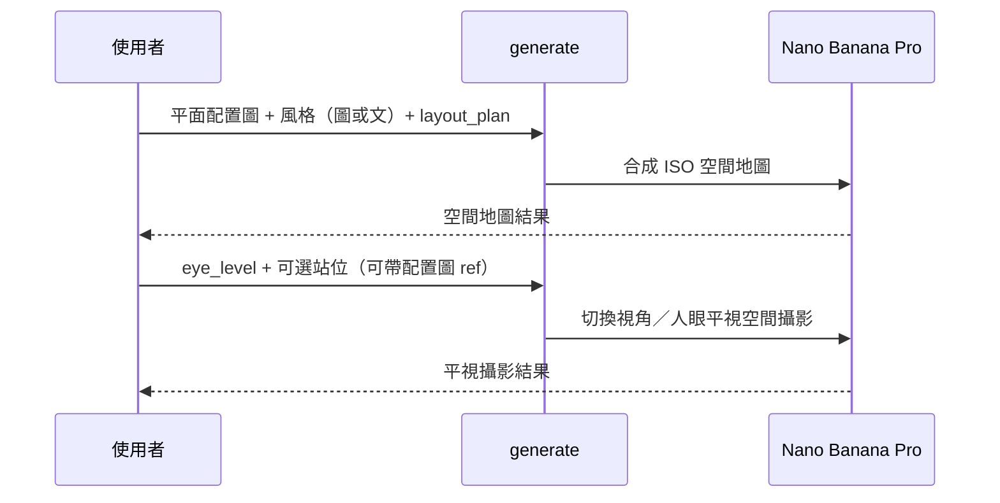

# 商攝導演 — 拍攝模式擴充規劃（產品／空間／人像）

> **更新**：2026-08-11（§14 實作進度；§3.14 **2K≠4K** 與點數定案；§3.6.2 空間用途下拉）  
> **狀態**：規劃定案；**P0a／P0b／P2 部分已上線（本機）**；**P1 待做**  
> **前端 build**（對照部署）：`promo-camera-plan-ui-20260811` · CSS `?v=20260811planui`  
> **前置**：`docs/PLAN-promo-advanced-camera.md`（Phase 1 商攝導演已完成）  
> **隔離原則**：沿用 `.cursor/rules/promo-camera-app-isolation.mdc` — 只加不改；**禁止**改動情境圖 TAB（`/api/promo-image/*`）與 `buildPromoImagePrompt()`。

---

## 0. 實作進度快照（2026-08-11 · 必讀 handoff）

**Agent 曾犯錯（勿再犯）**：未對照本檔就改 UI → 前台誤標 **Gemini／FLUX／4K**、空間假 **1～4 張** 下拉、張數塞在 `pc-flux-shoot-only`、人像 Tab 殘留平面配置圖。已依 §3.4／§10.4 **改回**；**以本檔為準**，勿再「改對又改回去」。

| 項目 | 規劃 | 現況 |
|------|------|------|
| 三 Tab（product／space／portrait） | §8 | ✅ `promo-camera.html`／`index.js` |
| 空間 `layout_plan` Gemini + 平面＋風格 | §10.1 | ✅ `lib/promo-space-gemini.js`、`handlePromoCameraSpaceGenerate` |
| 空間 `eye_level` 單張 explicit | §10.5 P1 步 1～2 | ✅ `layout_generation_id` + 視角 + 相機 |
| 空間用途 `space_use_type` 下拉 | §3.6.2 | ✅ 後端字典；**缺** `zone_intents` API |
| 點數 layout **30**／eye **30** 固定 | §3.5、SQL | ✅ `points-preview` + `payment_config` seed |
| 解析度 | **2K 起**；可选 **4K**（§3.14） | ✅ `imageConfig.imageSize` + clamp |
| 人像 8 主題 + theme 必填 | §5、P0b | ✅ migration + options 篩 audience |
| 人像 1～4 張 FLUX 批次 | P2 擴充 | ✅ `output_count` + Flash Lite briefs |
| 產品／人像選填 **product_image** 第二 ref | P2 | ✅ staging product |
| `zone_intents` + 套圖／多方案 | §10.5 | ❌ 未做 |
| `promo_space_zone_intents` 表 + 後台 | §10.5 步 3 | ❌ 未做 |
| i18n 模式名／placeholder | P1 | ⚠️ 部分仍硬編碼中文 |

**上線前 DB**：Supabase 執行 `docs/add-promo-space-gemini-config.sql`、`docs/add-promo-shoot-modes.sql`（或確認 migration 已跑）。

---

## 1. 背景與目標

商攝導演（`/promo-camera`）目前以 **產品攝影** 為主：上傳 1 張產品圖 → 主題／場景（選填）→ 相機控制台 → FLUX 生圖。

**擴充目標**：在同一套入口與 API 上，新增兩種拍攝模式；**空間模式** `layout_plan` 須上傳 **平面配置圖**（風格可圖可文）：

| 模式 | 英文 key | 核心價值 |
|------|----------|----------|
| **產品攝影** | `product` | 商業產品廣告構圖（**現有**，預設） |
| **空間攝影** | `space` | **平面配置圖** + **風格**（攝影圖或描述）→ AI 產 **ISO 空間地圖**；並可 **切換視角** 產人眼平視攝影 |
| **人像攝影** | `portrait` | 依 **拍攝主題** + 現有場景 + 使用者描述（含服裝／髮型） |

三模式共用：相機控制台、比例／MP、點數、`POST /api/promo-camera/generate`、`product_promo_generations`（`generation_mode = camera_advanced`）。

**生圖引擎分流**

| 模式／輸出 | 引擎 | 模型（Google 商品名） | 說明 |
|------------|------|----------------------|------|
| 空間 · `layout_plan`（ISO 空間地圖） | **Gemini** | **Nano Banana Pro**（`gemini-3-pro-image`） | 平面+風格 → ISO 地圖；**2K 起** |
| 空間 · `eye_level`（切換視角／平視攝影） | **Gemini** | **Nano Banana Pro**（`gemini-3-pro-image`） | 獨立 key；**2K 起** |
| **產品**、**人像** | **FLUX** | `bfl_flux_model_promo_image` | 沿用現有 img2img |

---

## 2. 已定案決策

| # | 決策 |
|---|------|
| 1 | 新增 state／payload 欄位 **`shoot_mode`**：`product` \| `space` \| `portrait` |
| 2 | **產品模式**維持現有 prompt 與 UI 語意，為預設模式 |
| 3 | **空間模式**：不載入 theme／scene；**`layout_plan` 靠平面圖 + 風格（圖或文）** |
| 4 | **`layout_plan` 輸入**：**平面配置圖**（必填）+ **風格**（風格攝影圖 **或** 文字描述二選一）；**不要求**使用者上傳 ISO／俯視**成品**（那是 AI 輸出） |
| 5 | **`layout_plan` 產出**：依平面圖 + 風格 → **ISO 空間地圖**（型錄視覺，**2K 起**，圖上無文字） |
| 6 | **`eye_level` 產出**：在已理解空間（P1 可引用 `layout_plan` 結果）下 **切換視角** → 人眼平視攝影 |
| 7 | **空間 — 輸出類型**：UI 選 `space_output_type`：`layout_plan`（配置圖）\| `eye_level`（平視攝影）；P1 可「先配置圖再平視」同 session 兩步 |
| 8 | **人像模式 — 拍攝主題**：8 類必填（見 §5）；`promo_scene_templates`，`slot=theme`，`audience=portrait` |
| 9 | **人像模式 — 場景**：**沿用現有** `slot=scene` |
| 10 | **人像模式 — 服裝／髮型**：由 **user_prompt** 修改 |
| 11 | **不用** `photography_prompt_sets` |
| 12 | P0 點數：**ISO 空間配置圖**（`layout_plan`）**30 點／張**；`eye_level`、產品、人像另計（見 §3.5／§3.6） |
| 13 | **`layout_plan` — 平面配置圖**：2D 平面圖／配置圖上傳（**必填**）；定義區域、動線、家具位置 |
| 14 | **`layout_plan` — 風格來源**：**風格攝影圖**（`space_style_source=image`）**或** **文字描述**（`space_style_source=prompt`）；二選一 |
| 15 | **`space_style_source=prompt`** 時：`user_prompt` 須描述材質、色調、採光、設計語言（可含空間類型）；可不傳風格圖 |
| 16 | **`layout_plan` 成品**：**圖上不要任何文字**（無標籤、無 logo）；風格／類型僅 prompt + meta |
| 17 | **空間模式生圖引擎 = Gemini**（`layout_plan` 與 `eye_level` 皆是）；**非 FLUX** |
| 18 | 產品、人像 **仍 FLUX**；`shoot_mode=space` 時同一 API 走 Gemini 分支 |
| 19 | **空間兩輸出皆 Nano Banana Pro**；`layout_plan`／`eye_level` 各 **`payment_config` key**（可獨立調模型／點數，預設皆 `gemini-3-pro-image`） |
| 20 | **Nano Banana Pro 最低輸出 = 2K**（最長邊 ≥ 2048px；預設正方形 **2048×2048**；**禁止** 1024 當空間 Pro 成品；**禁止** 對使用者標 **4K** — 見 §3.14） |
| 21 | **各模式點數**（產品／人像 **20**、空間 `layout_plan` **30**）用 **§3.13**：對照 **該任務** 官網自建成本 vs **試錯＋時間＋曝光** 三支柱；**模式之間不互比點數** |
| 22 | **不對使用者揭露**生圖模型／供應商；引擎分工僅 **內部實測 + 後台** |
| 23 | **平台價值三支柱**：省試錯、省時間、**曝光管道**（廠商＋設計者）→ 定價 **高於** 一般堆 API 生圖站 **屬預期**（§3.13） |

---

## 3. 空間攝影 — 產品語意

### 3.1 核心概念（定案）

**`layout_plan`（ISO 空間地圖）**：用 **平面配置圖** 定義「哪裡有什麼、怎麼擺」，用 **風格** 定義「長什麼樣子」；AI 合成 **ISO 空間地圖**（不是使用者上傳 ISO 成品）。

```
layout_plan 輸入
├─ ① 平面配置圖（必填）— 2D floor plan／平面配置
│     → 區域、動線、家具／建置位置
│
├─ ② 風格（二選一）
│     → A. 風格攝影圖（space_style_source=image）— 材質、色調、採光、設計語言
│     → B. 文字描述（space_style_source=prompt）— 同上，寫在 user_prompt
│
└─ user_prompt（選填補充）— 空間類型、尺度、特殊需求（例：商業餐廳、系統櫃）

layout_plan 輸出
└─ ISO 空間地圖（型錄視覺、**2K 起**、圖上無文字）

eye_level（切換視角，另見 §3.6）
└─ P1：可引用已產 layout_plan 空間地圖 + 站位／視線 → 人眼平視攝影
```

| 項目 | 說明 |
|------|------|
| **平面配置圖** | **必填**（`layout_plan`）；2D 平面／配置圖；**不是** ISO 俯視成品 |
| **風格攝影圖** | 選填；與 `space_style_source=image` 搭配；提供視覺風格錨點 |
| **風格文字** | 與 `space_style_source=prompt` 搭配；**可完全代替**風格攝影圖 |
| **`user_prompt`** | `prompt` 模式時 **必填**（風格＋可含空間類型）；`image` 模式時選填補充 |
| **輸出 — 空間地圖** | AI 生成 **ISO** 型錄空間圖（`layout_plan`） |
| **輸出 — 平視攝影** | 人眼平視成品（`eye_level`） |

### 3.1b `layout_plan` 輸入對照

| 平面配置圖 | 風格來源 | 行為 |
|------------|----------|------|
| ✓ | **風格攝影圖** | 平面定布局 + 攝影定風格 → ISO 空間地圖 |
| ✓ | **文字描述**（無風格圖） | 平面定布局 + prompt 定風格 → ISO 空間地圖 |
| ✗ | 任意 | **400**／前端禁用（缺平面配置圖） |
| ✓ | 兩者皆無（無圖無 prompt） | **400**／前端禁用（缺風格來源） |

### 3.2 兩種輸出的分工

| 輸出 | `space_output_type` | 給誰看 | 模型 | Prompt 重點 |
|------|---------------------|--------|------|-------------|
| **ISO 空間地圖** | `layout_plan` | 型錄／配置／溝通 | **Nano Banana Pro** | **平面圖 + 風格** → ISO 型錄；滿版完整空間；**無文字** |
| **人眼平視／切換視角** | `eye_level` | 商業／作品集攝影成品 | **Nano Banana Pro** | natural eye-level interior **photography**；**禁止** 把此輸出做成俯視示意圖 |

**重要**：俯視／ISO 是 **空間模式的合法輸出之一**（配置圖），與 **平視攝影** 分開；不再全域「禁止 isometric」。

### 3.3 提示詞示例

**風格文字模式**（`space_style_source=prompt`，`user_prompt` 必填）：

| 示例 | 說明 |
|------|------|
| 工業風、深色木質、暖色間接照明、商業餐廳 | 風格 + 空間類型 |
| 北歐極簡、白牆浅木、大面窗光、約 40 坪居家廚房 | 風格 + 類型 + 尺度 |
| 精品酒店感、大理石、低飽和、臥室套間 | 風格 + 空間類型 |

**風格攝影圖模式**（`space_style_source=image`）：`user_prompt` 選填，可補空間類型或特殊建置（例：「整合系統櫃」）。

P1：**場景／風格快捷 chip** 填入 prompt，不必另建 scene DB。

### 3.4 空間模式 UI（草案）

**選 `layout_plan`（ISO 空間地圖）時：**

```
[ 產品攝影 ] [ 空間攝影 ] [ 人像攝影 ]

平面配置圖（必填）
  例：2D floor plan、平面家具配置圖

風格來源（二選一）：
  ○ 上傳風格攝影圖 — 材質、色調、採光、設計語言
  ○ 用文字描述風格 — 不傳風格圖

描述（依風格來源）：
  · 風格圖模式：選填（可補空間類型、系統櫃等）
  · 文字風格模式：必填（材質、色調、採光、空間類型…）

輸出：ISO 空間地圖（2K · **30 點／張**）
[ 生成 ]
```

**選 `eye_level`（切換視角）時：**

```
（P1 可選）引用本 session 已產 ISO 空間地圖

站位／視線（選填）
比例／MP · 相機控制台
描述（選填）
[ 生成 ]
```

**不顯示** 產品 theme／scene 下拉。

### 3.4b API 上傳欄位（`layout_plan`）

P0 **`POST /api/promo-camera/generate`** 需支援 **最多 2 張圖**（僅 `layout_plan`）：

| 欄位 | multipart 名 | 必填 | 說明 |
|------|--------------|------|------|
| 平面配置圖 | `floor_plan` | **是** | 2D 平面／配置 |
| 風格攝影圖 | `style_image` | `space_style_source=image` 時 **是** | 風格錨點 |
| 風格來源 | `space_style_source` | 是 | `image` \| `prompt` |
| 補充描述 | `user_prompt` | `prompt` 時 **是**；`image` 時選填 | 風格文字或補充 |

產品／人像／`eye_level` 仍維持 **1 張** 參考圖上限（或 P1 `eye_level` 改引用 `layout_generation_id` URL，不佔上傳 slot）。

### 3.5 Prompt 組裝 — 輸出 A：`layout_plan`（**Gemini · 空間 Pro 路線**）

**不走** `buildPromoCameraAdvancedPrompt`（FLUX 專用）。改 **`buildPromoSpaceLayoutPlanGeminiPrompt()`**，回傳 **中文整段 prompt**（P0 以中文為主；`lang=en` 可另出英文同構句，**不**改固定約束）。

#### 3.5.1 提示詞模板（定案 · 2026-08 實測句）

**使用者實測參考句**（僅 **風格片段** 可替換，其餘 **寫死在程式**）：

> 幫我把平面圖改為寫實攝影品質**{風格}**的住家空間，45度ISO視角呈現空間圖，盡量放大並完整呈現，每個門和隔間務必對照原圖並且清晰合邏輯，不須任何文字描述，寫實攝影品質，解析度1024X1024

| 片段 | P0 定案 |
|------|---------|
| **{風格}** | **唯一使用者可變**：`space_style_source=prompt` → `user_prompt`（例：`莫蘭迪配色`）；`image` → 固定句「風格請依第二張參考圖…」 |
| **{空間用途}** | **`space_use_type` 一鍵**（§3.6.2）；預設 `residential`；取代寫死「住家空間」 |
| 45° ISO、放大完整、門／隔間… | **固定** |
| 解析度 | **動態** `${width}×${height}`；P0 預設 **2048×2048**（§3.12 最低 2K；實測 1024 僅開發參考） |

**`buildPromoSpaceLayoutPlanGeminiPrompt({ styleSource, styleText, supplement, width, height })` 偽代碼**：

```javascript
const w = Math.max(2048, width || 2048);  // 空間 layout 長邊不得 < 2048
const h = Math.max(2048, height || 2048);

const stylePhrase =
  styleSource === 'image'
    ? '風格請依第二張參考圖的材質、色調、採光與設計語言'
    : String(styleText || '').trim();  // 必填，例：莫蘭迪配色

if (!stylePhrase && styleSource === 'prompt') throw …;

const supplementBit = supplement ? `，${supplement.trim()}` : '';

return [
  `幫我把平面圖改為寫實攝影品質${stylePhrase}的${spaceUseLabel}${supplementBit}，`,
  '45度ISO視角呈現空間圖，盡量放大並完整呈現，',
  '每個門和隔間務必對照原圖並且清晰合邏輯，',
  '不須任何文字描述、標籤或 logo，寫實攝影品質，',
  `解析度${w}X${h}`
].join('');
```

**風格攝影圖模式**：Gemini `contents` = `[ inlineData: floor_plan, inlineData: style_image, text: prompt ]`；prompt 內 **不重述** 風格形容詞，避免與圖矛盾。

**風格文字模式**：`contents` = `[ inlineData: floor_plan, text: prompt ]`；`user_prompt` = `{風格}`（例：`莫蘭迪配色`）。

**核心語意**（與模板一致）：依 **平面配置圖** 建立空間布局，套用 **風格**（圖或文），輸出 **ISO 空間地圖**（非 2D 平面重繪）。

**Gemini 呼叫**

```
POST .../models/{model}:generateContent
contents: [
  { inlineData: floor_plan },
  optional { inlineData: style_image },  // space_style_source=image
  { text: buildPromoSpaceLayoutPlanGeminiPrompt(...) }
]
config: { responseModalities: ['Image'] }
→ extractGeminiResponseImageBuffer → 若 API 回傳短邊 < 2048，**sharp 放大至最長邊 ≥ 2048**（維持比例）
```

| 項目 | 定案 |
|------|------|
| 模型 | `payment_config` **`gemini_model_promo_space_layout`**（預設 **`gemini-3-pro-image`**，Nano Banana Pro） |
| 佇列 | 沿用 `runInGeminiImageQueue` |
| 參考圖 | **1～2 張**：平面配置（必）+ 風格攝影（選） |
| 尺寸 | **最低 2K**；P0 預設 **2048×2048**（`promo_space_output_min: 2K`） |
| API Key | `GEMINI_API_KEY`；未設定 → 503 |
| 紀錄 meta | `image_provider: 'gemini'`, `space_output_type: 'layout_plan'`, `space_style_source`, `gemini_model` |

**點數（定案）**

- **`points_promo_space_layout_gemini` = 30**（每張 ISO 空間配置圖；固定扣點，**不走** MP 加價）
- 付費訂閱戶是否另設 `points_promo_space_layout_gemini_subscriber`（P1／後台）；P0 可先共用 30 或比照商攝半價規則

### 3.6 Prompt 組裝 — 輸出 B：`eye_level`（切換視角 · **Gemini Nano Banana Pro**）

**不走 FLUX。** 改 **`buildPromoSpaceEyeLevelGeminiPrompt()`** + **`generatePromoSpaceWithGemini()`**（共用 Gemini 呼叫層，依 `space_output_type` 分支 prompt **與模型**）。

**與 `layout_plan` 分 key**：切換視角與 ISO 配置圖 **預設同一 Pro 模型**，但 **`payment_config` key 分開**（日後可獨立調模型／點數）。

```
1. 空間理解基底
   P1：同 session 已產 `layout_plan` ISO 空間地圖 → 作 primary inlineData
   P0：或平面配置圖 + 風格（同 §3.5 邏輯精簡版）

2. user_prompt（選填）— 站位／視線方向

3. （P1）可選：同 session 已產 `layout_plan` 結果作第二張 inlineData 或 URL ref

4. 人眼平視約束（寫入 Gemini prompt）
   人眼平視室內攝影，站立視線高度，水平視角。
   禁止：俯視、ISO 示意圖、平面配置圖、鳥瞰。

5. 相機控制台（選填）— 將使用者選的 lens／aperture／EV 等 **轉成自然語句** 併入 Gemini prompt
   （空間模式仍顯示相機 UI，但不走 FLUX camera param fragments）

6. 解析度 — **最低 2K**（最長邊 ≥ 2048）；UI 比例／MP 可放大但 **不得低於 2K**
```

**Gemini 呼叫**：同 §3.5（`responseModalities: ['Image']`）；**模型** 改走 **`getPromoSpaceEyeLevelModelName()`** → `gemini-3-pro-image`。

| 項目 | 定案 |
|------|------|
| 模型 | `payment_config` **`gemini_model_promo_space_eye_level`**（預設 **`gemini-3-pro-image`**，Nano Banana Pro） |
| 佇列 | 同 §3.5（共用 `runInGeminiImageQueue`；Pro 較慢，P0 仍串行） |
| 參考圖 | P1：優先 **AI 空間地圖**（`layout_generation_id`）；P0 可平面+風格或單 ref |
| 尺寸 | **最低 2K**；依 UI 比例計算，最長邊 ≥ 2048 |
| 紀錄 meta | `image_provider: 'gemini'`, `space_output_type: 'eye_level'`, `gemini_model` |

**點數（P0 建議）**

- 獨立 key：**`points_promo_space_eye_level_gemini`**（Pro 成本高於 layout，P0 可略高於 layout 或與商攝同價簡化）

> **§3.6 詳細提示詞** 見下方 **§3.6.1**（固定句 + `{站位}` + `{相機}`；套圖 API 見 **§10.5**）。

### 3.6.1 `eye_level` 提示詞模板（定案 · 2026-08 修訂）

**實測參考句**：

> 利用這個地圖幫我生成**站在門口看沙發**的視角，**捨棄原圖視角**，室內設計用的**客廳**商業攝影圖

**組裝**：固定句 + **`{視角}`** + **`{區域大方向}`** + **`{相機}`**。套圖用 **區域 intent（含主臥等）+ AI 讀地圖判斷站位**，不用固定 5 鍵輪替。

**固定常數**：利用地圖、**捨棄原圖 ISO／俯視**、人眼平視商業攝影、配置一致、禁止文字／ISO／平面圖、寫實品質。

**模式 A · 明確視角**（你的試詞）：

> 利用第一張參考圖的空間地圖，捨棄原圖 ISO／俯視視角，生成人眼平視的室內設計商業攝影：**{viewpoint}**。**空間區域：{zone_hint}**。**鏡頭與曝光：{camera}**…

**模式 B · 大方向**（套圖／對比）：`shot_intents[]` = `客廳`、`主臥室`、`餐廚`、`衛浴`… → 每 intent 一張，prompt 含 **「請理解地圖，選符合此區域的最佳平視站位」**。

**多方案對比**：使用者選 **M 張 layout** × **同一組 K 個 intent** → **M×K 張**；每張地圖 **各自判斷**門／沙發／床在哪，但 **語意對齊**（都比客廳、都比主臥…）。

| 輸出 | 可變 |
|------|------|
| `layout_plan` | `{風格}` |
| `eye_level` explicit | `{視角}` + `{區域}` + `{相機}` |
| `eye_level` guided | `{intent 大方向}` + `{相機}`；站位 AI 判斷 |

詳 API → **§10.5**。

### 3.6.2 空間用途 — 居家／商業（UI 只加 **一個** 下拉）

**問題**：僅「住家＋客廳主臥」不足；商業還有餐廳、賣場、辦公室、展場…各需不同 **區域大方向** 與 **攝影語意**。  
**原則**：**不**為每種商業加一頁 UI；**一個** `space_use_type` 下拉驅動後端字典（區域列表 + prompt 句）。

#### 空間用途字典（後台／DB · P1）

| `space_use_type` | 顯示名 | layout 用 `{空間用途}` 句 | eye_level 可勾區域（`shot_intents` key） |
|------------------|--------|---------------------------|----------------------------------------|
| `residential` | 居家 | 住家／住宅空間 | 客廳、主臥、餐廚、衛浴、書房、陽台、玄關 |
| `restaurant` | 餐廳 | 餐飲商業空間 | 用餐區、吧台、開放廚房、包廂、候位／入口 |
| `retail` | 賣場 | 零售商業空間 | 入口橱窗、主通道、陳列區、收銀、試衣／體驗區 |
| `office` | 辦公室 | 辦公商業空間 | 接待大廳、開放工位、會議室、主管室、茶水區 |
| `exhibition` | 展場 | 展覽／活動空間 | 主入口、主通道、核心展區、洽談區、服務台 |
| `hotel` | 飯店／民宿 |  hospitality 空間 | 大廳、客房、衛浴、餐廳、走廊（依平面） |
| `clinic` | 診所／美業 | 醫美商業空間 | 接待、候診、診療／服務區、動線 corridor |

- 每區域一筆：`key`、`name`、`name_en`、`intent_brief_en`（進 Gemini）、`sort_order`；表名 **`promo_space_zone_intents`**，欄 **`space_use_type`**。
- **新增商業類型** = 後台加列 + 區域子列；**前台不加 widget**。

#### UI 定案（精簡 · 整個空間 Tab 只多 1 控件）

```
空間 Tab 共用（layout_plan 與 eye_level 同一列）：
┌─────────────────────────────────────┐
│ 空間用途 [ 居家 ▼ ]  ← 唯一新增；預設 residential │
└─────────────────────────────────────┘

layout_plan：平面圖 + 風格 + [生成 ISO 地圖]
eye_level：選 layout 圖 + 下方「區域」勾選（選項隨 space_use_type 從 API 載入，同一塊 UI）
           + 可選「明確視角」單行（進階，預設收合）
           + 相機控制台（既有）
```

| 不做 | 改做 |
|------|------|
| 居家／商業分頁 | 一個下拉 |
| 商業再分子 Tab | 下拉換區域 checklist |
| eye_level 再選一次用途 | **layout meta 存 `space_use_type`**，eye_level **繼承**；下拉可改 = override |
| 每區一個表單 | **guided**：勾區域；**explicit**：一行視角 + 區域下拉（同 API 過濾） |

#### prompt 如何隨用途變（後端）

**layout_plan** — `{空間用途}` 來自字典 `layout_label`（例：餐飲商業空間）。

**eye_level 固定句追加** — `{space_use_photography_brief}`：

| type | 攝影大方向句（拼在固定常數內） |
|------|-------------------------------|
| residential | 室內設計住宅商業攝影 |
| restaurant | 餐飲空間商業攝影，氛圍與動線 |
| retail | 零售陳列商業攝影，商品與走道可讀 |
| office | 辦公空間商業攝影，專業與採光 |
| exhibition | 展場商業攝影，展品與人流動線 |

**guided 每張**：

```text
…捨棄原圖 ISO 視角…{space_use_photography_brief}…
請理解地圖，為「{zone intent_brief}」選最佳人眼平視站位…
```

#### 多方案對比（跨用途）

- 比 **同一用途** 下多張 layout（A/B/C 都是「餐廳」）→ **同一組** 餐廳區域 intent。  
- **不**建議一次對比「居家 A vs 餐廳 B」（用途不同，區域語意不可對齊）；UI 複選 layout 時 **filter 同 `space_use_type`** 或提示。

#### API

- `GET /api/promo-camera/options?shoot_mode=space&space_use_type=restaurant` → `{ space_use_types[], zone_intents[] }`
- generate body 帶 `space_use_type`；layout 寫入 meta；eye_level 缺省讀 layout meta。

---



同 session 將 `layout_generation_id` 寫入 meta；第二步 **eye_level** 以 **AI 空間地圖** 為空間理解主 ref（P1 可 URL fetch，不強制再傳平面圖）。

### 3.8 建議新增 server 函式

| 函式 | 用途 |
|------|------|
| `buildPromoSpaceLayoutPlanGeminiPrompt(opts)` | ISO 配置圖 Gemini prompt |
| `buildPromoSpaceEyeLevelGeminiPrompt(opts)` | 切換視角／人眼平視 Gemini prompt（含相機選項轉自然語句） |
| `getPromoSpaceLayoutModelName()` | 讀 `gemini_model_promo_space_layout` |
| `getPromoSpaceEyeLevelModelName()` | 讀 `gemini_model_promo_space_eye_level` |
| `generatePromoSpaceWithGemini(opts)` | 共用 Gemini image API → Buffer（依 `space_output_type` 分支 prompt **＋ model**） |
| `buildPromoCameraAdvancedPrompt(...)` | **僅 FLUX**（product／portrait） |

### 3.9 明確不做

| 不做 | 原因 |
|------|------|
| 要求使用者上傳 **ISO／俯視成品** 當輸入 | 那是 **AI 輸出**；輸入是 **2D 平面配置圖** |
| `layout_plan` 無平面配置圖 | 無法建立空間地圖 |
| `layout_plan` 無風格（既無風格圖也無描述） | 無法定材質／色調 |
| 把 ISO 輸出做成 2D 平面圖重繪 | 輸出須是 **ISO 型錄空間地圖** |
| 空間 Pro 成品 **低於 2K**（1024 等） | **最低 2K**；API 不足則 sharp 補至 ≥2048 長邊 |
| 空間模式沿用 scene 下拉 | 風格／類型由 **風格圖或 user_prompt** |

### 3.10 `layout_plan` 雙輸入語意（定案）

| 輸入 | 角色 | 類比 |
|------|------|------|
| **平面配置圖** | **Where** — 區域、動線、家具位置 | 地圖的「路網」 |
| **風格攝影圖** 或 **文字描述** | **How it looks** — 材質、色調、採光、設計語言 | 地圖的「衛星圖層／風格」 |
| **AI 輸出 ISO 空間地圖** | **What you show** — 3D 型錄視角完整空間 | 給客戶看的空間地圖 |

- **風格攝影圖可用描述代替** — 不必同時有圖與長文；`prompt` 模式時文字即風格來源。
- **平面配置圖不可省略** — 沒有 2D 布局就無法精準建立空間地圖（Pro 也無法憑空猜動線）。

### 3.11 Gemini 實例 — ISO 空間地圖（`layout_plan`）

**流程**：上傳 **平面配置圖** +（**風格攝影圖** 或 **風格文字**）→ Pro 產 **ISO 空間地圖**。

**範例 A — 平面圖 + 風格文字**

| 輸入 | 內容 |
|------|------|
| `floor_plan` | 商業餐廳 2D 平面（吧台、客席、動線） |
| `space_style_source` | `prompt` |
| `user_prompt` | 工業風、深色木質、暖色間接照明、整合系統櫃 |

**範例 B — 平面圖 + 風格攝影圖**

| 輸入 | 內容 |
|------|------|
| `floor_plan` | 居家廚房平面 |
| `style_image` | 北歐風廚房實景照（材質／色調參考） |
| `space_style_source` | `image` |
| `user_prompt` | （選填）中島加寬 |

**建議 Gemini prompt 模板（可中文）**

```text
依上傳的平面配置圖建立空間布局，{風格來源：依風格攝影圖／依以下描述：{user_prompt}} 套用材質與採光。
輸出 ISO 視角空間地圖，盡量放大並完整呈現。寫實商業空間型錄視覺。
圖片中不要任何文字、標籤或 logo。輸出 **2K**（預設正方形 2048×2048）。
```

**對應欄位（舊單圖 prompt 示例仍適用於「風格文字 + 無平面圖」情境 — **已廢**；現須有平面圖）**

**後端分支**

`POST /api/promo-camera/generate` 當 **`shoot_mode=space`**（含 `layout_plan` 與 `eye_level`）：

1. **不檢查** `BFL_API_KEY`（改檢查 `GEMINI_API_KEY`）
2. 呼叫 `generatePromoSpaceWithGemini({ spaceOutputType, ... })`
3. 存檔／入庫同既有 promo-camera 流程；meta 標 `image_provider: gemini`、`space_output_type`

**與 `eye_level` 的差異**

| 項目 | `layout_plan` | `eye_level`（切換視角） |
|------|---------------|-------------------------|
| 輸入 | **平面配置圖** + 風格（圖或文） | P1：**AI 空間地圖** ref + 站位 |
| 視角 | **ISO** 空間地圖 | **人眼平視** |
| 模型 | **Nano Banana Pro**（`gemini-3-pro-image`） | **Nano Banana Pro**（`gemini-3-pro-image`） |
| 用途 | 型錄／配置／溝通（**純空間視覺**） | 寫實商業攝影成品 |
| 圖上文字 | **不要**（風格／類型在 prompt） | **不要** |
| 預設尺寸 | **2048×2048**（2K 正方形） | **最低 2K**；依比例／MP（≥2048 長邊） |

**實作注意**

- **空間模式（兩種輸出）皆 Gemini**；FLUX 不參與空間攝影。
- **不做** 圖上疊字（`layout_plan` 圖內零文字）。
- `layout_plan`：Gemini 請求 **1～2 張 inlineData**（平面必 + 風格圖選）+ text。
- `eye_level`：相機控制台 **改寫進 Gemini prompt**。

### 3.12 定案 — 空間模式全程 Gemini（皆 Nano Banana Pro）

| 項目 | 定案 |
|------|------|
| 範圍 | `shoot_mode=space` 下 **所有輸出**（`layout_plan` + `eye_level`） |
| 引擎 | **Gemini** `generateContent` + `responseModalities: ['Image']`（P0；P2 可評估 Interactions API） |
| 不走 | `buildPromoCameraAdvancedPrompt`、BFL FLUX、`BFL_API_KEY` 檢查 |
| 共用層 | `generatePromoSpaceWithGemini()`；依 `space_output_type` 分支 prompt **與 model key** |
| 配置圖模型 | **`gemini_model_promo_space_layout`** → 預設 **`gemini-3-pro-image`**（**Nano Banana Pro**） |
| 切換視角模型 | **`gemini_model_promo_space_eye_level`** → 預設 **`gemini-3-pro-image`**（**Nano Banana Pro**） |
| 點數 | **`layout_plan` = 30 點／張**；`eye_level` 見 §3.6（`points_promo_space_eye_level_gemini`，待訂） |
| 輸出尺寸 | **最低 2K**（2048px 長邊）；可選 **4K**（§3.14）；`generateContent` 送 `config.imageConfig.imageSize: "2K"|"4K"` + `aspectRatio`；API 不足时 sharp ≥2048／4096 |
| 產品／人像 | **仍 FLUX**，行為不變 |

**理由（內部）**：實測空間路徑以此模型 **空間／結構最穩**；詳 **§3.13**。**前台／文案不寫模型名。**

**後台**（對齊 `docs/admin-ai-settings-models.md` 慣例；**僅管理員可見**）：

| payment_config key | 預設 model id | 後台 UI 標籤（勿出現在前台） |
|--------------------|---------------|------------------------------|
| `gemini_model_promo_space_layout` | `gemini-3-pro-image` | 商攝・空間 ISO 配置 |
| `gemini_model_promo_space_eye_level` | `gemini-3-pro-image` | 商攝・空間切換視角 |

### 3.14 解析度與點數 — 前台（2026-08-11 定案）

| 項目 | 定案 | UI | 後端 |
|------|------|-----|------|
| 最低解析度 | **4 MP**（≈ Gemini **2K**，長邊 2048） | 下拉 **4 MP** | `space_resolution_tier: 2k` |
| 可選升級 | **16 MP**（≈ Gemini **4K**，長邊 4096） | 下拉 **16 MP** + 長寬比 | `space_resolution_tier: 4k` |
| layout 點數 | 4 MP **30**／16 MP **50**（可後台調） | 依選項即時更新 | `points_promo_space_layout_gemini(_4k)` |
| eye_level 點數 | 4 MP **30**／16 MP **50** | 同上 | `points_promo_space_eye_level_gemini(_4k)` |
| 比例 | 與產品相同 ratio 列表 | **空間 Tab 獨立** `pcSpaceRatioSelect` | payload `width/height/aspect_ratio` |

**禁止**：只顯示固定文字、不提供選擇器；禁止對使用者標 Gemini／FLUX。

### 3.13 內部定案 — 平台價值、試錯與定價（不對外）

**不對使用者告知模型或供應商。** 以下僅供實作、定價、後台設定；前台只描述能力（空間地圖、切換視角、2K 等）。

#### 平台應幫使用者省什麼、多給什麼（定價與產品錨點）

MatchDo 點數 **不是** 裸 API 轉售；使用者付費買的是 **工具 + 管道**。內部定錨 **三支柱**（商攝三模式與全站其他工具 **同一邏輯**）：

| 支柱 | 意思 | 商攝導演上的體現 | 全站延伸（廠商＋設計者） |
|------|------|------------------|---------------------------|
| **① 省試錯成本** | 不必官網自建帳號、付費重跑 prompt | 內建主題／場景／ISO prompt；熟悉 prompt 官網仍常多次才成 | 材料 FLUX、設計頁生圖等同理 — workflow 已堆穩 |
| **② 省時間成本** | 不必自己查、試「參數怎麼寫進 prompt」 | **相機控制台**完整度；空間 **平面＋風格** 雙輸入；一鍵出圖 | 後台子分類 prompt、資產標籤管線等 |
| **③ 曝光管道** | 生成物可接 **公開發現**，不是下載就結束 | 成品可進 **靈感／作品／版型** 鏈（見下） | 廠商 **`/vendor-profile`**、**`/inspiration/`**、**`/official-templates/`**／**`/vendor-styles/`**、作品頁、媒體牆等 |

**③ 曝光管道（內部錨點，規劃／SEO 見 `docs/architecture-and-seo-principles.md`）**

- **設計者**：公開作品 **`/inspiration/user_design/{id}`**、設計工作區瀏覽、媒體牆（首頁靈感）— 商攝成品 **可選** 納入作品／靈感流（實作細節 P1+，本規劃不阻塞 P0 生圖）。
- **廠商**：公開首頁 **`/vendor-profile.html`**、官方／廠商版型目錄、展示案例 — 商攝／空間地圖可支撐 **型錄、portfolio、溝通稿**，再鏈到公開頁。
- **定價含義**：若只有「幫你生一張圖」，錨點接近官網 API；**加上 ①②③**，20／30 點才是 **平台價**，不是單次 inference 加價。

**為何比「一般堆疊 API 的 AI 生圖網站」貴（內部定位 · 不對外逐條辯論）**

| 類型 | 賣什麼 | 定價錨點 |
|------|--------|----------|
| **堆 API 生圖站** | 裸 prompt 框 + 單次 inference；使用者自己試錯、自己下載 | API 成本 + 薄毛利；常標榜「比官方便宜」 |
| **MatchDo** | **①②③ 三支柱** — 場景／主題／**攝影參數**／空間 workflow **已堆好** + **廠商／設計者曝光管道** | **官網自建試錯成本** + **時間** + **管道**；**刻意**高於裸 API 轉售站 |

因此點數／張 **高於** 單純 wrap FLUX／Gemini 的網站 **是預期、合理** — 不是算錯 API 倍率，而是 **產品类別不同**（工具＋產業管道 vs 生圖按鈕）。對外只講能力與成果，**不**與他站比 API 單價、**不**揭露模型。

```text
平台價值 ＝ 省試錯成本 + 省時間成本 + 曝光／發現管道（廠商與設計者）
點數是否合理 ＝ 對照「官網自建（同一任務）試錯花費」+ 上式③（管道是否閉環）
```

---

#### 實測結論（2026-08，內部）

| 路徑 | 引擎（內部） | 實測 |
|------|--------------|------|
| 產品／人像 | FLUX 2 Pro | **攝影感**較佳；商攝成品向 |
| 空間 ISO／結構 | Gemini 空間 Pro 路線 | **空間感、結構**最佳；**熟悉提示詞**時官網約 **1～2 次** 可成；其他 Gemini **相同 prompt >10 次仍 0 成功** |
| 空間（若改 FLUX） | — | 空間／結構感 **明顯弱於** 上列 Pro 路線 |

兩邊 API **皆無 Free Tier**，上線即付費成本。

#### 定價 — 同一方法：「官網自建試錯成本 vs 平台價值」（各模式 **各自** 對照）

**試錯**在此指：**使用者自己**到 **官網或自建 API 帳號**，每張付費、**自己打提示詞、改詞重跑**，直到勉強有一張可用——**不是**本平台內部的自動重試次數。

**各模式共用公式**（產品、人像、空間 **皆同**；錨 **三支柱** 之 ①②，③ 為全站加值）：

```text
使用者自建（同一任務）平均成本 ＝ 官網單次費用 × 自己試錯次數（含是否熟悉 prompt）
平台是否合理 ＝ 對照上式 + ①省試錯 + ②省時間（場景／參數／workflow）+ ③曝光管道
```

**不混比模式與點數**：Pro 空間 vs FLUX 產品／人像 **用途不同**，**禁止**用 `30 點 vs 20 點`、API 單價倍率等 **跨模式** 比「誰更值」——但 **定價方法相同**：都是 **省官網試錯 + 省堆參數時間 + 接曝光管道**，不是比引擎誰強。

**試錯次數必附前提（不可遺漏）**：官網「1～2 次」等數字 = **已熟悉該任務提示詞** 時在官網自建——**不是**新手第一次就過。

---

##### A. 產品／人像（FLUX）· **20 點** — 官網試錯 vs 平台價值

| 情境（使用者自建 · **產品或人像商攝**） | 單次官網／API（約） | 前提 | 實測：需試幾次 | 平均才有一張可用（約） |
|------------------------------------------|---------------------|------|----------------|------------------------|
| 官網 FLUX | $0.045 | prompt **不熟** | **2～4 次** | **$0.09～0.18** |
| 官網 FLUX | $0.045 | prompt **已熟悉** | **~1 次**（仍要自己寫完 commercial intent） | **~$0.045** |

**平台 20 點 的價值（vs 官網自建 · 同一產品／人像任務）** — 否則不必做這些 UI：

| 內建能力 | 省下的官網試錯／時間 |
|----------|----------------------|
| **拍攝主題**（官方模板、commercial intent） | 不用自己試「這類商品／人像該怎樣寫光線、構圖、用途」 |
| **場景**（`slot=scene` 等） | 不用反覆試背景、環境敘述 |
| **需求／user_prompt 分工** | 造型、道具 vs 攝影意圖分欄，減少 prompt 互相打架的重試 |
| **相機控制台**（鏡頭、光圈、角度、景深… **完整參數進 prompt**） | **重點**：官網自建幾乎得 **自己查、自己試** 每個參數怎麼寫進英文 prompt；我們 **選項即片段**，完整性 + **大幅省時間** |
| 一鍵生成 | 一般使用者 **不必** 官網練到熟悉 prompt 再試 2～4 次 |

- **成本面**：平台單次約 **$0.045**；20 點使用者付約 **15～20 TWD**（依包）。
- **結論**：20 點 = **同一商攝任務** 下，相對「官網 FLUX 自建試錯 + **自己堆場景／攝影參數**」的工具價；**不是** 和空間 30 點互比。

---

##### B. 空間 ISO（`layout_plan`）· **30 點** — 官網試錯 vs 平台價值

| 情境（使用者自建 · **僅空間 ISO**） | 單次官網／API（約） | 前提 | 實測：需試幾次 | 平均才有一張可用（約） |
|-------------------------------------|---------------------|------|----------------|------------------------|
| 官網 Pro 路線 | $0.134 | prompt **已熟悉** | **1～2 次** | **$0.13～0.27** |
| 官網 Pro 路線 | $0.134 | prompt **不熟** | **>2 次**（未完整實測） | **>$0.27** |
| 官網其他 Gemini 圖模 | 較低 | **相同提示詞**（含已熟悉版） | **>10 次，0 成功** | **∞／放棄** |

**平台 30 點 的價值（vs 官網自建 · 同一空間 ISO 任務）**：

| 內建能力 | 省下的官網試錯／時間 |
|----------|----------------------|
| **平面配置圖 + 風格**（圖或文）雙輸入 | 不用官網自己試怎麼餵圖、怎麼描述 ISO／家具配置 |
| **內建 ISO 專用 prompt** | 不必練空間結構 prompt；Pro 熟悉態仍常 1～2 次，不熟 >2 次 |
| **2K 一鍵** | 尺寸、無文字等約束已打包 |

- **成本面**：平台單次成功約 **$0.13～0.14**（Pro 路線 2K）；30 點使用者付約 **22～29 TWD**（依包）。
- **結論**：30 點 = **同一空間任務** 的工具價；便宜 Gemini **不是多試就會過**（>10 次 0 成功）。**不是** 和 FLUX 20 點互比。

---

**共通 · 不對外**：不揭露模型、不說「比官方便宜」。失敗不扣點 — 呼應 ① **省試錯成本**。P1+ 可強化 ③：生成後「存作品／申請靈感牆」等閉環（見 `docs/TODO-homepage-promo-image-placement.md`）。

#### 上線後 meta（調價用，不對外；與「使用者官網試錯」分開）

`generation_meta_json` 可記 **本平台** 單次請求的 `attempt_count`（含平台自動重試），用來監控 **我們** 的穩定度；**不等同** § 上表「使用者自己去官網試錯」。若平台長期平均 **> 1.2**，再檢討 30 點或「失敗不扣點」。

#### 失敗與扣點（建議，對使用者可說、不涉模型）

- **生成失敗不扣點** — 避免使用者覺得「像官網一樣付了錢卻白跑」；與「我們吸收試錯、你不必自建帳號自己試」的價值一致。

---

## 4. 人像攝影 — 產品語意

### 4.1 分工

| 欄位 | 角色 |
|------|------|
| **拍攝主題**（必填） | 決定 **攝影類型** 與 commercial intent（光線、構圖、用途） |
| **場景**（選填） | **沿用現有** `promo_scene_templates` 之 `slot=scene` |
| **user_prompt** | **服裝、髮型、表情、道具** 等造型描述 |
| **相機控制台** | 鏡頭、光圈、角度等 |

### 4.2 身份 vs 造型

Prompt 明確區分：

- **保留**：參考圖同一人物之臉部身份（facial identity / likeness）
- **允許修改**：clothing, hairstyle, accessories, styling — 依 `user_prompt`

UI placeholder 示例：

> 可描述服裝、髮型、表情、道具；臉部會盡量維持參考圖同一人物。

### 4.3 人像模式 UI（草案）

```
[ 產品攝影 ] [ 空間攝影 ] [ 人像攝影 ]

上傳人像參考圖

拍攝主題（必填）：
  [ 商業形象 ] [ 時尚型錄 ] [ 生活情境 ] [ 運動 ]
  [ 美妝 ] [ 證件／正式肖像 ] [ 品牌形象 ] [ 社群內容 ]

場景（選填）：〈沿用現有 scene 下拉 + 「不選」〉

比例／MP
相機控制台（人像預設可推 85mm、大光圈）
描述：服裝、髮型、表情…
[ 生成 ]
```

未選主題 → **禁用生成**（前端 + 後端 400）。

### 4.4 人像模式 Prompt 組裝

```
1. 人像基底（新函式 promoFluxPortraitIdentityPromptPart）
   Preserve the same person's facial identity from the reference.
   Clothing, hairstyle, and styling may be changed per user description.

2. 拍攝主題 theme（必填，§5 八類之一）

3. 場景 scene（選填，與產品相同 collectPromoSceneTemplateParts 邏輯）
   有 scene → promoFluxFillFramePromptPart + scene 模板
   無 scene → 保留參考背景或以主題光線為主（實作時二選一，與產品不選場景行為對齊）

4. subject_preservation（預設 keep 或 prompt）

5. 相機參數 fragments

6. user_prompt（造型與細節）
```

---

## 5. 人像拍攝主題（8 類 seed）

存 **`promo_scene_templates`**：`slot = 'theme'`，**`audience = 'portrait'`**（新欄，見 §7）。

| key | 名稱（zh） | name_en | prompt 方向（英文，後台可改） |
|-----|------------|---------|-------------------------------|
| `portrait_corporate` | 商業形象 | Corporate portrait | professional, trustworthy, clean background, business lighting |
| `portrait_fashion_lookbook` | 時尚型錄 | Fashion lookbook | editorial fashion, garment lines, lookbook composition |
| `portrait_lifestyle` | 生活情境 | Lifestyle | natural, narrative, everyday environment |
| `portrait_sports` | 運動 | Sports | dynamic energy, athletic context or studio |
| `portrait_beauty` | 美妝 | Beauty | skin texture, makeup, soft beauty lighting |
| `portrait_formal_id` | 證件／正式肖像 | Formal ID portrait | front-facing, even lighting, plain background, formal |
| `portrait_brand_image` | 品牌形象 | Brand image | brand campaign consistency, premium campaign mood |
| `portrait_social_content` | 社群內容 | Social content | engaging, vertical-friendly framing, approachable |

**多語系**：`name` / `name_en` 必填；其餘語系欄位依 `.cursor/rules/admin-content-multilang.mdc`。

**場景**：不另建人像 scene；前台 `shoot_mode=portrait` 時 **scene 下拉與 product 共用** `slot=scene` 全量（或 `audience IN ('product','all')` 若日後 scene 也分 audience）。

---

## 6. 產品攝影（現有，對照）

| 項目 | 行為 |
|------|------|
| 上傳 | 產品圖 1 張 |
| theme | 選填（廣告主題） |
| scene | 選填；有 scene 換場，無 scene 保留參考場景 |
| user_prompt | 產品名、賣點 |
| prompt | 現有 `buildPromoCameraAdvancedPrompt` 邏輯 |

`shoot_mode` 缺省或 `product` 時 **零行為變更**（回歸測試基準）。

---

## 7. 資料庫與後台

### 7.1 Migration（新檔建議：`docs/add-promo-shoot-modes.sql`）

```sql
-- promo_scene_templates.audience: product | portrait | all
ALTER TABLE public.promo_scene_templates
    ADD COLUMN IF NOT EXISTS audience TEXT NOT NULL DEFAULT 'product';

-- product_promo_generations 紀錄（若無 generation_meta_json 則用既有 JSON 欄）
-- shoot_mode, space_output_type, layout_generation_id 寫入 meta
```

- 既有 theme／scene → `audience = 'product'`（或 `'all'` 給共用 scene）
- 人像 8 主題 seed → `audience = 'portrait'`
- 註冊 `lib/admin-migrations.js`

**`payment_config` 新增（空間 Gemini 雙模型）**

| key | 預設值 | 說明 |
|-----|--------|------|
| `gemini_model_promo_space_layout` | `gemini-3-pro-image` | 空間 ISO 地圖（Nano Banana Pro） |
| `gemini_model_promo_space_eye_level` | `gemini-3-pro-image` | 空間切換視角（Nano Banana Pro） |
| `points_promo_space_layout_gemini` | **30** | ISO 2K 扣點（**定案**） |
| `points_promo_space_layout_gemini_4k` | **50** | ISO 4K 扣點（**定案**） |
| `points_promo_space_eye_level_gemini` | **30** | 平視 2K 扣點 |
| `points_promo_space_eye_level_gemini_4k` | **50** | 平視 4K 扣點 |
| `promo_space_output_min` | `2K` | 空間 Pro 最低檔（`1K` 禁用；4K 见 `_4k` 键） |

後台 AI 設定頁需各一輸入（對齊 `docs/admin-ai-settings-models.md`）。

### 7.2 管理區

| 頁面 | 變更 |
|------|------|
| `public/admin/promo-scene-templates.html` | 列表／表單加 **audience**；人像主題 TAB 或篩選 |
| `public/admin/promo-camera-params.html` | （P2）依 shoot_mode 建議預設 camera keys |

### 7.3 生成紀錄

`product_promo_generations.generation_meta_json`（或同等欄）建議存：

```json
{
  "shoot_mode": "space",
  "space_output_type": "layout_plan",
  "space_style_source": "prompt",
  "image_provider": "gemini",
  "gemini_model": "gemini-3-pro-image",
  "theme_key": null,
  "scene_key": null
}
```

```json
{
  "shoot_mode": "space",
  "space_output_type": "eye_level",
  "layout_generation_id": "uuid-of-prior-layout",
  "image_provider": "gemini",
  "gemini_model": "gemini-3-pro-image",
  "theme_key": null,
  "scene_key": null
}
```

```json
{
  "shoot_mode": "portrait",
  "theme_key": "portrait_beauty",
  "scene_key": "scene_clean_studio"
}
```

---

## 8. API 與前端

### 8.1 API

| 方法 | 路徑 | 變更 |
|------|------|------|
| GET | `/api/promo-camera/options` | Query `shoot_mode`；`themes` 依 audience 篩選；`scenes` 人像／產品共用 |
| POST | `/api/promo-camera/generate` | **`shoot_mode=space` → 全 Gemini**；product／portrait → FLUX |
| — | `buildPromoSpace*GeminiPrompt` | 新；空間專用 |
| — | `generatePromoSpaceWithGemini` | 新；空間 Gemini 生圖（依輸出類型分支 prompt + model key；預設皆 Pro） |
| — | `buildPromoCameraAdvancedPrompt` | FLUX 專用（product／portrait） |

### 8.2 前端 state（`public/js/promo-camera/state.js`）

```javascript
shootMode: 'product' | 'space' | 'portrait'
spaceOutputType: 'layout_plan' | 'eye_level'   // 僅 space
spaceStyleSource: 'image' | 'prompt'           // layout_plan：風格來源
// floorPlanFile, styleImageFile — 前端 File；payload multipart
layoutGenerationId: null | string              // P1：eye_level 引用 ISO 空間地圖
// themeKey, sceneKey, userPrompt, camera — 沿用
```

- `buildGeneratePayload()` 帶 `shoot_mode`（及 space 專用欄位）
- `toPresetSnapshot()` 含 `shootMode`（presets 跨模式可還原）

### 8.3 主要改檔（P0）

| 路徑 | 用途 |
|------|------|
| `public/js/promo-camera/state.js` | shootMode、payload |
| `public/js/promo-camera/index.js` | 三模式 Tab、條件顯示 theme/scene、文案 |
| `public/client/promo-camera.html` | 模式切換 markup |
| `public/client/promo-camera-app.html` | PWA 同步 |
| `public/locales/zh-TW.json`, `en.json` | 模式名、placeholder、8 主題名 |
| `server.js` | options 篩選、generate 驗證、prompt 分支 |
| `docs/add-promo-shoot-modes.sql` | audience + seed |
| `lib/admin-migrations.js` | 註冊 migration |

**Store L4**（`apps/matchdo-promo-camera/`）：Web P0 驗完再同步快照（見隔離層文件）。

---

## 9. Prompt 組裝總表

| 步驟 | product | space (`layout_plan`) | space (`eye_level`) | portrait |
|------|---------|------------------------|---------------------|----------|
| 引擎 | **FLUX** | **Gemini** | **Gemini** | **FLUX** |
| 模型 | BFL FLUX | **Nano Banana Pro** | **Nano Banana Pro** | BFL FLUX |
| 基底 | 有/無 scene 現有邏輯 | **平面配置圖 + 風格（圖或文）** | P1：**AI 空間地圖** ref | 保留身份、可改造型 |
| theme | 選填 | **不用** | **不用** | **必填（8 類）** |
| scene | 選填 | **不用** | **不用** | **沿用現有 scene** |
| 輸出約束 | 攝影 | **ISO 空間地圖**（**2K 起**、**無文字**） | **人眼平視**（**2K 起**） | 攝影 |
| 相機 params | ✓ | 可簡化 | ✓ | ✓ |
| user_prompt | 產品描述 | **風格文字**（`prompt` 模式必填）或補充 | **站位／視線** | **服裝、髮型、表情** |

---

## 10. 分期實作

| 期 | 內容 | 驗收 | 狀態（2026-08-11） |
|----|------|------|-------------------|
| **P0a** | **空間 `layout_plan` 先上**（§10.1）；三 Tab 可先只有 product + space | 平面 + `莫蘭迪配色` 文字 / 平面 + 風格圖 → ISO 2K | ✅ 本機已接線；待 E2E＋DB |
| **P0b** | 人像 8 主題 + portrait Tab | theme 必填、FLUX 不變 | ✅ migration + UI |
| **P1** | 兩步流、**zone_intents** 套圖、i18n、admin audience | eye_level 引用 layout；區域勾選批次 | ⚠️ 單張 eye_level ✅；套圖 ❌ |
| **P2** | JSON 多圖、staging product、人像 batch、計價後台 | 完整空間創作流 | ⚠️ 部分（base64 非 multipart） |
| **P3** | 情境圖 TAB 是否跟進 | 預設不做 | — |

### 10.1 P0a 實作順序 — `layout_plan`（建議開發順序）

依 **最小可驗收** 拆步；每步可 `node --check server.js` + 手動 POST 測。

| 步 | 內容 | 檔案／位置 | 驗收 |
|----|------|------------|------|
| **1** | **`lib/promo-space-gemini.js`**（新建）：`buildPromoSpaceLayoutPlanGeminiPrompt`、`generatePromoSpaceLayoutWithGemini`、`getPromoSpaceLayoutModelName`、`getPointsPromoSpaceLayout` | 新檔 + `server.js` require | 單元：prompt 僅 `{風格}` 變、2048 句尾 |
| **2** | **`resolvePromoSpaceLayoutReferences(body)`**：`floor_plan`（必填）、`style_image`（`image` 時必填）；P0 沿用 JSON base64（同既有 `images` 解析），欄位名 **`floor_plan` / `style_image`**，不走 multipart | `server.js` | 缺平面 400；prompt 模式無風格字 400 |
| **3** | **`POST /api/promo-camera/generate` 分支**：`shoot_mode=space` + `space_output_type=layout_plan` → 檢 `GEMINI_API_KEY`、扣 **30 點**、呼叫 Gemini、meta 寫入 | `server.js` ~14403 | curl／Postman 可出 ISO 圖 |
| **4** | **`GET /api/promo-camera/points-preview?shoot_mode=space&space_output_type=layout_plan`** → 固定 30 | `server.js` | 前端點數預覽正確 |
| **5** | **`payment_config` seed**：`gemini_model_promo_space_layout`、`points_promo_space_layout_gemini=30`、`promo_space_output_min=2K` | `lib/admin-migrations.js` | 後台可見 key |
| **6** | **前端 state**：`shootMode`、`spaceOutputType`、`spaceStyleSource`、`floorPlanImage`、`styleImage`；`buildGeneratePayload()` 帶新欄位；空間模式 **隱藏** theme／scene／相機（layout_plan） | `state.js` | payload 正確 |
| **7** | **前端 UI**：空間 Tab → ① 平面圖上傳 ② 風格（文字／參考圖）③ 風格輸入 placeholder「例：莫蘭迪配色」④ 預設 2048×2048 ⑤ 點數顯示 30 | `index.js`、`promo-camera.html` | 原站可端到端 |
| **8** | **PWA 同步**（同 markup／state 邏輯） | `promo-camera-app.html`、`app-shell.js` 若需 | 三入口一致 |
| **9** | **`product_promo_generations` meta**：`shoot_mode`、`space_output_type`、`space_style_source`、`image_provider: gemini` | 既有 insert | 後台可追溯 |

**P0a 原刻意不做**（後續已超出 P0a 範圍實作，見 §0）：`eye_level`、portrait、multipart — 若文件與程式不一致，**以 §0 表格為準**。

### 10.2 API payload（P0a · JSON base64）

```json
{
  "shoot_mode": "space",
  "space_output_type": "layout_plan",
  "space_style_source": "prompt",
  "floor_plan": "data:image/png;base64,...",
  "style_image": null,
  "user_prompt": "莫蘭迪配色",
  "width": 2048,
  "height": 2048,
  "aspect_ratio": "1:1"
}
```

`space_style_source=image` 時：`style_image` 必填；`user_prompt` 選填（空間類型補充）。

**既有 `product` 不帶 `shoot_mode`** → 行為與現網 100% 相同（FLUX、1 張、`images[0]`）。

### 10.3 後端 Gemini 呼叫（P0a）

```javascript
// lib/promo-space-gemini.js — 對齊 optimizeVendorAssetImageWithGemini
runInGeminiImageQueue(() => genAI.models.generateContent({
  model: await getPromoSpaceLayoutModelName(),  // payment_config → gemini-3-pro-image
  contents: [{ role: 'user', parts: [
    { inlineData: { mimeType, data: floorPlanB64 } },
    ...(styleImage ? [{ inlineData: { mimeType, data: styleB64 } }] : []),
    { text: buildPromoSpaceLayoutPlanGeminiPrompt({...}) }
  ]}],
  config: { responseModalities: ['Image'] }
}));
// extractGeminiResponseImageBuffer → sharp 若短邊 < 2048 放大 → jpeg 存檔
```

### 10.4 前端 UI 草圖（空間 Tab · 精簡）

```
[ 產品 ] [ 空間 ] [ 人像 ]

空間用途：[ 居家 ▼ ]     ← 全 Tab 唯一新增控件（layout／eye_level 共用）

── layout_plan ──
① 平面配置圖  ② 風格（文字／圖）  [ 生成 ISO 地圖 30點 ]

── eye_level（P1）──
① 選 1～N 張 ISO 地圖（多選 = 多方案對比）
② 區域（勾選，列表依「空間用途」自動換）：
   居家：☑客廳 ☑主臥 ☐餐廚 …
   餐廳：☑用餐區 ☑吧台 ☐包廂 …
③ ▶ 進階：明確視角 [ 站在門口看沙發 ]  （預設收合；填了則走 explicit 單張）
④ 相機控制台（共用）
   預計：2 區 × 1 方案 = 2 張 · ?? 點
[ 拍攝 ]
```

### 10.5 P1 實作 — `eye_level` 套圖 API

#### 10.5.1 三種生成模式（修訂）

| 模式 | API | 行為 |
|------|-----|------|
| **單張 · 明確視角** | `layout_generation_id` + `viewpoint` + 選填 `zone_hint` + `camera` | 1 次；對應實測句 |
| **同方案套圖 · 大方向** | `layout_generation_id` + `shot_intents[]`（區域名）+ 共用 `camera` | len(intents) 次；**AI 依地圖判斷站位** |
| **多方案對比** | `eye_level_compare_sets[]`：`{ layout_generation_id, shot_intents[] }` × M | **M×K**；**同一組 K 個 intent** 套到每張選中的 layout |

```json
{
  "shoot_mode": "space",
  "space_output_type": "eye_level",
  "view_mode": "explicit",
  "layout_generation_id": "uuid",
  "viewpoint": "站在門口看沙發",
  "zone_hint": "客廳",
  "camera": { "lens": "35mm_standard", "aperture": "f28" }
}
```

```json
{
  "view_mode": "guided",
  "space_use_type": "restaurant",
  "layout_generation_id": "uuid",
  "shot_intent_keys": ["dining", "bar", "kitchen_open"],
  "camera": { "lens": "24mm_wide" }
}
```

**多方案對比**（同用途 · 選 3 張餐廳 layout × 3 區）：

```json
{
  "view_mode": "guided",
  "space_use_type": "restaurant",
  "eye_level_compare_sets": [
    { "layout_generation_id": "方案A", "shot_intent_keys": ["dining", "bar", "entry"] },
    { "layout_generation_id": "方案B", "shot_intent_keys": ["dining", "bar", "entry"] }
  ]
}
```

- **張數** = 使用者 **選的 layout 數 × 勾選的區域數**；點數 = 單價 × 成功張數。
- **廢止** `eye_level_set_count` 自動輪替 5 固定鍵；改 **shot_intents 長度** 決定 K。
- 回應：`results[]` 含 `layout_generation_id`、`intent`、`shot_index_in_set`。

#### 10.5.2 前端 UI（見 §10.4 · 不重複）

#### 10.5.3 實作順序（P1，在 P0a 之後）

| 步 | 內容 |
|----|------|
| 1 | `buildPromoSpaceEyeLevelGeminiPrompt` + 依 id 載入 layout 結果圖 |
| 2 | `generate` 分支：eye_level 單張 |
| 3 | SQL：`promo_space_use_types` + `promo_space_zone_intents`（用途 + 區域 intent；後台維護） |
| 4 | `options?space_use_type=` 回傳區域 checklist 資料 |
| 5 | 套圖／對比：`shot_intent_keys[]` 迴圈、`eye_level_compare_sets[]` |
| 6 | 前端：§10.4 單下拉 + 動態區域勾選 |

---

## 11. 測試要點

| 案例 | 預期 |
|------|------|
| product 無 shoot_mode | 與現網一致 |
| space + layout_plan 成功 | 扣 **30 點**（`points_promo_space_layout_gemini`）；ISO 空間地圖 **2K** |
| space + layout_plan 輸出短邊 < 2048 | 後端放大至 **≥2K** 再存檔 |
| space + layout_plan + 平面 + 風格圖 | 同上；style inlineData |
| space + layout_plan 無平面圖 | 400 |
| space + layout_plan 無風格（無圖且 prompt 空） | 400 |
| space + eye_level + layout_generation_id | 切換視角；非 ISO 示意 |
| portrait 無 theme | 400 / 前端禁用 |
| embed / PWA / 原站 | 三入口行為一致 |

---

## 12. 相關文件

| 文件 | 關係 |
|------|------|
| `docs/PLAN-promo-advanced-camera.md` | 商攝導演主規劃 |
| `docs/PLAN-promo-camera-app-isolation-layer.md` | 四表面隔離 |
| `docs/PROGRESS-promo-camera-app-store.md` | PWA／Store handoff |
| `docs/add-promo-theme-scene-slots.sql` | theme／scene slot 定義 |
| `.cursor/rules/admin-content-multilang.mdc` | 人像主題 name_en |
| `.cursor/rules/promo-camera-app-isolation.mdc` | 必守隔離 |

---

## 13. 一句話摘要

- **各模式點數**（產品／人像 20、空間 ISO **30**、平視 **30** P0）：內部對 **§3.13 三支柱**；**空間是 2K 不是 4K**。**不對外標模型。**
- **人像**：**8 類拍攝主題** + **現有 scene** + **提示詞改服裝髮型**；可選 1～4 張 FLUX 批次（P2）。  
- **產品**：維持現狀；可選第二 ref 產品 staging（P2）。

---

## 14. 實作進度與檔案對照（2026-08-11）

### 14.1 已完成（對照驗收）

| 步 | 規劃 | 檔案 |
|----|------|------|
| Gemini prompt／2K clamp | §10.1 步 1 | `lib/promo-space-gemini.js` |
| layout／eye resolve + generate | §10.1 步 2～3 | `server.js`（`handlePromoCameraSpace*`） |
| points-preview 空間固定價 | §10.1 步 4 | `GET /api/promo-camera/points-preview` |
| payment_config seed | §10.1 步 5 | `docs/add-promo-space-gemini-config.sql`、`lib/admin-migrations.js` |
| 前端 state／payload | §10.1 步 6 | `public/js/promo-camera/state.js` |
| 三 Tab UI（§3.4 文案） | §10.1 步 7 | `index.js`、`promo-camera.html`（**無** 4K／模型名／空間假張數） |
| PWA 同步 | §10.1 步 8 | `promo-camera-app.html`、`app-shell.js` |
| meta 寫入 | §10.1 步 9 | `generation_meta_json` |
| portrait audience + seed | §7、P0b | `docs/add-promo-shoot-modes.sql` |
| 人像 batch + 雙 ref | P2 | `handlePromoCameraPortraitBatchGenerate` |

### 14.2 未完成（下一輪必做 · 勿用假 UI 代替）

1. **`GET /api/promo-camera/options?space_use_type=` → `zone_intents[]`**（§3.6.2、§10.5 步 4）
2. **`promo_space_zone_intents` 表 + 後台**（§10.5 步 3）
3. **`shot_intent_keys[]`／`eye_level_compare_sets[]` 批次 API**（§10.5 步 5）
4. **前端區域勾選可互動**（目前 placeholder disabled；§10.4）
5. **locales** 模式名／placeholder（§8、P1 i18n）

### 14.3 UI 必守（§22 + §3.14）

| 禁止 | 正確 |
|------|------|
| 前台 Gemini／FLUX／4K | **2K**、`ISO 空間地圖`、`平視攝影`、點數 |
| 空間 1～4 張下拉 | layout：**無張數**；eye：**區域勾選數**（P1） |
| 空間張數放在 `pc-flux-shoot-only` | 空間用 `pc-space-output-only`；人像張數在 `pc-portrait-batch-only` |
| layout_plan 顯示相機 | 隱藏 `pc-camera-shell`；eye_level 才顯示 |

### 14.4 部署檢查

```bash
node --check server.js
```

- 硬重新整理確認 `20260811planui`
- Supabase：兩支 SQL（§0）
- 三入口 smoke：product 無 `shoot_mode` 不變；space layout 30 點 2K；space eye 單張；portrait theme 必填
