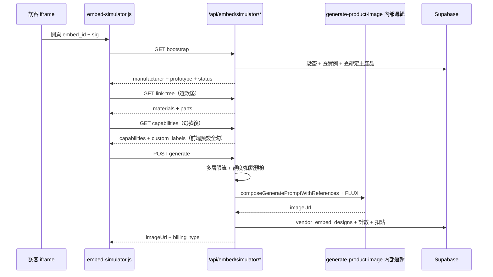

# Embed Simulator 功能串接實作計畫（2026-06-27）

> **狀態（2026-06-30）**：**MVP 已上線可結案** — 後端／前端主流程 ✅；SQL／部署／驗收 ✅。§6.2 為選做 backlog。  
> **Handoff**：[`PROGRESS-vendor-embed-simulator-handoff-2026-06-27.md`](PROGRESS-vendor-embed-simulator-handoff-2026-06-27.md)  
> **規格母本**：[`PROGRESS-vendor-embed-simulator.md`](PROGRESS-vendor-embed-simulator.md)

---

## 0. 串接總覽

### 0.1 計費分界（必讀）

| 入口 | API | 扣誰 |
|------|-----|------|
| iframe 訪客生圖 | `POST /api/embed/simulator/generate` | **廠商**（成功 **10 點/次**；公開 API **不查訂閱**） |
| 主站設計頁生圖 | `POST /api/generate-product-image` | **訪客**（登入後文生圖／圖生圖點數） |
| 取得 iframe 嵌入碼 | `POST /api/me/embed-simulator-instances` | **付費方案** gate（300/900/1800） |

iframe **只允許**實例綁定的**一款主產品**；主站試做連結可進全站流程。兩者**不統一計費**。



**原則**：後端**不**讓訪客直打 `/api/generate-product-image`；embed generate 內部**重用**現有 prompt 組裝與 FLUX 呼叫，但以廠商 `user_id` 扣點。

---

## 1. 前端 ↔ 後端對照表

| 前端動作 | 現況（Mock） | 串接後 API | 備註 |
|----------|-------------|-----------|------|
| 初始化 | `?mock=1` 假資料 | `GET /api/embed/simulator/bootstrap` | 回傳廠商 + **綁定的一款** `prototype` |
| 選款後載材配 | 假 3 材料 + 3 配件 | `GET /api/embed/simulator/link-tree` | `linked_assets[]` |
| 選款後載工藝 | 假 4 工藝 | `GET /api/embed/simulator/capabilities` | 包裝 `/api/vendor-assets/:id/design-capabilities` |
| 生成 | 3 秒假圖 | `POST /api/embed/simulator/generate` | 見 §4 |
| 參考圖 | DataURL 本機上傳 | 同 POST body `ref_images` | 後端轉成 `referenceImages` + `referenceSources` |
| 工藝 | **預設全勾** | `capability_keys` + `capability_custom_labels` | 同 custom-product |

### 1.1 參考圖來源（已定案）

| 類型 | 怎麼選 | UI 位置 |
|------|--------|---------|
| **主產品（綁定款）** | iframe **不可換款**；`image_items` 每張＝角度，最多 3 張（連動組邏輯同主站） | Step 1 |
| **材料** | 步驟 2 從 link-tree 關聯列表單選 | Step 2「廠商來源」摘要 |
| **配件** | 步驟 2 從 link-tree 關聯列表複選 | 同上 |
| **原圖印刷 / 風格參考** | 訪客本機上傳 | 步驟 4「圖稿／風格參考」 |

**`prototype_asset_id`** 由 embed 實例固定；決定 link-tree、工藝驗證、`categoryKeys`。  
**多角度**：`prototype_angle_urls` 對應已選 `image_items` URL，進 `referenceSources`（`asset_kind: prototype`）。

**禁止**在步驟 4 重複上傳款式／材料／配件（與 custom-product 一致：廠商素材從選取帶入，訪客只上傳圖稿）。

**link-tree API 回傳格式**：`linked_assets[]`（依 `asset_kind` 分 material / part），不是 `materials` / `parts` 頂層欄位。

### 1.2 前端串接（Phase C2 ✅）

檔案：`public/js/embed-simulator.js` — 已接 bootstrap / link-tree / capabilities / generate；保留 `?mock=1` 供本機無 DB 測 UI。

---

## 2. Phase A — DB Schema（先做，約 1 次 migration）

執行順序：

1. `docs/add-embed-simulator-schema.sql`（新建，內容見 PROGRESS §10）
2. 在 Supabase SQL Editor 執行
3. 更新 `seed-subscription-plans.sql` 中階/高階方案加 `embed_enabled`、`embed_generations_monthly`

### 2.1 表與用途

| 表 | 用途 |
|----|------|
| `manufacturer_embed_instances` | 每個 iframe 實例、簽名 secret、限流設定 |
| `embed_instance_usage_counters` | 實例日計數（月 cap 用 SUM） |
| `vendor_embed_designs` | 訪客成圖 + 意圖快照 |
| `subscription_plans` 擴欄 | `embed_enabled`、`embed_generations_monthly` |
| `payment_config` | `points_embed_simulator_generate = 10` |

### 2.2 廠商取得 iframe（已實作）

1. 登入 → 素材頁 → **主產品** → 編輯已上架款式  
2. 「分享與嵌入」→ **② 嵌入官網 iframe**  
3. 前端 `POST /api/me/embed-simulator-instances`（get-or-create）→ 複製 `iframe_snippet`  
4. 貼到官網、活動頁等（**不**要求域名白名單）

手動 SQL 建實例僅供開發除錯，正式流程不需 Supabase 手動 INSERT。

---

## 3. Phase B1 — 讀取 API（bootstrap / link-tree / capabilities）

**建議位置**：`server.js` 新增區塊 `// --- Embed Simulator API ---`（約 L7132 後），或日後拆 `routes/embed-simulator.js`。

### 3.1 共用 helper（必做）

```javascript
// 偽代碼 — 實作時放 server.js 或 lib/embed-simulator.js

async function resolveEmbedInstance(embedId, sig) {
  // 1. 查 manufacturer_embed_instances WHERE embed_key = embedId AND is_active
  // 2. 驗簽 HMAC_SHA256(embed_id + ts, embed_secret) — 或簡化版 embed_id + secret 靜態簽名（見 §3.2）
  // 3. 查 manufacturers + profiles（廠商名、logo）
  // 4. 查訂閱 embed_enabled — 否則 throw embed_disabled
  return { instance, manufacturer, vendorUserId };
}

function getClientIp(req) { /* 現有 x-forwarded-for 邏輯 */ }
function hashIp(ip) { /* SHA256 for visitor_ip_hash */ }
```

### 3.2 簽名方案（實作二選一，建議 A）

| 方案 | URL 格式 | 優點 | 缺點 |
|------|----------|------|------|
| **A 靜態簽名** | `sig=HMAC(embed_key, secret)` | iframe src 固定、廠商複製即用 | secret 外洩風險 → 靠 allowed_origins |
| **B 時效簽名** | `sig=HMAC(embed_key+ts, secret)&ts=` | 較安全 | iframe URL 需定期更新，廠商難用 |

**建議 Phase 1 用 A**（與卡片 embed 類似），Phase E 再加 B + 域名白名單。

### 3.3 GET `/api/embed/simulator/bootstrap`

**Query**：`embed_id`, `sig`

**Response**：

```json
{
  "manufacturer": {
    "id": "uuid",
    "name": "優質工坊",
    "logo_url": "https://..."
  },
  "prototype": {
    "id": "uuid",
    "title": "經典後背包",
    "image_url": "https://...",
    "image_items": [{ "url": "...", "label": "正面" }],
    "category_key": "bags",
    "subcategory_key": "backpack"
  },
  "prototype_asset_id": "uuid",
  "service_status": "ok"
}
```

**實作**：

- 自 `manufacturer_embed_instances.prototype_asset_id` 查**單一**公開主產品（`resolveEmbedPrototypeForRequest`）
- **不**回傳多款列表、點數餘額、embed_secret

### 3.4 GET `/api/embed/simulator/link-tree`

**Query**：`embed_id`, `sig`, `prototype_asset_id`

**邏輯**：

1. `resolveEmbedInstance`
2. 確認 `prototype_asset_id` 屬該 manufacturer 且公開
3. 呼叫現有 link-tree 查詢（同 L15553 `GET /api/vendor-assets/:id/link-tree` 內部函式）
4. 只回傳 `materials`、`parts`（精簡欄位：`id`, `title`, `image_url`）

**無材配時**：`{ materials: [], parts: [] }` → 前端 Step 2 顯示「此款式無關聯材配」或隱藏

### 3.5 GET `/api/embed/simulator/capabilities`

**Query**：同上 + `prototype_asset_id`

**邏輯**：包裝 `GET /api/vendor-assets/:id/design-capabilities`（L15617）

**Response**：

```json
{
  "capabilities": [{ "key": "printing", "label": "絲印" }],
  "custom_labels": [{ "label": "手工縫線" }]
}
```

前端收到後**預設全勾**（已實作，同 custom-product.html）。

---

## 4. Phase B2 — POST generate（核心，約 300–400 行）

### 4.1 Request body

```json
{
  "embed_id": "xxx",
  "sig": "yyy",
  "prototype_asset_id": "uuid-bound-prototype",
  "prototype_angle_urls": ["https://..."],
  "material_ids": ["uuid"],
  "part_ids": ["uuid"],
  "capability_keys": ["printing"],
  "capability_custom_labels": ["手工縫線"],
  "reference_sources": [
    { "intent": "prototype", "vendor_asset_id": "...", "asset_kind": "prototype", "image_url": "https://...", "title": "側面" },
    { "intent": "material", "vendor_asset_id": "...", "asset_kind": "material", "image_url": "https://..." },
    { "intent": "pattern_print", "image_url": "data:image/jpeg;base64,...", "pattern_intent": "print" }
  ],
  "reference_images": ["https://...", "data:image/jpeg;base64,..."],
  "prompt": "軍綠色，正面印 LOGO",
  "session_id": "emb_..."
}
```

前端 `buildReferencePayload()` 已組裝；順序：原型 → 配件 → 材料 → 原圖印刷 → 風格參考（同 `custom-product.js` `refSlotPayloadRank`）。

### 4.2 檢查順序（全部通過才呼叫 FLUX）

```text
1. resolveEmbedInstance → 403
2. prototype_asset_id + prototype_asset_ids 皆屬該廠商且公開；ids.length ≤ 3 → 404
3. 實例 daily/monthly cap → 429
4. IP hourly → 429
5. 月池 OR 廠商 balance ≥ 10 → 402
6. material_ids / part_ids 在第一款 link-tree 內
7. validateSelectedCapabilitiesForPrototype（第一款）
```

### 4.3 提示詞組裝（必與本站一致 — 嚴禁第二套）

> 政策：[`flux-and-gemini-prompt-policy.md`](flux-and-gemini-prompt-policy.md)  
> 現有入口：`POST /api/generate-product-image`（`server.js` L8850+）

**Embed 不得複製 prompt 字串、不得另寫 regex／material_key map。**

#### 唯一正確路徑

```text
embed body
  → buildEmbedReferenceSources()        // 後端驗證 + 補齊 vendor_assets
  → categoryKeys ← 第一款 category_key + subcategory_key
  → composeGeneratePromptWithReferences()  // server.js L8495，唯一組裝函式
       ├─ buildPromptFromCategoryKeys
       ├─ reorderFluxReferenceInputs
       ├─ buildFluxStyleReferenceLead
       ├─ buildFluxReferenceFactsAppendix
       └─ buildSelectedCapabilityPromptAppendix（工藝 DB visual_hint）
  → generateImageWithFlux2Pro(..., bfl_flux_model_generate)
  → uploadToSupabaseStorage
  → vendor_embed_designs（不寫 custom_products）
```

**建議**：抽出 `runFluxProductImageGeneration(opts)`，`generate-product-image` 與 embed **共用**，避免 drift。

#### referenceSources 格式（對齊 `collectReferencePayload`）

| 欄位 | 廠商素材 | 訪客上傳 |
|------|----------|----------|
| `asset_kind` | prototype / material / part | other + `pattern_intent` |
| `vendor_asset_id` | 必填 | 不填 |
| `image_url` | vendor_assets | DataURL 或 GCS URL |
| `pattern_intent` | — | print / style |

多款原型：多筆 `asset_kind: prototype`。`referenceImages[]` 與 `referenceSources[]` **同索引對齊**。

#### categoryKeys / 工藝 / FLUX

- `categoryKeys`：第一款 prototype 的主／子分類，訪客不可改
- 工藝：`validateSelectedCapabilitiesForPrototype` + compose 內 appendix；**禁止** embed 另寫工藝句
- FLUX：有參考圖 → `generateImageWithFlux2Pro`；無 → `generateImageWithFlux2ProTextToImage`；jpeg 1024×1024

#### 嚴禁

- ❌ embed 專用 prompt 模板
- ❌ 複製 compose 邏輯到 embed 路由
- ❌ 略過 reorderFluxReferenceInputs
- ❌ 訪客直打 `/api/generate-product-image`

### 4.4 扣點（Embed 專屬）

- 主體：`manufacturers.user_id`
- 月池內：`plan_quota` / 0 點；超額：`credit_overage` / **固定 10 點**（與設計頁 15/20 分開）

### 4.5 成功後寫入

1. `vendor_embed_designs`（含 `fluxReferenceSources` 快照）
2. `embed_instance_usage_counters` +1
3. 超額扣點 + `credit_transactions`（`source: embed_simulator_generate`）

### 4.6 失敗 rollback

FLUX 失敗 → 不計次、不扣點 → `flux_error` 500

### 4.7 Response

```json
{
  "success": true,
  "imageUrl": "https://storage.../xxx.jpg",
  "billing_type": "plan_quota",
  "points_charged": 0
}
```

錯誤：

```json
{
  "error": "試做暫停，請聯絡優質工坊",
  "error_code": "insufficient_credits"
}
```

---

## 5. Phase C2 — 前端錯誤碼對應（串接後）

| error_code | UI 行為 |
|------------|---------|
| `embed_disabled` | 全頁錯誤，無法使用 |
| `invalid_signature` | 全頁「無效連結」 |
| `rate_limit_ip_hour` | 生成鈕禁用 + 「請稍後再試」 |
| `daily_cap_reached` / `monthly_cap_reached` | 生成鈕禁用 + 固定文案 |
| `plan_quota_exhausted_no_credits` / `insufficient_credits` | 生成鈕禁用 + 「請聯絡 {廠商名}」 |
| `flux_error` | 顯示錯誤 + 可重試（仍受限流） |
| `prototype_not_found` | 重新 bootstrap 或提示款式下架 |

---

## 6. Phase D — 廠商後台（可與 B 並行）

| 頁面 | 路徑 | API |
|------|------|-----|
| 實例管理 | `/client/embed-instances.html` | `GET/POST/PATCH /api/me/embed-instances` |
| 複製 iframe 碼 | 同上 | 回傳 `simulator.html?embed_id=&sig=` |
| 訪客設計列表 | `/client/embed-visitor-designs.html` | `GET /api/me/embed-designs` |
| 用量儀表 | dashboard 小 widget | `GET /api/me/embed-usage` |

**最小可行**：先做 SQL 手動建實例 + 訪客設計列表；實例管理 UI 可後做。

---

## 7. 建議實作順序（給 Agent / 開發者）

| 步驟 | 內容 | 可測方式 |
|------|------|----------|
| **1** | SQL migration（Phase A） | Supabase 表存在 |
| **2** | `lib/embed-simulator.js`：resolveEmbedInstance、驗簽、限流 helper | unit / 手動 |
| **3** | GET bootstrap | curl + 瀏覽器去掉 mock |
| **4** | GET link-tree + capabilities | 選款後 Network tab |
| **5** | 抽出 `runFluxProductImageGeneration` + `buildEmbedReferenceSources` | 與 design 頁同一 compose |
| **6** | POST generate 接 FLUX + 扣點 | 真實生圖；**對照** design 頁同 inputs 的 prompt 一致 |
| **7** | 寫 vendor_embed_designs | 廠商後台列表 |
| **8** | 前端 error_code UI | 手動觸發限流 |
| **9** | 廠商後台 iframe 管理 | 複製貼到測試頁 |

**預估工時**：B1 半天、B2 1–1.5 天、D 1 天、硬化 0.5 天

---

## 8. 測試清單（串接完成後）

- [ ] 真實廠商原型卡片顯示（非 placeholder）
- [ ] 無材配款式：Step 2 正確隱藏/提示
- [ ] 款式複選（最多 3）皆進 referenceSources
- [ ] 與 design 頁相同 reference 輸入 → **fullPrompt 一致**（staff debug 或 log 比對）
- [ ] 工藝預設全勾，取消後 compose 不帶該 key
- [ ] 圖稿上傳後 generate 成功
- [ ] 月池內生圖不扣點；超額扣 10
- [ ] 點數不足 402，前端顯示聯絡廠商
- [ ] IP hourly 429
- [ ] FLUX 失敗不扣點
- [ ] 成圖出現在 `vendor_embed_designs`
- [ ] curl 無 sig 被拒絕

---

## 9. 檔案清單（後端新增）

```
docs/
└─ add-embed-simulator-schema.sql          (Phase A)

lib/
├─ embed-simulator.js                      (驗簽、限流、額度)
└─ product-image-generation.js             (共用 FLUX：compose + generateImageWithFlux2Pro)

server.js
└─ + /api/embed/simulator/bootstrap
└─ + /api/embed/simulator/link-tree
└─ + /api/embed/simulator/capabilities
└─ + /api/embed/simulator/generate

public/client/                             (Phase D)
├─ manufacturer-materials.html             (✅ 主產品編輯 → ② iframe 複製碼)
├─ embed-design-records.html               (✅ Embed 訪客生圖紀錄)
└─ embed-instances.html                    (選做 backlog：獨立實例管理頁)
```

---

**最後更新**：2026-06-30（MVP 結案）  
**相關**：[`embed-simulator-ui-implementation.md`](embed-simulator-ui-implementation.md)、[`embed-simulator-frontend-testing.md`](embed-simulator-frontend-testing.md)
