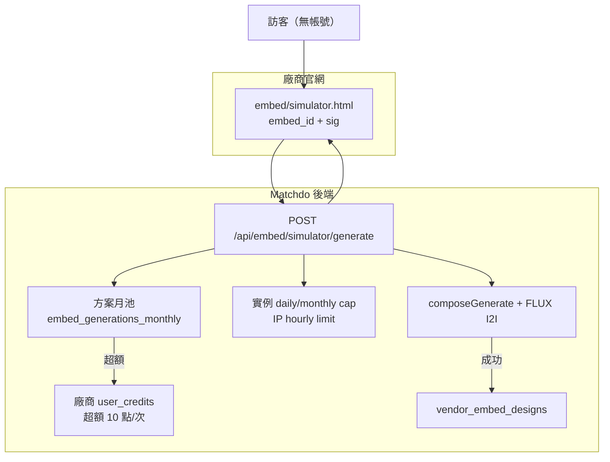

# 廠商嵌入式模擬器 — 產品規格與實作進度（2026-06-27）

> **狀態**：Phase A～C 已實作；Phase D 進行中（素材後台「② iframe」已接 API，完整實例管理頁待做）  
> **與現況關係**：已上線的 [`/embed/vendor-catalog.html`](../public/embed/vendor-catalog.html) 為「卡片牆 + 外跳試做」；本文件為**新產品**「iframe 內完整模擬 + 廠商扣點 + 訪客匿名」。

---

## 1. 產品目標

廠商在**自家官網、活動頁或任意推廣頁**嵌入 iframe，訪客**無需登入**即可完成「此款主產品 → 選材配 → 輸入描述 → 生圖預覽」；成本由**廠商訂閱月額度 + 廠商點數**（超額）承擔，成圖與意圖紀錄進**廠商售前數據庫**。

### 1.1 兩種入口、兩套計費（已定案 · 2026-06-27）

| 入口 | 訪客能做什麼 | 誰付生圖成本 | 成圖歸屬 |
|------|--------------|--------------|----------|
| **② iframe**（`/embed/simulator.html`） | **僅**廠商綁定的**一款主產品**（＋該款關聯材配）；不可換別款 | **廠商**（方案 `embed_generations_monthly` 月池 → 超額扣廠商點數） | `vendor_embed_designs` |
| **① 主站試做連結**（`custom-product.html?prototype_asset_id=`） | Matchdo 全站設計流程（訪客可換款、存資產等） | **訪客**登入後扣**自己的** Matchdo 點數 | 訪客 `custom_products` |

**產品原則**：

- iframe 是廠商**推廣用**工具：訪客**不付點**、**不強制跳回** Matchdo 全站、**不要求**域名白名單（可貼官網、Landing、活動頁）。
- 流量若進主站，即走主站規則，**扣訪客點數**——兩條路**刻意分開**，不是同一套計費的漏洞。
- 素材後台「分享與嵌入」①② 文案須讓廠商理解上述差異。

---

## 2. 核心邏輯



| 原則 | 說明 |
|------|------|
| **身分主體** | `embed_id` → `manufacturer_id` → `manufacturers.user_id` 為扣點／訂閱主體 |
| **訪客匿名** | 不建立 Supabase 帳號、不發 JWT；用 `embed_session_id`（localStorage）防濫用 |
| **生圖身分** | iframe 訪客**禁止**直打 `/api/generate-product-image`；僅走 `/api/embed/simulator/generate`（廠商付費） |
| **一款 iframe** | 一實例綁一 `prototype_asset_id`；後端拒絕換款、拒絕非關聯材配 |
| **資料歸屬** | 成圖存廠商「Embed 訪客設計」表，**不**寫入訪客 `custom_products` |
| **失敗不扣** | FLUX 失敗（BFL 5xx/timeout）→ **不扣**額度、**不扣**點數；成功才 commit |

---

## 3. iframe UI 內容（極精簡）

### 3.1 結構（單頁 stepper，約 400–600 行）

```
embed-sim-shell
├─ embed-sim-header（極簡：廠商 logo + 名稱，無 Matchdo 選單）
├─ embed-sim-body
│  ├─ Step 1: 此款主產品（iframe 已綁定，**無多款列表**；`image_items` 每張＝角度，最多 3 張）
│  ├─ Step 2: 材配（該款 link-tree；材料單選、配件可複選）
│  ├─ Step 3: 工藝（若原型有 capabilities）
│  ├─ Step 4: 提示詞（textarea）
│  ├─ Step 5: 生成按鈕 + loading + 結果圖
│  └─ 「再生成」按鈕（每次計額度，受限流）
└─ embed-sim-footer（小字「Powered by Matchdo」+ 連到廠商公開頁）
```

**佈局模式**：

- **桌機（≥768px）**：左右兩欄（左：步驟 accordion；右：結果固定區）
- **手機**：單欄 stepper，生成後結果插入當前位置

**步驟展開邏輯**：

- Step 1：bootstrap 只回傳**綁定的一款**主產品；有 `image_items` 時選角度（連動組：首次點同組一併勾選，可個別取消）
- Step 2（材配）：載入 link-tree 後自動展開（若無關聯則跳過）
- Step 3（工藝）：若原型有 capabilities 才顯示
- Step 4（prompt）：始終可見
- Step 5（生成）：按鈕固定在底部（桌機）或 prompt 下方（手機）

### 3.2 包含（重用來源）

| 功能 | 重用邏輯 | 精簡點 |
|------|----------|--------|
| 主產品＋角度 | `GET /api/embed/simulator/bootstrap` 回傳單一 `prototype` | **無**多款 grid、無換款；材配在 Step 2 內展開 |
| 材配選取 | `GET /api/vendor-assets/:id/link-tree` + product-tree 選取邏輯 | fork 成 `embed-material-picker.js`（去掉左側原型列表、去掉「換款式」「進入設計」按鈕） |
| 工藝 | `design-capabilities` | 精簡 UI（勾選框 + 名稱，無長說明） |
| 提示詞 | custom-product 的 textarea | 去掉「說明 Modal」（改 tooltip 或一句 hint） |
| 生成 + 結果 | 新 embed API | 無「儲存到我的資產」「找廠商」；可右鍵下載（廠商自決浮水印） |

### 3.3 明確不包含

- 全站 header、選單、點數餘額顯示
- Tab 切換（實境模擬、圖樣提取、設計風向）
- 媒體牆、靈感牆、其他廠商資訊
- 註冊／登入、我的數位資產、定價頁
- 「找廠商訂製」「前往 Matchdo」（除 footer 小字 Powered by）
- Seed 進階設定、過往設計列表

### 3.4 footer 與白牌程度（已定案）

- **保留小字**「Powered by Matchdo」+ 連到廠商公開頁（`/vendor-profile.html?id=`）
- 類 YouTube embed 模式：不影響廠商品牌主體，合理曝光平台
- 若日後客戶要求完全白牌 → 需另議「白牌方案加價」

---

## 4. 額度與扣點（兩段式計費）

### 4.1 方案月池（共享）

```text
每次 embed 生圖請求：
  1. 檢查「廠商當月 embed 總已用次數」< 方案 embed_generations_monthly
     → 免費通過，不扣點（billing_type = plan_quota, points_charged = 0）
  2. 否則
     → 扣廠商點數 10 點（billing_type = credit_overage, points_charged = 10）
  3. 若需扣點且 user_credits.balance < 10
     → 拒絕生圖，返 402，iframe 顯示「服務暫停，請聯絡廠商」
  4. FLUX 成功 → commit 計數 + 扣點
     FLUX 失敗 → 不扣額度、不扣點（rollback）
```

| 項目 | 規格 |
|------|------|
| 方案月免費次數 | `subscription_plans.embed_generations_monthly`（新欄位，預設 0） |
| 超額單價 | **固定 10 點**（`payment_config.points_embed_simulator_generate = 10`，可後台調） |
| 月池共享 | 所有 embed 實例（官網、活動頁…）消耗**同一個**廠商月池 |
| 再生成計次 | 訪客每按一次「再生成」= **1 次**計入額度（成功才扣） |
| 方案未含 embed | 整個模擬器不可用（API 403） |

### 4.2 月池 vs 實例 cap 關係（已釐清）

```text
實際可用次數 = min(
  方案月池剩餘,
  實例 monthly_cap 剩餘,
  實例 daily_cap 剩餘,
  IP hourly 剩餘
)
```

**範例**：

- 方案：embed_generations_monthly = **500**（廠商總池）
- 實例 A（官網）：monthly_cap = **300**、daily_cap = **50**
- 實例 B（活動）：monthly_cap = **200**、daily_cap = **30**

當月實際：A 已用 280、B 已用 150 → 方案池剩餘 70（500 - 280 - 150）  
此時實例 A 可再用 min(70, 20, 50) = **20 次**；實例 B 可再用 min(70, 50, 30) = **30 次**（但兩者共享池，先到先得）

---

## 5. 防濫用（廠商自行設定 · 每個 iframe）

### 5.1 Embed 實例

一個 iframe = 一筆 **manufacturer_embed_instances**，且綁定**一款** `prototype_asset_id`（一主產品一實例）。

**iframe URL（規格）：**

```text
/embed/simulator.html?embed_id={embed_key}&sig={hmac_sha256}
```

`manufacturer_id`、主產品 ID 由後端從 `embed_id` 解析，訪客不可換款。

**廠商取得方式**：素材頁 → 主產品 → 編輯 →「② 嵌入官網 iframe」→ `POST /api/me/embed-simulator-instances`（get-or-create），複製 `<iframe>` 程式碼。

### 5.2 廠商可設定項（每實例）

| 設定 | 說明 | 預設建議 |
|------|------|----------|
| `name` | 實例名稱（如「官網首頁」「2026 春節活動」） | — |
| `rate_limit_per_ip_hour` | 同一 IP 每小時最多生圖次數 | 5 |
| `daily_cap` | 此 iframe 當日總上限（0=不設） | 100 |
| `monthly_cap` | 此 iframe 當月總上限（0=不設） | 500 |
| `allowed_origins` | 可選域名白名單（jsonb） | `[]`（**預設不限制**；Phase E 可選啟用） |
| `is_active` | 開關 | true |

### 5.3 檢查順序（全部通過才生圖）

```text
1. embed 實例存在且 active
2. 簽名 sig 驗證通過（HMAC）
3. 方案含 embed 功能（subscription_plans.embed_enabled 或 features 含 'embed_simulator'）
4. 實例 daily_cap 剩餘 > 0
5. 實例 monthly_cap 剩餘 > 0
6. IP hourly limit（Redis 或 DB counter）
7. 方案月池剩餘 > 0 OR 廠商點數 ≥ 10
8. （可選）平台全站熔斷上限（admin config）
```

任一失敗 → **不呼叫 FLUX**，返回明確錯誤碼（見 §7）。

### 5.4 平台級安全（非廠商設定）

- **HMAC 簽名**：`sig = HMAC_SHA256(embed_id + timestamp + secret)`，10 分鐘有效期
- **禁直連 API**：embed API 需 `embed_id` + `sig`，無簽名拒絕
- **Rate limit 存 Redis**：`embed_rl:{embed_id}:{ip}:{hour_bucket}` → count
- **CAPTCHA 觸發**：單 IP 單日超 **30 次**（跨所有實例）或單實例 QPM > 設定值 × 1.5

---

## 6. 數據回收（售前意圖）

### 6.1 新表 `vendor_embed_designs`

| 欄位 | 類型 | 用途 |
|------|------|------|
| id | uuid PK | — |
| embed_instance_id | uuid | 哪個 iframe |
| manufacturer_id | uuid | 廠商 |
| prototype_asset_id | uuid | 選哪款 |
| reference_sources | jsonb | 材／配／工藝選擇快照（同 custom_products） |
| prompt | text | 訪客描述 |
| ai_generated_image_url | text | 成圖 URL |
| generation_seed | int | 重現 |
| visitor_ip_hash | text | IP SHA256（合規，非明文） |
| embed_session_id | text | localStorage 匿名 session |
| referrer_host | text | 來源頁域名 |
| billing_type | text | `plan_quota` / `credit_overage` |
| points_charged | int | 0 或 10 |
| created_at | timestamptz | 時間 |

**不收集** email／電話（除非日後另做「留資優惠」opt-in）。

### 6.2 廠商後台

**列表頁**（新建或擴充現有控制台）：

- 路徑建議：`/client/embed-visitor-designs.html`
- 顯示：時間、縮圖、原型名、材配摘要、prompt 前 80 字、來源 iframe 名稱
- 篩選：日期、原型、embed 實例、referrer 域名
- 匯出：CSV（不含 IP hash）

**洞察**（Phase 2 可選）：

- 併入 `vendor-prototype-insights` 加「Embed 訪客」tab
- 熱門材配組合、熱門 prompt 關鍵字、轉換漏斗（選款 → 材配 → 生圖）

---

## 7. 錯誤處理與文案

### 7.1 後端錯誤碼 vs 訪客文案

| 後端 code | HTTP | 訪客看到（中文） | 訪客看到（英文） | 廠商後台看到詳細原因 |
|-----------|------|-----------------|-----------------|---------------------|
| `embed_disabled` | 403 | 此功能未開通 | Feature not available | 方案未含 embed_simulator |
| `instance_disabled` | 403 | 試做服務暫停中 | Service paused | 實例已停用 |
| `invalid_signature` | 403 | 無效連結 | Invalid link | 簽名過期或不符 |
| `rate_limit_ip_hour` | 429 | 請稍後再試（1 小時內已達上限） | Try again later | IP {hash} 超 hourly limit |
| `daily_cap_reached` | 429 | 今日試做已額滿，明日再來 | Daily limit reached | 實例日 cap 用完 |
| `monthly_cap_reached` | 429 | 本月試做已額滿 | Monthly limit reached | 實例月 cap 用完 |
| `plan_quota_exhausted_no_credits` | 402 | 試做暫停，請聯絡 {廠商名} | Service paused, contact vendor | 方案月池 + 點數均不足 |
| `insufficient_credits` | 402 | 試做暫停，請聯絡 {廠商名} | Service paused, contact vendor | 超額需扣點但餘額 < 10 |
| `flux_error` | 500 | 生成失敗，請稍後再試 | Generation failed | BFL 5xx / timeout |
| `prototype_not_found` | 404 | 該款式已下架 | Style unavailable | 原型 is_public=false |

### 7.2 前端顯示策略

- **429**：按鈕變灰 + 倒數計時（若是 hourly）或固定文案（daily/monthly）
- **402**：按鈕永久禁用 + 「請聯絡廠商」（含廠商名、可選聯絡方式連結）
- **500**：可重試按鈕（但仍受限流）
- **403**：整個 iframe 顯示錯誤頁（無法繼續使用）

---

## 8. API 規格（草案）

| Method | Path | 說明 | 需簽名 |
|--------|------|------|--------|
| GET | `/api/embed/simulator/bootstrap?embed_id=&sig=` | 綁定主產品、廠商資訊、服務狀態（不暴露點數餘額） | ✓ |
| GET | `/api/embed/simulator/link-tree?embed_id=&sig=&prototype_asset_id=` | 材配樹（限該廠商、公開） | ✓ |
| POST | `/api/embed/simulator/generate` | 生圖 + 多層限流 + 扣額/扣點 + 寫庫 | ✓ |
| GET | `/api/me/embed-simulator-instances?prototype_asset_id=` | 查此款 iframe（需 Bearer） | ✗ |
| POST | `/api/me/embed-simulator-instances` | get-or-create（一主產品一實例，回傳 URL + snippet） | ✗ |
| GET | `/api/me/embed-instances` | 廠商管理 iframe 列表（Phase D 待做） | ✗ |
| POST/PATCH | `/api/me/embed-instances` | 建立/更新頻率與 cap（Phase D 待做） | ✗ |
| GET | `/api/me/embed-designs` | 訪客成圖列表 | ✗ |
| GET | `/api/me/embed-usage` | 本月方案池用量、各實例用量 | ✗ |

**禁止**：前端呼叫 `/api/generate-product-image`（現況無 token 可白嫖）。

---

## 9. 訂閱方案包裝（示例）

| 方案 | 月費 | 卡片 embed | 模擬器 embed | 月免費 embed 次數 | 超額單價 |
|------|------|-----------|-------------|-------------------|----------|
| 免費 | 0 | ✓ | ✗ | 0 | — |
| 中階 | 例 899 | ✓ | ✓ | 例 30 | 10 點/次 |
| 高階 | 例 1999 | ✓ | ✓ | 例 150 | 10 點/次 |

**成本參考**：BFL I2I 約 9–15 credits/次（$0.09–$0.15）；10 點若 = $0.10 → 接近成本；需確認方案贈送次數不虧損。

---

## 10. DB Schema（Phase A）

### 10.1 擴 `subscription_plans`

```sql
ALTER TABLE public.subscription_plans
ADD COLUMN IF NOT EXISTS embed_enabled boolean DEFAULT false,
ADD COLUMN IF NOT EXISTS embed_generations_monthly integer DEFAULT 0;

COMMENT ON COLUMN public.subscription_plans.embed_enabled IS '是否可使用嵌入式模擬器';
COMMENT ON COLUMN public.subscription_plans.embed_generations_monthly IS '每月免費 embed 生圖次數（0=不可用）';
```

或若用 `features` jsonb：

```sql
-- features 範例：{"embed_simulator": true, "embed_generations_monthly": 50}
```

### 10.2 新表 `manufacturer_embed_instances`

```sql
CREATE TABLE IF NOT EXISTS public.manufacturer_embed_instances (
  id uuid PRIMARY KEY DEFAULT gen_random_uuid(),
  manufacturer_id uuid NOT NULL REFERENCES public.manufacturers(id) ON DELETE CASCADE,
  name text NOT NULL,
  embed_key text NOT NULL UNIQUE, -- 對外公開 URL 用
  embed_secret text NOT NULL,     -- 後端驗簽用
  allowed_origins jsonb DEFAULT '[]'::jsonb,
  rate_limit_per_ip_hour integer DEFAULT 5,
  daily_cap integer DEFAULT 100,
  monthly_cap integer DEFAULT 500,
  is_active boolean DEFAULT true,
  created_at timestamptz DEFAULT now(),
  updated_at timestamptz DEFAULT now()
);

CREATE INDEX IF NOT EXISTS idx_embed_instances_mfr ON public.manufacturer_embed_instances(manufacturer_id);
CREATE INDEX IF NOT EXISTS idx_embed_instances_key ON public.manufacturer_embed_instances(embed_key);

COMMENT ON TABLE public.manufacturer_embed_instances IS '廠商 iframe 嵌入實例（每個 iframe 獨立設定）';
```

### 10.3 新表 `embed_instance_usage_counters`

```sql
CREATE TABLE IF NOT EXISTS public.embed_instance_usage_counters (
  id uuid PRIMARY KEY DEFAULT gen_random_uuid(),
  embed_instance_id uuid NOT NULL REFERENCES public.manufacturer_embed_instances(id) ON DELETE CASCADE,
  date date NOT NULL,
  count integer DEFAULT 0,
  created_at timestamptz DEFAULT now(),
  updated_at timestamptz DEFAULT now(),
  UNIQUE(embed_instance_id, date)
);

CREATE INDEX IF NOT EXISTS idx_embed_usage_date ON public.embed_instance_usage_counters(date);
CREATE INDEX IF NOT EXISTS idx_embed_usage_instance_date ON public.embed_instance_usage_counters(embed_instance_id, date);

COMMENT ON TABLE public.embed_instance_usage_counters IS 'Embed 實例每日計數（月聚合由 SQL 查）';
```

### 10.4 新表 `vendor_embed_designs`

```sql
CREATE TABLE IF NOT EXISTS public.vendor_embed_designs (
  id uuid PRIMARY KEY DEFAULT gen_random_uuid(),
  embed_instance_id uuid NOT NULL REFERENCES public.manufacturer_embed_instances(id) ON DELETE CASCADE,
  manufacturer_id uuid NOT NULL REFERENCES public.manufacturers(id) ON DELETE CASCADE,
  prototype_asset_id uuid REFERENCES public.vendor_assets(id) ON DELETE SET NULL,
  reference_sources jsonb DEFAULT '[]'::jsonb,
  prompt text,
  ai_generated_image_url text,
  generation_seed integer,
  visitor_ip_hash text,
  embed_session_id text,
  referrer_host text,
  billing_type text CHECK (billing_type IN ('plan_quota', 'credit_overage')),
  points_charged integer DEFAULT 0,
  created_at timestamptz DEFAULT now()
);

CREATE INDEX IF NOT EXISTS idx_embed_designs_mfr ON public.vendor_embed_designs(manufacturer_id);
CREATE INDEX IF NOT EXISTS idx_embed_designs_instance ON public.vendor_embed_designs(embed_instance_id);
CREATE INDEX IF NOT EXISTS idx_embed_designs_created ON public.vendor_embed_designs(created_at DESC);
CREATE INDEX IF NOT EXISTS idx_embed_designs_proto ON public.vendor_embed_designs(prototype_asset_id) WHERE prototype_asset_id IS NOT NULL;

COMMENT ON TABLE public.vendor_embed_designs IS '訪客 embed 生成設計（售前意圖數據）';
```

### 10.5 `payment_config` 新 key

```sql
INSERT INTO public.payment_config (key, value, description)
VALUES ('points_embed_simulator_generate', '10', 'Embed 模擬器生圖單價（超額時扣點）')
ON CONFLICT (key) DO NOTHING;
```

---

## 11. 實施階段

| Phase | 內容 | 預估行數 |
|-------|------|----------|
| **A - DB** | Schema（§10）+ RLS policies | ✅ `docs/add-embed-simulator-schema.sql` |
| **B - 後端 API** | bootstrap / link-tree / generate + 限流 + 簽名 | ✅ `server.js` + `lib/embed-simulator.js` |
| **C - 前端 UI** | `/embed/simulator.html` + `embed-simulator.js` | ✅ 已串 API（`?mock=1` 可本機測） |
| **D - 廠商後台** | 素材編輯窗 ② iframe 複製碼；完整實例管理、訪客設計列表 | 🔄 部分完成 |
| **E - 硬化** | 域名白名單、CAPTCHA、平台熔斷、GA4 事件 | ~200 行 |

---

## 12. 驗收清單

- [x] 訪客無登入可完成：此款主產品 → 材配 → prompt → 看到成圖
- [x] 方案月免費次數內不扣點；超額扣 10 點；點數不足停止
- [x] 實例 IP/小時、日 cap、月 cap（DB 預設；後台調整 UI 待 Phase D）
- [x] FLUX 失敗不扣額度、不扣點
- [ ] 成圖出現在廠商後台「Embed 訪客設計」列表（Phase D）
- [x] iframe 內無 site-header、無他廠、footer 僅「Powered by Matchdo」
- [x] 訪客可右鍵下載成圖
- [x] 再生成每次計額度（成功才扣），受限流
- [x] 無法用 curl 無簽名刷 `/api/embed/simulator/generate`
- [x] 僅綁定一款主產品，不可換款
- [x] 素材後台主產品編輯可複製 iframe 程式碼

---

## 13. 與現有程式落差

| 現況 | Embed Simulator 需求 | 解法 |
|------|---------------------|------|
| 無 token 可生圖且不扣點 | 專用 API + 簽名 | 新建 `/api/embed/simulator/*` |
| 無 embed 月額度欄位 | 擴 `subscription_plans` | Phase A SQL |
| 成圖寫 `custom_products.owner_id=訪客` | 改寫 `vendor_embed_designs` | Phase B generate API |
| 僅卡片 embed | 新建 `simulator.html` | Phase C |
| I2I 預設 20 點 | Embed 固定 10 點 | `payment_config` 新 key |
| product-tree 含平台導流按鈕 | fork 成輕量 `embed-material-picker.js` | Phase C |

生圖 prompt 仍走 **`composeGeneratePromptWithReferences`**（遵守 flux-gemini 政策）。

---

## 14. 文件交叉引用

- 現有卡片 embed：[`docs/PROGRESS-vendor-embed-catalog.md`](PROGRESS-vendor-embed-catalog.md)
- 分享連結：[`docs/PROGRESS-vendor-asset-share-links.md`](PROGRESS-vendor-asset-share-links.md)
- 點數規則：[`docs/points-grant-current-state.md`](points-grant-current-state.md)
- 訂閱 schema：[`docs/subscriptions-schema.sql`](subscriptions-schema.sql)
- FLUX 提示詞政策：[`docs/flux-and-gemini-prompt-policy.md`](flux-and-gemini-prompt-policy.md)
- 部署流程：[`docs/deploy-matchdo-push-and-deploy.md`](deploy-matchdo-push-and-deploy.md)

---

**最後更新**：2026-06-27  
**決策記錄**：
1. FLUX 失敗不扣點（含 BFL 5xx/timeout）
2. 方案月池共享（所有實例消耗同一池）
3. footer 保留「Powered by Matchdo」小字
4. 訪客可右鍵下載成圖
5. 再生成每次都計額度（成功才扣，受限流）
6. **iframe 僅廠商綁定主產品、廠商付費；主站試做連結扣訪客點數**——兩入口分開，不統一計費
7. iframe **不強制**跳主站、**不**預設域名白名單（推廣頁可貼）
