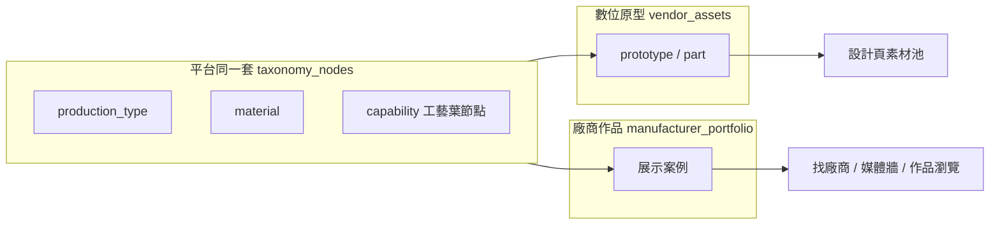

# 廠商分類：生產模式 × 材質 × 工藝能力 — 規劃（第二版）

**狀態**：**MT-1／MT-2 進行中**（SQL + 讀取 API）；MT-3 表單待做  
**基線 commit**：`552a296`（2026-06-06，產品關聯鏈匯出 PDF）  
**更新**：2026-06-09（雙載體定案；MT-1 SQL、MT-2 `/api/taxonomy*`）  
**取代**：2026-06-09 已還原的 `df6507a`～`bbcde72` 工藝分類實作與舊規劃稿（勿再參考）

**相關現況文件**：

- `docs/vendor-asset-prototype-moq-customization-notes.md` — 數位原型 MOQ／訂製程度（**已上線**）
- `docs/add-vendor-assets-style-material.sql` — `style_key`／`material_key` 粗分（**已上線**）
- `docs/custom-product-design-and-manufacturer-search-plan.md` — 設計者找廠商主軸
- `docs/architecture-and-seo-principles.md`、`docs/account-one-login-capabilities.md`

---

## 0. 這次規劃要守住的底線

| 原則 | 說明 |
|------|------|
| **先文件、後實作** | 本檔定案前不寫 `server.js`／不動部署設定 |
| **一期一 PR** | 每期獨立 commit；**禁止**把 Dockerfile／`cloudbuild.yaml`／部署文件混進功能 PR |
| **部署不變** | 上線仍用既有一行 Cloud Shell（見 `.cursor/rules/deployment.mdc`） |
| **每期可驗證** | 每期結束必能回答：線上多了什麼、怎麼測、失敗怎麼回退 |
| **加法優先** | 不破壞現有 MOQ／訂製程度／`material_key` 行為 |

---

## 1. 要解決什麼

幫助**製造商**在兩類對外內容上，說清楚「這件怎麼做、用什麼材、走哪些工藝」，讓**設計者**找廠商（看作品）與選素材（看原型）時都能**縮小範圍**。

### 1.1 兩類載體（同一套分類詞彙）

| 載體 | 資料表 | 頁面 | 給誰看 | 語意 |
|------|--------|------|--------|------|
| **數位原型**（含零件） | `vendor_assets`（`prototype`／`part`） | `manufacturer-materials.html` | 設計者選參考圖、生圖 | 「這款**可以怎麼訂**」— 版型＋製造條件 |
| **廠商作品**（展示案例） | `manufacturer_portfolio` | `manufacturer-portfolio.html` | 設計者找廠商、媒體牆 | 「我們**做過這件**」— 成品案例＋製造條件 |

**材料參考**（`vendor_assets.material`）本期只做標準材質 key **選填**，工藝樹以原型＋作品為主。



### 1.2 三個維度（不是一棵樹）

| 問題 | 維度 | 落在哪裡 |
|------|------|----------|
| 這件怎麼接單／量級？ | 生產模式 `production_type` | **每筆**原型 **與** 每筆作品（單選） |
| 用什麼材質錨點？ | 材質 `material` | 原型（材料種類為主）、作品（選填） |
| 涉及哪些工藝？ | 工藝能力 `capability` | **每筆**原型 **與** 每筆作品（複選葉節點） |

與**產品分類**的關係：

| 欄位 | 載體 | 角色 |
|------|------|------|
| `category_key`／`subcategory_key` | 作品**已有**；原型走平台主分類 | **尋找主軸**（要做什麼產品） |
| `production_type_key`、工藝、MOQ | 原型＋作品**各填各的** | **輔助縮小**（在候選裡篩量級／製程） |

### 1.3 尋找主軸 vs 輔助條件

| 層級 | 內容 | 角色 |
|------|------|------|
| **尋找主軸** | `custom_product_categories`、作品 `category_key`、設計語意 | 「要做什麼、誰有相關案例」 |
| **輔助縮小** | 生產模式、MOQ、工藝標籤 | 作品列表／素材池上篩選，**不是**全站第一層導覽 |
| **AI 媒合** | 三維度 + `ai_tags`／`ai_tags_by_dimension` | 建議排序；**不取代**結構化 taxonomy，也不自動覆寫 |

**禁止誤解**：

- 不以「15 大工藝」當與「服飾／家具」平行的第一層導覽
- 工藝是在**編輯單筆原型或單筆作品**時複選；瀏覽時顯示**標籤**，不是獨立工藝目錄站
- **禁止**只在原型加標籤、作品沒有 — 兩邊必須能填**同一套 key**

---

## 2. 基線現況（`552a296` 已有）

### 2.1 `vendor_assets` 相關欄位（已存在）

| 欄位 | 適用 | 說明 |
|------|------|------|
| `asset_kind` | 全種類 | `prototype`／`part`／`material` 等 |
| `min_order_quantity` | 主要 `prototype` | 必填；設計頁精確相等篩選 |
| `customization_levels` | 主要 `prototype` | 訂製程度五 slug，複選 |
| `style_key` | 可選 | 造型粗分（silhouette, bags…） |
| `material_key` | 可選 | 材質粗分（fabric, leather, metal…） |

### 2.2 `manufacturer_portfolio` 相關欄位（已存在）

| 欄位 | 說明 |
|------|------|
| `category_key`／`subcategory_key`／`category_type` | 訂製品／再製主分類（**尋找主軸**，已有） |
| `min_order_quantity` | 此案例 MOQ（**選填**） |
| `ai_tags` | AI 標籤（與結構化工藝**分離**） |

### 2.3 頁面與 API（已存在）

| 項目 | 位置 |
|------|------|
| 原型上傳／編輯 | `public/client/manufacturer-materials.html` |
| 作品上傳／編輯 | `public/client/manufacturer-portfolio.html` |
| 設計頁素材池 | `public/custom-product.html` + `public/js/custom-product.js` |
| 公開原型列表 | `GET /api/vendor-assets` |
| 公開／廠商作品 | `GET /api/me/manufacturer-portfolio` 等 |

### 2.4 與本規劃的關係

- **MOQ**：原型必填、作品選填 — **維持**，與生產模式並存
- **訂製程度** `customization_levels`：僅原型；作品**不加**此欄
- **`material_key`**（原型粗分）：短期保留；標準 `mat.*` 逐步對齊（§4.2）
- **作品 `category_key`**：維持主分類；本規劃在其下**加**生產模式＋工藝，不取代 category

---

## 3. 維度一：生產模式（Production Type）

**語意**：這**一筆素材**的接單／製造屬性（不是整間廠的標籤）。

| key | 顯示名 | MOQ 提示（表單 hint，非硬性） |
|-----|--------|-------------------------------|
| `prod.bespoke` | 單件客製 | 1 |
| `prod.artisan` | 職人工坊 | 1～20 |
| `prod.small_batch` | 小批量產 | 20～500 |
| `prod.mass` | 工業量產 | 500+ |

### 3.1 資料

| 表 | 欄位 | 必填 |
|----|------|------|
| `vendor_assets` | `production_type_key` | 原型建議必填；`part` 選填 |
| `manufacturer_portfolio` | `production_type_key` | **選填**（與作品 MOQ 同區填寫） |

與 `min_order_quantity` **並存**：模式＝語意分類，MOQ＝實際件數。

### 3.2 廠商 UI（規劃）

| 頁面 | 表單 | 控件 |
|------|------|------|
| `manufacturer-materials.html` | 原型／零件 新增＋編輯 | 單選，MOQ 下方 |
| `manufacturer-portfolio.html` | 作品 新增＋編輯 | 單選，MOQ 旁（與 category 並列） |

### 3.3 設計者端（後期 MT-5）

- 素材池：依 `production_type_key` + MOQ 篩原型
- 找廠商／作品列表：可依作品 `production_type_key` 篩選（與 `category_key` 疊加）

---

## 4. 維度二：材質（Material）

**語意**：L0 供應鏈／庫存錨點，讓設計者知道「這張圖對應什麼物料族」。

### 4.1 與 `material_key` 的演進

| 階段 | 做法 |
|------|------|
| **MT-1～MT-3** | 新表 `taxonomy_nodes` 種子 `material` 維度；`material_key` **不刪** |
| **MT-3 廠商表單** | `asset_kind=material` 可選「標準材質」autocomplete（選葉節點 key） |
| **日後** | 後台或 migration 將常見 `material_key` 映射到 `mat.*` key |

### 4.2 種子範圍（MT-1 SQL 另檔）

平面維護：`key` + `name_zh` + `aliases[]` + 可選 `parent_key`（如 `mat.leather` → `mat.leather.vegetable_tanned`）。

種子約 **30～40** 個常用節點即可上線；不全列於本檔，MT-1 以獨立 `docs/add-manufacturer-taxonomy.sql` 交付。

廠商**不可自創**節點；缺詞送審後由平台新增。

---

## 5. 維度三：工藝能力樹（Capability）

**語意**：這**一筆**內容（原型或作品）涉及哪些製程；瀏覽時顯示**標籤 chips**。

- 儲存單位：**葉節點 key**（`depth` 最大那層）
- 廠商 UI：**複選**，大類可摺疊；原型表單與作品表單**共用同一 picker 元件**
- 不要求廠商勾滿整棵樹；**禁止**用 profile 級「此廠擅長工藝」取代逐筆標註

### 5.1 十五大類（種子骨架）

MT-1 種子以以下大類為根（`cap.*`），其下再掛中類／細項：

| # | 大類 key | 名稱 |
|---|----------|------|
| 1 | `cap.printing` | 印刷工藝 |
| 2 | `cap.textile` | 紡織工藝 |
| 3 | `cap.leather` | 皮革工藝 |
| 4 | `cap.wood` | 木工工藝 |
| 5 | `cap.metal` | 金屬工藝 |
| 6 | `cap.plastics` | 塑膠工藝 |
| 7 | `cap.silicone_rubber` | 矽膠與橡膠 |
| 8 | `cap.jewelry` | 珠寶工藝 |
| 9 | `cap.modeling` | 模型工藝 |
| 10 | `cap.3d` | 3D 製造 |
| 11 | `cap.laser` | 雷射工藝 |
| 12 | `cap.surface` | 表面處理 |
| 13 | `cap.assembly` | 組裝工藝 |
| 14 | `cap.electronics` | 電子工藝 |
| 15 | `cap.other` | 其他（葉節點送審用） |

細項清單（約 **100+ 葉節點**）在 **MT-1 SQL 檔**維護，不貼進本規劃以免雙源不一致。

### 5.2 廠商 UI（規劃）

| 頁面 | 掛載點 | 儲存 |
|------|--------|------|
| `manufacturer-materials.html` | 原型／零件 新增表單、編輯 modal | `vendor_asset_taxonomy_links` |
| `manufacturer-portfolio.html` | 作品 新增表單、編輯 modal | `portfolio_taxonomy_links`（見 §6.2） |

控件：搜尋 + 分組 checkbox（`vendor-asset-taxonomy-picker.js` 或更名為通用 picker，**動態掛載**，不硬編碼 HTML）。

### 5.3 瀏覽端（規劃）

| 場景 | 顯示 |
|------|------|
| 原型卡片／設計頁素材池 | 工藝 chips + 生產模式 |
| 作品卡片／廠商頁／媒體牆 | 工藝 chips + 生產模式（**與 category 並列**） |
| 全站工藝導覽頁 | **不做** |

---

## 6. 資料模型（規劃）

### 6.1 `taxonomy_nodes`

| 欄位 | 說明 |
|------|------|
| `key` | 主鍵，如 `prod.bespoke`、`cap.printing.dtg` |
| `dimension` | `production_type` \| `material` \| `capability` |
| `parent_key` | 可 NULL（根節點） |
| `depth` | 0=根，1=中類，2=葉（能力樹最多三層） |
| `name_zh` / `name_en` | 顯示名 |
| `aliases` | 搜尋用同義詞 |
| `moq_hint_json` | 僅 `production_type` 用 |
| `sort_order` / `is_active` | 排序與下架 |

RLS：公開 **SELECT** `is_active = true`；寫入僅 service role／後台。

### 6.2 連結表（工藝／標準材質）

**原型** — `vendor_asset_taxonomy_links`：

```text
asset_id       uuid  → vendor_assets.id
taxonomy_key   text  → taxonomy_nodes.key（capability 或 material 葉節點）
PRIMARY KEY (asset_id, taxonomy_key)
```

**作品** — `portfolio_taxonomy_links`（新表，結構對稱）：

```text
portfolio_id   uuid  → manufacturer_portfolio.id
taxonomy_key   text  → taxonomy_nodes.key
PRIMARY KEY (portfolio_id, taxonomy_key)
```

**生產模式**兩表各一欄 `production_type_key`（單選，不進 link 表）。

寫入時校驗：`taxonomy_key` 的 `dimension` 必須與欄位語意一致（工藝→`capability`，材質→`material`）。

### 6.3 與 AI 標籤

- `ai_tags_by_dimension` **維持平行**，不自動覆寫結構化 taxonomy
- 日後可做：上傳後 AI 建議工藝 key，廠商確認寫入 link 表（**MT-6 以後**，本期不做）

---

## 7. API（規劃，MT-2 實作）

| 方法 | 路徑 | 說明 |
|------|------|------|
| GET | `/api/taxonomy?dimension=` | 回傳該維度節點樹或平鋪列表 |
| GET | `/api/taxonomy/search?q=&dimension=capability` | 工藝 autocomplete |
| GET | `/api/vendor-assets` | **擴充**回傳 `production_type_key`、`capability_keys[]`、`material_taxonomy_keys[]` |
| POST/PATCH | `/api/me/vendor-assets` | **擴充**接受上述欄位 |
| GET | `/api/me/manufacturer-portfolio`、公開作品 API | **擴充**回傳 `production_type_key`、`capability_keys[]` |
| POST/PATCH | 作品建立／更新 API | **擴充**接受 `production_type_key`、`capability_keys[]` |

錯誤契約：未知 key → 400；DB 未 migration → 500 附 `請執行 docs/add-manufacturer-taxonomy.sql`。

---

## 8. 實作分期

每期：**Supabase SQL（若需要）→ 程式 → push → 既有部署一行 → 冒煙測試**。  
每期完成才開下一期。

| 期別 | 名稱 | 交付物 | 完成標準（線上可測） |
|------|------|--------|---------------------|
| **MT-0** | 規劃定案 | **本檔** | ✅ |
| **MT-1** | DB 種子 | `docs/add-manufacturer-taxonomy.sql` | Supabase 執行成功；`taxonomy_nodes` 有資料 |
| **MT-2** | 讀取 API | `lib/manufacturer-taxonomy.js` + `GET /api/taxonomy*` | `curl …/api/taxonomy?dimension=production_type` 回 JSON（未跑 SQL 則 503） |
| **MT-3a** | 原型編輯 UI | picker + `manufacturer-materials.html` | 原型可填生產模式＋工藝；DB 有值 |
| **MT-3b** | 作品編輯 UI | 同一 picker + `manufacturer-portfolio.html` | 作品可填生產模式＋工藝；DB 有值 |
| **MT-4** | 瀏覽標籤 | 原型＋作品列表 chips | 兩邊後台／公開 API 都看得到標籤 |
| **MT-5** | 設計者篩選 | `custom-product.js` + 作品列表 facet | 素材池與找廠商列表可篩 |
| MT-6+ | AI 建議工藝、B 線材質對齊 | 另開 | — |

### 8.1 MT-3 範圍邊界

**MT-3a 要做（原型）**：

- `prototype`（＋`part`）新增／編輯：生產模式單選、工藝複選

**MT-3b 要做（作品）**：

- `manufacturer-portfolio.html` 新增／編輯：同上控件、同一套 key
- SQL 含 `manufacturer_portfolio.production_type_key` + `portfolio_taxonomy_links`

**不做**：

- 改部署設定；設計頁大改導覽；硬編碼工藝 HTML
- 廠商 profile 級「擅長工藝」聚合（Q5）
- 僅做原型、作品留空 — **視為未完成 MT-3**

### 8.2 每期部署驗證清單（固定）

```bash
# 部署（不變）
cd ~/matchdo && git fetch origin main && git reset --hard origin/main && gcloud run deploy matchdo --source . --region=asia-northeast1 --allow-unauthenticated --clear-base-image
```

| 檢查項 | MT-2 | MT-3a | MT-3b |
|--------|------|-------|-------|
| `/api/taxonomy?dimension=production_type` | ✓ | ✓ | ✓ |
| 原型表單有工藝區塊 | — | ✓ | ✓ |
| 作品表單有工藝區塊 | — | — | ✓ |
| 舊 MOQ／category 行為不壞 | ✓ | ✓ | ✓ |

若 revision 不變或 API 404：**停止疊加功能**，先查部署／映像，不改部署文件。

---

## 9. 開放問題（定案前請你勾選）

| # | 問題 | 建議預設 |
|---|------|----------|
| Q1 | `part` 是否與 `prototype` 同套生產模式＋工藝？ | **是** |
| Q2 | `material` 種類是否本期就接標準材質 key？ | **MT-3 只做選填**；必填會拖慢材料上傳 |
| Q3 | 設計頁工藝篩選是否綁 MT-3 一起上？ | **否**，MT-5 獨立 |
| Q4 | 十五大類細項是否沿用 2026-06-05 種子草稿？ | **是**，MT-1 從還原前 SQL 整理一份乾淨版 |
| Q5 | 公開廠商頁是否顯示「此廠常見工藝」聚合？ | **本期不做**；只顯示**單筆作品**上的標籤 |
| Q6 | 作品是否必填生產模式／工藝？ | **選填**（與 MOQ 一致）；原型生產模式建議必填 |

---

## 10. 不做清單

- 不以工藝能力當全站第一層選單
- 不為此功能修改 Cloud Run 部署流程或 `cloudbuild.yaml`
- 不在一期 PR 同時改 SQL + 全站篩選 + 部署快取
- 不刪除 `material_key`／`customization_levels` 既有欄位
- 不為 `/client/*` 工作區做 sitemap（架構原則不變）

---

## 11. 下一步

1. **你確認本檔**（尤其 §9 開放問題）  
2. 定案後才開 **MT-1**：只交 `docs/add-manufacturer-taxonomy.sql`，不動 `server.js`  
3. MT-1 你在 Supabase 跑完 SQL，回報成功後才做 MT-2

---

*文件結束 — 實作前請勿引用已還原 commit `df6507a`～`bbcde72` 的程式為「現況」。*
