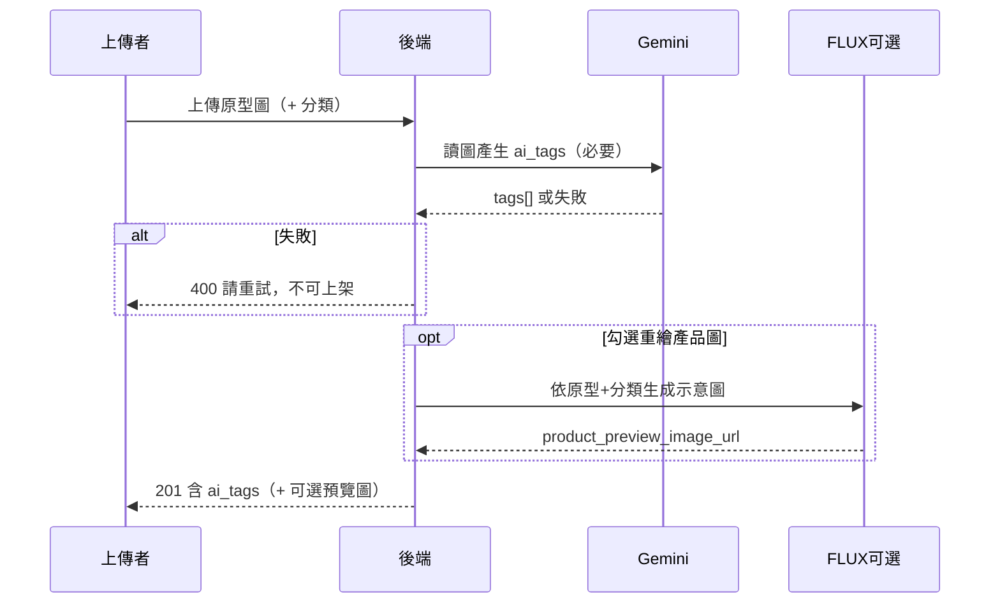

# MatchDO「合做」落地 TODO 清單（分階段）

更新日期：2026-06-02

> **架構 × SEO × B 線原則（必讀）**：`docs/architecture-and-seo-principles.md` — A1～A4 仍有效、**A5 已還原（進度＝A5r 待做）**、B 線 `/client/*` 不進 sitemap、供應商語意欄位。  
> **新對話交接**：`docs/session-handoff-2026-05-26.md`（B 線推送狀態、產品規則、硬編碼 vs AI 待辦）。

---

## 近期完成（2026-06-02 廠商素材 · 編輯多角度圖）

| 項目 | 說明 |
|------|------|
| **頁面** | `public/client/manufacturer-materials.html`（`/client/manufacturer-materials.html`）— **非** portfolio／對照圖頁 |
| **功能** | 數位原型／零件：新增可多圖 + 逐張勾 AI 重繪；**編輯**可「新增角度圖／一次選多張」選檔即上傳 |
| **API** | `POST`／`DELETE` `/api/me/vendor-assets/:id/gallery-images`；列表 `image_urls` 含 `part` |
| **SQL** | `docs/add-vendor-asset-gallery-images.sql`（`gallery_images`） |
| **穩定 commit** | `95b4b98`（按鈕 + `bindEditGalleryUpload`）；詳 **`docs/PROGRESS-vendor-asset-gallery-edit.md`** |
| **文件** | `vendor-asset-prototype-moq-customization-notes.md` §多角度圖、`user-manual.md` §8.3、`網站完整功能說明.md` |

---

## 近期完成（2026-05-26 產業供應商 B 線 · 已 push `main`）

| 項目 | 說明 |
|------|------|
| **遠端** | `main` = `origin/main` @ `285ffc3`（導覽還原 ③、引用列表、效能、作品門檻、移除綁定 UX） |
| **頁面** | `industry-suppliers.html`、`industry-supplier-catalog.html`、`my-supplier-references.html`；上游 `industry-supplier-dashboard` / `supplier-catalog-manage` |
| **API** | `supplier-catalog-imports`、`industry-suppliers`、`supplier-catalog-items`；`can_import_supplier_catalog` 依公開作品 |
| **SQL** | `add-industry-supplier-catalog.sql`；`add-supplier-catalog-item-kind-part.sql`；`seed-industry-supplier-materials.sql` |
| **未做** | 匯入**不**跑 Gemini 標籤；篩選仍混用 enum key；見交接檔 §4 |

---

## 接下來執行進度（建議順序 · 含廠商素材 MOQ／材質提示）

> **架構優化 Step 0～4 + Step 1～2**：✅ **已完成**（2026-05-26）。**Step 5 路由拆分已還原**（`605dca4` 導致啟動時 `express is not defined`、全站 500；已恢復 Step 4 的 `server.js`）。  
> **第二輪**（含 **重做 Step 5**、拆 `custom-products` API）：見 **「架構優化第二輪」**。

> **你現在在這裡**：若架構主線已部署，請以 **SQL → 部署 → 冒煙／E2E** 為主（下表 1～4）；架構第二輪非阻塞。

| 順序 | 做什麼 | 誰做 | 完成標準 |
|------|--------|------|----------|
| **1** | **Supabase 執行 SQL** | 你 | 依下方「待執行 SQL」至少跑完：`semantics` → `semantics-taxonomy` → `data-lineage` → `designer-region`；有廠商自訂分類則加 `vendor-catalog-groups`；**數位原型 MOQ／訂製程度** → `add-vendor-asset-prototype-moq-customization.sql`；**原型多圖** → `add-vendor-asset-gallery-images.sql` |
| **2** | **Git push + Cloud Run 部署** | 你 | 確認 `main` 含：MOQ／訂製程度、FLUX 英譯與 `"..."` 保留、材質紋理提示附錄（`server.js`）；Cloud Shell：`git fetch && reset --hard origin/main` 後 `gcloud run deploy …`（見 `.cursor/rules/deployment.mdc`） |
| **3** | **冒煙測試** | 你 | ① 廠商：上傳**數位原型**（MOQ＋訂製程度、單色／彩色互斥）與**材料參考** ② 設計頁：篩 MOQ／訂製程度、混用原型＋材質參考圖生圖 ③ 儲存→`ai_tags_by_dimension` ④ 圖庫帶分類仍正常 |
| **4** | **全站 E2E** | 你 | 訂製六步、素材庫、廠商頁、對話、點數；問題清單回報再改 |
| **5** | **分析／報表（可選）** | 開發排程 | 媒體牆 API `exclude_vendor_self_serve`；依國家／分維 tag 聚合（R5） |
| **6** | **舊資料補跑（可選）** | 開發排程 | 血緣 backfill；舊圖重跑 Gemini 補 `ai_tags_by_dimension`（耗 API） |
| **7** | **設計風向改版** | 另開分支 | D0–D7，與圖庫／分析分開 PR（見下方規劃） |
| **8** | **廠商 slug 短網址**（選用） | 擇期 | 見 `docs/vendor-profile-slug-plan.md`；現行 `vendor-profile.html?id=` 維持 |

**暫緩／後排**：強制填設計者地區、圖庫作品+素材並列、**B 線匯入後 AI 標籤／語意篩選取代 enum**（見 `docs/session-handoff-2026-05-26.md` §4）、**廠商公開頁自訂 slug 短網址**（見 `docs/vendor-profile-slug-plan.md`，非迫切）。

> **B 線主流程已上 `main`**（2026-05-26）；§4 規劃文內「暫不實作」為舊稿，實作狀態以本檔「近期完成（B 線）」與交接檔為準。

---

## 架構優化第二輪（待排，2026-05-26）

主線 Step 0～5 已結案；以下**另開一輪**，勿與主線混在同一 PR。

| 代號 | 待辦 | 優先 | 完成標準 |
|------|------|------|----------|
| **A5r** | **重做 Step 5**（`inspiration`／`media-wall`／`vendor-pages`） | 高 | 拆檔時 **`routes/media-wall.js` 須 `require('express')`**；admin 路由勿誤搬；`node -e "require('./server.js')"` 通過後再部署 |
| **A6** | 拆 **`routes/custom-products.js`**（或 `lib/custom-products.js` + 路由） | 中 | `POST/PATCH/GET /api/custom-products*`、生圖相關路由搬出 `server.js`；行為不變 |
| **A7** | 拆 **admin 靈感牆**（`PATCH/DELETE /api/admin/media-wall-item`、`requireMediaWallDelete`） | 中 | 權限與刪除流程冒煙通過 |
| **A8** | ~~B 線 P2：開放 `nav.show_supplier_zone`~~ | — | **已廢止**：選單常駐見 `docs/account-one-login-capabilities.md` |
| **A9** | 可選：`media-wall-item` 未上牆即 404 | 低 | 產品確認後再做 |
| **A10** | 可選：統一 **`show_on_homepage` 寫入**（手動儲存 vs 生圖） | 低 | API 與文件一致 |

**參考**：`docs/architecture-optimization-backlog.md` §十一.4。

---

## 規格／規劃文件（供實作前參考）

| 文件 | 說明 |
|------|------|
| **`docs/STABLE-BASELINE.md`** | **實作前必讀**：目前穩定版本 commit（b27ce73）、還原方式、安全實作原則（不破壞穩定性、加法優先、不更動首頁靈感牆）。 |
| **`docs/設計與開店路徑-廠商素材庫規格.md`** | ① 操作流程更清晰（導覽語意、各功能頁內步驟提示與建議下一步；**首頁靈感牆不變動**）。② 廠商素材庫：資料模型、廠商端上傳與分類、設計端「從廠商素材庫選參考圖」、權限與實作順序。已部分實作（見 `vendor_assets`）。 |
| **`docs/design-lineage-and-design-direction-plan.md`** | **訂製生圖資料血緣**（生圖帳號 vs 素材廠商帳號、`is_vendor_self_serve`）；**再製→設計風向**（設計意圖分析）分階段實作。 |
| **`docs/design-signals-tiered-access-plan.md`** | **待開發**：Design Signals 四階付費牆（0／300／900／1800）、`daily_trend_stats` 預聚合、DS-0～DS-7。 |
| **`docs/design-direction-ai-advisor-plan.md`** | **待開發**：設計風向 × **AI 產品顧問**（四階餵料、10 點/次診斷、報告模板）、AD-0～AD-8；現行設計風向差距與調整建議 §四。 |
| **`docs/design-direction-analysis-time-fields.md`** | 風向分析可撈的時間／語意／地區欄位（`custom_products` 等）。 |
| **`docs/vendor-profile-slug-plan.md`** | **選用／後排**：廠商公開頁自訂網址（`/vendor/{slug}`），取代或並存 `vendor-profile.html?id=UUID`；實作清單與工時見該檔。 |
| **`docs/admin-ai-settings-models.md`** | **後台 AI 模型設定**：`/admin/ai-settings.html` 三槽（翻譯／讀圖分析／標籤讀圖）、API 與 `payment_config`；**暫定**讀圖分析 → `gemini-3.1-pro-preview`，標籤維持 `gemini-3.1-flash-lite`。 |
| **`docs/manufacturer-taxonomy-plan.md`** | **規劃中（MT-0）**：廠商素材三維度（生產模式／標準材質／工藝能力）；基線 `552a296`；分期 MT-1～MT-5；**定案前不實作**。 |
| **`docs/vendor-asset-prototype-moq-customization-notes.md`** | **已實作（文件）**：數位原型 MOQ／訂製程度篩選與生圖製造限制句；**多角度圖**（§多角度圖）；**材料參考**紋理尺度附錄。程式見 `server.js`、`manufacturer-materials.html`。 |
| **`docs/PROGRESS-vendor-asset-gallery-edit.md`** | **已完成**：編輯／新增多角度圖、API、排查紀錄、維護注意（勿 label／按鈕 JS 不一致）。 |
| **`docs/design-analysis-material-backtrace.md`** | **待開發**：設計分析須能從 `reference_sources`／`vendor_assets`（材料、版型）**回推訂製需求**；與成品 `ai_tags` 分離，見 MB-0～MB-4。（≠ 生圖材質附錄，後者已上程式） |
| **`docs/supplier-reverse-intent-discovery-plan.md`** | **待開發（已評估）**：L0 逆向檢索；商機＝引用→**通知**+**引用製造商清單頁**（§3.3）；不做合作意向；RI-0～RI-6。 |
| **`docs/architecture-optimization-backlog.md`** | **架構優化執行清單**：Step 0～5 **主線已完成**；URL 對照、風險、§十一 交付摘要與第二輪代辦 A6～A10。 |
| **`docs/architecture-optimization-runbook.md`** | **逐步手冊與冒煙清單**（Step 0～5 操作紀錄；§十 上線驗證勾選）。 |
| **`docs/architecture-and-seo-principles.md`** | **A1～A5r、頁型 A～E、B 線 SEO、語意 migration、部署前檢查**（與 SEO 文件並讀）。 |
| **`docs/session-handoff-2026-05-26.md`** | **對話交接**：B 線已 push 清單、產品紅線、硬編碼 vs AI 待決、部署與 SQL 勾選。 |
| **`docs/三角色架構與AB線說明.md`** | **對外說明用**：訂製者／製造商／產業供應商三角色、**A 線**（`vendor_assets`）與 **B 線**（原型組＋材料）流程圖與對照表；含官方帳號與 A 線測試摘要。 |
| **本檔 §4「產業供應商、製造商採購庫」** | 供應商上架分兩類：**數位原型組**（一組多圖）、**材料**；製造商後台分別**導入**至原型組庫／材料庫（B2B；**不用「收藏」**）；**不**接入訂製者設計頁；另含線下店家、官方虛擬廠商；**暫不實作**。 |
| **本檔 §5「會員後台・三角色介面分離」** | 會員中心 IA、導覽三區、頁面對照、capabilities 顯示；與 `/admin/` 分工；**規劃中**。 |
| **本檔 §6「視覺語意庫・Gemini 標籤／提示詞／生成圖解析」** | 上傳與生圖時以 **`gemini-3.1-flash-lite`** 解讀圖與提示詞，累積 **`visual_semantics`** 供搜尋與日後售前風格意圖／流行預測；首頁靈感牆標籤搜尋；**規劃中**。 |

---

## 近期完成（2026-05-26 種子廠商：天數／同意公開／內部預覽／素材上下架）

| 項目 | 說明 |
|------|------|
| **SQL** | `docs/add-manufacturers-seed-public-released.sql` |
| **後台** | `seed-vendors.html`：公開天數、到期日、同意公開／撤回、素材上下架 Modal |
| **API** | `getRequestInternalPreviewFlag`；種子可見性規則；`PATCH` 素材 `is_public`；admin 素材列表 |
| **廠商端** | `manufacturer-materials.html`：一般廠商素材上架／下架 |
| **設計／廠商頁** | 帶 token 請求 `vendor-assets`（admin/tester 可預覽種子） |
| **文件** | `docs/seed-vendor-admin-and-visibility-plan.md`、`種子廠商入駐操作手冊.md` |

## 近期完成（2026-05-26 數位原型 MOQ／訂製程度 · 材質生圖提示）

| 項目 | 說明 |
|------|------|
| **DB** | `min_order_quantity`、`customization_levels`（僅 `prototype`）；migration：`add-vendor-asset-prototype-moq-customization.sql`；多圖：`add-vendor-asset-gallery-images.sql` |
| **廠商 UI** | `manufacturer-materials.html`：MOQ、訂製程度、單色／彩色表面圖文互斥 |
| **設計端** | `custom-product`：MOQ 精確篩選、訂製程度 OR 篩選；選圖帶 `material_key` |
| **生圖 prompt** | 原型：未勾選訂製程度→限制句；材料：`buildMaterialTexturePromptAppendix`（尺度、勿平鋪樣板、檔名可選線索） |
| **FLUX** | 整段英譯；`"..."` 內印刷文字不譯；設計頁 `?` 說明 |
| **修復** | `GET /api/me/vendor-assets` 列表第 2 筆起誤顯英文標籤（`3c15eea`） |
| **文件** | 本檔進度表、`vendor-asset-prototype-moq-customization-notes.md`、`網站完整功能說明.md` |
| **待你** | **push → 部署 → Supabase SQL**；實測材質＋原型混用生圖效果 |

## 近期完成（2026-05-26 架構優化 Step 0～4 主線；Step 5 已還原）

> **2026-05-26 晚**：Step 5（`605dca4`）上線後全站 HTTP 500，已 **還原 `server.js` 至 Step 4**（`7033fe3` 版路由本體），刪除 `lib/media-wall.js`、`routes/inspiration.js` 等。請重新部署後驗證首頁。

| 項目 | 說明 |
|------|------|
| **Step 0** | `/client` 分流、`show_on_homepage`／`visibility` 稽核；可索引 URL 定案 |
| **Step 1** | `routes/sitemap.js`（sitemap + robots） |
| **Step 2** | `/sitemap.xml` 改 5 子索引；廢止 products 索引；`SEO-PROGRESS.md` |
| **Step 3** | `GET /api/me/capabilities` 加 `zones`、`nav`；產業供應商 ③ 區選單暫隱 |
| **Step 4** | 廢止 `visibility`；`custom-product-detail`：`noindex` + canonical → `/inspiration/...` |
| **Step 5** | ~~已拆路由~~ → **已還原**（見上；第二輪 **A5r** 重做） |
| **導覽 UX** | 「我的功能」移除與頂部「客製產品／設計風向」重複的連結 |

**新增／主要變更檔案**：

- `routes/sitemap.js`
- `public/js/site-header.js`、`client/custom-product-detail.html`
- `docs/custom-products-db-columns.md`、`docs/SEO-PROGRESS.md`、`docs/sitemap.md`

**仍留在 `server.js`（第二輪可拆）**：訂製產品 CRUD、生圖 API、admin 靈感牆刪除、金流、其餘 `/api/*`。

---

## 近期完成（2026-05-21 再製→設計風向文案）

| 項目 | 說明 |
|------|------|
| **前台** | 導覽「設計風向」、`/remake/` 與 `/remake-product.html`（設計意圖分析）、`zh-TW`／`en` i18n；流程說明暫為「規劃中」占位。 |
| **後台** | `remake-categories.html` 改「設計風向分類」；header／sidebar 連結同步。 |
| **未改** | URL、`remake_*` 表、API 路徑、`categorySource: 'remake'`；D0–D7 產品改版見下方規劃。 |

## 近期完成（2026-05-21 廠商後台導覽與 IA）

| 項目 | 說明 |
|------|------|
| **公開頁 vs 後台** | 訪客首頁 = `vendor-profile.html?id=…`；管理 = `manufacturer-dashboard.html`。控制台頂部藍卡「我的廠商首頁」+ 標題列按鈕；快速入口第一項同義；複製網址區文案對齊。 |
| **頂部選單** | 「我的功能 → 製造商」新增 **我的廠商首頁（公開）**（登入且有廠商資料時顯示）；「訂製需求」與控制台快速入口對齊；「瀏覽所有廠商」降為次要連結。 |
| **文案釐清** | `manufacturer-portfolio.html` 改稱 **上傳展示案例**（非訂製者 AI 設計稿）；`manufacturer-materials.html` 頁頂說明對應素材庫；`demands.html` 麵包屑與說明改為接案用。 |
| **廠商頁按鈕** | 「瀏覽作品圖庫」改 **查看下方作品集**（同頁捲動）；從廠商頁進圖庫仍可用 `manufacturer_id` 限定單廠（標題改為「○○ 的作品圖庫」）。 |
| **素材分類 UI** | `manufacturer-materials.html`「我的素材分類」可收起／展開；「預設收起」存本機 `localStorage`（≥5 類首次自動收起）。 |
| **commits** | `4688e7c`、`5d074b5`；本批 IA 與文件見本次 commit。 |

## 近期完成（2026-05-20 圖庫分類・廠商素材）

| 項目 | 說明 |
|------|------|
| **廠商自訂分類** | `docs/add-vendor-catalog-groups.sql` + 後端 API；`manufacturer-materials.html` 頁頂「我的分類」、上傳／編輯可掛分類；`vendor-profile.html` 依廠商分類瀏覽素材；產品設計頁「從廠商素材庫選」可配合廠商分類篩選。 |
| **圖庫 `/custom/gallery.html`** | ① 首頁 `category_key`／`subcategory_key` **原樣帶入**（`init` 與穩定版 `01a1053` 相同；**禁止**改寫 `selCat`／`selSub`）。② 作品篩選對齊首頁媒體牆（`portfolio.category_key`、子分類、廠商 `categories[]`）。③ **該分類無對照圖／作品時**，顯示同訂製分類的 **`vendor_assets`**（素材 `category_key`／`subcategory_key` 與作品同一套 `assetMatchesCategory` 比對）。④ 按鈕高亮用 `categoryKeyForUiActive`（僅 UI，處理 URL 含 `&` 的異常參數）。commits：`65561c8`、`f459347`、`7b202db`、`f42e282`。 |
| **部署** | 已 push `origin/main`；上線僅 **Google Cloud Shell**（見 `.cursor/rules/deployment.mdc`）。 |

## 近期完成（2026-05-20 設計圖分維標籤・資料血緣）

| 項目 | 說明 |
|------|------|
| **分維 AI 標籤** | `lib/visual-semantics.js` v3：生成圖語意拆為 style／material／color／structure／features／patterns／craftsmanship／form／mood／use_case／category，寫入 `ai_tags_by_dimension` + `image_semantics_json` |
| **資料血緣** | `lib/custom-product-lineage.js`：`is_vendor_self_serve` **僅**素材庫引用自己廠素材；API 回傳 strip，**前端不顯示** |
| **設計者國家** | `lib/designer-region-from-ip.js` + `geoip-lite`；僅 IP，不強制填寫 |
| **SQL** | 見下方「待執行 SQL」；含 semantics、taxonomy、lineage、designer-region |

### 待辦：圖庫・素材（測試後再改）

| 優先 | 項目 | 說明 |
|------|------|------|
| **→ 目前** | **發案者全站 E2E** | 圖庫分類帶入與無作品顯示素材已驗證可顯示；其餘功能繼續測，有問題再逐項修改。 |
| 待確認 | 首頁→圖庫 URL | 若仍出現 `category_key=主類&子類` 複合字串，可改首頁組連結只傳單一 key（圖庫端已容錯高亮）。 |
| 可選 | 圖庫作品+素材並列 | 現況：僅「該分類作品數 = 0」才顯示素材；若要同時顯示作品與素材需另開需求。 |
| 可選 | 圖庫篩選區版面 | 關鍵字是否固定在上、分類在下（先前改版曾影響版面，目前未改）。 |
| 必做（若未執行） | Supabase SQL | `docs/add-vendor-catalog-groups.sql`；其它本輪相關 migration 見下方「待執行 SQL（2026-05-20）」。 |

### 待執行 SQL（2026-05-20，雲端若尚未跑請補）

| 檔案 | 用途 |
|------|------|
| `docs/add-vendor-catalog-groups.sql` | 廠商自訂素材分類表與關聯 |
| `docs/add-manufacturer-portfolio-min-order-quantity.sql` | 作品／素材最小起訂量（若已上該欄位功能） |
| `docs/add-custom-products-reference-sources.sql` | 客製產品引用廠商素材來源紀錄 |
| `docs/add-custom-products-semantics.sql` | 生圖 `ai_tags`／語意 JSON（分析用） |
| `docs/add-custom-products-semantics-taxonomy.sql` | 設計圖分維標籤 `ai_tags_by_dimension` |
| `docs/add-custom-products-data-lineage.sql` | 廠商自產血緣（後端分析用） |
| `docs/add-custom-products-designer-region.sql` | 設計者國家（僅 IP 快照） |
| `docs/add-vendor-asset-prototype-moq-customization.sql` | 數位原型 **MOQ**、**訂製程度**（`vendor_assets`，2026-05-26） |
| `docs/add-vendor-asset-gallery-images.sql` | 數位原型 **多角度** `gallery_images`（2026-05-26） |
| `docs/add-manufacturers-seed-public-released.sql` | 種子廠商 **已同意公開** `seed_public_released_at`（2026-05-26） |

---

## 規劃：訂製生圖「資料血緣」（廠商自產標記）— 2026-05-20

**目標**：設計好的圖已有 **分類**（`category`／`subcategory_key`）與 **tags**（`ai_tags` 等）；另需判定 **生圖帳號**（`owner_id`）與 **引用素材所屬廠商帳號**（`manufacturers.user_id`）是否相同，並註明，以便分析時排除廠商自己建的樣本。

**詳細規格**：`docs/design-lineage-and-design-direction-plan.md` §二

### 建議作法（摘要）

| 步驟 | 待辦 | 說明 |
|------|------|------|
| 1 | **新增 SQL** | ✅ `docs/add-custom-products-data-lineage.sql`、`docs/add-custom-products-semantics-taxonomy.sql`（請在 Supabase 執行） |
| 2 | **後端判定** | ✅ `lib/custom-product-lineage.js` + `POST /api/custom-products`；**僅伺服器**查 `manufacturers` |
| 3 | **規則** | ✅ `is_vendor_self_serve` = **僅**「從素材庫引用自己廠素材」；上傳參考圖但未選素材庫 **不算**；**前端不顯示、API 已 strip** |
| 3b | **設計圖分維標籤** | ✅ `lib/visual-semantics.js` v3：風格／材質／顏色／結構／特色／圖案／工藝／形態／氛圍／用途 + `ai_tags_by_dimension` |
| 4 | **語意事件** | ✅ `visual_semantics_events.semantics_json` 含 `ai_tags_by_dimension` 與 `lineage`（內部） |
| 5 | **媒體牆／報表** | ⏳ 對外趨勢 API 可選 `exclude_vendor_self_serve=true`（預設排除） |
| 6 | **舊資料 backfill** | ⏳ 血緣與分維標籤批次補跑 |
| 7 | **文件** | ✅ `docs/custom-products-db-columns.md`；**禁止**前端顯示廠商自產 |

**分維欄位**（`ai_tags_by_dimension`）：`style`、`material`、`color`、`structure`、`features`、`patterns`、`craftsmanship`、`form`、`mood`、`use_case`、`category`。

---

## 設計者國家／地區（僅 IP，不強制填寫）— 2026-05-20

**決策**：不強制使用者填地區；儲存設計圖時依 **IP** 寫入國家快照（`designer_region_source=ip` 或 `unknown`）。

| 項目 | 說明 |
|------|------|
| **程式** | `lib/designer-region-from-ip.js`；`POST /api/custom-products`、生圖自動儲存皆寫入 |
| **推斷** | 優先 CDN 標頭（`CF-IPCountry` 等）→ 否則 `geoip-lite` + `X-Forwarded-For` |
| **SQL** | `docs/add-custom-products-designer-region.sql`（請在 Supabase 執行） |
| **隱私** | `designer_region_json` 只存遮罩 IP；**前端不顯示、API strip**（與廠商自產相同） |
| **依賴** | `geoip-lite`（`package.json`）；`app.set('trust proxy', 1)` 以正確讀取代理 IP |

### 待辦（可選後續）

| 階段 | 待辦 |
|------|------|
| R4 | 舊資料無法補 IP（僅新儲存有效） |
| R5 | 後台／趨勢報表依 `designer_country_code` 聚合 |

**不實作**：強制表單、使用者宣告地區（除非你日後改需求）。

---

## 規劃：再製方案 → 設計風向（設計意圖分析）— 2026-05-20

**文案（2026-05-21）**：前台＋後台使用者可見名稱已改為「設計風向／設計意圖分析」；功能與資料表尚未改版。  
**導覽選單（2026-05-21）**：頂部「設計風向」下拉與「我的功能」獨立區塊 — 首頁 → 意圖分析 → 我的設計風向｜找製作方、圖庫找靈感（與客製產品選單區隔）；見 `nav.remake*` i18n。

**目標**：將現行 **再製方案** 整線改為 **設計風向**——核心為 **設計意圖分析**（圖＋描述 → 結構化風格／意圖），而非「改裝分類」語意；生圖／儲存可保留，但分類與 prompt 體系重定位。

**詳細規格**：`docs/design-lineage-and-design-direction-plan.md` §三

**風向分析可用時間／語意欄位**（2026-05-21 紀錄）：`docs/design-direction-analysis-time-fields.md` — `custom_products.created_at`／`updated_at`／`semantics_generated_at`、`visual_semantics_events.created_at`、分維標籤與 designer 地區欄位；無獨立「設計時間」欄。

### 待開發：Design Signals（設計風向數據付費牆）— 2026-05-21

**狀態**：📋 僅規劃，**不執行**。完整規格：`docs/design-signals-tiered-access-plan.md`

| 摘要 | 內容 |
|------|------|
| 產品邏輯 | 排名 → 成長率 → 折線趨勢 → 自訂儀表板／地圖／警報 |
| 四階解鎖 | 免費 Top3 標籤（無數字）→ $300 排行榜+%+週成長 → $900 3～6 月折線+對比 → $1,800 Heatmap+釘選+Email 警報 |
| 資料源 | 時間／主+子分類／`ai_tags_by_dimension`／`designer_country_code`（見 time-fields 專檔） |
| 待建表 | `daily_trend_stats`（每日 Cron 預聚合，禁止即時掃 JSONB） |
| 實作階段 | **DS-0～DS-7**（見規劃書 §六）；與 D0–D7 產品線可並行 |

### 待開發：AI 產品顧問（設計風向 × Gemini 診斷）— 2026-05-21

**狀態**：📋 僅規劃，**不執行**。完整規格：`docs/design-direction-ai-advisor-plan.md`

| 摘要 | 內容 |
|------|------|
| 免費 | 首頁分類 Top3 標籤；作品旁灰階 **🪄 讓 AI 診斷…** → 升級 $300 彈窗 |
| $300 | 顧問開啟，**10 點/次**；餵 **7 天** tag 排名 → 短期戰術報告 + 結尾引導升 $900 |
| $900 | **10 點/次**（或月 5 次免費深度）；餵 **3～6 月折線** + 材料庫 → 生命週期／供應鏈建議 |
| $1,800 | 吃到飽或大批量；餵 **全局 + IP 地理** → 產能／外銷報告 |
| 實作階段 | **AD-0～AD-8**；依賴 **DS-2** 聚合表、**D1 `product_line`** |
| **設計風向現況調整** | 見顧問規劃書 **§四**：優先 `product_line`、列表篩選、意圖分析頁加報告區、顧問按鈕；首頁 Top3 屬 DS 非 remake 本體 |

### 待辦（分階段）

| 階段 | 待辦 | 說明 |
|------|------|------|
| **D0** | **規格確認** | 方案 A：`custom_products.product_line`（`custom`／`design_direction`，舊 `remake` 遷移）vs 方案 B：獨立 `design_intent_analyses` 表；導覽是否保留 `/remake/` URL |
| **D1** | **資料層** | migration：`product_line`；`remake_categories` 改名或改語意為設計風向；種子／後台資料遷移 |
| **D2** | **後台** | `/admin/remake-categories.html` → 設計風向分類與 **意圖分析用 prompt**（非改裝用語） |
| **D3** | **API** | `categorySource: 'design_direction'`；新增或擴充 `analyze-design-intent`；`buildPromptFromDesignDirectionKeys`；生圖仍寫 `custom_products` 並帶 **§ 資料血緣** 旗標 |
| **D4** | **前端** | `remake-product.html`／`remake-product.js` 文案與流程：意圖分析結果區、標籤；`/remake/` 首頁改「設計風向」 |
| **D5** | **列表／靈感牆** | 我的客製產品篩選 `product_line`；媒體牆是否獨立設計風向比例（可沿用本檔「再製品靈感牆比例」規劃，改欄位名） |
| **D6** | **多語系／SEO** | `locales`、nav、Sitemap；舊連結 301 或相容 |
| **D7** | **E2E** | 設計風向：上傳圖 → 意圖分析 → 生圖 → 儲存 → 確認 `product_line` 與血緣旗標 |

**與訂製線關係**：訂製產品設計頁維持現行；設計風向為**另一產品線**（共用 `custom_products` 表較省改動，見規劃文件方案 A）。

**注意**：改動面大，**勿與圖庫分類帶入**同一 PR；全站 E2E 測完後另開實作分支。

---

## 本次檢查與修復（2026-03-05）

| 項目 | 說明 |
|------|------|
| **GA4 全站載入** | 前台 `ga4-loader.js` 從 `/api/config/ga4` 取得衡量 ID 並注入 gtag；主要頁面（首頁、產品設計、訂閱方案、廠商列表、客製產品、remake-product、vendors）直接掛載 script，其餘由 `site-header.js` 動態注入以覆蓋全站。後台「網站設定」填 GA4 衡量 ID 即可，無需改 HTML。 |
| **聯絡信箱統一** | 頁腳 partial、site-footer.js、首頁 Organization JSON-LD、about／contact／feature／service 等對外頁面聯絡信箱與 Contact Us 連結均改為 **support@matchdo.cc**。 |
| **文件更新** | `docs/SEO-PROGRESS.md` 更新：GA4、sitemap-inspiration、聯絡信箱；`docs/user-manual.md` 新增 GA4 與圖片網址說明。推送 commit `f5f7d26`。 |
| **獨立 URL Canonical（③a）** | `/inspiration/:type/:id` 輸出的 HTML 已加上 `<link rel="canonical" href="${pageUrl}">`，搜尋引擎可明確識別正本網址。 |

---

## 待辦：SEO 獨立 URL 其餘項（已紀錄，見 docs/SEO-PROGRESS.md）

| 項目 | 說明 |
|------|------|
| **① 標題格式** | 可選：將靈感牆獨立頁 og:title 改為「MatchDO｜{標題或分類}」格式（一行級）。 |
| **② 語意化網址** | 中長期：改為 `/design/bespoke-oxford-shoes-9527` 等，需新路徑、slug 來源、301、前端與 sitemap 全面改。 |
| **③b Sitemap 高品質優先** | 需「再設計點擊」埋點與儲存，再依計數排序／篩選 sitemap 收錄。 |

---

## 本次檢查與修復（2026-03-04）

| 項目 | 說明 |
|------|------|
| **對照圖篩選 API** | 靈感牆篩選「對照圖」時，`GET /api/media-wall?layout_type=comparison` 改為**查詢時**即過濾：僅查 `image_url_before` 非 null 的廠商作品，沒傳對照圖的項目不會出現在對照圖區（`server.js` 兩處 compQuery + fallback 皆加 `.not('image_url_before', 'is', null)`）。 |
| **工作進度文件** | 系列圖／對照圖分離與聯絡資訊的**目前進度總覽**已寫入 **`docs/series-vs-comparison-progress.md`**（含規格、已完成項、聯絡資訊 FK 修正方式、待確認項目與關鍵檔案）。 |
| **系列圖／資料夾整合** | 後端：media_collections 回傳 `type=series`、`series_image_urls`；篩選「系列圖」或「資料夾」皆查廠商 series＋資料夾，並 filter 為 `type===series`。前端：`renderOne` 以 `series`／`collection` 同一分支；`is1x2` 含 series；按鈕「系列圖」`data-layout-type="series"`，`applyStateFromURL` 含 `series`。 |
| **設計圖僅 AI 生成** | API 回傳前：有 manufacturer_id 且 type 為 user_design 的改為 comparison／series；`layout_type=user_design` 時再 filter 為 `type===user_design` 且無 manufacturer_id。 |
| **聯絡資訊儲存失敗** | 在 Supabase SQL Editor 執行 **`docs/fix-contact-info-fk-to-auth-users.sql`** 後即可正常儲存。 |

---

## 近期完成（2026-03-04 Cloud Run 部署 + 首頁篩選）

| 項目 | 說明 |
|------|------|
| **Cloud Run 啟動修正** | `server.js` 改為在建立 app 後**立即 listen(PORT)**，再載入路由與背景 bootstrap，避免 Cloud Run 判定「未在時限內 listen」導致部署失敗；media-wall try 區塊語法修正（Missing catch）已一併推送。 |
| **首頁篩選與網址** | 首頁三種 layout_type（設計圖／對照圖／系列圖）按鈕、篩選狀態與 URL 綁定（`layout_type`、`category_key`、`subcategory_key`、`q`、`lang`）；載入時從 URL 還原、popstate 支援返回。 |
| **Sitemap** | 首頁「全部 + 三種類型 + 中英文」與動態 `sitemap-categories.xml` 已加入；見 `docs/SEO-PROGRESS.md`、`docs/sitemap.md`。 |
| **部署方式** | 僅 **Google Cloud Shell**（見 `.cursor/rules/deployment.mdc`）；指令用 `git fetch + reset --hard` 再 `gcloud run deploy`。 |
| **系列圖／對照圖分離** | 廠商作品：系列圖（多張 `series_image_urls`、無 `image_url_before`）與對照圖（設計圖＋作品圖）完全分開；上傳類型單選、編輯依類型顯示區塊、靈感牆篩選「對照圖」時 API 只回傳有設計圖的項目；防呆不把廠商作品當 user_design。詳見 **`docs/series-vs-comparison-progress.md`**。聯絡資訊儲存失敗可執行 `docs/fix-contact-info-fk-to-auth-users.sql`。 |

---

## 近期完成（2026-03-04 Header 會員點數）

| 項目 | 說明 |
|------|------|
| **桌機版點數** | 已登入時在頭像「下方」、兩條橫線中間（navbar-collapse 底線與 navbar 底線之間）顯示「N 點」，寬度與頭像同寬靠右（`flex: 0 0 auto`、`margin-left: auto`），不佔滿寬、不撐開版面；點擊連到 `/credits.html` |
| **手機版點數** | 已登入時在 Logo 與漢堡之間（`#navPointsMobile`）顯示「N 點」，`ms-auto me-2` 靠右；點擊連到 `/credits.html` |
| **點數來源** | `GET /api/me/credits` 取 `balance`，`loadHeaderCredits()` 於 header 渲染後呼叫並更新 `#navPointsDesktopValue`、`#navPointsMobileValue` |
| **樣式** | 數字與「測試中」同色 `#ffc107`、字重 600；桌機 0.95rem／手機 1rem；`text-shadow: none`、`subpixel-antialiased` 避免糊感；背景與導覽列同色 `#ffffff` |
| **規劃文件** | 本檔「規劃：Header 會員點數顯示位置」一節為實作依據；commit `ae0802a` |

---

## 近期完成（2026-03-01 頂部選單 Hover 下拉 + 手機版 UI）

| 項目 | 說明 |
|------|------|
| **Navbar hover 下拉** | 「客製產品」與「再製方案」選單項改為 `.nav-has-hover` dropdown；桌機滑鼠懸停時以 CSS `:hover` 展開 4 個子連結（建立產品／找製作方／圖庫找廠商／我的數位資產），點擊標題本身仍導向首頁不受影響；手機版 ▾ 箭頭隱藏，維持原收合行為 |
| **再製方案手機版 UI** | `remake-product.html` + `remake-product.js` 套用與客製產品頁相同的手機版調整：結果畫布置頂 1:1、頁面標題隱藏、上下 padding 壓縮、Textarea auto-grow（手機專用）、Seed 收納在 `<details>` 裡、分類 Bottom Sheet（主→子兩步驟）、參考圖橫向滾動、生成按鈕固定頁底；生成中加 `is-loading` 脈衝動畫 |

---

## 近期完成（2026-03-01 客製產品手機版 UI 第一波 + 選單）

| 項目 | 說明 |
|------|------|
| **結果畫布置頂** | 手機版 `.create-panel-right` 改為 `order:-1`，寬度 `min(55vw, 240px)`，`aspect-ratio:1`，歷史縮圖在手機隱藏；生成中加 `is-loading` CSS 脈衝動畫 |
| **頁面標題/副標/提示字隱藏** | `.page-title`、`.page-sub`、`#promptHint` 在 `@media(max-width:768px)` 下 `display:none` |
| **上下間距壓縮** | `.container-fluid.py-4` 與 `#custom-product.py-2` 在手機均清零 padding |
| **Textarea auto-grow** | JS 手機條件（`window.innerWidth<=768`）才設 `rows=1`、`resize:none`、auto-grow；桌機維持 `rows=3`、`resize:vertical` |
| **Seed 收納** | Seed 欄位包進 `<details id="seedDetails">` 手機預設折疊；桌機 `<summary>` 樣式保持 |
| **分類 Bottom Sheet** | 手機隱藏 `.cat-tablet` 雙面板；改為 `#catMobileBtn` 按鈕觸發由下滑出的 `.cat-bottom-sheet`，分主分類→子分類兩步驟，用 `MutationObserver` 同步按鈕標籤 |
| **參考圖橫向滾動** | `.ref-slots` 在手機改 `display:flex; overflow-x:auto; scroll-snap-type:x mandatory`，每格固定 80×80px |
| **生成按鈕固定頁底** | `.btn-generate` 手機版 `position:fixed; bottom:0`；左側加 `padding-bottom:4.5rem` 防遮擋 |

---

## 近期完成（2026-03-01 站內對話介面修復）

| 項目 | 說明 |
|------|------|
| **noConversation 兩格 bug** | `#noConversation` 有 `d-flex` class（`display:flex !important`），JS 的 `style.display='none'` 被蓋過，導致 noConversation 與 conversationPanel 同時顯示各佔一半；改用 `classList.add('d-none')` 切換解決 |
| **conversationPanel 初始隱藏** | 改為 `class="d-none"` 取代 `style="display:none;"`，與 Bootstrap 類別機制一致 |
| **輸入框貼底雙重保險** | CSS 加 `position:sticky; bottom:0; z-index:10`；JS `fixLayoutHeight()` 同時用 `ResizeObserver` 監聽 `#site-header` 與 `.page-title-bar`，加 `window.scroll` 監聽，`maxHeight` 同步設定；保底 timeout 延至 1500ms |
| **圖片預覽 X 按鈕不被裁** | 原 `top:-8px` 超出祖先 `overflow:hidden` 被裁掉；改 `.img-preview-item` 加 `padding-top:10px`，按鈕改 `top:0` 停在容器範圍內 |
| **訊息泡泡顏色** | 自己訊息泡泡由 `#0d6efd`（高彩度）改為 `#5b9cf6`（柔和淺藍）；時間戳與翻譯按鈕顏色改為 `rgba(255,255,255,0.78)` 可讀 |
| **我的最愛按鈕文案** | `client/my-custom-products.html`：「查看原始」改為「前往廠商頁面」，語意更清楚 |
| **數位資產庫傳圖** | 對話頁可從「我的作品」與「我的最愛」兩個分頁選取圖片直接傳送（`POST /api/direct-conversations/:id/messages/asset-url`） |
| **圖片壓縮上傳** | 上傳前 Canvas 壓縮（PNG/JPG → JPEG，max 1200px，quality 0.82）；純圖片訊息無粗藍框（`img-only` class，透明背景＋細邊框） |

---

## 近期完成（2026-03-01 社群分享 & 廠商社群帳號）

| 項目 | 說明 |
|------|------|
| **首頁 lightbox 分享按鈕** | 「分享▼」下拉選單（FB/IG/Threads/X/LINE/Pinterest/複製連結）；收藏+分享改為 `d-flex me-auto` 包裝，確保兩者緊鄰左側 |
| **分享 i18n** | 所有分享文字改用 `data-i18n`，英文頁自動顯示英文 |
| **廠商社群帳號設定** | 廠商控制台新增「社群帳號」卡片（FB/IG/Threads/X/LINE/官網）；`PATCH /api/me/manufacturer` API 新增；`vendor-profile.html` 可顯示 |
| **後台平台社群帳號** | `admin/site-settings.html` + `GET/PATCH /api/admin/social-links` |
| **contact_info 補欄位** | `docs/add-threads-twitter-to-contact-info.sql`（需在 Supabase 手動執行） |
| **Bootstrap Icons 升版** | 廠商控制台、聯絡設定頁升至 v1.11.3（`bi-threads`、`bi-twitter-x` 正常顯示） |

---

## 近期完成（2026-03-01 服務地區系統 v2）

| 項目 | 說明 |
|------|------|
| **正確三層結構** | 台灣(TW)為頂層節點→縣市為子（葉節點，不可再細分）；海外國家→州/地區→城市；前台第一層台灣＋海外同級 |
| **Admin UI 重寫** | 台灣縣市不顯示「新增子地區」；海外國家顯示「新增州/地區」；州下顯示「新增城市」；型別色碼標示 (country/tw_city/state/city) |
| **前台選擇器 v2** | 第一層台灣＋各國同級；台灣展開後按北中南東離島分組顯示縣市；海外分裂標籤（左點=選整個國家/州，右點=展開下層） |
| **DB schema** | `service_areas` 新增 `parent_code` + `area_type`；執行 `docs/service-areas-complete.sql` 一次完成 |
| **美英澳地區資料** | 英國 4 地區+10城市；美國 10 州+17城市；澳洲 8 州領地+12城市；全部含中英文名稱 |
| **area-codes.js 重構** | 改用 `countries[]` 結構（台灣含 group_code 用於北中南東分組）；保留 `groups` getter 舊版相容 |
| **SQL 執行** | `docs/service-areas-complete.sql`（Supabase SQL Editor，可重複執行） |
| **commit** | `6c76488` |

---

## 近期完成（2026-03-01 Navbar 整治）

| 項目 | 說明 |
|------|------|
| **Navbar 全站一致** | `site-header.js` IIFE 只注入 CSS/Bootstrap JS/字型，不再渲染 HTML；DOMContentLoaded 單次渲染，消除 i18n key 錯誤與跳動 |
| **credits.html 修正** | 補 `/css/style.css`、修正 script 載入順序（bootstrap → auth-config → i18n → site-header） |
| **個人選單跳動消除** | `updateUserInfo` 比對後只在資料真的不同時更新 DOM；`INITIAL_SESSION` 不再觸發重畫 |
| **首頁搜尋框置中** | `justify-content-center`，搜尋框寬度調整至 280px |

---

## 規劃：Header 會員點數顯示位置（已實作 2026-03-04）

**目標**：會員點數在 header 永遠可見；桌機在個人選單下、手機在漢堡左邊。

### 顯示規則

| 版型 | 位置 | 說明 |
|------|------|------|
| **桌機版** | 個人選單「下」 | 在頭像／個人選單區塊內、頭像下方或緊鄰處，永遠顯示一列「N 點」（可點擊連到 `/credits.html`），不需展開選單即見。 |
| **手機版** | 漢堡左邊 | 在 Logo 與漢堡按鈕之間，永遠顯示「N 點」（可點擊連到 `/credits.html`）。 |

- 僅**已登入**時顯示點數；未登入不顯示。
- 點數來源：**`GET /api/me/credits`**（回傳 `balance`），與 `credits.html` 相同。

### 實作要點

1. **`public/js/site-header.js`**
   - **桌機**：在 `#authSection` 內、登入時於頭像 dropdown 前方或下方插入一個「點數」節點（例如 `<a href="/credits.html" class="nav-points-desktop">…</a>`）。可用小字或 icon＋數字（如 `bi-currency-exchange`＋「123 點」），置於頭像正下方或同一 flex 行內，依現有 `.nav-avatar-toggle` 排版微調。
   - **手機**：在 **navbar-brand 之後、navbar-toggler 之前** 插入一個僅手機顯示的區塊（例如 `<div id="navPointsMobile" class="d-lg-none">…</div>`），內為 `<a href="/credits.html">N 點</a>`，確保 DOM 順序為：Logo → 點數 → 漢堡。
   - 初次渲染時若尚未取得點數，可先顯示「—」或「0」，再在 `loadSiteHeader` 內（或之後）呼叫 `GET /api/me/credits`，取得 `data.balance` 後更新兩處節點（桌機 `.nav-points-desktop`、手機 `#navPointsMobile`）。若與 `updateUserInfo` 一併更新，可一併在登入狀態變更時重取點數。

2. **`public/css/style.css`**
   - 桌機：`.nav-points-desktop` 僅在 `min-width: 992px`（或全站 RWD 斷點）顯示，樣式與個人選單區一致（字級、顏色、間距）。
   - 手機：`#navPointsMobile` 僅在 `max-width: 991.98px` 顯示（或使用 `d-lg-none`），置於 logo 與漢堡之間，不折行、不壓縮漢堡按鈕。

3. **i18n**  
   - 若需「點」字樣多語，可加 `nav.points` 或沿用既有點數相關 key。

### 注意

- 不更動現有個人選單 dropdown 內容（「我的點數」連結保留）。
- 點數僅在 header 顯示餘額數字＋連結，不重複整塊 credits 介面。

---

## 近期完成（2026-02-25 部署規劃）

### 部署方案：Zeabur + GitHub

| 項目 | 說明 |
|------|------|
| **建議平台** | **Zeabur**（台灣團隊、每月免費額度 $5、額度內不休眠、全中文介面）；替代方案 Render、Koyeb 見下方部署計劃。 |
| **部署文件** | **`docs/deploy-zeabur-github.md`**：GitHub 建立 repo、本機 push、Zeabur 連動 GitHub、Web Service 建置與啟動指令（`npm start`）、環境變數、部署後 Supabase／金流設定。 |
| **後端埠** | `server.js` 已改為使用 `process.env.PORT || 3000`，Zeabur／Render 等平台會自動注入 PORT。 |

---

## 近期完成（2026-02-25 補充）

### 我的 AI 編輯區與會員方案頁

| 項目 | 說明 |
|------|------|
| **置換背景與重打光** | Stability Edit「replace-background-and-relight」：後端 `POST /api/replace-background-relight-image`、點數 `points_ai_replace_bg_relight` 預設 30；前台／後台「我的 AI 編輯區」新增工具「置換背景與重打光」，主體圖＋背景描述或參考圖＋選填打光等；輸出僅 jpeg/png。 |
| **結果標籤依功能切換** | 我的 AI 編輯區結果區標題改為依目前工具顯示（如「圖像去背 生成結果」「放大結果 (4x)」），不再固定「放大結果 (4x)」。 |
| **訂閱會員 AI 編輯區 6 折** | 有效付費訂閱用戶使用「我的 AI 編輯區」任一功能時，實際扣點為後台表列點數的 6 折（至少 1 點）。後端 `hasActivePaidSubscription`／`applyAiEditDiscountForSubscriber`，套用於放大、草圖／結構／風格／風格轉換、移除物件、內部補繪、外擴繪圖、圖像去背、置換背景與重打光。 |
| **方案頁內容描述與 6 折說明** | `/subscription-plans.html`：各方案卡片補回權益列表（設計圖靈感牆、接案分類、首頁對照圖、多語系、對話翻譯）；**我的 AI 編輯區**列在「首頁作品對照圖」下方，免費為「依後台點數」、付費為「訂閱享 6 折」；按鈕以 flex 對齊卡片底部；下方點數規則註明「6 折僅適用我的 AI 編輯區」，AI 設計圖／翻譯依原價。 |
| **文件與後台** | `docs/membership-tiers-and-points-plan.md` 更新點數規則（含 6 折說明）、更新日；`/admin/membership.html` 點數規則區加註訂閱會員 AI 編輯區 6 折。 |

---

## 近期完成（2026-02-22 補充）

| 項目 | 說明 |
|------|------|
| **後台用戶管理** | `/admin/user-management.html`：顯示會員等級、點數；可編輯；**角色／會員等級篩選**（下拉篩選＋清除）；載入逾時 12 秒、錯誤顯示；API 為 `GET/PATCH /api/admin/users`（註冊於 static 前）。 |
| **Profile 由後端代查** | `GET /api/me/profile` 由後端查 profiles，前端 `AuthService.getUserProfile()` 優先呼叫此 API（逾時 5 秒），避免瀏覽器直連 Supabase 造成 CORS/502；header 顯示名稱與頭像不再卡住。 |
| **前台樣式統一** | 全站標題列改為 `.page-title-bar`（淺灰），禁止 teal 條；client／expert／admin 有 site-header 的頁面一律載入 `/css/style.css`。 |
| **新頁面流程** | 範本 `docs/templates/page-with-header.html`、Cursor 規則 `.cursor/rules/frontend-html-style.mdc`，新頁複製範本或依規則可避免樣式不一致。 |
| **導覽** | 下拉箭頭改為 Unicode（不依賴 Font Awesome），避免方塊；選單副標「訂製品（客戶／供應商兼用）」簡化文案。 |
| **我的廠商作品頁** | 邏輯釐清：同一頁「無廠商→建立廠商資料／有廠商→新增作品＋列表＋上傳」；文案改為「第一步：建立廠商資料」與「建立後此頁出現新增作品」；下方改為「在圖庫中預覽我的作品」（僅有廠商時顯示），不再誤導製作方去「找廠商」。 |
| **選單「首頁」** | 一律連到站點首頁 `/index.html`（不再依路徑切到客製產品首頁）；品牌 logo 仍依路徑（在 /custom 時連到 /custom/）。 |
| **圖庫與首頁顯示** | 廠商作品**一律顯示**（圖庫找廠商、首頁靈感牆皆不依 `show_on_media_wall`；該欄位僅供 AI 設計生圖用）。**必做**：① 在 Supabase SQL Editor 執行 **`docs/seed-manufacturers-and-portfolio.sql`**；② 後端 .env 設 **`SUPABASE_SERVICE_ROLE_KEY`**，否則 RLS 可能擋住讀取。 |
| **訂閱與儲值分離** | `/credits.html` 依 URL 區分：**訂閱方案付款**（`billing`+`plan`）時標題為「訂閱方案付款」、金額/點數唯讀、說明為方案月費／年費；**儲值點數**時顯示 300/900/1800 方案與自訂，並顯示「各方案用盡後可加購 N 點/月/分類」（N 由 `GET /api/points-info` 與後台點數規則同步）。 |
| **免費會員按鈕** | 方案頁「免費會員」：已登入顯示「已訂閱」且不可按；未登入導向登入／註冊（returnUrl 為方案頁）。付費方案仍導向付款介面。 |
| **200 點/月/分類全方案** | 後台功能權限矩陣：製作方接案分類數量改為只顯示**方案內含數量**（0/3/10/30）；說明「各方案用盡後皆可以 200 點/月/分類 加購」。點數規則標籤改為「製作方接案分類（各方案用盡後加購）」。 |
| **再製方案介面** | 與訂製方案一致：**`/remake/`** 首頁、**`/remake-product.html`** 表單；分類來自 **`/api/remake-categories`**（後台 **`/admin/remake-categories.html`**）；**AI 必須有圖**（至少一張參考圖才能生成，後端 `categorySource: 'remake'` 時強制檢查）。生圖 API 使用 `buildPromptFromRemakeCategoryKeys` 取再製分類提示詞。導覽新增「再製方案」、品牌在 `/remake` 時連到 `/remake/`。 |
| **點數規則與付款頁同步** | 公開 **`GET /api/points-info`** 回傳 `points_listing_per_category`，儲值頁在儲值模式下顯示「用盡後可加購 N 點/月/分類」與後台同步。 |
| **訂製／再製多語系優化** | 解決 DB 無多語系欄位時的 500 錯誤（Fallback 至基本欄位，含 PGRST204 容錯）；列表加入 `cache: 'no-store'` 解決需重開兩次才更新的問題；後台頁面新增 migration 提示（`docs/add-custom-product-categories-multilang.sql`、`docs/add-remake-categories-multilang.sql`）。 |

### 訂製方案（custom）與再製方案（remake）並列

| 項目 | 訂製方案 | 再製方案 |
|------|----------|----------|
| **首頁** | `/custom/` | `/remake/` |
| **設計表單** | `/custom-product.html` + `custom-product.js` | `/remake-product.html` + `remake-product.js` |
| **分類來源** | `GET /api/custom-product-categories`（後台 custom-categories） | `GET /api/remake-categories`（後台 remake-categories） |
| **參考圖** | 選填 | **必填**（至少一張才能生成） |
| **生圖 API** | `POST /api/generate-product-image`（預設訂製分類 prompt） | 同上，body 帶 `categorySource: 'remake'`，後端用再製分類 prompt |
| **儲存** | `POST /api/custom-products`（category 為訂製分類 key） | 同上（category 為再製分類 key，同一表） |
| **我的產品** | `/client/my-custom-products.html`（訂製與再製目前共用列表） |

### 再製品廠商與靈感牆比例（規劃）

**1. 再製品的廠商要不要分開？**

- **建議：不分開。** 同一製作方（廠商）可同時接訂製與再製；不需另建「再製廠商」表或角色。
- **實作方式**：建立／編輯**作品集**時，勾選「此作品為再製品」→ 表單顯示**再製分類**選單（來自 `/api/remake-categories`）；不勾選 → 顯示**訂製分類**選單（來自 `/api/custom-product-categories`）。同一張表 `manufacturer_portfolio` 即可，需新增欄位例如：
  - `is_remake` boolean（或 `product_type` 'custom' | 'remake'）
  - `category_key` text（訂製時存訂製分類 key，再製時存再製分類 key）
- **找製作方**：可依分類篩選「訂製」或「再製」；廠商若兩種作品都有，兩邊都會被篩到。

**2. 首頁靈感牆再製品怎麼分配比例？**

- **現況**：靈感牆為 **50% 用戶設計 : 30% 廠商對比 : 20% 資料夾**。其中「用戶設計」來自 `custom_products`（有圖即可），**訂製與再製目前都存同一表、未區分**，故 50% 已是訂製＋再製混合（依時間排序）。
- **選項**：
  - **A. 維持不區分（建議先做）**：50% 仍從 `custom_products` 取，訂製與再製混合顯示，無需改 API 或 schema。
  - **B. 區分訂製／再製比例**：在 `custom_products` 加 `product_type`（'custom' | 'remake'），媒體牆 50% 再拆成例如 **訂製 35% + 再製 15%**（或 40% : 10%，可後台可調）。需改 `GET /api/media-wall` 與寫入時帶入 type。
- **建議**：先 **A**，上線後若希望首頁再製曝光獨立控制再做 **B**。

### 接下來要做什麼（建議優先）

> **⚠️ 發案者／專家線（專案媒合、發包、預媒合等）暫不開發。** 以下僅列訂製品線與其餘項目，勿再提發案者／專家線為待辦。

1. **訂製品線 E2E 驗證**（建議第一項）  
   本地跑通：設計頁生圖 → 儲存 → 我的客製產品 → 找製作方 → 聯絡 → 我的對話。確認 Supabase 已執行：`contact-list-and-direct-conversations.sql`、`add-custom-products-category-fields.sql`、`add-manufacturers-user-id.sql`、`add-custom-products-show-on-homepage.sql`。  
   → 通過後即可進行 **GitHub + 雲端部署**（見本檔「📝 GitHub + Vercel 部署步驟」）。  
   → **再製方案 E2E**（可一併或稍後）：`/remake/` → 建立再製設計（上傳圖＋選再製分類）→ 生成 → 儲存 → 找製作方／我的產品，確認分類與提示詞來自後台再製分類。

2. **會員系統**（可上雲後再做）：四級會員與點數、後台可調、前台依方案控制；規劃見 `docs/membership-tiers-and-points-plan.md`。方案與定價頁、後台 membership、點數規則、訂閱/儲值分離與免費方案按鈕已實作；**訂閱會員「我的 AI 編輯區」6 折**已上線；方案頁權益描述與 6 折說明已補齊。待 E2E 與金流實際串接驗證。

3. **其餘**：訂製品廠商搜尋體驗微調、**設計圖／作品社群分享**（首頁與設計頁 lightbox、我的產品等處分享到 FB／Line／複製連結，見步驟 5 規劃）、project-detail UI 簡潔化、金流、通知等，依時程排入。

**以下請依「接下來工作步驟（從 E2E 驗證起）」一節依序執行；該節為單一工作清單來源。**

---

## 接下來工作步驟（從 E2E 驗證起）

> **說明**：從訂製品線 E2E 驗證開始，到上雲、會員金流驗證為止的**單一依序清單**。完成一項再進行下一項；發案者／專家線暫不開發。

### 步驟 1：訂製品線 E2E 驗證（前置：Supabase SQL）

**目標**：本地跑通整條訂製品線，確認可部署。

**1.1 確認 Supabase 已執行下列 SQL**（在 Supabase SQL Editor 依序執行，若已執行過可略過）：

| 檔案／腳本 | 用途 |
|------------|------|
| `contact-list-and-direct-conversations.sql` | 聯絡清單與 1:1 對話表（direct_conversations、direct_messages、contact_list） |
| `add-custom-products-category-fields.sql` | 客製產品分類欄位 |
| `add-manufacturers-user-id.sql` | 廠商與 user 關聯 |
| `add-custom-products-show-on-homepage.sql` | 客製產品是否顯示於首頁 |
| （若有圖庫／媒體牆）`seed-manufacturers-and-portfolio.sql` | 廠商與作品種子；且後端 .env 需有 `SUPABASE_SERVICE_ROLE_KEY` |

**1.2 本地 E2E 流程**（依序操作並確認無報錯）：

1. **設計頁生圖**：`/custom-product.html` 或 `/custom/` → 輸入描述、選分類、可選參考圖 → 生成圖片。
2. **儲存**：將生成結果儲存為「客製產品」。
3. **我的客製產品**：`/client/my-custom-products.html` → 能看到剛儲存的產品。
4. **找製作方**：從該產品進入「找製作方」或從圖庫／找廠商頁找到廠商。
5. **聯絡**：對廠商執行「聯絡」或「加入聯絡清單」。
6. **我的對話**：`/client/messages.html` → 選剛加入的聯絡人 → 能收發訊息。

**1.3 完成標準**：以上六步在本地皆可完成且無 500／權限錯誤。完成後即可進行**步驟 2**。

---

### 步驟 2：再製方案 E2E（可選，建議緊接步驟 1）

**目標**：確認再製流程與後台分類一致。

**2.1 流程**：`/remake/` → 建立再製設計（**必填**參考圖 + 選擇再製分類）→ 生成 → 儲存。

**2.2 檢查**：儲存後在「我的客製產品」可見；分類與生圖提示詞來自後台「再製分類」設定。  
**完成標準**：再製設計可建立、生圖、儲存，分類正確。完成後進行**步驟 3**。

---

### 步驟 3：上雲與環境（GitHub + Zeabur）

**目標**：程式上傳 GitHub，並部署到雲端，對外可訪問。

**3.1 準備**  
- 確認 `.env` 未提交；敏感資訊僅在部署平台環境變數中設定。  
- 建議平台：**Zeabur**（見 **`docs/deploy-zeabur-github.md`**）；替代方案 Render、Railway 見 `docs/deploy-github-vercel.md`。Vercel 需改寫為 serverless，不建議本專案使用。

**3.2 執行**  
- 建立 GitHub repo，推送程式（見 `docs/deploy-zeabur-github.md` 第一節）。  
- 在 **Zeabur** 建立專案、從 GitHub 匯入、新增 Web Service、Start 填 **`npm start`**、設定環境變數（Supabase URL/Key、Stability/BFL、Gemini 等）。  
- 在**雲端** Supabase 專案執行與本地相同的必要 SQL（步驟 1.1 所列）。  
- 取得 Zeabur 網址，確認首頁與 API 可訪問。

**3.3 完成標準**：站點可透過 HTTPS 訪問，登入與訂製品主流程在雲端可測。完成後進行**步驟 4**。

---

### 步驟 4：會員與金流驗證（上雲後）

**目標**：方案頁、點數、訂閱／儲值流程在雲端可跑；綠界回調需公網 HTTPS。

**4.1 檢查項目**  
- 方案與定價頁（`/subscription-plans.html`）顯示正確、訂閱／儲值分流正常。  
- 後台會員管理（`/admin/membership.html`）點數規則可儲存、方案可編輯。  
- 訂閱會員「我的 AI 編輯區」6 折扣點在雲端實際請求中生效。  
- 金流：綠界 Notify URL 改為雲端 HTTPS 網址；測試環境下單 → 付款 → 回調 → 訂單／點數更新。

**4.2 完成標準**：方案與點數顯示正確、後台可調、金流測試環境跑通。正式金流可於上線後再切換。

---

### 步驟 5：後排與可選項目（依時程排入）

完成步驟 1～4 後，以下依需求與時程排入，**無固定順序**：

| 項目 | 說明 |
|------|------|
| 訂製品廠商搜尋體驗 | 依分類列廠商、篩選、作品展示等微調 |
| **設計圖／作品 社群分享** | 首頁媒體牆、設計頁／歷史圖 lightbox、我的客製產品等處，提供「分享」按鈕：分享到 Facebook、Line、複製連結等；見下方「設計圖社群分享（規劃）」小節。 |
| project-detail UI 簡潔化 | 見 `docs/project-detail-ui-simplify-plan.md`（可選） |
| 通知、README、文案與版面微調 | 依產品需求 |

#### 設計圖社群分享（規劃）

**目標**：讓使用者可將「我的圖」（AI 設計圖、作品）一鍵分享到社群或複製連結，提升擴散與回流。

| 項目 | 說明 |
|------|------|
| **適用場景** | ① 首頁媒體牆 lightbox（點單張作品後彈窗）② 設計頁「歷史圖」modal（pastItemModal）③ 我的客製產品列表／詳情 ④ 可選：AI 編輯區生成結果區。 |
| **分享管道** | Facebook、Line、複製連結（必備）；可選：Twitter/X、Email（mailto 帶標題與連結）。 |
| **分享內容** | 連結：作品詳情頁或媒體牆單圖的公開 URL（若無獨立詳情頁可先以「首頁 + 錨點／query」或圖庫單圖連結）。標題／描述：可帶作品標題或提示詞，供 OG 與 Line 預覽。 |
| **技術要點** | ① 各場景加上「分享」按鈕，點擊後可開小選單（分享到 FB / Line / 複製連結）。② FB：`https://www.facebook.com/sharer/sharer.php?u=` + encodeURIComponent(url)。③ Line：`https://social-plugins.line.me/lineit/share?url=` + encodeURIComponent(url)。④ 複製連結：`navigator.clipboard.writeText(url)`，並 toast 提示「已複製」。⑤ 若有獨立作品頁，建議該頁設 OG meta（og:image、og:title、og:description）與 Twitter Card，以便預覽圖與標題正確。 |
| **優先順序** | 先做「複製連結」+「分享到 Line / Facebook」於媒體牆 lightbox 與設計頁歷史圖 modal；我的客製產品可第二波；OG 與獨立分享頁可依是否有固定作品 URL 再補。 |

---

### 步驟 6：手機／平板 App 轉化（可選）

**目標**：讓站點可安裝到手機／平板主畫面，或上架 App Store／Play Store。

**6.1 執行依據**：依 **`docs/app-mobile-tablet-plan.md`** 規劃。

**6.2 階段**  
- **第一階段 PWA**：新增 manifest、圖示、meta、可選 Service Worker；使用者可「加到主畫面」。預估約 2–3 天。  
- **第二階段 Capacitor**（若要上架商店）：用 Capacitor 包現有網站，產出 iOS／Android 專案；同一 App 支援手機與平板。預估約 1–2 天產出雛形。

**6.3 完成標準**：PWA 可安裝到主畫面並正常使用；若要做商店版，則完成 Capacitor 建置並可於模擬器／真機開啟。

---

### 工作步驟總覽（一頁對照）

| 步驟 | 內容 | 完成後 |
|------|------|--------|
| **1** | 訂製品線 E2E 驗證（SQL 已執行 + 本地／雲端六步跑通） | 可進行上雲 |
| **2** | 再製方案 E2E（可選） | — |
| **3** | 上雲與環境（**目前：Cloud Run**，見 `.cursor/rules/deployment.mdc`、`docs/SEO-PROGRESS.md` 四；替代方案 Zeabur 見 `docs/deploy-zeabur-github.md`） | 站點對外可訪問 |
| **4** | 會員與金流驗證（方案／點數／6 折／金流回調） | 可正式對外或切正式金流 |
| **5** | 後排與可選（廠商搜尋、設計圖社群分享、UI、通知、README 等） | 依時程 |
| **6** | 手機／平板 App 轉化（可選：PWA → 可選 Capacitor 上架） | 可安裝／可上架 |

---

## 手機／平板 App 轉化規劃

為讓本站可**快速轉成**手機與平板雙版本 App（同一套前端、依螢幕響應式），已撰寫獨立規劃文件：

- **文件**：**`docs/app-mobile-tablet-plan.md`**

**要點**：
- **第一階段 PWA**：新增 manifest、圖示、meta（theme-color、viewport-fit）、可選 Service Worker；使用者可「加到主畫面」，無需上架商店即可有類 App 體驗。預估約 2–3 天。
- **第二階段 Capacitor（可選）**：用 Capacitor 包現有靜態檔或線上網址，產出 iOS / Android 專案；**同一 App 支援手機與平板**，版面沿用現有 Bootstrap 響應式。若要上架 App Store / Play Store 再執行，預估約 1–2 天產出雛形。
- 不需改寫後端或重寫前端；登入、多語系、API 沿用現有架構，僅需確保上線為 HTTPS。

實作時依 `app-mobile-tablet-plan.md` 內檢查清單與步驟執行即可。

---

## ⚠️ 兩條線分開（勿混用）

| 線 | 角色 | 對話／資料 | 說明 |
|----|------|------------|------|
| **訂製品線**（目前只保留／主線） | **訂製者** ⇄ **製作方** | `direct_conversations`、`direct_messages`、`contact_list` | 用 AI 設計產品 → 找製作方承製；對話為 1:1 不綁專案。**文件與實作以此為主，勿與下線混在一起。** |
| **發案者／專家線**（專案媒合，可保留但分開） | **發案者**（client）⇄ **專家**（expert） | `conversations`、`messages`（綁 project_id） | 發包專案、預媒合、專家報價；對話綁定專案。與訂製品為**不同流程、不同表**，文件與程式請分開標示與維護。 |

**名詞對照**：訂製品線 = 訂製者 + 製作方（廠商）；發案者／專家線 = 發案者 + 專家（接案方）、專案（project）。

---

## 前台樣式一致規範（必守）

**凡使用 `#site-header` 的頁面**，一律遵守以下兩點，避免標題列與導覽樣式不一致：

1. **載入全站樣式**：`<link href="/css/style.css" rel="stylesheet">`（可再加 theme-custom.css 等，但 style.css 必須有）。
2. **標題列統一**：有「頁面標題 + 麵包屑」的區塊一律使用 **`.page-title-bar`**，結構為：
   ```html
   <div class="container-fluid page-title-bar">
     <div class="container">
       <div class="d-flex justify-content-between align-items-center">
         <h3 class="mb-0 text-dark">頁面標題</h3>
         <nav aria-label="breadcrumb"><ol class="breadcrumb mb-0">...</ol></nav>
       </div>
     </div>
   </div>
   ```
   **禁止**再使用 `bg-primary`、`text-white` 的 teal 標題列。

### 選單與登入（修改 site-header 時必守，避免改壞）

編輯 **`public/js/site-header.js`** 時：

1. **勿在同一 function 內重複宣告同一變數**（例如已有 `const path` 就不要再 `var path`），否則整支腳本報錯、選單與登入一併失效。
2. **登入連結必須帶 returnUrl**：`loginHref` 要用 `AuthService.getLoginUrl(path)` 或 `'/login.html?returnUrl=' + encodeURIComponent(path)`，不可只寫 `'/login.html'`。

詳見 **`.cursor/rules/site-header-and-auth.mdc`**；檔案內 `renderHeader` 上方也有註解提醒。

### 頁尾一致（不准再出現錯誤）

與選單同級：**有 site-header 的頁面必須有頁尾，且與首頁一致。**
- 必須有：`<div id="site-footer"></div>` + `<script src="/js/site-footer.js"></script>`。
- 不可改壞 `public/js/site-footer.js`（載入 `/partials/footer.html` 或 fallback）。
詳見 **`.cursor/rules/site-footer-consistent.mdc`**。

### 新頁面怎麼做（避免樣式重來一遍）

| 做法 | 說明 |
|------|------|
| **1. 複製範本** | 從 **`docs/templates/page-with-header.html`** 複製到要放的資料夾（如 `client/`、`expert/`），改名後只改：`<title>`、標題列裡的「頁面標題」與麵包屑、`<div class="container py-4">` 內的主要內容。 |
| **2. Cursor 規則** | 專案已加 **`.cursor/rules/frontend-html-style.mdc`**：編輯 `client/`、`expert/`、`admin/`、`public/` 下的 HTML 時，AI 會依此規則自動帶入 style.css 與 page-title-bar，不會漏掉。 |
| **3. 檢查清單** | 加完新頁自檢：① 有 `<link href="/css/style.css">`？② 有標題列的話是 `page-title-bar` 且無 `bg-primary`？ |

---

## 進度表（單一來源，其餘章節為細項／規劃）

**說明**：以下為唯一進度總覽；Phase 細項檢查清單以 **`docs/PHASE.md`** 為準；完成項細部記錄見本檔下方各專節（預媒合、發包媒合、媒合演算法、待執行 SQL 等）。

### Phase 與狀態

| Phase | 狀態 | 備註 |
|-------|------|------|
| 1.1–1.4 Auth／Schema／介面／專家端 | ✅ 完成 | 登入、導航、專家控制台、報價表單、媒合專案頁 |
| 1.5 發案者端 | ⏳ 約 85% | 控制台、專案詳情、預媒合、發包、已媒合專家列表、站內聯繫已完成；可選獨立 matched-experts 頁 |
| 1.6 Storage 遷移 | ✅ 完成 | 見 `docs/PHASE-1.6-STORAGE-MIGRATION.md` |
| 1.7 權限與保護 | ✅ 完成 | requireAdmin／Expert／Client、關鍵 API JWT |
| 1.8 廠商端媒合 | ✅ 完成 | 可媒合專案、預媒合、申請、我已媒合、站內聯繫 |
| 媒體牆 | ✅ 完成 | 三類型 50:30:20、對比滑桿、系列四格；種子見 `docs/seed-media-wall-sample.sql` |
| 圖庫找廠商 | ✅ 基本完成（2026-05-20） | 首頁帶分類、作品篩選對齊媒體牆、無作品顯示同分類素材；細項見上方「近期完成（2026-05-20）」 |
| 廠商素材・自訂分類 | ✅ 基本完成（2026-05-20） | `vendor_catalog_groups`、素材庫／廠商頁／產品設計串接；SQL 見 `add-vendor-catalog-groups.sql` |
| 服務媒合開關 | ✅ 完成 | `ENABLE_SERVICE_MATCHING`、`GET /api/public-config`；預設關閉 |

### 下一步優先（只保留這一張）

> **發案者／專家線（媒合、發包、預媒合等）暫不開發，不列為待辦。**  
> **依序執行請以本檔「接下來工作步驟（從 E2E 驗證起）」為準。**

| 優先 | 待辦 | 對應 |
|------|------|------|
| — | ~~多語系（前端）~~ ✅ 已完成 | 2026-02-22 完成。見本檔「多語系（前端）實作進度」。 |
| **→ 建議下一步** | **繼續全站 E2E（含圖庫以外）** | 圖庫分類＋素材 fallback 已上線；見上方「待辦：圖庫・素材」與「目前建議進度」。 |
| 1 | **訂製品線 E2E 驗證** | 步驟 1（本地六步跑通 → 可上雲） |
| 2 | **再製方案 E2E**（可選） | 步驟 2 |
| 3 | **上雲與環境** | 步驟 3（**目前為 Cloud Run**，見 `.cursor/rules/deployment.mdc`、`docs/SEO-PROGRESS.md` 四、部署流程） |
| 4 | **會員與金流驗證** | 步驟 4（會員系統規劃見 `docs/membership-tiers-and-points-plan.md`；6 折、方案頁、credits 已接） |
| 5 | 後排與可選（廠商搜尋、project-detail UI、金流、通知、README） | 步驟 5 |
| 6 | **手機／平板 App 轉化**（可選，見 `docs/app-mobile-tablet-plan.md`） | 步驟 6 |
| 後排 | **產業供應商目錄（原型組＋材料；導入制）** | 見 **§4.3～§4.5**；僅製造商後台；與訂製者 `custom-product` 無關 |
| 後排 | **線下訂製店家目錄** | 每筆僅 Google Maps 連結 + 站內分類；見 **§4.1** |
| 後排 | **官方虛擬廠商（範例版型）** | 不接單、僅 `vendor_assets` 範例；見 **§4.2** |
| 後排 | **會員後台・三角色介面分離** | 見 **§5**；A 線 E2E 穩定後先做導覽＋會員中心 P0 |
| 後排 | **視覺語意庫（Gemini 標籤＋提示詞／生成圖解析＋搜尋）** | 見 **§6**；與 A 線上傳、訂製生圖、靈感牆連動 |
| 後排 | **訂製生圖資料血緣（廠商自產標記）** | 見上方「規劃：資料血緣」；`docs/design-lineage-and-design-direction-plan.md` |
| 已完成 | **設計者國家（僅 IP 快照）** | `lib/designer-region-from-ip.js`；見上方「設計者國家／地區」；報表 R5 待做 |
| 後排 | **再製方案 → 設計風向（設計意圖分析）** | 見上方「規劃：再製→設計風向」；整線改版，分 D0–D7 |
| 後排 | **Design Signals 數據付費牆** | `docs/design-signals-tiered-access-plan.md`；DS-0～DS-7；$300/$900/$1800 分層 |
| 後排 | **供應商逆向意圖檢索** | `docs/supplier-reverse-intent-discovery-plan.md`；依 DS 預聚合 + B 線；RI-0～RI-6 |
| 後排 | **AI 產品顧問（設計風向）** | `docs/design-direction-ai-advisor-plan.md`；AD-0～AD-8；10 點/次、四階餵料 |
| 已完成 | **廠商的資料夾功能** | 見本檔下方「廠商資料夾」相關紀錄。 |

**目前建議進度**（2026-05-20）：**圖庫**已可從首頁帶入分類，且分類下無作品時會顯示同分類**廠商素材**（`vendor_assets`）。請**繼續測其它功能**（產品設計、素材庫選圖、廠商頁、對話、點數等），有問題再回報逐項改。若尚未跑過訂製品線 E2E 六步，仍可依「接下來工作步驟」1.2 補跑；再製 E2E、會員與金流驗證為後續步驟。

**常用**：發包案模擬資料 `node docs/generate-test-data-projects.js`；作品集 schema `docs/expert-portfolio-schema.sql`；首頁 AI 流程 `docs/首頁AI識別流程.md`。

### 建議執行順序（訂製品為主，2026-02-25）

**→ 請依本檔「接下來工作步驟（從 E2E 驗證起）」一節依序執行；下表與該節對應。**

| 順序 | 做什麼 | 對應步驟 |
|------|--------|----------|
| 1 | **訂製品線 E2E 驗證** | 步驟 1 |
| 2 | **再製方案 E2E**（可選） | 步驟 2 |
| 3 | **上雲與環境** | 步驟 3 |
| 4 | **會員與金流驗證** | 步驟 4 |
| 5 | **後排與可選** | 步驟 5 |
| 6 | **手機／平板 App 轉化**（可選） | 步驟 6 |

### 適合放到雲端的時機

**建議**：在以下都完成後，再部署到雲端（如 Vercel／Railway／自架 + 雲端 Supabase）做**最後調整**（環境變數、網域、SSL、真實帳號測試、小修）。

| 條件 | 說明 |
|------|------|
| ✅ 訂製品主流程本地可跑 | 設計→儲存→我的客製產品→找製作方→聯絡→對話（含聯絡清單、direct_messages）在本地驗證通過。 |
| ✅ 必要 SQL 已可在雲端執行 | 雲端 Supabase 專案建立後，執行 `contact-list-and-direct-conversations.sql`、`add-custom-products-category-fields.sql`、`add-custom-products-show-on-homepage.sql`、`add-manufacturers-user-id.sql` 等；Auth 與 Storage 已設定。 |
| ✅ 環境變數與金鑰就緒 | 雲端環境可設定 Supabase URL/Key、FLUX API、必要時 Gemini 等；不把金鑰寫進程式。 |
| 可選 | 媒體牆／首頁、多語系、服務媒合開關已依需求關閉或開啟。 |

上雲後適合做的「最後調整」：網域與 SSL、CDN／快取、錯誤監控、真實用戶測試、文案與版面微調、必要時會員系統與點數上線。

---

### 近期需完成的功能與流程（訂製品為主）+ 何時可部署

**→ 依序執行請以本檔「接下來工作步驟（從 E2E 驗證起）」為準；下表為對照。**

| 順序 | 功能／流程 | 對應步驟 | 完成後可部署？ |
|------|------------|----------|----------------|
| **1** | **訂製品線 E2E 驗證** | 步驟 1 | ✅ 是：通過後可進行步驟 3（GitHub + 雲端部署） |
| 2 | **再製方案 E2E**（可選） | 步驟 2 | — |
| 3 | **上雲與環境** | 步驟 3 | — |
| 4 | **會員與金流驗證** | 步驟 4 | 可選（不擋部署） |
| 5 | 後排與可選 | 步驟 5 | 可選 |
| 6 | **手機／平板 App 轉化**（可選） | 步驟 6 | 可選 |

**部署前檢查（建議順序）**  
1. **申請 GA4**：建立 GA4 資源並取得衡量 ID，部署後於前台埋碼或 GTM 串接。  
2. **驗證 E2E**：訂製品線在本地（或測試環境）跑通：設計→儲存→我的客製產品→找製作方→聯絡→對話。  
3. **測試金流**：在測試環境完成下單／付款／訂單狀態流程，確認無誤。  
以上都沒問題後即可正式部署上線。

**部署時機結論**：  
- **可部署到 GitHub + 雲端的時點**：完成 **① 訂製品線 E2E 驗證**（設計→儲存→找製作方→聯絡→對話 在本地可跑、必要 SQL 已在 Supabase 執行）之後。  
- 部署步驟與環境變數見 **`docs/deploy-zeabur-github.md`**（建議 **Zeabur**）；替代方案 Render 等見 **`docs/deploy-github-vercel.md`**。

---

### 模擬資料／種子：何時塞進去、之後怎麼清除

#### 何時塞進去（時機）

| 時機 | 建議 |
|------|------|
| **本地開發／訂製品 E2E 驗證** | **訂製品線**：用設計頁自己生圖並儲存 1～5 筆即可，不需先塞模擬資料；若要首頁媒體牆有圖，可執行 `docs/seed-media-wall-sample.sql`（Supabase SQL Editor）。**發案者／專家線**（若要測）：再執行下方「發包／專家」腳本。 |
| **上雲前 Alpha／展示** | 雲端 Supabase 已建好後，若要首頁有展示：執行 `seed-media-wall-sample.sql`；若要測發包／媒合：在雲端環境跑 generate-test-data-*.js（需 .env 指到雲端 Supabase）。 |
| **正式上線前** | 可選擇：**(1)** 清除所有測試帳號與模擬資料（見下方清除方式），只留真實用戶；**(2)** 保留少量「展示用」產品或媒體牆種子，其餘清除。 |

#### 要塞什麼（依用途）

| 用途 | 怎麼塞 | 檔案／指令 |
|------|--------|------------|
| **訂製品：首頁媒體牆有圖** | Supabase SQL Editor 執行 | `docs/seed-media-wall-sample.sql`（會 UPDATE/INSERT custom_products、manufacturer_portfolio、media_collections） |
| **訂製品：找製作方有列表** | 需有 `manufacturers` 且每位至少 1 筆 `manufacturer_portfolio`。**執行順序**：Supabase SQL Editor 執行 **`docs/seed-manufacturers-and-portfolio.sql`**（先插入 4 筆「示範」製作方，再為每位插入 1～2 筆作品集；categories 對齊訂製品主分類）。假資料不綁 `user_id`，僅供列表與作品集展示；「聯絡」需綁定帳號後可用。 | `docs/seed-manufacturers-and-portfolio.sql` |
| **廠商資料夾功能** | 廠商在「我的廠商作品」可建立資料夾、將作品加入資料夾。Supabase SQL Editor 執行 **`docs/manufacturer-collections-schema.sql`**（建立 `manufacturer_collections`、`manufacturer_collection_items` 與 RLS）。 | `docs/manufacturer-collections-schema.sql` |
| **再製分類多語系** | 後台「再製分類」與訂製品分類對齊（主分類／子分類皆可填英文、日西德法）。須先有 `remake_categories`／`remake_subcategories` 表，再執行 **`docs/add-remake-categories-multilang.sql`** 新增 name_en、name_ja、name_es、name_de、name_fr 欄位。 | `docs/add-remake-categories-multilang.sql` |
| **訂製品分類多語系** | 後台「訂製品廠商分類」儲存時若出現 500，多半是資料表尚無 name_en／name_ja 等欄位。在 Supabase 執行 **`docs/add-custom-product-categories-multilang.sql`** 後即可正常儲存多語系。**已做**：訂製／再製後台 GET、POST、PUT 在無多語系欄位時會自動 fallback（只查／只寫基本欄位），未執行 SQL 也能正常開啟列表、新增、編輯、儲存。 | `docs/add-custom-product-categories-multilang.sql` |
| **訂製品：測試登入帳號** | 需可登入的訂製者／製作方帳號時：先跑完 `seed-manufacturers-and-portfolio.sql`，再在專案根目錄執行 **`node docs/seed-custom-product-test-accounts.js`**（.env 需有 `SUPABASE_URL`、`SUPABASE_SERVICE_ROLE_KEY`）。會建立 2 個 Auth 用戶並寫入 `public.users`，並將「示範服飾工坊」綁定至製作方帳號。**帳密見下方「訂製品測試帳號」**。 | `node docs/seed-custom-product-test-accounts.js` |
| **發案者／專家線：預媒合／發包測試** | 專案根目錄、.env 設好 Supabase | `node docs/generate-test-data-v3-unitprice.js`（約 32 位專家）<br>`node docs/generate-test-data-projects.js`（發包專案）<br>`node docs/generate-test-data-100experts.js`（100 位專家，可選）<br>`node scripts/generate-test-data.js`（100 位，或 `--clean` 後重建） |

#### 之後怎麼清除

| 類型 | 清除方式 |
|------|----------|
| **Node 腳本產生的測試資料** | 同腳本加 `--clean` 參數，會刪除該腳本建立的測試帳號與相關資料（專案、listings、matches 等）：<br>• `node docs/generate-test-data-v3-unitprice.js --clean`<br>• `node docs/generate-test-data-projects.js --clean`<br>• `node docs/generate-test-data-100experts.js --clean`<br>• `node scripts/generate-test-data.js --clean` |
| **發案者／專家線測試帳號（@matchdo.test）** | 用 SQL 依賴順序刪除：執行 **`docs/test-data-management.sql`** 內「清除測試數據」區段（DELETE matches → listings → projects → experts_profile → contact_info → users）；**auth.users** 需在 Supabase Dashboard → Authentication 手動刪除，或用 service_role API 刪除。 |
| **媒體牆種子（seed-media-wall-sample.sql）** | 該 SQL 會 UPDATE 現有筆數或 INSERT 範例。若要還原：<br>• 把「用戶設計」範例刪除：`DELETE FROM public.custom_products WHERE title IN ('用戶設計 A','用戶設計 B','用戶設計 C');`<br>• 把 show_on_homepage 全關：`UPDATE public.custom_products SET show_on_homepage = false;`（再依需求改回特定筆數）<br>• 廠商作品對比／系列：依 `manufacturer_portfolio.show_on_media_wall`、`media_collections` 手動 DELETE 或 UPDATE。 |
| **訂製品自己的資料（custom_products）** | 若只清「測試用」：依 `owner_id` 或建立時註記篩選後 DELETE。若全清：`DELETE FROM public.direct_messages;`、`DELETE FROM public.direct_conversations;`、`DELETE FROM public.contact_list;` 再 `TRUNCATE public.custom_products CASCADE;`（注意會刪光，僅適合測試環境）。 |
| **製作方假資料＋作品集（seed-manufacturers-and-portfolio.sql）** | 僅刪本種子：`DELETE FROM public.manufacturer_portfolio WHERE manufacturer_id IN (SELECT id FROM public.manufacturers WHERE name LIKE '示範%');` 再 `DELETE FROM public.manufacturers WHERE name LIKE '示範%';`。重複執行種子會再插入一組，不需重複時請先清除。 |
| **訂製品測試帳號（custom.*@matchdo.test）** | 在 Supabase Dashboard → Authentication 手動刪除對應用戶，或依 `docs/test-data-management.sql` 精神刪除 `public.users` 後再刪 auth 用戶（需 service_role）。 |

#### 訂製品測試帳號（登入用）

執行 **`node docs/seed-custom-product-test-accounts.js`** 後可使用以下帳號登入（密碼皆為 **`Test1234!`**）：

| 角色 | Email | 用途 |
|------|--------|------|
| 訂製者 | **custom.client@matchdo.test** | 設計產品、存檔、找製作方、對製作方發起聯絡 |
| 製作方 | **custom.maker@matchdo.test** | 登入後可管理「示範服飾工坊」（已綁定）、收訂製者訊息 |

**小結**：訂製品主流程驗證時**不必先塞模擬資料**，用設計頁生圖即可；要首頁有牆再跑 `seed-media-wall-sample.sql`；要「找製作方」有列表與作品集則跑 **`seed-manufacturers-and-portfolio.sql`**（先有製作方假資料、再生成作品集）。發案者／專家線用 Node 腳本塞、用同腳本 `--clean` 或 `test-data-management.sql` 清。正式上線前建議清掉測試帳號與模擬資料，或只保留要展示的少量種子。

---

## 產品方向規劃（討論用，暫不實作）

以下為產品方向與多語系規劃，**先規劃、討論後再決定執行方式**。實作前請依此節與需求方確認。

### 1. 暫時停用「服務媒合」頁面與功能

**目標**：在過渡期或策略調整時，不對外顯示服務媒合相關入口與功能，避免用戶進入後無法使用或造成混淆。

**規劃要點**：

| 項目 | 說明 |
|------|------|
| **前台入口** | 導航／選單中隱藏或移除「服務媒合」「發包」「可媒合專案」等連結；首頁若有服務媒合 CTA 一併隱藏或改文案。 |
| **路由與頁面** | 決定是否：保留路由但回傳維護頁／403，或直接從導航移除連結（用戶若手動輸入網址可導回首頁或顯示「暫停服務」頁）。 |
| **API** | 可選：媒合相關 API（如 `/api/match/*`）加維護開關（如環境變數或設定檔），回傳 503／維護中訊息；或暫不變動，僅隱藏前端入口。 |
| **實作方式** | 建議用 **feature flag 或設定檔**（如 `ENABLE_SERVICE_MATCHING=false`）控制：導航顯示與否、首頁區塊顯示與否、是否導向維護頁。方便日後一鍵恢復。 |

**待討論**：是否需獨立「維護中」頁面、專家／發案者登入後是否也完全隱藏媒合入口、後台是否仍可操作（僅關閉前台）。

---

### 2. 首頁改為「媒體牆」：免費用戶 AI 設計客製產品圖

**目標**：首頁以「媒體牆」形式展示免費用戶用 AI 設計的客製產品圖，提升社群感與示範效果。

**規劃要點**：

| 項目 | 說明 |
|------|------|
| **資料來源** | 需定義「免費用戶」與「可展示」條件：例如來自訂製品／客製產品流程、狀態為「已完成」或「已同意展示」、且為免費方案產出的圖。對應資料表／API（如 `custom_products` 或既有作品表）需有欄位標記「可顯示於首頁」或依方案判斷。 |
| **顯示邏輯** | 媒體牆：列表或網格呈現圖片（可含標題／簡述）；排序可為最新優先或精選；分頁或無限捲動。 |
| **權限與隱私** | 僅展示使用者同意公開的圖；若無同意欄位需先加欄位與流程（例如完成設計時勾選「同意展示在首頁」）。 |
| **首頁版面** | 首頁結構調整：現有區塊（如 AI 識別、服務媒合 CTA）依規劃 1 調整後，媒體牆區塊位置（首屏下方或取代部分區塊）、一屏顯示數量、RWD。 |
| **效能** | 圖片 CDN／縮圖、列表 API 分頁與快取，避免首頁過重。 |

**待討論**：資料來源表與欄位、免費／可展示的判定規則、是否需後台「精選」或審核後才上牆。

---

### 3. 多語系網站規劃（僅前端；/admin/ 不納入）

**目標**：前端網站（使用者可見頁面）支援多語系；管理後台 `/admin/` 維持單一語系（如繁中），不納入多語系範圍。

**規劃要點**：

| 項目 | 說明 |
|------|------|
| **範圍** | **納入**：首頁、登入／註冊、客戶端（client）、專家端（expert）、訂製品／客製等對外頁面。<br>**不納入**：`/admin/*` 所有頁面（維持繁中即可）。 |
| **語系檔結構** | 建議集中語系檔（如 `public/locales/zh-TW.json`、`en.json`），key 為文案 id，value 為對應語系字串。可依頁面或功能再分子物件（如 `home`, `auth`, `client`, `expert`）。 |
| **前端套件／方式** | 可選：輕量自建（依語系載入 JSON，用 JS 替換 DOM 文案）、或採用 i18n 套件（如 i18next、vue-i18n 等依目前前端技術選型）。 |
| **語系切換** | 使用者可切換語系（如繁中、英文）；儲存方式：URL 參數（如 `?lang=en`）、path prefix（如 `/en/`）、或 cookie／localStorage，需與 SEO／書籤友善度一併考慮。 |
| **後端 API** | 若 API 回傳錯誤訊息或少數文案，可約定由前端依語系 key 對應，或 API 回傳 key、前端負責翻譯；盡量避免 API 回傳多語系字串以利維護。 |
| **預設語系** | 建議預設為繁中（zh-TW）；依瀏覽器或使用者選擇切換。 |

**待討論**：第一版要支援的語系數量（例如先繁中＋英文）、是否需 path prefix 以利 SEO、語系檔由誰維護與更新流程。

---

### 4. 產業供應商、製造商採購庫與相關規劃（討論用，暫不實作）

> 三角色與 A／B 線流程圖、對外說明：**`docs/三角色架構與AB線說明.md`**

以下整合：**線下店家目錄**、**官方虛擬廠商**、**產業供應商數位目錄（原型組＋材料）**、**導入制**。實作前請依此節與需求方確認。  
**帳號原則**：不新增「訂製者／製造商」身分切換；僅 **admin** 特殊。其餘以 **資料資格（capabilities）** 控制功能是否開放。  
**用語（製造商端）**：一律用 **「導入」**、**「加入我的材料庫」**／**「加入我的原型組庫」**、**「取消導入」**；**勿用「收藏」**，避免與訂製者媒體牆收藏（`media_wall_favorites`）混淆。API／表名亦避免 `favorite`。  
**範圍澄清（2026-05-12）**：產業供應商目錄 = **製造商內部採購／打樣參考**（材料＋成品／半成品原型組），與**訂製者**設計頁、媒體牆收藏、AI 試穿**無關**；亦**不**透過 `?manufacturer_id=` 載入。

#### 4.1 線下訂製店家目錄（非入駐；Google Maps）

| 項目 | 說明 |
|------|------|
| 目的 | 讓訂製者找到**未入駐**、以線下為主的訂製相關店家；不要求登入、不要求作品上傳。 |
| 第一階段資料 | **不爬蟲、暫不接 Google Places API**；每筆必填：**Google Maps 連結** + **站內分類**；站內不快取電話／地址，使用者以「開啟 Google 地圖」為主。 |
| 與製作方分流 | 與 `manufacturers` 接單／作品集分開呈現與文案。 |

#### 4.2 官方虛擬廠商（訂製範例版型；不接單）

| 項目 | 說明 |
|------|------|
| 做法 | 一筆 **`manufacturers`**（例：MatchDO 官方範例），素材走既有 **`vendor_assets`**。 |
| 類型 | `vendor_source = platform`（或同等欄位），**非** `seed`（種子素材一般使用者看不到）。 |
| 不接單 | 不出現在「找製作方」、不提供站內聯絡／詢價；僅供訂製者設計參考與招商 demo。 |
| 顯示名稱 | 可設廠商層級「素材上不顯示接單廠商名」或固定顯示「MatchDO 官方範例」。 |

#### 4.3 產業供應商數位目錄（B2B；製造商專用）

**定位**：上游**產業供應商**（或管理員代上架）可上傳兩類目錄；**製造商**（已建廠商且至少 1 筆 `manufacturer_portfolio`）在後台瀏覽並**導入**至對應庫。  
**不是**給訂製者直接逛的目錄；**不是**既有 `vendor_assets`（後者給**訂製者**當設計參考，屬接單製造商對外版型）。

**兩大類（上傳與導入皆須區分，不可混在同一表單／同一列表無標籤）**：

| 類型 | `item_kind`（建議） | 供應商上傳 | 一組內容 | 製造商導入後 | 主要用途 |
|------|---------------------|------------|----------|--------------|----------|
| **產品的數位原型組** | `prototype_set` | 建立一組、**可上傳多張圖**（例：正面／背面／細節／尺寸示意） | 標題、說明、規格摘要；`image_urls[]` 有序 | **我的原型組庫** | 參考成品／半成品樣貌、結構、打樣溝通 |
| **材料** | `material` | 建立一筆材料品項 | 主圖（可選副圖）、材質／色號／幅寬／單價區間等規格欄 | **我的材料庫** | 備料、詢價、聯絡進貨 |

- **原型組 ≠ 材料**：原型組強調「產品長怎樣、幾張圖一組」；材料強調「原料規格與採購」。UI 分頁或 Tab：**原型組**｜**材料**。  
- **與廠商作品系列類似**：原型組的多圖可參考既有 `manufacturer_portfolio` 系列圖／`series_image_urls` 的「一組多圖」模式，但資料表獨立、僅 B2B 供應商目錄使用。

**與現有層級對照**：

| 類型 | 誰維護 | 誰用 | 資料 |
|------|--------|------|------|
| 訂製者設計參考 | 接單製造商 | 訂製者 | `vendor_assets`（已有） |
| 產業供應商・原型組 | 產業供應商／管理員 | 製造商（有作品門檻） | 🆕 `supplier_catalog_items`（`prototype_set`）+ 多圖子表 |
| 產業供應商・材料 | 產業供應商／管理員 | 製造商（有作品門檻） | 🆕 `supplier_catalog_items`（`material`） |
| 官方範例版型 | 平台 | 訂製者 | 官方虛擬廠商 + `vendor_assets` |

**資格（capabilities，不切身分）**：

```
可瀏覽產業供應商目錄、可導入（原型組或材料）⇔
  已登入
  AND EXISTS manufacturers WHERE user_id = 當前使用者
  AND manufacturer_portfolio 該 manufacturer_id ≥ 1 筆（建議 image_url 非空）
```

- 後端 API 強制；無資格 → 403 + 引導「請先上傳至少 1 件作品」。  
- 建議 `GET /api/me/capabilities` 回傳：`has_manufacturer`、`portfolio_count`、`can_use_supplier_catalog`、`can_import_supplier_catalog`。

**資料模型（概念）**：

| 表／概念 | 說明 |
|----------|------|
| `industry_suppliers` | 供應商公司：名稱、分類、聯絡、Maps 連結、上下架 |
| `supplier_catalog_items` | 目錄主檔：`item_kind` = `prototype_set` \| `material`；名稱、分類、規格摘要、所屬供應商；材料用 `cover_image_url` 等 |
| `supplier_prototype_set_images` | 僅 `prototype_set`：**一組多圖**，`catalog_item_id` + `image_url` + `sort_order` |
| `manufacturer_supplier_imports` | **導入紀錄**：`manufacturer_id` + `catalog_item_id` + `item_kind` + 導入時快照（含原型組整組 `image_urls` 或材料規格）+ `imported_at`、備註 |

（若實作簡化第一版：仍可用單表 `supplier_products` 加 `item_kind` 欄，原型組圖存 JSONB `image_urls`；第二版再拆子表。）

**「導入」定義**：依 `item_kind` 點 **「加入我的原型組庫」** 或 **「加入我的材料庫」** → 寫入 `manufacturer_supplier_imports`；不整庫同步；預設**快照**（原型組快照須含當時整組圖序）。

#### 4.4 製造商後台（Maker Dashboard）必做行為

| 行為 | 說明 |
|------|------|
| **瀏覽供應商目錄** | Tab／篩選：**原型組**｜**材料**；列表卡片依類型顯示（原型組顯示多圖縮圖列，材料顯示主圖＋規格摘要）。 |
| **加入我的原型組庫** | `item_kind=prototype_set` 時；`POST /api/me/supplier-catalog-imports`，body：`catalog_item_id`。詳情頁可翻整組圖再導入。 |
| **加入我的材料庫** | `item_kind=material` 時；同上 API，依 kind 寫入對應庫。按鈕文案分開，不用「收藏」。 |
| **我的原型組庫** | 已導入原型組：整組圖、標題、供應商、備註、聯絡、取消導入。 |
| **我的材料庫** | 已導入材料：規格、供應商、備註、聯絡、取消導入。 |
| **用途** | 原型組 → 打樣／結構參考；材料 → 備料／詢價。**不是**給訂製者選設計參考。 |
| **解鎖提示** | 無作品時：「上傳至少 1 件作品後可使用產業供應商目錄」。 |
| **上傳第 1 件作品後** | 可 toast：「已解鎖產業供應商目錄」。 |

**供應商／管理員上架（與製造商導入對稱）**：

| 行為 | 說明 |
|------|------|
| **新增數位原型組** | 一組多圖上傳、標題、說明、分類；至少 1 張圖才可上架。 |
| **新增材料** | 主圖、名稱、材料規格欄（材質、色號、幅寬等依品類可調）。 |
| **不可** | 同一筆同時當原型組又當材料；上傳表單須先選類型。 |

#### 4.5 與訂製者設計流分離（必讀；先前規劃已修正）

| 項目 | 說明 |
|------|------|
| **不做** | 已導入的**原型組與材料**皆**不**出現在 `custom-product.html`、**不**接入 AI 試穿／實境模擬、**不**因 `?manufacturer_id=` 載入、**不**進訂製者數位資產。 |
| **`?manufacturer_id=` 維持現狀** | 僅 **`vendor_assets`（對外版型）**；與產業供應商目錄無關。 |
| **兩條線對照** | ① 訂製者：`vendor_assets` → 設計頁。② 製造商：`supplier_catalog_items`（原型組｜材料）→ **導入** → 原型組庫／材料庫（後台）。 |

#### 4.6 介面文案（僅製造商後台，可選）

| 項目 | 說明 |
|------|------|
| **分庫標題** | 材料庫可用「本店常用原料」；原型組庫可用「參考原型組」等；**僅製造商本人可見**。 |
| **顯示供應商名** | 兩庫列表皆顯示**真實產業供應商名稱**與聯絡方式。 |
| **進階（第二階段，另議）** | 若要給訂製者看圖，須自行 **`vendor_assets` 上傳**並處理授權；**不**自動把導入的原型組／材料推到設計頁。 |

#### 4.7 API 清單（概念，實作時對照）

| API | 誰 | 說明 |
|-----|-----|------|
| `GET /api/me/capabilities` | 登入者 | 含供應商目錄／導入資格 |
| `GET /api/industry-suppliers` | 有資格製造商 | 供應商列表 |
| `GET /api/industry-suppliers/:id/catalog-items` | 有資格 | 該供應商目錄；query：`item_kind=prototype_set\|material` |
| `GET /api/supplier-catalog-items/:id` | 有資格 | 單筆詳情（原型組含多圖陣列） |
| `POST /api/me/supplier-catalog-imports` | 有資格 | **導入**；body：`catalog_item_id`（後端依 `item_kind` 歸庫） |
| `GET /api/me/supplier-catalog-imports` | 有資格 | 已導入列表；query：`item_kind` 篩選 |
| `DELETE /api/me/supplier-catalog-imports/:id` | 有資格 | **取消導入** |
| 管理／供應商端 | admin 或供應商帳 | `POST/PATCH` 上架原型組（多圖）、材料；分開 endpoint 或同一 resource + `item_kind` |

（以上 API **僅**供製造商後台；**勿**對訂製者或 `custom-product` 開公開讀取。）

#### 4.8 實施階段

| 階段 | 內容 |
|------|------|
| **P0** | SQL：`industry_suppliers`、`supplier_catalog_items`（含 `item_kind`）、原型組多圖、`manufacturer_supplier_imports`；capabilities；管理員可上架兩類 |
| **P1** | 製造商後台：目錄 Tab（原型組｜材料）、分別導入、**我的原型組庫**＋**我的材料庫** |
| **P2** | 篩選、備註、規格複製；供應商自助上架表單（先選類型再多圖／材料欄） |
| **P3** | 供應商自助／月費名錄 |
| **並行可選** | §4.1 線下店家目錄、§4.2 官方虛擬廠商（與本節分開排程） |

#### 4.9 風險與規則

- 產業供應商上架即同意：已解鎖之製造商可於平台內瀏覽並導入參考；禁止批量爬取對外轉售。  
- 聯絡方式僅有資格製造商可見；供應商列表／材料 API 不進公開 SEO。  
- 訂製者**看不到**產業供應商目錄與已導入內容；訂製者設計仍只用 `vendor_assets`。  
- 與 `vendor_assets`、種子廠商、線下 Maps 目錄：**分表、分入口**，避免一個 `manufacturers` 承載全部角色。

**需求一句話**：產業供應商上架分 **數位原型組（一組多圖）** 與 **材料** 兩類；製造商（有作品）分別**導入**至原型組庫／材料庫（**不用「收藏」**）；**與訂製者設計頁、`manufacturer_id` 無關**。

---

### 5. 會員後台・三角色介面分離（規劃中）

> 架構與 A／B 線：**`docs/三角色架構與AB線說明.md`**。本節只談**登入後會員看到的後台／導覽**，不取代 **`/admin/`** 平台管理後台。

**更新：2026-05-20**

#### 5.0 現況與問題

| 現況 | 問題 |
|------|------|
| 頂部「我的功能」下拉混排訂製＋廠商（`site-header.js`） | 文案「訂製品（客戶／供應商兼用）」易混淆；新用戶不知自己是訂製還是接單 |
| 廠商頁散落 `/client/manufacturer-*.html` | 與訂製頁同層路徑，缺少「會員中心」總覽 |
| 產業供應商（B 線）尚未實作 | 若塞進廠商區會與 A 線 `vendor_assets`、B 線導入混為一談 |
| `profiles.role` 僅 `user`／`admin`／`tester` | **沒有**註冊時選「訂製者／製造商」；介面須用**能力（capabilities）**分區，而非身分切換 |

**目標**：同一登入帳號可同時具多種能力，但**畫面上三區分開、標題與用語一致**；無能力則隱藏或顯示解鎖說明。

#### 5.1 兩種後台分工（必讀）

| | **平台管理後台** | **會員後台（本節）** |
|---|------------------|----------------------|
| 路徑 | `/admin/*` | `/member/*`（新建）＋既有 `/client/*`、`/profile/*` 等 |
| 誰能進 | `profiles.role = admin` | 已登入會員（`user` 等） |
| 做什麼 | 全站用戶、種子廠商、分類、金流、代上架產業目錄 | **自己的**訂製、廠商、供應商（若有綁定） |
| 三角色 | 營運代操作 | ① 訂製／設計 ② 製造商 ③ 產業供應商（若具資格） |

#### 5.2 設計原則

1. **不新增註冊身分欄位**；註冊後人人預設可見 **① 訂製／設計區**（登入即可）。  
2. **② 製造商區**：`manufacturers.user_id = 我` 時顯示；未建廠商 → 區塊內「建立廠商資料」引導（沿用 `/client/manufacturer-dashboard.html`）。  
3. **③ 產業供應商區**（B 線）：`industry_suppliers` 綁定帳號或管理員代營第一版可僅 admin；會員端待 B 線 P2 再開。  
4. **製造商・產業採購（B）** 與 **製造商・對外素材（A）** 在 ② 區內再分子區，文案標 **「給訂製者看的版型」** vs **「產業原料／原型組（採購）」**。  
5. **共通帳務**：點數、方案、帳號設定放在會員中心頂部或側欄「帳戶」，不塞進三角色任一區。

#### 5.3 統一入口（建議）

| 項目 | 說明 |
|------|------|
| **會員中心首頁** | 新建 `/member/index.html`（或 `/my.html`）：三張卡片／三 Tab → 訂製｜製造｜產業供應 |
| **頂部導覽** | 「我的功能」改為 **「會員中心」** 連到上列首頁；或保留下拉但改為**三個區塊標題**（見 5.5） |
| **子控制台** | 各區可有輕量總覽頁（可第二階段）：`/member/design/`、`/member/manufacturer/`、`/member/supplier/` |

#### 5.4 三角色功能對照（會員後台）

**① 訂製／設計**（人人可用；對應訂製者）

| 功能 | 現有路徑 | 備註 |
|------|----------|------|
| 總覽／快速開始 | `/member/design/`（新）或 `/client/dashboard.html` | 捷徑：建立產品、我的資產 |
| 建立訂製產品 | `/custom-product.html` | A 線消費端 |
| 再製設計 | `/remake-product.html` | |
| 我的數位資產 | `/client/my-custom-products.html` | |
| 圖庫找廠商 | `/custom/gallery.html` | |
| 我的對話 | `/client/messages.html` | |
| AI 編輯區 | `/client/ai-edit.html` | 依會員方案 |
| 點數／方案 | `/credits.html`、`/subscription-plans.html` | 共通帳務 |

**② 製造商／接單**（需已建 `manufacturers`）

| 子區 | 功能 | 現有路徑 | 資料線 |
|------|------|----------|--------|
| **接單與曝光** | 廠商控制台（後台） | `/client/manufacturer-dashboard.html` | 非公開頁 |
| | **我的廠商首頁（公開）** | `/vendor-profile.html?id=…` | 訪客／分享用；控制台與選單可一鍵開啟 |
| | 上傳展示案例 | `/client/manufacturer-portfolio.html` | → 公開頁「作品集」 |
| | 訂製需求（接案） | `/client/demands.html` | 查訂製者開放製造的設計 |
| | 詢價／聯絡 | `/client/manufacturer-inquiries.html` | |
| **對外・A 線** | 上傳數位版型（素材庫） | `/client/manufacturer-materials.html` | `vendor_assets` → 公開頁「素材庫」 |
| **採購・B 線** | 產業供應商目錄 | `/client/supplier-catalog.html`（新） | 規劃 §4 |
| | 我的原型組庫 | `/client/my-prototype-imports.html`（新） | 導入 `prototype_set` |
| | 我的材料庫 | `/client/my-material-imports.html`（新） | 導入 `material` |
| | 解鎖提示 | 無作品時顯示於 B 子區 | `portfolio_count ≥ 1` |

種子廠商（`vendor_source = seed`）：② 區可**唯讀**或隱藏編輯入口，文案連到「平台代維護／升級付費」（與現行一致）。

**③ 產業供應商**（上游；與 ② 製造商不同公司）

| 功能 | 路徑 | 備註 |
|------|------|------|
| 供應商控制台 | `/member/supplier/`（新） | 第一版可由 admin 代上架；P2 開放自管 |
| 上架數位原型組 | 表單：一組多圖 | `item_kind = prototype_set` |
| 上架材料 | 表單：規格＋主圖 | `item_kind = material` |
| 聯絡與公司資料 | 同控制台 | `industry_suppliers` |
| **引用我的製造商**（清單） | `/member/supplier/referencing-manufacturers.html`（新） | 誰曾導入／引用本供應商材料；見 `supplier-reverse-intent-discovery-plan.md` §3.3、RI-4 |
| 逆向意圖檢索（可選） | 同控制台子頁 | 材料 tag → 品類趨勢；見 RI-2～RI-3 |

**誰會看到 ③**：`industry_suppliers.user_id = 我`（或 `supplier_staff` 表，第二階段）；一般製造商**不**看到 ③，只看到 ② 內的「瀏覽產業目錄／導入」。

#### 5.5 導覽改版（`site-header.js` + i18n）

**現行**：一個下拉、兩個 header（設計／開店）混在一起。

**建議改為**（登入後「會員中心」下拉或獨立頁）：

```
我的功能（同一帳號；①②③ 全部常駐，見 docs/account-one-login-capabilities.md）
├─ ① 訂製／設計
├─ ② 製造商（含上游採購 B 線）
└─ ③ 產業供應商（上架、引用紀錄、公開首頁）
```

**共通（下拉底或帳戶區）**：帳號資訊、聯絡設定、我的點數、方案與定價、登出。  
**admin**：維持另開「平台管理」連結至 `/admin/`，不與三區混排。

#### 5.6 Capabilities API（頁面／API 用，**禁止**用來隱藏選單）

見 **`docs/account-one-login-capabilities.md`**。僅兩項業務限制：免費不可上傳產品與素材；無展示案例不可匯入供應商品項（管理員／測試員除外）。

| 欄位 | 用途 |
|------|------|
| `can_upload_products_and_assets` | 停用上傳按鈕、POST 素材／目錄品項 |
| `can_import_supplier_catalog` | 匯入按鈕、B 線 API |
| `has_manufacturer` / `industry_supplier_id` | 公開頁連結、頁面狀態（**不**藏選單） |
| `nav.show_all_workspace_menus` | 固定 `true`；勿恢復 `nav.show_supplier_zone` 藏選單 |

#### 5.7 介面線框（文字）

**會員中心首頁 `/member/index.html`**

- 頂：歡迎、點數摘要、帳戶設定連結  
- 三欄（手機改直排）：  
  - **訂製與設計** — 說明「用 AI 設計並找廠商製作」→ 進入設計區  
  - **製造商** — 未建廠商：大按鈕「建立廠商」；已建：作品數／詢價數／捷徑  
  - **產業供應商** — 無資格：灰階＋「此為產業上游帳號」；有資格：上架數統計  

**製造商區子頁** 頂部 **Tab**：`接單` | `對外版型 (A)` | `產業採購 (B)`，避免一頁塞滿連結。

#### 5.8 實施階段

| 階段 | 內容 | 依賴 |
|------|------|------|
| **M0** | 文件定案（本節 + 三角色說明）、i18n key 清單 | — |
| **M1** | `GET /api/me/capabilities`；`/member/index.html` 三區卡片；`site-header` 下拉改三區標題（連結仍用現有 URL） | A 線 E2E 建議先跑通 |
| **M2** | `/member/design/`、`/member/manufacturer/` 輕量總覽；製造商 Tab（接單／A／B） | |
| **M3** | B 線新頁：產業目錄、原型組庫、材料庫（§4 P1） | §4 P0 SQL |
| **M4** | ③ 產業供應商控制台、上架表單（§4 P2 自助） | `industry_suppliers` 綁帳 |

**建議順序**：**A 線測試（官方素材）→ M1 導覽分區 → §4 B 線後端 → M3／M4**。

#### 5.9 與既有頁面遷移

- **不強制搬 URL**：第一版只改導覽與會員中心入口，舊書籤 `/client/manufacturer-dashboard.html` 仍有效。  
- **第二版**可選：製造商頁統一 prefix `/member/manufacturer/*` 並 301 舊路徑。  
- **專家媒合**（`/expert/*`）：維持第四區「服務媒合（專家）」或收進 ② 底部「進階」，與訂製三角色文件分開註記，避免本節範圍膨脹。

#### 5.10 驗收清單（會員後台）

- [ ] 未登入：看不到會員中心，僅公開頁＋登入  
- [ ] 僅一般 user：只看到 ①＋帳戶；無 ②③  
- [ ] 已建廠商、無作品：② 可見，B 子區顯示解鎖提示  
- [ ] 已建廠商、有作品：② 完整，B 子區可進目錄（B 線實作後）  
- [ ] 產業供應商帳：③ 可見，①② 仍可用（同帳雙能力）  
- [ ] admin：頂部另有平台管理，三角色區與 `/admin/` 不混  

**需求一句話**：登入後以**會員中心**統一入口，**訂製／製造商／產業供應商**三區分開；製造商區內再分**對外版型（A）**與**產業採購（B）**；用 capabilities 控制顯示，不新增註冊身分。

---

### 6. 視覺語意庫・Gemini 標籤／提示詞／生成圖解析與首頁搜尋（規劃中）

**更新：2026-05-20**（擴充：累積語意資料供搜尋與日後流行預測）

#### 6.0 產品願景（一句話）

凡進平台的**可搜尋視覺資產**（廠商數位原型、作品集、訂製者提示詞與 AI 生成圖），在上傳或生圖完成時，一律用 **`gemini-3.1-flash-lite`** 做**讀圖／讀文**解析，寫入統一語意結構；短期支撐**靈感牆與站內搜尋**，長期累積為**售前風格意圖分析**與**流行趨勢預測**的資料基礎（分析儀表板、聚合報表為後續產品，本階段只做**採集＋可查**）。

**適用對象**：**所有付費／一般製造商**自行上傳（非僅種子）；種子廠商仍由平台代傳，代傳時同樣跑解析。訂製者 `custom_products` 之公開作品一併納入（已有 `generation_prompt` 欄，見 `docs/add-custom-products-prompt-seed.sql`）。

---

**產品需求（需求方確認）**：

1. **廠商／供應商**上傳「產品的數位原型」（含 `vendor_assets` 數位版型、`manufacturer_portfolio` 系列圖、未來 §4 **原型組**）時：  
   - **必要**：上傳後由 **Gemini 讀圖自動產生標籤**（`ai_tags`），寫入資料庫；未產生標籤不得完成上架（或強制重試）。  
   - **可選**：**重繪成產品圖**（示意成品圖，FLUX／Gemini 依現行生圖策略）；勾選才跑、扣點規則另訂。  
2. **訂製者生圖流程**（`custom_products`）：  
   - **提示詞解析（必要）**：儲存或生圖時，對 `generation_prompt`（及可選 `analysis_json`）做 **Gemini 文字解析** → `prompt_semantics_json`（意圖、品類、風格、材質、場景等）。  
   - **生成圖解析（必要）**：`POST /api/generate-product-image` 成功後，對 **`ai_generated_image_url`** 再跑 **Gemini 讀圖** → `image_semantics_json`（視覺風格、配色、結構、氛圍標籤）；與提示詞語意分開存，便於日後比對「意圖 vs 成品」。  
   - **參考圖（建議）**：若有 `reference_image_url`，同樣讀圖寫入語意庫（來源標記 `reference`）。  
   - **設計分析・材料回推需求（待實作，2026-05-26 紀錄）**：當有 `reference_sources`（廠商素材庫選料／版型）時，設計分析（`analyze-custom-product`、設計風向意圖分析、日後 AI 顧問）須能依 **`vendor_assets`**（`asset_kind`、`material_key`、`ai_tags`、`image_semantics_json`）**回推**材質、工藝、結構約束與可製性等需求；**不必**把素材 tags 併入對外搜尋用 `ai_tags`。規格：**`docs/design-analysis-material-backtrace.md`**（MB-0～MB-4）。  
3. **首頁靈感牆**（`/` 媒體牆）：搜尋框輸入文字時，可**以標籤／語意欄位**比對篩選（含 portfolio、`user_design` 的 tags + prompt + 生成圖語意）；**卡片版面不變**，僅在卡片加**小圖示**（例：`bi-tags`），點擊／hover 才顯示標籤全文。  
4. **資料累積**：每筆解析寫入**中央語意表**（見 §6.2），保留 `model`、`prompt_version`、`created_at`，供日後聚合（熱門 tag、分類×風格矩陣、時間序列）而不必每次重跑 Gemini。

與 §4 對齊：**材料**（`material`）可共用 Gemini 標籤，但「重繪產品圖」主要針對**原型／版型圖**；材料以規格欄為主。

**模型（分開設定）**：

| 項目 | 規劃 |
|------|------|
| 預設模型 | **標籤用讀圖**（`gemini_model_tagging`）→ **`gemini-3.1-flash-lite`**；**一般讀圖／分析**（`gemini_model_read`）→ 程式預設 `gemini-3-flash-preview`；**營運暫定**改為 **`gemini-3.1-pro-preview`**（見 `docs/admin-ai-settings-models.md`）；**翻譯** → `gemini-2.5-flash-lite` |
| 後台設定 | `/admin/ai-settings.html` → **三欄分開**儲存，互不覆寫；規格見 **`docs/admin-ai-settings-models.md`** |
| 程式 | `getTaggingModelName()` 僅用於 §6 素材標籤／語意；`getReadModelName()` 用於客製分析、首頁識別等 |
| 管理頁 | `/admin/ai-settings.html`：翻譯／讀圖分析／標籤用讀圖模型 + **標籤用讀圖系統提示詞**（`GET/PATCH /api/admin/semantics-prompts`）；種子 SQL：`docs/seed-semantics-prompts.sql` |
| 成本 | 上傳／生圖**同步**解析可能略增延遲；大量舊資料用 **T6 補跑腳本** 離峰執行 |

---

#### 6.1 現況檢查（2026-05-20 程式對照）

| 項目 | 現況 | 缺口 |
|------|------|------|
| **`vendor_assets` 上傳** | `POST /api/me/vendor-assets`、`POST /api/admin/manufacturers/:id/vendor-assets`；欄位：分類、標題、說明、造型／材質 key、單圖 | ❌ 無 Gemini 標籤；❌ 無重繪產品圖；表無 `tags`／`ai_tags` 欄（見 `docs/vendor-assets-schema.sql`） |
| **`manufacturer-portfolio` 系列／對照** | 上傳可帶 **手動** `tags`（逗號分隔）；lightbox 可顯示 `tags`、`design_highlight` | ❌ 非 Gemini 自動；❌ 無重繪產品圖欄位 |
| **管理員代傳素材** | `/admin/seed-vendors.html` Modal：分類、標題、單圖、造型／材質 | 同 `vendor_assets`，缺 Gemini／重繪 |
| **產業供應商原型組 §4** | 尚未實作 | 待 §4 表建立時一併納入 `ai_tags` |
| **Gemini 現有用途** | 首頁 **服務媒合** `POST /api/ai-detect`（工項 JSON）；客製 `analyze-custom-product`；翻譯／讀圖模型見 `server.js` | ❌ **未**用於廠商上傳素材自動標籤 |
| **生圖** | 訂製流程 `POST /api/generate-product-image`（**FLUX**） | 可複用為「重繪產品圖」可選步驟，需獨立 API 與 Storage 路徑 |
| **首頁搜尋 `?q=`** | `GET /api/media-wall`；placeholder「搜尋作品（標題或提示詞）」 | ⚠️ **僅**在後端過濾 **`user_design`**（`custom_products` 的 title、generation_prompt）；**未**搜尋 portfolio 標籤／`image_semantics`／`prompt_semantics` |
| **首頁卡片 UI** | 對照／系列圖 lightbox 內有「標籤」列（`media-wall-lightbox-tags`） | ❌ 牆上卡片**未**顯示標籤小圖示；搜尋也不含廠商作品標籤 |
| **`custom_products` 語意** | 有 `generation_prompt`、`analysis_json`（analyze 時寫入） | ❌ 生圖後**未**對生成圖做 Gemini 視覺解析；❌ 提示詞**未**結構化為可搜尋 `ai_tags` |
| **設計分析・材料回推** | `reference_sources` 已存；`vendor_assets` 可有 `ai_tags`／`material_key` | ❌ 分析 API **未**依引用素材回推需求（見 `design-analysis-material-backtrace.md`） |
| **語意累積／趨勢用** | 無中央表 | ❌ 無法跨來源聚合 tag 頻率、時間序列 |

**相關檔案**：`server.js`（`GET /api/media-wall`、`POST /api/generate-product-image`、`POST /api/analyze-custom-product`、`vendor-assets`）、`public/client/manufacturer-materials.html`、`public/client/manufacturer-portfolio.html`、`public/custom-product.html`、`public/admin/seed-vendors.html`、`public/admin/ai-settings.html`、`public/iStudio-1.0.0/index.html`（`#media-wall-search`）。

---

#### 6.2 資料模型（建議）

**A. 各業務表快取欄位**（供列表、靈感牆、API 直接讀，避免每次 JOIN）

| 表 | 新增欄位（建議） | 說明 |
|----|------------------|------|
| `vendor_assets` | `ai_tags text[]`、`ai_tags_generated_at`、`tags_source`（`gemini`／`manual`） | 讀圖標籤；上架必要 |
| `vendor_assets` | `image_semantics_json jsonb` | 完整結構化輸出（風格、材質、結構、配色、一句摘要） |
| `vendor_assets` | `product_preview_image_url text`（可選） | 「重繪成產品圖」；原圖仍為 `image_url` |
| `manufacturer_portfolio` | `ai_tags text[]`、`image_semantics_json jsonb` | 系列／對照每筆上傳後強制 Gemini；手動 `tags` 第二階段改為補充 |
| `manufacturer_portfolio` | `product_preview_image_url`（可選） | 同上 |
| `custom_products` | `ai_tags text[]` | 由提示詞＋生成圖語意**合併去重**後的快取，供搜尋 |
| `custom_products` | `prompt_semantics_json jsonb` | 解析 `generation_prompt`（＋可選 description） |
| `custom_products` | `image_semantics_json jsonb` | 解析 `ai_generated_image_url`（生圖成功後寫入） |
| `custom_products` | `semantics_generated_at timestamptz` | 最後一次語意更新時間 |
| `supplier_catalog_items`（§4） | `ai_tags`、`image_semantics_json`、`product_preview_image_url` | 原型組必填；材料至少 tags |

**B. 中央語意事件表**（累積與趨勢分析用，建議）

| 表 | 欄位 | 說明 |
|----|------|------|
| **`visual_semantics_events`**（新表） | `id`、`source_type`（`vendor_asset`／`portfolio`／`custom_product`／`catalog_item`）、`source_id`、`image_url`、`text_input`（提示詞原文，可 null）、`semantics_kind`（`image`／`prompt`／`generated_image`／`reference_image`）、`ai_tags text[]`、`semantics_json jsonb`、`model text`、`prompt_version text`、`owner_id`、`category_key`、`created_at` | 每次解析 append 一筆；**不刪舊列**以便時間序列；業務表更新時同步寫入最新一筆或 upsert 鏡像 |

**索引**：

- 各表 `ai_tags` → **GIN**（array containment）  
- `image_semantics_json`、`prompt_semantics_json` → **GIN** `jsonb_path_ops` 或 generated column 抽 `tags` 陣列（量大時再優化）  
- `visual_semantics_events (source_type, source_id, semantics_kind)`、`(created_at)`、`ai_tags` GIN  

**SQL 檔（待寫）**：

1. `docs/add-digital-prototype-ai-tags.sql` — `vendor_assets`、`manufacturer_portfolio`  
2. `docs/add-custom-products-semantics.sql` — `custom_products` 語意欄位  
3. `docs/add-visual-semantics-events.sql` — 中央事件表 + RLS（僅 service role 寫入；讀取依產品規則）

**`semantics_json` 建議 schema（Gemini 輸出，版本化）**：

```json
{
  "tags": ["極簡", "皮革", "手提包"],
  "category_guess": "bags",
  "style_keywords": ["minimal", "luxury"],
  "materials": ["leather"],
  "colors": ["#8B4513", "black"],
  "structure": ["top-handle", "structured"],
  "mood": ["elegant"],
  "intent_summary": "高端極簡皮革手提包，偏都會通勤",
  "locale": "zh-TW"
}
```

提示詞解析可省略 `colors`／`structure`（無圖），生成圖解析可省略與提示詞重複的 narrative，以 **tags + style_keywords** 為搜尋主軸。

---

#### 6.3 上傳流程（廠商／供應商／管理員代傳）



| 步驟 | UI（製造商／admin） | 後端 |
|------|---------------------|------|
| 1 | 選圖、分類、標題；**顯示「正在產生 AI 標籤…」** | 先存圖或暫存，呼叫 **`POST /api/.../generate-prototype-tags`**（Gemini vision + 結構化 JSON 標籤陣列） |
| 2 | 顯示建議標籤（唯讀或可刪單一 tag，**不可空白送出**） | 寫入 `ai_tags` |
| 3 | 勾選「一併重繪成產品示意圖（可選，扣點）」 | **`POST /api/.../render-product-preview`** → FLUX；寫入 `product_preview_image_url` |
| 4 | 確認上架 | `INSERT` 正式列 |

**套用頁面**：

- `/client/manufacturer-materials.html`（`vendor_assets`）  
- `/client/manufacturer-portfolio.html`（系列／多圖＝原型組語意）  
- `/admin/seed-vendors.html` 代傳素材 Modal  
- 未來 §4 供應商上架原型組表單（材料：僅步驟 1～2）

**點數**：重繪可選步驟依 `membership-tiers-and-points-plan.md` 訂點；**Gemini 語意解析（標籤／提示詞／讀圖）建議不扣使用者點數**（平台吸收或訂閱內含），避免阻礙資料累積；若需限流可對免費帳號每日 N 次。

---

#### 6.3b 三條解析管線（共用 `gemini-3.1-flash-lite`）

| 管線 | 觸發時機 | 輸入 | 輸出寫入 | 搜尋用途 |
|------|----------|------|----------|----------|
| **P1 原型／素材讀圖** | `vendor_assets`／`portfolio`／§4 上架前 | 圖片 URL 或上傳檔 | `ai_tags`、`image_semantics_json` + `visual_semantics_events` | 靈感牆、圖庫、廠商頁 |
| **P2 提示詞解析** | `custom_products` 儲存／生圖請求前；`analyze-custom-product` 可合併 | `generation_prompt`、`title`、`category_key` | `prompt_semantics_json`、合併進 `ai_tags` | 靈感牆 `q`、意圖分析 |
| **P3 生成圖讀圖** | `generate-product-image` **成功回傳後**（非同步亦可） | `ai_generated_image_url` | `image_semantics_json`、更新 `ai_tags` + event | 比對意圖 vs 成品、流行視覺特徵 |

**實作要點**：

- 抽出 **`lib/visual-semantics.js`**（或 `server.js` 內模組）：`analyzeImageSemantics(bufferOrUrl, context)`、`analyzePromptSemantics(text, context)`；統一 prompt 模板與 JSON schema 校驗（失敗重試 1 次）。  
- **P2／P3 分開存**：避免只用提示詞標籤代表生成結果，否則趨勢分析會失真。  
- **公開範圍**：僅 `show_on_homepage`／公開 portfolio 的語意進入「對外搜尋」；私人設計可寫 event 但 `GET /api/media-wall` 不曝光（RLS／API filter）。  
- **與現有 `analyze-custom-product` 關係**：短期可並存（舊 `analysis_json` 供表單）；中期將結構化標籤**對齊** `prompt_semantics_json.tags`，避免兩套欄位漂移。

---

#### 6.4 首頁靈感牆・標籤搜尋與簡潔 UI

**搜尋行為（`GET /api/media-wall?q=`）**：

| 類型 | 現況 `q` | 規劃 `q` |
|------|----------|----------|
| `user_design` | title、generation_prompt | ✅ 加上 `ai_tags`、`prompt_semantics_json` 內 tags、`image_semantics_json` 內 tags（`ilike` 或 GIN） |
| `comparison`／`series` | ❌ 不過濾 | ✅ `ai_tags`／`tags`／`design_highlight`／`title`／`description`／`image_semantics_json` |
| `vendor_assets` 是否進牆 | 目前靈感牆**不含** `vendor_assets` 列 | **本需求若含「官方／廠商版型」被搜尋**：需另議是否將部分 `vendor_assets` 以 `type=vendor_asset` 進牆；**預設先做 portfolio 系列＋對照**；`vendor_assets` 進牆列為 **P2 可選** |

**前端（`index.html` 媒體牆卡片）**：

- 卡片**不顯示**標籤文字列（維持簡潔）。  
- 若該筆 `ai_tags.length > 0`（或 `tags`）：角標小 icon **`bi-tags`**（或 `#has-ai-tags`）。  
- 點 icon → Bootstrap popover／小 modal 列出標籤；或僅在 **lightbox** 詳情顯示（現有 `media-wall-lightbox-tags-row` 改為優先顯示 `ai_tags`）。  
- 搜尋 placeholder 改為：「搜尋標籤、標題或提示詞」；i18n `home.searchPlaceholder`。

**注意**：`docs/STABLE-BASELINE.md` 要求靈感牆穩定；實作採**加法**（icon + API 擴充），不改現有卡片尺寸與 layout 篩選邏輯。

---

#### 6.5 API 清單（概念）

| API | 說明 |
|-----|------|
| `POST /api/me/vendor-assets/generate-tags` | P1：上傳圖後 Gemini 產 `ai_tags` + `semantics_json`（preview） |
| `POST /api/me/vendor-assets` | 必帶 `ai_tags`（非空）；寫入業務表 + `visual_semantics_events` |
| `POST /api/me/vendor-assets/render-product-preview` | 可選重繪；完成後可再跑 P1 於預覽圖（選項） |
| 同上 pattern | `manufacturer-portfolio` 上傳；admin 代傳路徑 |
| `POST /api/custom-products/:id/analyze-semantics` | P2+P3：手動重跑（管理員／本人） |
| （內部） | `generate-product-image` 成功 hook → P3 非同步 |
| （內部） | `POST /api/custom-products`／更新 → 有 `generation_prompt` 則 P2 |
| `GET /api/media-wall` | `q` 擴充：portfolio + user_design 的 `ai_tags`／semantics |
| `GET /api/admin/semantics-stats`（T7） | 聚合：tag 次數、分類×風格、近 7/30 日（趨勢預覽，僅 admin） |

**Gemini prompt（`payment_config` 可覆寫）**：

| key | 用途 |
|-----|------|
| `gemini_model_tagging` | 模型 ID，預設 `gemini-3.1-flash-lite` |
| `prototype_tagging_prompt` | P1 讀圖 |
| `prompt_semantics_prompt` | P2 讀文 |
| `generated_image_semantics_prompt` | P3 讀生成圖 |

輸出皆為 **JSON**，校驗失敗則 400／重試；`tags` 陣列 5～20 個，中英皆可，含品類／材質／風格／結構／配色關鍵字。

---

#### 6.6 實施階段（工作分解）

| 階段 | 內容 | 產出 |
|------|------|------|
| **T0** | SQL：業務表語意欄位 + `visual_semantics_events` + GIN；三份 migration 檔 | ⏳ **Supabase 網站** SQL Editor 依序執行 `add-digital-prototype-ai-tags.sql`、`add-custom-products-semantics.sql`、`add-visual-semantics-events.sql`（見 `add-visual-semantics-all.sql` 索引） |
| **T0.5** | `getTaggingModelName()`、`lib/visual-semantics.js`、後台 `gemini_model_tagging` | ✅ 已實作（預設 prompt 在模組；後台三 prompt 編輯待補） |
| **T1** | P1：`vendor_assets` 上傳必備標籤（`manufacturer-materials` + seed-vendors Modal） | ✅ API + materials 頁；admin seed Modal 待接 |
| **T2** | P1：`manufacturer-portfolio` 系列／對照上傳 | 作品集語意齊全 |
| **T3** | P2+P3：`generate-product-image` hook + `custom_products` 欄位寫入 | 提示詞＋生成圖進語意庫 |
| **T4** | `GET /api/media-wall` 的 `q` 擴充 + 首頁 **tags 小 icon**／lightbox 優先 `ai_tags` | 站內搜尋可用 |
| **T5** | 可選「重繪產品圖」+ 扣點；§4 原型組接入 P1 | 與原 §6 重繪需求一致 |
| **T6** | 補跑腳本 `node docs/backfill-visual-semantics.js`（portfolio、vendor_assets、公開 custom_products） | 舊資料進語意庫 |
| **T7（後續產品）** | Admin 語意統計 API、匯出 CSV、售前「風格意圖」報表雛形 | 流行預測資料基礎 |

**建議順序**：**A 線 E2E 穩定 → T0～T0.5 → T1 → T3 → T4 → T2 → T6 → T5**。（先讓訂製生圖與首頁搜尋有語意，再補齊 portfolio 量。）

**工時粗估（供排程）**：

| 區塊 | 約略 |
|------|------|
| T0 + T0.5 | 0.5～1 天 |
| T1 + T2 | 1～1.5 天（含前端上傳 UX） |
| T3 | 1 天（hook + 失敗重試） |
| T4 | 0.5～1 天 |
| T6 | 0.5 天 |
| T5 + T7 | 另計 |

---

#### 6.8 日後「流行預測／售前風格意圖」（本階段不實作 UI，僅預留）

| 能力 | 資料來源 | 說明 |
|------|----------|------|
| 熱門風格 tag 排行 | `visual_semantics_events.ai_tags` + `created_at` | 按週／月聚合 |
| 分類 × 風格矩陣 | `category_key` + `style_keywords` | 訂製品與廠商作品交叉 |
| 意圖 vs 成品落差 | 同筆 `custom_product` 的 P2 與 P3 | 提示詞偏「極簡」但生成圖偏「繁複」等 |
| 售前建議（未來） | 廠商 `vendor_assets` 語意 vs 近期平台熱門 | 輔助報價／推薦版型 |

**隱私**：僅聚合公開或已授權資料；私人 `show_on_homepage=false` 不進對外統計。GDPR／刪帳時刪除對應 `visual_semantics_events`（依 `owner_id`）。

---

#### 6.9 前端待改檔案

| 檔案 | 變更 |
|------|------|
| `public/client/manufacturer-materials.html` | 上傳：產生標籤中狀態、顯示建議 tags、必過關才送出 |
| `public/client/manufacturer-portfolio.html` | 同上；系列多圖可「主圖解析 + 其餘圖批次」（或僅封面） |
| `public/custom-product.html`（或生圖頁） | 生圖後顯示「已分析風格標籤」（唯讀）；可選重試解析 |
| `public/iStudio-1.0.0/index.html` | 搜尋 placeholder、tags icon、lightbox 顯示 `ai_tags` |
| `public/admin/ai-settings.html` | `gemini_model_tagging`、三 prompt  textarea |
| `public/admin/semantics-stats.html`（T7 新頁） | 趨勢預覽儀表 |

---

#### 6.10 與其他章節關係

| 章節 | 關係 |
|------|------|
| §4 B 線 | 原型組／材料上架時走 **P1**，寫入 `supplier_catalog_items` + events |
| §5 會員中心 | 「我的數位版型／作品」入口不變；上傳流程內嵌語意步驟 |
| §6 舊「僅標籤」 | 本擴充**包含**原需求，並加上 P2/P3 與中央表 |
| `docs/首頁AI識別流程.md` | 首頁工項識別用 **`gemini_model_read`**；素材標籤用 **`gemini_model_tagging`**，兩者分開 |

---

#### 6.7 驗收清單

**廠商上傳（P1）**

- [ ] 上傳單張原型圖不帶 `ai_tags` → API 拒絕或前端擋送出  
- [ ] 使用 `gemini-3.1-flash-lite`（或後台 `gemini_model_tagging`）成功產出 `ai_tags` + `image_semantics_json`  
- [ ] 寫入 `visual_semantics_events` 一筆 `semantics_kind=image`  
- [ ] Gemini 失敗 → 明確錯誤，可重試  
- [ ] 不勾重繪 → 僅存原型圖 + 標籤  
- [ ] 勾重繪 → 另有 `product_preview_image_url`，原型圖不變  

**訂製生圖（P2/P3）**

- [ ] 有 `generation_prompt` 的產品 → 存在 `prompt_semantics_json`  
- [ ] 生圖成功 → 存在 `image_semantics_json`，且 `ai_tags` 含視覺標籤  
- [ ] P2 與 P3 的 tags 可分開查詢（事件表 `semantics_kind` 正確）  

**搜尋與 UI**

- [ ] 首頁 `q`：對照／系列 + 使用者設計皆可依 tag／提示詞語意篩出  
- [ ] 靈感牆卡片無標籤文字外露；有標籤者見小 icon；點開可讀全文  
- [ ] §4 原型組（實作後）沿用 P1  

**資料累積（趨勢預留）**

- [ ] T6 補跑後，公開作品在 `visual_semantics_events` 可查  
- [ ] 私人作品不出現在 media-wall 搜尋結果  

**需求一句話**：上傳與生圖時用 **`gemini-3.1-flash-lite`** 解析**圖＋提示詞＋生成圖**，**必備標籤**才能上架／公開；語意寫入業務表與 **`visual_semantics_events`** 供搜尋與日後流行預測；首頁搜尋擴充但卡片仍簡潔。

---

### 多語系（前端）實作進度（可接續實作）

**更新：2026-02-22**。接續完成內頁多語系。

| 項目 | 狀態 | 說明 |
|------|------|------|
| 語系核心 | ✅ | `public/js/i18n.js`：`getLang` / `setLang` / `loadLocale` / `t()` / `applyPage`；語系來源 URL `?lang=` &gt; localStorage `lang` &gt; 預設 `zh-TW`；`/admin/` 強制 zh-TW；`normalizeLang()` 將 zh、zh-tw 統一為 zh-TW。 |
| 語系檔 | ✅ | `public/locales/zh-TW.json`、`public/locales/en.json`。已含 nav.\*、home.\*、auth.\*、client.\*、expert.\*、customProduct.\*、customHome.\*、gallery.\*、**myCustomProducts.\***、**customProductDetail.\***、**myProjects.\***、**expert.\***（控制台／統計／快速動作）、**matchedProjects.\***、**myListings.\***、**profile.\*** 等 key。 |
| 導覽與切換 | ✅ | `public/js/site-header.js`：`renderHeader` 全用 `t()`；語系切換按鈕 `data-lang="zh-TW"` / `data-lang="en"`，點擊呼叫 `i18n.setLang(lang)`；載入時先 `i18n.ready` 再 render。 |
| 首頁 | ✅ | `public/iStudio-1.0.0/index.html`：已載入 `/js/i18n.js`、`/js/site-header.js`；媒體牆有 `data-i18n` / `data-i18n-placeholder`；`i18n.ready.then(() => i18n.applyPage())`。 |
| 訂製／客製內頁 | ✅ | `public/custom-product.html`、`public/custom/index.html`、`public/custom/gallery.html`：已載入 i18n.js、關鍵標題／按鈕／說明已加 `data-i18n` 或 `data-i18n-placeholder`，並有 `applyPage()`。 |
| 我的客製產品／詳情 | ✅ | `iStudio-1.0.0/client/my-custom-products.html`、`custom-product-detail.html`：標題／按鈕／狀態／載入與空白文案已加 `data-i18n`，載入後 `applyPage()`；動態狀態與按鈕使用 `i18n.t()`。 |
| 我的專案 | ✅ | `iStudio-1.0.0/client/my-projects.html`：頁頭、麵包屑、區塊標題、載入／空狀態、狀態標籤、查看詳情均多語系，`applyPage()` + JS 內 `t()`。 |
| 專家控制台／媒合／報價 | ✅ | `iStudio-1.0.0/expert/dashboard.html`、`matched-projects.html`、`my-listings.html`：已載入 i18n、標題／篩選／按鈕／說明加 `data-i18n`，載入後 `applyPage()`；控制台動態區塊用 `t()`。 |
| 聯絡資訊設定 | ✅ | `iStudio-1.0.0/profile/contact-info.html`：已載入 i18n 與 site-header；隱私說明、表單區塊與標籤已加 `data-i18n`／`data-i18n-placeholder`，載入後 `applyPage()`。 |
| 訂製品分類（四語預留） | ✅ | 後台 GET 回傳 name_ja/es/de/fr；POST/PUT 支援（無欄位時自動 Fallback）；後台「訂製品廠商分類」與「再製分類」新增／編輯主分類與子分類可填英文＋日／西／德／法；API 支援 `?lang=ja|es|de|fr`，fallback name_xx → name_en → name。 |

**訂製品分類多語系（後台維護）**：分類名稱改由後台維護，不必改語系檔。  
① 在 Supabase SQL Editor 執行以下 SQL（僅需執行一次），為訂製品分類加入多語系名稱欄位（預留日／西／德／法）：
```sql
-- 英文（已有則略過）
ALTER TABLE public.custom_product_categories ADD COLUMN IF NOT EXISTS name_en TEXT;
ALTER TABLE public.custom_product_subcategories ADD COLUMN IF NOT EXISTS name_en TEXT;
-- 日文、西班牙文、德文、法文（預留，後續開發用）
ALTER TABLE public.custom_product_categories ADD COLUMN IF NOT EXISTS name_ja TEXT;
ALTER TABLE public.custom_product_subcategories ADD COLUMN IF NOT EXISTS name_ja TEXT;
ALTER TABLE public.custom_product_categories ADD COLUMN IF NOT EXISTS name_es TEXT;
ALTER TABLE public.custom_product_subcategories ADD COLUMN IF NOT EXISTS name_es TEXT;
ALTER TABLE public.custom_product_categories ADD COLUMN IF NOT EXISTS name_de TEXT;
ALTER TABLE public.custom_product_subcategories ADD COLUMN IF NOT EXISTS name_de TEXT;
ALTER TABLE public.custom_product_categories ADD COLUMN IF NOT EXISTS name_fr TEXT;
ALTER TABLE public.custom_product_subcategories ADD COLUMN IF NOT EXISTS name_fr TEXT;
```  
② 後台「訂製品廠商分類」已支援「顯示名稱（英文）」及預留「日文、西班牙文、德文、法文」；新增主分類可填四語，**既有主分類／子分類在「編輯」彈窗中填寫即可**。  
③ 前台 `GET /api/custom-product-categories?lang=en|ja|es|de|fr` 會回傳對應 `name_xx`（fallback：name_xx → name_en → name）。產品設計頁已依語系帶 `?lang=` 請求；後續開日／西／德／法語系時只需加語系檔與切換，無需改 API。  
**目前大致先這樣；下一步見本檔最上方「下一步優先」。**

**接續時可做（可選）**：專案詳情頁（`project-detail.html`，若存在於前台路由）補語系 key 與 `data-i18n`；listing-form、browse-projects 等其餘專家／發案頁面補齊內文 key。

**重要路徑**：語系 `public/js/i18n.js`、`public/locales/zh-TW.json`、`public/locales/en.json`；導覽 `public/js/site-header.js`；首頁 `public/iStudio-1.0.0/index.html`；訂製三頁 `public/custom-product.html`、`public/custom/index.html`、`public/custom/gallery.html`。

---

### 訂製者與製作方介面規劃（名詞：訂製者 ⇄ 製作方，平台只做對接、不抽成）

**角色定義**：**訂製者** = 用 AI 輔助設計產品、想找廠商做出來的人；**製作方** = 有能力在該分類承製的廠商，想找有訂製需求的客戶。雙方在平台上**對接**（看到彼此、直接聯絡），平台不經手金流、不抽成。

**最低實作範圍**：至少需要 **(1) 雙方介面**（訂製者端 + 製作方端）**(2) 對話介面**（雙方可互相聯絡、看對話列表與對話內容）。**訂製品線**對話使用 `direct_conversations`／`direct_messages`（見 `docs/contact-list-and-direct-conversations.sql`），勿與發案者／專家線的 `conversations`／`messages` 混用；需補齊對話列表頁與對話詳情頁／彈窗，並在雙方介面提供入口。

#### 一、訂製者端介面

| 區塊 | 頁面／功能 | 說明與文案建議 |
|------|------------|----------------|
| **入口** | 首頁、導覽「訂製產品」 | 強調：用 AI 設計 → 找製作方做出來。 |
| **設計** | 產品設計頁（現有 custom-product） | 選分類、描述／上傳、AI 產圖；完成後可「找製作方」或「加入我的訂製」。 |
| **我的訂製** | 我的客製產品列表（現有 my-custom-products） | 每筆顯示：設計圖、分類、狀態。每筆有 **「找製作方」** 按鈕 → 帶出該分類的製作方列表。 |
| **找製作方** | 依分類的製作方列表（可新頁或彈窗） | 標題如：「此分類可承製的製作方」。列表：製作方名稱、簡介、可承接分類、作品圖、**「聯絡」** 按鈕。點聯絡 → 開啟對話介面。**分類邏輯見下方「製作方列表分類邏輯」。** |
| **聯絡／對話** | 對話列表與聯絡清單入口 | 像對話軟體：可從「對話過的對象」或「儲存的聯絡清單」選製作方後開啟對話；可將對象加入／移出聯絡清單。 |
| **帳號** | 聯絡資訊設定（現有 profile/contact-info） | 訂製者留聯絡方式，方便製作方回覆。 |

**訂製者導覽建議**：導覽「我的」下拉區分為「訂製者」與「製作方」兩塊（若同一帳號可雙身份）。訂製者區：首頁訂製、建立產品、我的客製產品、找製作方（或合併在「我的客製產品」內依單筆「找製作方」）。

---

#### 二、製作方端介面

| 區塊 | 頁面／功能 | 說明與文案建議 |
|------|------------|----------------|
| **入口** | 導覽「製作方」區 | 文案：在這裡找到有訂製需求的客戶。 |
| **我的能力** | 我承接的分類／品項（對應現有 listings／接案設定） | 製作方勾選或填寫「我能承製的分類」；可選填報價說明、作品連結。 |
| **訂製需求** | 訂製需求列表（依分類篩選） | 標題如：「訂製需求」或「委託列表」。列出訂製者已公開的設計／需求（依分類），製作方選「我承接的分類」後看到對應需求。每筆：設計摘要、分類、訂製者（匿名或顯示名稱依隱私設定）、**「聯絡訂製者」**。 |
| **聯絡／對話** | 對話列表與聯絡清單入口 | 像對話軟體：可從「對話過的訂製者」或「儲存的聯絡清單」選對象後開啟對話；可將對象加入／移出聯絡清單。 |
| **我的作品** | 作品集（現有 portfolio） | 上傳可承製的成品圖，供訂製者參考。 |
| **帳號** | 聯絡資訊設定 | 製作方留聯絡方式，方便訂製者詢價。 |

**製作方導覽建議**：製作方區：控制台（總覽）、我的承接分類、訂製需求列表、我的聯絡／對話、我的作品。

---

#### 三、對接邏輯（誰看到誰、如何聯絡）

| 規則 | 說明 |
|------|------|
| **訂製者 → 製作方** | 訂製者在「我的客製產品」某筆點「找製作方」→ 依該筆的**產品分類**（主分類 + 子分類）查詢「承接該分類的製作方」→ 顯示列表；訂製者點「聯絡」→ 開啟對話介面。 |
| **製作方 → 訂製者** | 製作方在「訂製需求」依**自己承接的分類**篩選 → 看到該分類下、訂製者願意公開的設計／需求；製作方點「聯絡訂製者」→ 開啟對話介面。 |
| **不經手金流** | 報價、下單、付款一律在站外或雙方約定方式；平台只提供「看到彼此 + 聯絡」。 |
| **隱私** | 訂製需求是否對「所有製作方」或「已聯絡過的製作方」可見，可依產品設定（例如：僅聯絡後可看詳情）。 |

**製作方列表分類邏輯（訂製者「找製作方」時）**：  
- **子分類優先**：先顯示「承接該**子分類**」的製作方。  
- **不足一頁則用主分類填滿**：若子分類的製作方數量少於一頁（例如少於 10 筆），則用「承接該**主分類**（同一主分類下任一子分類）」的製作方補足，至少顯示一頁；同一製作方不重複出現，子分類符合者排序在前。  
- API／後端查詢時：先查 subcategory_key 符合的製作方，不足一頁再擴大到 category_key 符合的製作方，合併去重、子分類優先排序。

---

#### 四、與現有頁面對照（實作時可對應或改名）

| 現有路徑／概念 | 對應角色 | 建議文案／調整 |
|----------------|----------|----------------|
| client/dashboard、my-projects、專案詳情、預媒合／發包 | 訂製者（原發案者） | 若保留「專案」流程：可改為「委託專案」；列表改「我的委託」；按鈕改「找製作方」／「聯絡製作方」。若簡化為「只有訂製產品」：可收合或隱藏專案流程，以「我的客製產品 + 找製作方」為主。 |
| client/my-custom-products、custom-product-detail | 訂製者 | 維持；按鈕改「找製作方」。 |
| client/manufacturer-dashboard、manufacturer-portfolio、manufacturer-inquiries | 製作方（原廠商端） | 導覽改「製作方」；控制台、作品、詢價改為「我的承接」「我的作品」「訂製需求／我的聯絡」。 |
| expert/dashboard、my-listings、matched-projects、browse-projects | 製作方（原專家／接案方） | 導覽改「製作方」；my-listings = 我的承接分類；matched-projects = 我聯絡過的訂製；browse-projects = 訂製需求列表（依分類篩）。 |
| 站內對話（**訂製品線**用 direct_conversations／direct_messages） | 訂製者⇄製作方 | **對話介面**：像對話軟體，可從「**對話過的對象**」或「**儲存的聯絡清單**」選擇對象後開啟對話；需支援聯絡清單的新增／移除。見下方「對話介面（像對話軟體）」小節。**發案者／專家線**的 conversations／messages 為另一套、綁專案，與訂製品分開。 |

**介面清單（最低需求）**：  
1. **訂製者端**：我的客製產品、找製作方（依子分類優先＋主分類填滿一頁）、對話／聯絡入口、對話詳情。  
2. **製作方端**：我的承接分類、訂製需求列表、對話／聯絡入口、對話詳情。  
3. **對話介面**：**對話過的對象**列表 ＋ **聯絡清單**（儲存的對象）＋ 選定對象後的對話詳情（收發訊息）；可新增對象至聯絡清單、從聯絡清單移除。

**對話介面（像對話軟體）**：  
- **雙來源選人**：進入對話頁後，可切換或並列兩種列表——(1) **對話過的對象**：曾有訊息往來的對方（依最近訊息時間排序）；(2) **聯絡清單**：使用者主動儲存的對象，方便快速找到常聯絡的製作方／訂製者。  
- **操作**：從任一路徑選定一個對象 → 右側或下方開啟與該對象的對話詳情（收發訊息）；在對話詳情或對象列表中可「加入聯絡清單」／「從聯絡清單移除」。  
- **資料**：需有「聯絡清單」的儲存（DB 表 `contact_list`：user_id、saved_user_id、created_at）；**訂製品線**對話過的對象由 `direct_conversations` 推得（勿與發案者／專家線的 `conversations` 混用）。

實作時可先統一導覽與按鈕文案（訂製者／製作方／找製作方／訂製需求／聯絡），再依上表對應或合併頁面。

**實作狀態（2026-02-22）**：  
- **DB**：需在 Supabase 執行 `docs/contact-list-and-direct-conversations.sql`（聯絡清單 `contact_list`、直接對話 `direct_conversations`／`direct_messages`）。  
- **API**：聯絡清單 GET/POST/DELETE、直接對話 GET 列表／POST 取得或建立／GET 訊息／POST 發送、「找製作方」子分類優先＋主分類填滿一頁、訂製需求列表 `GET /api/custom-products/for-makers` 已實作。  
- **頁面**：訂製者「我的客製產品」每筆有「找製作方」→ `client/find-makers.html`；`client/messages.html`（最近對話＋聯絡清單＋對話詳情）；製作方 `client/demands.html`（訂製需求）；導覽已加「我的對話」「訂製需求」。  
- **測試前**：請先執行上述 SQL，並確認 `manufacturers` 表有 `user_id`（製作方綁定帳號後，「聯絡」才會開啟對話）。

**如何測試（聯絡清單＋直接對話）**：  
1. **執行 SQL**：在 Supabase 專案 → SQL Editor → 新增查詢，貼上 `docs/contact-list-and-direct-conversations.sql` 全文 → 執行。確認無錯誤（若有觸發器語法錯誤，改為 `EXECUTE PROCEDURE` 再跑一次）。  
2. **訂製者**：登入 → 我的客製產品 → 任選一筆有分類的產品點「找製作方」→ 應進入找製作方頁；若有製作方且該廠商有綁定 `user_id`，點「聯絡」→ 應進入我的對話並開啟與該製作方的對話；在對話頁可「加入聯絡清單」／「移出聯絡清單」；左側切換「最近對話」「聯絡清單」選人。  
3. **製作方**：登入 → 訂製需求（或導覽「製作方」→ 訂製需求）→ 選主分類後按查詢 → 應列出該分類的訂製需求；點「聯絡訂製者」→ 進入我的對話並開啟與該訂製者的對話。  
4. **對話**：在「我的對話」頁送出一則訊息，重新整理後應仍存在；對方帳號登入後進入我的對話選同一串，應能看到訊息並回覆。

---

### 4. 文件更新原則

**目標**：減少零散新文件，優先更新既有主文件，方便後續查找與維護。

| 原則 | 說明 |
|------|------|
| **主清單** | 產品／開發待辦、規劃與完成項，**集中更新 `docs/matchdo-todo.md`**；本節「產品方向規劃」即寫入此檔，不另開新檔。 |
| **零散文件** | 避免為單一小改動或單一功能新增多個零散 md；若屬技術細節可併入 matchdo-todo 對應章節或現有技術文件（如 sitemap、PHASE）。 |
| **新文件時機** | 僅在「獨立主題、需長期引用、或章節過長需拆分」時才新增獨立文件，並在 matchdo-todo 中註明路徑與用途。 |

**文件現況**：`docs/` 底下約 **44 個 .md**；**本檔有引用的**（視為正式維護）僅約 **17 個**：`PHASE.md`、`PHASE-1.6-STORAGE-MIGRATION.md`、`membership-tiers-and-points-plan.md`、`project-detail-ui-simplify-plan.md`、`首頁AI識別流程.md`、`deploy-phase-and-vercel.md`、`MATCHING-ALGORITHM-V2.md`、`MARKET-PRICE-SETUP.md`、`HOW-TO-TEST-AND-NEXT.md`、`FORM-SQL-AND-UI-SUMMARY.md`、`sitemap.md`、`BUDGET-CALCULATION-LOGIC.md`、`backend-structure.md`、`matchdo-roadmap.md`、`subcategory-default-fields.md`、`custom-product-design-and-manufacturer-search-plan.md`。其餘 .md 未在本檔引用，屬歷史或一次性說明，之後可併入本檔或標記歸檔，避免再新增一次性文件。

後續執行上述 1～3 項時，實作步驟與完成狀態也將更新於本 matchdo-todo 對應段落，不另建零散文件。

---

### 5. 範例圖片夾（尚未提供）

**現況**：**範例圖片夾尚未由需求方提供**，會影響以下工作的進行方式與排程。

| 影響範圍 | 說明 |
|----------|------|
| **媒體牆種子／展示** | 若首頁媒體牆要用「範例圖片」作為初期展示或佔位，需等範例圖片夾提供後，再產出對應種子資料或上傳至 Storage 並寫入 `custom_products`（或展示用表）。若暫不依賴範例圖，可先用現有 AI 生圖流程產出 1～5 筆測試資料。 |
| **產品設計／分類圖片** | 若後台分類圖、廠商作品圖、或產品設計流程會使用到範例圖片夾內的素材，相關功能需在**取得範例圖片夾後**再串接或匯入。 |
| **文件與腳本** | 範例圖片夾提供後，再於本 matchdo-todo 註明：存放路徑、命名規則、用途對應（媒體牆／分類／廠商等），並視需要新增或調整種子腳本。 |

**短期排程**：不把「範例圖片夾」當作所有項目的前置條件；可先做不依賴圖片的項目（停用服務媒合、媒體牆欄位＋API＋用現有流程生少量圖、FLUX 串接）；**範例圖片夾提供後**再補：媒體牆精選／種子、或需用到該圖庫的功能。

---

### 6. 產品設計 AI 生圖改為 FLUX 2.0 pro API（Gemini 保留）

**目標**：**產品設計／客製產品流程的「AI 生圖」**改由 **FLUX 2.0 pro API** 負責；**Gemini 仍保留**，供其他用途（例如：首頁 AI 識別、分析、文案、其他非生圖流程）。

| 項目 | 說明 |
|------|------|
| **現況** | 目前產品生圖為 `POST /api/generate-product-image`，使用 **Gemini**（`gemini-3-pro-image-preview`）；上傳至 Supabase Storage `custom-products/generated/`。 |
| **調整方向** | 將「依文字／描述生成產品圖」的邏輯改為呼叫 **FLUX 2.0 pro API**（需確認：API 端點、認證方式、request/response 格式、是否支援圖＋文）；同一支 API 或新 endpoint 可保留路徑，僅後端換成 FLUX。 |
| **Gemini 保留用途** | 首頁 AI 識別（上傳圖／描述→工項＋分類＋標籤）、客製產品分析（`analyze-custom-product`）、或其他文字／分析類功能**維持使用 Gemini**，不改成 FLUX。 |
| **實作要點** | 後端：新增或引入 FLUX 2.0 pro 的呼叫模組；環境變數（如 `FLUX_API_KEY` 或對應設定）；錯誤處理與 fallback（可選：FLUX 失敗時是否回退 Gemini）。前端：若 API 介面不變（輸入／輸出格式一致），可無需改動；若有差異再一併調整。 |

**待確認**：FLUX 2.0 pro API 文件、計費方式、rate limit、以及是否支援「參考圖＋提示詞」生圖（若產品設計需此流程）。

---

### 短期工作進度（與上方進度表一致，此節僅留實作細節）

**執行順序與依賴**：見本檔最上方「進度表」之下一步優先；範例圖片夾尚未提供時，媒體牆／FLUX／多語系不依賴該圖庫。

**已做完的實作紀錄**（供查閱）：  
① 停用服務媒合：`ENABLE_SERVICE_MATCHING`、`GET /api/public-config`、site-header 與 site-navigation 依 config 隱藏入口。  
② 媒體牆第一版：`show_on_homepage`、`GET /api/custom-products/for-homepage`、首頁區塊；需執行 `docs/add-custom-products-show-on-homepage.sql`。  
③ 媒體牆三類型：`GET /api/media-wall`（50:30:20）、對比滑桿、系列四格；種子 `docs/seed-media-wall-sample.sql`；首頁路由 `/`、`/index.html` → `iStudio-1.0.0/index.html`。  
④ **產品設計生圖改 FLUX 2.0 pro**：`POST /api/generate-product-image` 已改用 BFL FLUX 2.0 pro（有參考圖用 Image Editing、無則 Text-to-Image）；Gemini 僅用於讀圖產生描述等輔助，生圖僅用 FLUX。

**範例圖片夾**：提供後再補媒體牆精選／分類圖／廠商圖種子或上傳；產品設計改 FLUX、多語系不依賴。

---

### 客製產品／產品設計 - 近期完成（2026-02-06）與首頁串接說明

**本階段已完成**：
- DB：`docs/add-custom-products-prompt-seed.sql` 新增欄位 `generation_prompt`、`generation_seed`（需在 Supabase 執行）。
- 後端：生成／儲存時寫入 prompt、seed；GET 列表／單筆／media-wall 回傳 `owner_display`（使用者帳號）、prompt、seed。
- 產品設計頁：歷史縮圖點擊 → 彈出 modal 大圖，下方顯示「提示詞（使用者輸入）」「SEED」「使用者帳號」；本次生成的縮圖同樣點擊開 modal（Bootstrap 5.0 相容寫法）。
- 首頁媒體牆：點擊「用戶設計」卡片放大時，lightbox 下方顯示提示詞、SEED、使用者帳號；`data-item` 已帶齊上述欄位。

**為何首頁看不到我的歷史圖片？**  
首頁媒體牆的「用戶設計」區塊，**只會顯示 `custom_products` 裡 `show_on_homepage = true` 的筆數**。  
- 預設為 `false`，且目前**沒有前台選項**讓使用者勾選「同意展示在首頁」。
- 因此：你有歷史圖片、但沒勾選過「顯示在首頁」→ 資料庫裡仍是 `show_on_homepage = false` → 首頁不會出現。

**若要立刻在首頁看到自己的圖**（暫時做法）：  
1. 確認已執行 `docs/add-custom-products-show-on-homepage.sql`。  
2. 在 Supabase SQL Editor 手動將指定產品設為展示，例如：  
   `UPDATE custom_products SET show_on_homepage = true WHERE owner_id = '你的使用者 UUID' AND ai_generated_image_url IS NOT NULL;`  
   （可先 `SELECT id, title, owner_id FROM custom_products;` 確認要展示的 id 或 owner_id。）

**首頁串接（已完成）**：  
- 後端 PATCH `/api/custom-products/:id` 已允許更新 `show_on_homepage`。  
- 產品設計頁：歷史縮圖點擊開 modal 後，若有產品 id 會顯示「展示在首頁媒體牆」勾選；勾選變更時呼叫 PATCH 寫入 DB，並更新列表上的狀態。  
- 需已執行 `docs/add-custom-products-show-on-homepage.sql`，否則 PATCH 該欄位會失敗。

**媒體牆彈窗（已完成 2026-02-06）**：  
- 首頁媒體牆點擊卡片：彈窗不超出視窗（max-width 720px / 94vw、max-height 90vh）；圖片盡量放大（78vh）；提示詞／SEED／帳號改為疊在圖底漸層條，不佔獨立白區。

**其餘**：確認 `add-custom-products-prompt-seed.sql`、`add-custom-products-show-on-homepage.sql` 皆已執行；其餘依進度表。

---

### ✅ 預媒合功能（第一版已完成）

**API**：`POST /api/match/preview`

**後端**：
- 依「已勾選工項」請求：接收 `project_id`、`item_ids`（可選 `owner_id`、`project_location`）
- 分類對齊：查 `ai_categories` 建 name→key，用 key 查 listings（避免專案存中文、listings 存 key 對不上）
- 標籤：接受 body `tags`（前端從畫面上已勾選工項的 `.tag-chip` 收集），只統計「至少有一個 tag 與工項標籤重合」的專家
- **單位不參與篩選**：僅用於報價對照與顯示
- 預算／價格：讀取市場價格表（或排除離群值計算）；回傳各項符合專家數、市場估算成交價（總價＝單價×數量，與預算區間可比對）
- 回傳 **同類專家常用標籤**：`expert_tags_in_category`（該分類所有 listing 的 tags 彙整、按次數排序前 35）

**前端**（`client/project-detail.html`）：
- 預媒合前檢查已勾選工項、可選設定預算；呼叫 API 時帶入從 DOM 收集的 tags
- 顯示：符合專家數、符合百分比、預期回應數、各項市場估算成交價（總價＋單價×數量小字）、預算區間對照
- **同類專家常用標籤**：顯示推薦標籤，點擊可加入「已勾選工項」的 `requirements.tags` 並寫入 DB
- 說明：單位僅供對照不參與篩選；市場估算與預算同為總價可比較

**與 run-split 對齊**：預媒合使用的分類、標籤、單位邏輯與正式發包一致，方便使用者先試算再送出媒合。

### 🎉 剛完成：發包媒合功能

**新增 API**: `POST /api/match/run-split`

**功能**：
- ✅ 接收 `project_id`、`item_ids`（要發包的項目）；可選 `owner_id`、`project_location` 由前端帶入（後端不查 `projects`，避免 RLS「找不到專案」）
- ✅ 讀取專案項目資料（category、budget、**requirements**，含 `requirements.tags` 供關鍵字/標籤評分）
- ✅ 專案地點：優先使用 body 的 `project_location`，無則查 `projects.project_location`
- ✅ 搜尋符合的專家 listings
- ✅ **地點過濾**（必要條件，不參與評分）：
  - 專案地點必須在專家服務區域內 OR
  - 專家可遠端服務 OR
  - 專案未指定地點
- ✅ **媒合評分系統**（總分 100，與下方「最新完成」V2.0 一致）：
  - **主分類匹配 10 分**、**子分類匹配 10 分**、**價格合理度 40 分**、**關鍵字/標籤相關度 40 分**
  - 關鍵字/標籤：需求描述 + 工項標籤(`project_items.requirements.tags`) vs 專家 `listing.tags`（有交集即計分）
- ✅ 篩選分數 ≥ **30** 的專家（確保基本匹配度）
- ✅ 寫入 `matches` 表（包含 match_score 和 match_reasons）
- ✅ 更新項目狀態為 `published`
- ✅ 返回詳細媒合結果

**重要修正**：
- ❌ 舊版：地點作為評分項目（30 分）
- ✅ 新版：**地點作為過濾條件**（不在服務範圍內的專家直接排除）
- ✅ **單價×數量**：發包商填數量、單位、總預算；承包商填單價（或階梯）、單位；媒合時用「發包數量 × 承包商對應單價」與總預算比對；**單位僅供對照，不參與篩選**
- ✅ **run-split**：不再限制 `status=draft`，已發包項目可勾選重新發包
- ✅ **刪除廠商**：`DELETE /api/projects/:projectId/matches/:matchId`；前端「移除此廠商」樂觀更新

**前端更新**：
- ✅ `client/project-detail.html` 的「送出媒合」按鈕已連接真實 API
- ✅ 顯示載入中動畫
- ✅ 顯示詳細媒合結果（各項目媒合到的專家數、Top 3 專家、分數）

### 🎉 最新完成：媒合演算法 V2.0 實作 + 市場價格系統

#### **1. 市場價格管理系統**

**新增檔案**：
- ✅ `docs/MATCHING-ALGORITHM-V2.md` - 演算法文檔（含市場價架構）
- ✅ `docs/create-market-price-system.sql` - 建立資料表（4 張表）
- ✅ `docs/market-price-calculation-functions.sql` - 計算函數（4 個函數）
- ✅ `docs/MARKET-PRICE-SETUP.md` - 使用說明文檔

**新增資料表**：
- `market_prices` - 市場價格表（預先計算，快速查詢）
- `price_calculation_rules` - 計算規則表（管理員控制）
- `price_trends` - 價格趨勢表（歷史追蹤）
- `matching_config` - 媒合評分設定表（權重調整）

**新增函數**：
- `calculate_market_price_default(subcategory)` - 計算預設市場價
- `calculate_market_price_with_tag(subcategory, tag)` - 計算特定 tag 的市場價
- `update_market_price_for_subcategory(subcategory)` - 更新單一子分類
- `update_all_market_prices()` - 批次更新所有子分類

---

#### **2. 媒合演算法 V2.0 實作**

**已更新 API**：
- ✅ `POST /api/match/run-split` - 發包媒合 API（使用新評分系統；讀取 `project_items.requirements` 含 tags）
- ✅ `POST /api/match/preview` - **預媒合第一版已完成**（優先讀取市場價格表；依已勾選工項+畫面上標籤篩選；回傳符合專家數、市場估算、`expert_tags_in_category`；單位僅對照；與 run-split 對齊）

**新評分系統（總分 100）**：
```javascript
主分類匹配：10 分   // 確保大方向正確
子分類匹配：10 分   // 提供專精度加分
價格合理度：40 分   // 查表取市場價，計算偏差率（無表時用預算區間重疊比）
關鍵字/標籤相關度：40 分  // 需求描述含專家 tag 或 工項 requirements.tags 與專家 tags 有交集；scorePerTag = 40 / (總工項數 × 1.5)
```

**核心改進**：
1. **效能優化**：價格評分從市場價格表讀取（毫秒級），不即時運算
2. **支援 Tags 細分**：自動檢查是否啟用子分類的 tags 細分價格
3. **動態關鍵字評分**：單項發包容易滿分，多項發包需高度相關才高分
4. **提高門檻**：媒合分數閾值從 20 提升到 30（確保基本品質）

**資料欄位新增**：
- `project_items.subcategory` (TEXT)
- `listings.subcategory` (TEXT)

**回退機制**：
- 如果市場價格表無資料，自動使用即時計算（排除離群值 + 底價加成 25%）

**優勢**：
- ✅ 媒合速度提升 100 倍（查表 vs 即時運算）
- ✅ 評分更精準（子分類 + 市場價）
- ✅ 可擴充性高（管理員可調整權重和細分規則）

---

**相關文件**：
- 演算法規格與價格邏輯：`docs/MATCHING-ALGORITHM-V2.md`（已含單價×數量、階梯定價、市場單價）
- 測試步驟與檢查清單：`docs/HOW-TO-TEST-AND-NEXT.md`
- 表單與 SQL 對應摘要：`docs/FORM-SQL-AND-UI-SUMMARY.md`

---

### ⚠️ 發包／同步現況與資料庫修復（必讀）

**流程**：專案詳情頁 →「同步為分包項目」→ 勾選項目 →「送出媒合」→ 後端 run-split 寫入 matches、更新項目為 published。

**卡點**：若 DB 有觸發器 `update_project_items_count_trigger` 且 `projects` 表沒有 `total_items` 欄位，同步會失敗（INSERT project_items 時觸發器報錯）。

**修復方式（一次即可）**：請管理員在 Supabase 專案 → **SQL Editor** 執行一次 **`docs/fix-projects-total-items-執行此段.sql`**（補上 `projects` 的 `total_items`、`published_items` 欄位），之後分包同步與發包即可正常。使用者若尚未執行會看到「同步暫時無法使用，請稍後再試或聯絡管理員」。

---

### ⏳ 待執行（按優先級）

#### 1. **立即需要** - SQL 腳本執行

**A. 單價×數量與階梯定價（發包/承包商表單對應）**
```sql
-- 檔案：docs/add-project-items-quantity-unit.sql  → project_items 新增 quantity、unit
-- 檔案：docs/clarify-listings-pricing.sql         → 註解 listings 價格為單價
-- 檔案：docs/add-listing-price-tiers.sql          → listings 新增 price_tiers（階梯定價）
-- 動作：在 Supabase SQL Editor 依序執行
```

**B. 市場價格系統**（若尚未執行）
```sql
-- 檔案：docs/create-market-price-system.sql
-- 檔案：docs/market-price-calculation-functions.sql
```

**C. 服務區域功能**
```sql
-- 檔案：docs/add-listing-work-location.sql  → service_location、is_remote
```

#### 2. **生成測試數據**（已準備好腳本）

**單價×數量媒合測試（建議）**：
```bash
# 專家（單價報價，約 32 位）
node docs/generate-test-data-v3-unitprice.js
# 清除：node docs/generate-test-data-v3-unitprice.js --clean

# 發包專案模擬資料（多筆發案者＋專案＋已發包 project_items，供可媒合專案列表測試）
node docs/generate-test-data-projects.js
# 清除：node docs/generate-test-data-projects.js --clean

# 發包專案與草稿項目（含 quantity、unit、budget）
node docs/create-draft-items-for-match.js

# 一鍵測試 preview + run-split（需先啟動 server）
node docs/test-match-api.js
```

**🎬 募資影片專用版本（100位專家）**：
```bash
# 生成 100 位專家測試數據
node docs/generate-test-data-100experts.js
# 清除：node docs/generate-test-data-100experts.js --clean
```

**✨ 100 位專家數據分布**：

**居家裝潢類（30位）**
- 室內設計師 8位：現代簡約、小坪數、日式無印、工業風、現代奢華、鄉村風、極簡、高端統包
- 木工師傅 6位：系統櫃、實木家具、木作裝潢、客製化家具、木地板
- 油漆工程 4位：全室油漆、特殊塗料
- 水電工程 5位：配置、檢修、維修
- 其他居家 7位：清潔、地板、窗簾、冷氣、防水、庭園、統包

**數位資產/科技類（50位）**

🎥 **影片製作（10位）**
- 商業廣告、企業形象、活動紀錄、動畫製作、產品展示
- YouTube頻道、微電影、空拍攝影、直播服務、影片剪輯
- 價格：8,000 - 500,000

💻 **網站開發（12位）**
- 企業形象網站、電商網站、客製化網站、一頁式網站
- 論壇/社群網站、預約系統、部落格、後台管理系統
- RWD網頁設計、API開發整合、電商金流串接
- 價格：15,000 - 600,000

📱 **APP 開發（10位）**
- iOS APP (Swift)、Android APP (Kotlin)、跨平台APP (Flutter)
- React Native APP、電商APP、社群APP、直播APP
- O2O服務APP、APP UI/UX設計、APP維護更新
- 價格：30,000 - 1,800,000

🤖 **AI 導入/數據分析（8位）**
- AI 導入顧問、機器學習開發、ChatGPT 整合、資料分析
- AI 客服機器人、電商AI推薦、影像辨識、RPA 流程自動化
- 價格：50,000 - 1,000,000

📈 **數位行銷（10位）**
- SEO 優化、Google 廣告、Facebook 廣告、社群經營
- 內容行銷、Email 行銷、LINE 行銷、網紅合作
- 直播電商、數據分析GA4
- 價格：10,000 - 300,000

**平面設計類（20位）**
- LOGO 設計、品牌識別、名片、DM/傳單、海報
- 包裝設計、型錄/手冊、菜單、插畫、吉祥物
- 社群素材、Banner 廣告、簡報設計、網頁視覺
- UI/UX 設計、APP介面、電商視覺、LINE 貼圖
- 書籍封面、展場設計
- 價格：2,000 - 200,000

**特色亮點**：
✅ **100 筆專業報價**：每筆都有豐富的 tags 標籤
✅ **真實價格區間**：從 2,000 到 2,000,000，涵蓋各種預算
✅ **完整分類**：特別強化數位資產類別（影片、網站、APP、AI）
✅ **適合募資影片**：展示平台多元性與專業性
✅ **遠端服務為主**：數位類專家全部支援遠端，符合現代趨勢

#### 3. **測試發包與媒合流程**
- [ ] 以客戶身分登入：`client.apartment@matchdo.test`
- [ ] 進入專案「台北市公寓全室裝潢」
- [ ] 勾選 1-2 個分包項目（可含已發包項目重新發包）
- [ ] 可先「預媒合」：編輯標籤、點擊推薦標籤加入已勾選工項後再送出
- [ ] 點擊「送出媒合」
- [ ] 檢視媒合結果；測試「移除此廠商」是否立即更新且失敗時還原

#### 4. **下一步：媒合結果顯示**
- [ ] 專案詳情頁顯示媒合到的專家清單（已支援刪除個別廠商）
- [ ] 顯示每位專家的媒合分數和原因
- [ ] 提供「查看專家」和「聯絡專家」功能

---

## 🗺️ 網站地圖
**路徑對照、SEO Sitemap、Google Analytics（GA4）** 皆在：**[docs/sitemap.md](./sitemap.md)**

- **GET /sitemap.xml**：Sitemap 索引 → **sitemap-pages.xml**（靜態頁，含首頁篩選 URL：`/?layout_type=user_design|comparison|collection`）、**sitemap-vendors.xml**（動態由 DB 產出）；會員頁不放進 sitemap。詳見 **docs/SEO-PROGRESS.md**。
- **GA4**：至 [analytics.google.com](https://analytics.google.com/) 申請，用 GA4（無 GA5）；ID 設環境變數後於全站版型掛追蹤碼。

**快速導航**:
- 公開頁面: `http://localhost:3000/` (首頁、登入、註冊)
- 客戶前台: `http://localhost:3000/client/` (發案者使用)
- 專家前台: `http://localhost:3000/expert/` (接案者使用)
- 管理員後台: `http://localhost:3000/admin/` (系統管理員使用)

---

## 🎉 今日完成（2026-02-06 深夜後 - 預媒合算法優化 v2）⭐ 重大升級

### 實現「排除離群值 + 底價加成」算法

**用戶建議**：
> "我覺得均價應該是先排除2%或5%的離群值，並且底線加個20%或30%"

**實現方案**：採用**方法 1C**（簡化版百分位過濾 + 底價加成）

**核心邏輯** (`server.js`)：
```javascript
// 1. 提取所有最低價並排序
const sortedPrices = listings
    .map(l => l.price_min)
    .sort((a, b) => a - b);

// 2. 排除前後 5% 的極端值
const startIdx = Math.floor(sortedPrices.length * 0.05);
const endIdx = Math.ceil(sortedPrices.length * 0.95);
const filteredPrices = sortedPrices.slice(startIdx, endIdx);

// 3. 計算平均並加成 25%（估算實際成交價）
const priceMultiplier = category === 'home' ? 1.25 : 
                       category === 'design' ? 1.2 : 1.15;
avgMarketPrice = Math.round(avgFilteredPrice * priceMultiplier);
```

**不同產業的加成倍數**：
- 居家裝潢：**1.25** (25%) - 材料+工錢，議價空間較大
- 設計類：**1.20** (20%) - 設計費用較透明
- 清潔服務：**1.15** (15%) - 標準化服務，價格透明
- 其他分類：**1.20** (20%) - 預設值

**判斷閾值調整**：
- 舊版：±30% (0.7 ~ 1.3)
- 新版：**±20%** (0.8 ~ 1.2) - 因為基準價已經是成交價而非底價

**優點**：
- ✅ 排除極端異常值（前後5%）
- ✅ 更接近實際成交價（底價+25%）
- ✅ 不同產業使用不同加成倍數
- ✅ 數據量不足時自動降級為簡單算法

**技術細節**：
- 數據量 ≥ 10 筆：使用完整的統計過濾算法
- 數據量 < 10 筆：使用簡單平均 + 25% 加成
- 無真實數據：使用模擬數據（已包含加成）

**文檔更新** (`docs/BUDGET-CALCULATION-LOGIC.md`)：
- 新增「方法 1A」：實際成交價估算（最推薦）
- 新增「方法 1B」：四分位距過濾（IQR Method）
- 新增「方法 1C」：百分位過濾 + 底價加成（已實現）
- 新增「方法 1D」：使用中位數
- 新增不同產業加成倍數建議表

---

## 🎉 今日完成（2026-02-06 深夜後 - 預媒合算法優化 v1）

### 修正市場平均價格計算邏輯 ⭐ 重要優化

**問題發現**：
- 原算法使用 `AVG((price_min + price_max) / 2)` 計算市場平均
- 但廠商的報價上限通常虛高（例如：10萬～100萬）
- 導致平均值嚴重失真（55萬完全不準確）

**解決方案**：改用「最低價格平均」
- 使用 `AVG(price_min)` 作為市場基準
- 廠商的最低價格通常是真實底線，更能反映市場行情
- 不受虛高上限影響

**技術實現** (`server.js`)：
```javascript
// 1. 查詢該分類的所有 listings
SELECT price_min, price_max FROM listings 
WHERE category = ? AND status = 'active'

// 2. 計算平均最低價（不是價格區間平均）
avgMarketPrice = SUM(price_min) / COUNT(*)

// 3. 用客戶預算下限與市場平均最低價比較
budgetRatio = budget_min / avgMarketPrice

// 4. 真實媒合：統計價格範圍有重疊的專家
matchedExperts = listings.filter(l => 
  l.price_min <= budget_max && l.price_max >= budget_min
).length
```

**前端顯示優化** (`client/project-detail.html`)：
- 顯示「市場平均最低價」而非「市場平均價格」
- 添加「基於專家底價」標記
- 說明文字：「市場平均價格是基於專家的『最低報價』計算，不受虛高上限影響」
- 標示是否為真實數據或模擬數據

**文檔更新** (`docs/BUDGET-CALCULATION-LOGIC.md`)：
- 新增核心問題說明：廠商報價上限通常虛高
- 新增三種解決方案：最低價格平均、中位數、過濾異常值
- 標記舊方法為「不推薦」

**效果**：
- ✅ 市場價格基準更準確
- ✅ 預算偏高/偏低判斷更可靠
- ✅ 媒合結果更符合實際情況

---

## 🎉 今日完成（2026-02-06 深夜後 - 專家工作區域與遠端選項）

### 專家報價新增地理與遠端工作欄位
- [x] **資料庫 Schema 更新**
  - 新增 `listings.service_location` (TEXT[] 陣列) - 服務區域（可複選縣市）
  - 新增 `listings.is_remote` (BOOLEAN) - 是否可遠端工作
  - 建立 GIN 索引提升查詢效能
  - 檔案：`docs/add-listing-work-location.sql`

- [x] **前端報價表單更新 (listing-form.html)**
  - 新增「服務區域」多選 checkbox 區域（23 個縣市 + 全台灣）
  - 新增「可接受遠端工作」checkbox
  - 驗證邏輯：至少選擇一個服務區域，或勾選「可遠端」
  - 表單提交時收集 `service_location` 陣列與 `is_remote` 布林值
  - 檔案：`expert/listing-form.html`

- [x] **前端報價列表更新 (my-listings.html)**
  - 顯示服務區域（用中文頓號分隔）
  - 遠端工作顯示「可遠端」藍色 badge 標記
  - 未設定區域顯示「未設定」
  - 檔案：`expert/my-listings.html`

### 技術重點
- **PostgreSQL TEXT[] 陣列**：支援多選縣市，使用 GIN 索引優化查詢
- **UX 改善**：
  - 專家可明確標示服務範圍，提升媒合精準度
  - 遠端工作選項擴大媒合範圍，不受地理限制
- **媒合算法基礎**：未來可根據 `service_location` 和專案地點進行地理媒合過濾

### 台灣縣市列表
台北市、新北市、桃園市、台中市、台南市、高雄市、基隆市、新竹市、新竹縣、苗栗縣、彰化縣、南投縣、雲林縣、嘉義市、嘉義縣、屏東縣、宜蘭縣、花蓮縣、台東縣、澎湖縣、金門縣、連江縣、全台灣

---

## 🎉 今日完成（2026-02-06 深夜後 - 預算與描述優化）

### 1. 預算欄位調整為項目層級
- [x] **移除專案層級預算欄位**
  - 刪除專案基本資訊區的 budget_min, budget_max 顯示
  - 移除相關的 editBudget(), saveBudget() 函數
  - 檔案：`client/project-detail.html`
- [x] **在項目表格添加預算欄位**
  - 表頭新增「預算範圍」欄位
  - 每個項目都有獨立的最低~最高預算輸入框
  - 支援即時修改並儲存到 description.items[].budget_min/budget_max
  - 新增 updateItemBudget(index, type, value) 函數
  - 檔案：`client/project-detail.html`
- [x] **預媒合功能調整**
  - 修改 preMatchProject() 函數，改為基於項目預算計算
  - 自動彙總所有項目的預算範圍（最小值~最大值）
  - 檢查項目是否已設定預算，未設定則提示
  - 顯示已設定預算的項目數量
  - 檔案：`client/project-detail.html`

### 2. 首頁 AI 識別優化
- [x] **新增用戶描述欄位**
  - 在首頁表單新增「需求描述」textarea
  - 選填欄位，提示：「提供更多細節可讓 AI 更精確地分析您的需求」
  - 檔案：`public/iStudio-1.0.0/index.html`
- [x] **圖片上傳改為選填**
  - 移除 designImages 的 required 屬性
  - 標註為「選填」
  - 添加提示：「提供圖片可協助 AI 更準確分析，但非必要」
  - 檔案：`public/iStudio-1.0.0/index.html`
- [x] **前端驗證調整**
  - 修改表單提交邏輯：至少要有圖片或描述其中之一
  - 檔案：`public/js/main.js`
- [x] **後端 API 調整**
  - 修改 `/api/ai-detect` 不強制要求圖片
  - 接收 userDescription 參數
  - 將用戶描述加入 AI 提示詞中
  - 支援純文字（無圖片）的 AI 分析
  - 動態構建 parts 陣列（有圖片才加入圖片）
  - 檔案：`server.js`

### 技術重點
- **項目預算獨立性**：每個工項可以有不同的預算範圍，更靈活
- **用戶體驗提升**：
  - 不強制上傳圖片，降低使用門檻
  - 支援純文字描述需求
  - 圖片 + 描述 可以獲得最準確的分析結果
- **AI 提示優化**：用戶描述會直接加入 AI 提示詞，提高辨識準確度

---

## 🎉 今日完成（2026-02-06 深夜後 - 預媒合功能）

### 預媒合功能開發
- [x] **project-detail.html 新增預算欄位**
  - 在專案基本資訊區新增 budget_min、budget_max 欄位顯示
  - 新增「設定預算」按鈕，可編輯預算範圍
  - 支援即時儲存到資料庫
  - **預算不公開顯示**（僅用於後台媒合算法）
  - 顯示提示：「僅供媒合算法使用，不公開」
  - 檔案：`client/project-detail.html`
- [x] **預媒合測試按鈕功能**
  - 「預媒合測試」按鈕實現完整功能
  - 調用後端 API `/api/match/preview`
  - 檢查是否已設定預算，未設定則提示設定
  - 顯示載入動畫
  - 美化結果顯示：
    - 符合百分比（大數字卡片）
    - 符合專家數（顯示具體數量）
    - 預期回應數量（例如：「3-5 位專家」）
    - 根據符合度顯示不同顏色（綠/黃/紅）
  - 檔案：`client/project-detail.html` (editBudget, saveBudget, preMatchProject 函數)
- [x] **後端預媒合 API**
  - 端點：`POST /api/match/preview`
  - 參數驗證：budget_min, budget_max 必填，且 min <= max
  - 演算邏輯：
    - 根據預算範圍計算符合專家數（目前為模擬數據）
    - 低預算（<5萬）：符合率 20-40%
    - 中預算（5-20萬）：符合率 40-70%
    - 高預算（>20萬）：符合率 60-90%
    - 預期回應數 = 符合專家數 × 30-50%
  - 返回數據：total_experts, matched_experts, match_percentage, estimated_responses
  - 檔案：`server.js`
- [x] **資料庫 Schema**
  - 新增 SQL 腳本：`docs/add-projects-budget-columns.sql`
  - 為 projects 表添加 budget_min、budget_max 欄位
  - 添加約束：budget_min <= budget_max
  - 添加索引優化查詢效能
  - 添加欄位註解說明用途
- [x] **文件更新**
  - `docs/matchdo-roadmap.md`：
    - 補充預媒合功能詳細說明
    - 添加 API 規格範例
    - 更新 Phase 1.5 進度
  - `docs/matchdo-todo.md`：本段紀錄

### 待執行（多數已完成）
- [x] **執行 SQL**：`docs/add-projects-budget-columns.sql`（若尚未執行請至 Supabase 執行）
- [x] **預媒合第一版**：已完成（API、依工項+標籤篩選、市場估算、同類專家常用標籤、推薦標籤可點擊加入、單位僅對照）；可進行 E2E 測試（設定預算 → 勾選工項 → 預媒合測試 → 檢視結果與推薦標籤）

### 技術重點
- **預算隱私保護**：預算欄位僅用於後台算法，前端明確標示「不公開」
- **用戶體驗優化**：
  - 未設定預算時，點預媒合會提示設定
  - 載入動畫提供視覺反饋
  - 結果使用大數字卡片，易於理解
  - 根據符合度顯示不同狀態顏色
- **演算法設計**：價格區間重疊判斷，已接入市場價格表／排除離群值；預媒合與 run-split 使用相同分類／標籤／單位邏輯

---

## 🎉 今日完成（2026-02-06 深夜後）

### 首頁與後台 UI 優化（基於子分類問題）
- [x] **首頁動態顯示子分類必問問題**
  - 移除首頁的「項目、單位、數量」欄位
  - 移除首頁的「自訂 AI 提示詞」（改放後台管理）
  - 新增動態欄位區域 `#dynamicFields`：當選擇子分類後，自動從 `ai_subcategories` 載入並顯示該子分類的 3 個必問問題
  - 支援 text、number、textarea、select 等類型，必填欄位標示紅色 *
  - 檔案：`public/iStudio-1.0.0/index.html`、`public/iStudio-1.0.0/js/main.js`
- [x] **新增 API 端點**
  - `GET /api/subcategories?category_key=xxx`：根據 category_key 返回該分類的所有子分類及其 form_config
  - `POST /api/subcategories/update-config`：更新指定子分類的 form_config（用於後台編輯）
  - 檔案：`server.js`
- [x] **後台分類管理支持子分類編輯**
  - 在 `admin/categories.html` 的「設定」按鈕，開啟 Modal 可編輯每個子分類的 form_config
  - 支援新增/刪除欄位、設定欄位名稱、類型（text/number/textarea/select）、單位、placeholder、必填、選項
  - 保存後自動更新 `ai_subcategories` 表的 form_config
  - 檔案：`public/admin/categories.html`
- [x] **文件更新**
  - `docs/backend-structure.md`：新增後台管理子分類 form_config 說明
  - `docs/matchdo-todo.md`：本段紀錄

---

## 🎉 今日完成（2026-02-06 深夜）

### 居家分類所有子分類必問問題配置
- [x] **為 20 個居家子分類設計 3 個必問問題**
  - 清潔服務、家電燈具、廚房、門片拉門、木工油漆壁紙、泥作圍藝、家事服務、搬家回收、抓漏防水、櫥櫃家具、消毒除蟲、地板地毯磁磚、鐵作採光罩、寵物、水電工程、衛浴、窗戶窗簾、室內設計與裝潢、其他裝修工程、保全防盜
  - 每個子分類各有 3 個實用且針對性的必填欄位（坪數、類型、位置、預算等）
  - 詳細定義：`docs/home-subcategory-form-fields.json`
- [x] **資料庫配置更新**
  - 新增 `docs/seed-home-subcategory-fields.sql`：一鍵更新所有居家子分類的 form_config
  - 執行後，ai_subcategories 表中居家所有子分類都會有對應的 3 個必問欄位
- [x] **專案表新增 subcategory 欄位**
  - 新增 `docs/add-projects-subcategory-column.sql`：為 projects 表增加 subcategory JSONB 欄位
  - 用於儲存專案所選的子分類陣列（例：["清潔服務", "家電 燈具"]）
- [x] **首頁儲存子分類到專案**
  - 修改 `server.js` `/api/ai-detect` 端點，在建立專案時將 subcategory 寫入資料庫
  - 首頁送出 AI 辨識時，已選擇的子分類會自動存入專案記錄
- [x] **專案詳情頁自動載入子分類問題**
  - `client/project-detail.html` 已支援讀取 projects.subcategory
  - 載入專案後，自動從 ai_subcategories 查詢對應的 form_config
  - 在「專案詳細描述」下方顯示必填欄位清單
  - 在「分類專屬需求」動態渲染這 3 個問題的表單欄位
- [x] **文件更新**
  - `docs/backend-structure.md`：新增居家子分類必問問題說明、專案表 subcategory 欄位說明
  - `docs/matchdo-todo.md`：本段紀錄

---

## 🎉 今日完成（2026-02-06 晚間）

### 首頁與專案詳情修正（2026-02-06）
- [x] **首頁子分類改為必選（並預設第一個）**
  - 主要首頁：**`public/iStudio-1.0.0/index.html`**（iStudio 模板）
  - 子分類標籤改為「子分類」（移除括號說明文字）；送出前驗證至少選一個，未選則提示「請至少選擇一個子分類」。
  - **預設選項**：切換大分類時自動選該大分類的第一個子分類（`$sub.val([cat.sub[0]])`）。
  - 檔案：`public/iStudio-1.0.0/index.html`、`public/iStudio-1.0.0/js/main.js`
- [x] **每個子分類預設填寫欄位**
  - 新增 `docs/subcategory-default-fields.md` 說明 form_config 欄位格式與自訂方式。
  - 新增 `docs/seed-subcategory-form-config.sql`：為所有子分類寫入通用預設欄位（需求說明、預算範圍）；執行後即可在專案詳情使用。
  - 子分類欄位可在後台「分類管理」編輯。
- [x] **project-detail.html 描述區顯示必填欄位**
  - 「專案詳細描述」區塊下方動態顯示「本專案必填欄位：xxx、xxx（請在下方「分類專屬需求」填寫）」。
  - 「分類專屬需求」動態欄位支援 textarea、必填標示（*）；欄位 id 支援無 `name` 時以 label 產生。
  - 檔案：`client/project-detail.html`
- [x] **文件更新**
  - `docs/backend-structure.md`：補充子分類 form_config 說明、首頁子分類必選、專案詳情必填欄位區塊說明。
  - `docs/matchdo-todo.md`：本段紀錄。

### 核心功能完成
- [x] **客戶控制台** (`client/dashboard.html`) - **Stage 2 第一個完成**
  - 路徑: `http://localhost:3000/client/dashboard.html`
  - 統計卡片（4個：專案數、已發包項目、媒合數、解鎖數）
  - 快速操作區（建立專案、查看專案、查看廠商）
  - 最近專案列表（前5筆，含狀態標籤）
  - 最新媒合記錄（前5筆，含媒合分數）
  - 空白狀態友善提示（無資料時顯示建議操作）
  - 完整錯誤處理（載入失敗時友善提示）
  
- [x] **用戶管理後台**（user-management.html）
  - 用戶列表展示（頭像、Email、角色、註冊時間）
  - 角色管理（管理員/一般用戶切換）
  - 統計儀表板（總用戶、已驗證、管理員、本月新用戶）
  - 權限控制（只有管理員可訪問）
- [x] **權限系統整合**
  - site-header.js 根據角色動態顯示選單
  - 管理功能（用戶管理、分類管理）只對管理員顯示
  - profiles 表結構建立與用戶同步
  - 角色檢查機制（user_metadata + profiles 雙重來源）
- [x] **UI/UX 優化**
  - 消除所有頁面的過度留白（py-5 → py-2）
  - 修復無限載入 spinner 問題（專家控制台、媒合專案、用戶管理）
  - 頁面頭部改為緊湊橫向布局（標題左、麵包屑右）
  - 所有空狀態都顯示友善提示而非無限轉圈
- [x] **AuthService 增強**
  - 新增 getUser() 相容方法
  - 新增 supabase 屬性暴露
  - 改進 getUserProfile() 支援多表查詢
  - 完整錯誤處理與回退機制
- [x] **資料庫架構**
  - user-roles-schema.sql（profiles 表 + RLS policies）
  - sync-profiles.sql（同步 auth.users 到 profiles）
  - 自動觸發器（新用戶自動建、、立 profile）
  - 完整的權限控制策略

### 技術問題解決
- [x] 修復 AuthService 載入檢查問題
- [x] 修復 Supabase 查詢語法錯誤（count: 'exact'）
- [x] 修復 profiles 表不存在時的友善提示
- [x] 修復用戶管理頁面語法錯誤（HTML 結構損壞）
- [x] 建立測試頁面診斷工具（test-profiles.html）

---

## 🎯 本機開發路線圖（上雲端前完成）

> **策略**：在本機完成所有核心功能與測試，確保平台可正常運作後再部署到雲端
> 
> **測試策略**：自動生成測試數據（帳號、專案、報價），模擬完整媒合流程

---

### ✅ 階段一：資料庫基礎（已完成 2026-02-05）

**目標**：執行所有資料表 Schema，讓系統有完整的資料結構 ✅

**執行結果**：
- ✅ 資料表: 11/11
- ✅ 函數: 5/5
- ✅ Views: 2/2
- ✅ 管理員權限: admin (liutsaiiu@gmail.com)

#### 📋 Schema 檔案清單（全部已執行）

已建立並執行的 Schema 檔案：
- ✅ `user-roles-schema.sql` (2.8 KB) - 用戶角色與權限
- ✅ `contact-info-schema.sql` (10.9 KB) - 聯絡資訊管理
- ✅ `subscriptions-schema.sql` (已建立) - 訂閱方案與點數系統
- ✅ `matches-schema.sql` (4.9 KB) - 媒合記錄
- ✅ `project-items-schema.sql` (14.3 KB) - 統包分包系統
- ✅ `contact-unlocks-schema.sql` (5.8 KB) - 聯絡紀錄表（可選；僅記錄用，**不鎖聯絡方式**）
- ✅ `notifications-schema.sql` (9.2 KB) - 通知系統

#### 執行順序（依賴關係）

**步驟 1：建立 profiles 表（用戶角色系統）** ⭐⭐⭐
```sql
-- 在 Supabase SQL Editor 執行
-- File: docs/user-roles-schema.sql
-- 內容：
--   - profiles 表（id, role, email, email_verified, avatar_url, full_name）
--   - RLS policies（查看所有、更新自己、管理員更新任何人）
--   - 自動觸發器（新用戶自動建立 profile）
-- 依賴：auth.users（Supabase 內建）
-- 預計時間：5 分鐘
```

**步驟 2：同步現有用戶到 profiles** ⭐⭐⭐
```sql
-- File: docs/sync-profiles.sql
-- 內容：
--   - INSERT INTO profiles FROM auth.users（同步現有用戶）
--   - UPDATE profiles SET role='admin' WHERE email='liutsaiiu@gmail.com'
-- 預計時間：2 分鐘
```

**後台「已登入」卻出現「token 無效」／「請先登入且帳號具管理員權限」**：  
前端已改為優先使用 Supabase 客戶端 `getSession()`（會自動刷新過期 token），僅在逾時時才用 localStorage。若仍出現 401，後台頁會清除本地 session 並更新狀態，請重新登入。確認 `profiles` 表內該帳號 `role='admin'`（見上方 sync-profiles.sql）。

**步驟 3：建立聯絡資訊表** ⭐⭐⭐
```sql
-- File: docs/contact-info-schema.sql
-- 內容：
--   - users 表擴充（phone, line_id, website_url, company_name, address, bio）
--   - contact_info 表（詳細聯絡資訊 + 隱私控制）
--   - 12 種聯絡方式（phone, mobile, email, line, facebook, instagram, linkedin,
--     youtube, website, portfolio, wechat, telegram, whatsapp）
--   - 每個聯絡方式都有 _visible 欄位控制是否公開
-- 依賴：users（既有表）
-- 預計時間：5 分鐘
```

**步驟 4：建立訂閱方案與點數系統** ⭐⭐⭐（新增）
```sql
-- File: docs/subscriptions-schema.sql（待建立）
-- 內容：
--   - subscription_plans 表（方案設定 + 數量限制 + 價格顯示設定）
--   - user_subscriptions 表（用戶訂閱記錄）
--   - user_usage_stats 表（使用量追蹤）
--   - user_credits 表（點數餘額）
--   - credit_transactions 表（點數交易記錄）
-- 依賴：auth.users
-- 預計時間：10 分鐘
```

**步驟 5：建立媒合記錄表** ⭐⭐⭐
```sql
-- File: docs/matches-schema.sql
-- 內容：
--   - matches 表（專案 <-> 報價的媒合記錄）
--   - 欄位：project_id, expert_listing_id, expert_id, client_id,
--     match_score (0-100), match_reasons (jsonb), status
--   - 8 個索引（優化查詢效能）
--   - 5 個 RLS policies
-- 依賴：projects, expert_listings（既有表）
-- 預計時間：5 分鐘
```

**步驟 6：建立統包分包系統表** ⭐⭐⭐
```sql
-- File: docs/project-items-schema.sql
-- 內容：
--   - projects 表擴充（project_type, total_items, published_items）
--   - project_items 表（分包項目 + 統包組合）
--   - 欄位：package_group, package_group_id, is_bundled
--   - VIEW: project_items_summary（專案分包統計）
--   - VIEW: package_groups_detail（統包組合明細）
--   - 函數：create_package_group(), ungroup_package(), publish_project_items()
-- 依賴：projects, ai_categories（既有表）
-- 預計時間：8 分鐘
```

**步驟 7：聯絡紀錄表（可選）** — MatchDO **不鎖聯絡方式**，媒合成功即直接顯示
```sql
-- File: docs/contact-unlocks-schema.sql
-- 說明：此表僅供「誰曾查看」等紀錄用，**不控制權限、不擋聯絡方式**。
-- 內容：contact_unlocks 表、unlocked_contacts 檢視（依賴 contact_info, matches）
-- 預計時間：5 分鐘
```

**步驟 8：建立通知系統表** ⭐⭐⭐
```sql
-- File: docs/notifications-schema.sql
-- 內容：
--   - notifications 表（38 種通知類型）
--   - 通知類型：媒合、專家服務、專案、訂閱、點數、付款、
--     廠商列表、系統通知（無「解鎖」流程；聯絡方式媒合成功即顯示）
--   - 關聯欄位：related_match_id, related_project_id, 
--     related_listing_id
--   - 函數：get_unread_notification_count(), mark_notifications_as_read()
-- 依賴：matches, projects, expert_listings
-- 預計時間：5 分鐘
```

**步驟 9：測試用戶管理後台** ⭐⭐
- 訪問 `/admin/user-management.html`
- 確認可以看到用戶列表
- 測試角色切換功能
- 預計時間：5 分鐘

**預期結果**：所有資料表結構完整，可以開始寫業務邏輯

#### 📊 資料表依賴關係圖

```
auth.users (Supabase 內建)
    ├─→ profiles (步驟1)
    ├─→ contact_info (步驟3)
    ├─→ subscription_plans (步驟4)
    ├─→ user_subscriptions (步驟4)
    ├─→ user_usage_stats (步驟4)
    ├─→ user_credits (步驟4)
    └─→ credit_transactions (步驟4)

projects (既有表)
    ├─→ project_items (步驟6) - 統包分包系統
    └─→ matches (步驟5)

expert_listings (既有表)
    └─→ matches (步驟5)

matches (步驟5)
    └─→ notifications (步驟8)
（可選）contact_unlocks (步驟7) — 僅紀錄用，不控制權限

project_items (步驟6)
    └─→ notifications (步驟8, 透過 related_project_id)
```

#### 🎯 執行檢查清單

完成後確認：
- [ ] 所有 8 個 SQL 檔案執行成功，無錯誤
- [ ] profiles 表有資料（至少有你的帳號）
- [ ] 你的帳號 role 是 'admin'
- [ ] user-management.html 可以正常顯示用戶列表
- [ ] 資料庫總表數：+8 個新表
- [ ] 資料庫總 VIEW 數：+3 個
- [ ] 資料庫總函數數：+8 個
notifications (依賴 matches)
```

---

### 📅 階段二：兩端基本介面（進行中，預計 1-2 天）

**目標**：先把發案者端和專家端的基本介面做好，才能測試媒合邏輯

**📌 為什麼要先做介面？**
- ✅ 兩端都有介面才能完整測試媒合流程
- ✅ 可以手動測試各個功能點
- ✅ 確保資料格式正確（前後端串接）

#### A. 發案者端基本介面 ⭐⭐⭐（優先）

**現況盤點：**
- ✅ `client/my-projects.html` - 已存在且為完整頁面
- ✅ `client/my-custom-products.html` - 已存在
- ✅ `client/dashboard.html` - **已完成** ⭐ (2026-02-05 完成)
- ✅ `client/project-detail.html` - **已完成** ⭐ (2026-02-06 第一版：預算、預媒合、分包項目與標籤、送出媒合、媒合專家列表、移除此廠商)
- ✅ `client/matched-experts.html` - 已改為導向頁（說明請至專案詳情查看，連結我的專案）

**待完成：**
1. [x] 建立 `client/dashboard.html`（優先度：高）✅ **已完成**
   - ✅ 統計卡片（專案數、媒合數、已發包項目、聯絡紀錄）
   - ✅ 最新專案列表（前 5 筆）
   - ✅ 最新媒合專家列表（前 5 筆）
   - ✅ 快速操作按鈕（建立專案、查看專案、查看廠商）
   - ✅ 使用 iStudio 模板樣式
   - ✅ 統一認證系統 (config/auth-config.js)
   - ✅ 共用 site-header

2. [x] 建立 `client/project-detail.html`（優先度：高）✅ **已完成（2026-02-05）**
   - ✅ 專案完整資訊顯示
   - ✅ **分包項目管理區塊**（可新增/編輯/刪除分項）
   - ✅ **項目勾選功能** - checkbox 選擇要操作的項目
   - ✅ **統包組合管理**
     - ✅ 顯示所有統包組（A組、B組...）
     - ✅ 每個統包組顯示包含的項目清單
     - ✅ 可解散統包組
     - ✅ 可從選中項目建立新統包組
   - ✅ **單獨分包項目區塊**
     - ✅ 顯示未組入統包的單獨分項
     - ✅ Checkbox 勾選功能（支援全選）
     - ✅ 顯示項目狀態（草稿/已發包/已媒合等）
   - ✅ **彈性發包功能**
     - ✅ 勾選任意項目後可選擇：組成統包、單獨發包
     - ✅ 送出媒合按鈕（架構完整，待接真實媒合 API）
     - ✅ 批量操作工具列（選中項目時顯示）
   - ✅ 媒合專家列表
     - ✅ 從 matches 表載入媒合結果
     - ✅ 顯示專家資訊、媒合分數
     - ✅ 顯示價格區間
   - ✅ **聯絡方式直接顯示**（電話、email、LINE 等）
   - ✅ 封面圖片管理（上傳/AI生成）
   - ✅ 完整錯誤處理與載入狀態

3. [ ] 建立 `client/project-items.html`（**可選**；分包項目管理已在 project-detail 內完成）
   - 若需獨立頁再實作：分包項目列表、統包組合、彈性發包選擇等（規格見上層 Phase 1.5）

4. [x] 檢查 `client/my-projects.html`（優先度：中）✅ **已具備**，可選後續細部檢查
   - 專案列表、跳轉詳情已可用；發包狀態等可選強化

#### B. 專家端基本介面檢查 ⭐⭐（次要）

**現況盤點：**
- ✅ `expert/dashboard.html` - 已存在並修復
- ✅ `expert/matched-projects.html` - 已存在並修復（但無真實資料）
- ✅ `expert/my-listings.html` - 已存在
- ❌ `expert/listing-detail.html` - **缺少**（報價詳情）

**待完成：**
- [ ] 建立 `expert/listing-detail.html`
  - 報價完整資訊
  - 媒合到的專案列表（準備好接收媒合結果的欄位）
  - 編輯/下架按鈕

#### C. 廠商列表頁（長期訂閱專屬）⭐⭐⭐（可延後）

**現況盤點：**
- ❌ `public/vendors.html` - **缺少**（廠商列表頁）
- ❌ `public/vendor-profile.html` - **缺少**（廠商詳細資料頁）

**待完成：**
- [ ] 建立 `public/vendors.html`（公開頁面，無需登入）
  - 廠商列表卡片展示（半年/一年訂閱用戶）
  - 篩選功能（分類、服務地區、評價）
  - 搜尋功能（公司名稱、服務項目）
  - 分頁功能
  - 只顯示已啟用公開資料的長期訂閱用戶

- [ ] 建立 `public/vendor-profile.html`（公開頁面）
  - 廠商完整資料展示
  - 公開聯絡資訊（電話、Email、Line、地址）
  - 服務項目與價格範圍
  - 作品集/案例展示
  - 用戶評價區塊
  - 聯繫按鈕（直接撥打或發送訊息）

- [ ] 建立 `expert/vendor-settings.html`（專家後台）
  - 廠商資料管理介面
  - 公開資訊編輯（公司名稱、簡介、服務地區）
  - 選擇公開的聯絡方式（電話、Email、Line 等）
  - 作品集上傳與管理
  - 預覽廠商頁面
  - 啟用/停用公開展示

**功能邏輯：**
- 只有半年/一年訂閱用戶才能啟用廠商列表展示
- 用戶可自行選擇要公開哪些聯絡方式
- 廠商列表頁 SEO 友善（利於搜尋引擎曝光）
- 廠商資料被查看時發送通知（`vendor_profile_viewed`）

**預期結果**：兩端基本介面齊全，廠商列表頁提供長期訂閱用戶額外曝光價值
；、、
---

### 📅 階段三：測試數據生成（第二週後半，預計 0.5-1 天）⭐⭐⭐

**目標**：自動生成數十筆測試資料，模擬真實使用場景

#### A. 建立測試數據生成腳本 📝

- [ ] **建立 `scripts/generate-test-data.js`**
  
  **功能規劃：**
  ```javascript
  // 1. 生成測試帳號（20個）
  - 10 個發案者帳號（client_01 ~ client_10）
  - 10 個專家帳號（expert_01 ~ expert_10）
  - 自動在 profiles 表建立資料
  
  // 2. 生成測試專案（30個）
  - 每個發案者 2-4 個專案
  - 涵蓋不同分類（裝潢、家具、設計、建材等）
  - 不同預算範圍（5萬 ~ 300萬）
  - 不同狀態（open, in_progress, closed）
  - 隨機生成需求描述（使用預設範本）
  
  // 3. 生成專家報價（40個）
  - 每個專家 3-5 個報價
  - 涵蓋不同服務類型
  - 不同價格範圍
  - 隨機專長標籤
  
  // 4. 生成聯絡資訊（20組）
  - 每個帳號的聯絡方式
  - 電話（格式：09XX-XXX-XXX）
  - Line ID、Email、地址
  ```

- [ ] **建立執行命令**
  ```bash
  # 在 package.json 加入
  "scripts": {
    "seed": "node scripts/generate-test-data.js",
    "seed:clean": "node scripts/clean-test-data.js"
  }
  ```

#### B. 數據生成範例規劃

**發案者帳號範例：**
```
Email: client_01@test.com ~ client_10@test.com
密碼: Test1234!
姓名: 測試發案者01 ~ 10
角色: user (發案者)
```

**專家帳號範例：**
```
Email: expert_01@test.com ~ expert_10@test.com
密碼: Test1234!
姓名: 測試專家01 ~ 10
角色: user (專家)
專長: 木工/水電/室內設計/景觀設計/泥作/油漆等
```

**專案範例：**
```
專案1: 新成屋全室裝潢（預算 80-120萬，分類：裝潢，3房2廳）
專案2: 客製化實木餐桌（預算 3-5萬，分類：家具，6人座）
專案3: 庭院景觀改造（預算 15-25萬，分類：景觀，20坪）
...共30個
```

**報價範例：**
```
報價1: 室內裝潢統包服務（木工專家，經驗15年，$80-150萬）
報價2: 客製化木工家具（家具專家，經驗8年，$3-10萬）
報價3: 景觀設計施工（景觀專家，經驗10年，$15-50萬）
...共40個
```

**預期結果**：一鍵生成完整測試數據，可立即測試媒合功能

---

### 📅 階段四：媒合邏輯實作（第三週前半，預計 1-2 天）

**目標**：實現真實的 AI 媒合算法

#### A. 建立 matches 資料表與 API ⭐⭐⭐
- [ ] 建立 `matches` 資料表
  ```sql
  CREATE TABLE matches (
    id uuid PRIMARY KEY DEFAULT gen_random_uuid(),
    project_id uuid REFERENCES projects(id),
    expert_listing_id uuid REFERENCES expert_listings(id),
    match_score decimal,
    match_reason jsonb,
    status text DEFAULT 'pending',
    created_at timestamptz DEFAULT now()
  );
  ```

- [ ] 實作媒合 API `/api/match/run`
  - 分析專案需求（AI 分析結果）
  - **判斷發包類型（統包組 or 單獨分項）**
  - 查詢所有專家報價
  - **統包組媒合**：計算每個專家能滿足該組所有項目的能力，只推薦能全部承接的廠商
  - **單獨分項媒合**：針對每個分項分別媒合對應專家
  - 計算匹配分數（關鍵字、預算、地區、經驗）
  - 儲存媒合記錄到 matches 表
  - 觸發通知（雙方）

- [ ] **實作統包組媒合算法** `/api/match/run-package-group`
  - 讀取指定統包組的所有項目（package_group_id）
  - 查詢所有專家的服務範圍（expert_listings）
  - **篩選出能承接該組「所有項目」的專家**（必須全滿足）
  - 不能承接全部項目的專家不納入推薦
  - 計算每個合格專家的總評分
  - 按評分排序，回傳前 10 名
  - **重點：只推薦能全包該組的廠商，不推薦部分符合的**

- [ ] **實作分包媒合 API** `/api/match/run-split`
  - 讀取專案的分包項目清單
  - **可選擇要發包的項目/統包組**（不需一次全發）
  - 針對每個已勾選的統包組，執行統包組媒合
  - 針對每個已勾選的單獨分項，執行單項媒合
  - 每個分項/統包組產生獨立的 matches 記錄
  - 標記分項發包狀態（未發包 → 已發包 → 已媒合）

- [ ] 更新專家控制台 `matched-projects.html`
  - 從 matches 表讀取真實資料（不再是空的）
  - **顯示媒合類型**（統包組/單獨分項）
  - **統包組專案顯示：「統包組X - 包含 Y 個項目」**
  - **列出統包組包含的項目清單**
  - 顯示匹配分數與原因
  - 快速操作（查看詳情、報價）

#### D. 圖面授權流程 ⭐⭐⭐
- [ ] 實作「授權查看圖面」功能
  - 案主在媒合結果中看到廠商和預估總價
  - 案主點擊「授權」按鈕 → 廠商即可看到詳細圖面
  - 建立 image_access 記錄追蹤授權狀態

- [ ] 實作圖面權限檢查 API
  - 廠商查看案件詳情時檢查是否已獲授權
  - 未授權：只顯示基本描述，圖面區域顯示「案主尚未授權」
  - 已授權：完整顯示所有圖面

- [ ] 前端顯示邏輯
  - 案主端 `client/project-detail.html`：顯示媒合廠商列表 + 授權按鈕
  - 廠商端 `expert/project-detail.html`：
    - 未授權：基本資訊 + 「等待案主授權查看圖面」
    - 已授權：完整資訊含圖面

**預期結果**：圖面只在案主授權後才對廠商開放，聯絡方式雙方直接可見

---

### 📅 階段七：通知系統（第四週後半，預計 1 天）

**目標**：讓使用者即時知道平台動態

#### A. 通知系統實作 ⭐⭐⭐
- [ ] 建立 `notifications` 資料表
  ```sql
  CREATE TABLE notifications (
    id uuid PRIMARY KEY DEFAULT gen_random_uuid(),
    user_id uuid REFERENCES auth.users(id),
    type text, -- 'new_match', 'unlock_request', 'unlock_approved'
    title text,
    message text,
    link text,
    is_read boolean DEFAULT false,
    created_at timestamptz DEFAULT now()
  );
  ```

- [ ] 導航欄通知圖示
  - 未讀數量紅點提示
  - 下拉選單顯示最新 5 筆
  - 點擊標記為已讀並跳轉

- [ ] 通知中心頁面 `notifications.html`
  - 完整通知列表（分頁）
  - 篩選（全部/未讀/已讀）
  - 批量操作（全部標記已讀、刪除）

**預期結果**：使用者可以即時收到平台通知，提升互動率

- [ ] 建立 `notifications` 資料表
  ```sql
  CREATE TABLE notifications (
    id uuid PRIMARY KEY DEFAULT gen_random_uuid(),
    user_id uuid REFERENCES auth.users(id),
    type text, -- 'new_match', 'unlock_request', 'unlock_approved', 'unlock_rejected'
    title text,
    me補充缺少的頁面
  - `client/matched-experts.html`（查看所有媒合專家）
  - `expert/project-detail.html`（專家查看專案詳情）

- [ ] UI/UX 優化
  - 統一卡片樣式
  - 統一按鈕樣式
  - 統一載入動畫
  - 統一空狀態提示

#### B. 完整測試轉

- [ ] 通知中心頁面 `/notifications.html`
  - 完整通知列表（分頁）
  - 篩選（全部/未讀/已讀）
  - 批量操作（全部標記已讀）

- [ ] 整合通知觸發點
  - 新媒合產生 → 通知雙方
  - 收到解鎖申請 → 通知專家
  - 解鎖被同意/拒絕 → 通知發案者

**預期結果**：使用者可即時收到平台通知

---

### 📅 階段八：金流與訂閱系統（第五週，預計 2-3 天）⭐⭐⭐

**目標**：整合綠界金流，實現訂閱方案付款與點數購買

#### A. 綠界 ECPay 金流整合 💰

**階段 8.1：綠界基礎設定**

> ⚠️ **重要提醒**：綠界需要**網站正式上線後**才能申請正式商家帳號。
> 
> **開發階段流程**：
> 1. 先使用綠界測試環境（免申請，立即可用）
> 2. 完成所有金流功能開發與測試
> 3. 網站部署上線後，申請正式商家帳號
> 4. 取得正式 MerchantID/HashKey/HashIV 後切換環境變數

- [ ] **使用綠界測試環境（開發階段）**
  - 前往 [綠界科技測試平台](https://payment-stage.ecpay.com.tw/)
  - 使用測試用 MerchantID: `2000132`（範例）
  - 使用測試用 HashKey 和 HashIV（從測試後台取得）
  - 測試環境支援完整功能，可模擬付款成功/失敗
  - **無需真實金流，可使用測試信用卡號進行測試**

- [x] **建立綠界設定檔** `config/ecpay-config.js`（已完成，依 `.env` 讀取；`.env.example` 已含 ECPAY_*、BASE_URL 範例）

- [ ] **正式上線後的切換步驟（階段十執行）**
  1. 網站部署到 Vercel 並取得正式網址
  2. 前往 [綠界科技](https://www.ecpay.com.tw/) 申請正式商家帳號
  3. 提供：公司資料、統編、銀行帳戶、網站網址
  4. 審核通過後取得正式 MerchantID、HashKey、HashIV
  5. 在 Vercel 環境變數中更新為正式金鑰
  6. 將 `NODE_ENV` 設為 `production`
  7. 測試正式環境付款流程

- [ ] **建立訂閱方案表** `subscriptions-schema.sql`
  ```sql
  CREATE TABLE subscription_plans (
    id uuid PRIMARY KEY DEFAULT gen_random_uuid(),
    name text NOT NULL,                    -- 方案名稱
    price integer NOT NULL,                -- 價格（台幣）
    duration_months integer NOT NULL,      -- 訂閱月數
    credits_monthly integer DEFAULT 0,     -- 每月贈送點數
    
    -- 方案限制設定（可在管理後台調整）
    max_projects integer DEFAULT -1,       -- 發案數量上限（-1=無限制）
    max_listings integer DEFAULT -1,       -- 報價刊登數量上限（-1=無限制）
    max_active_projects integer DEFAULT -1, -- 同時進行中專案數上限（-1=無限制）
    max_project_items integer DEFAULT -1,  -- 單一專案分包項目數上限（-1=無限制）
    
    features jsonb DEFAULT '[]'::jsonb,    -- 方案特色
    is_vendor_listing boolean DEFAULT false, -- 是否可公開廠商資料
    is_active boolean DEFAULT true,
    sort_order integer DEFAULT 0,          -- 排序順序
    created_at timestamptz DEFAULT now(),
    updated_at timestamptz DEFAULT now()
  );
  
  CREATE TABLE user_subscriptions (
    id uuid PRIMARY KEY DEFAULT gen_random_uuid(),
    user_id uuid REFERENCES auth.users(id),
    plan_id uuid REFERENCES subscription_plans(id),
    start_date timestamptz DEFAULT now(),
    end_date timestamptz NOT NULL,
    status text DEFAULT 'active', -- active, expired, cancelled
    auto_renew boolean DEFAULT false,
    created_at timestamptz DEFAULT now()
  );
  
  -- 使用量追蹤表
  CREATE TABLE user_usage_stats (
    id uuid PRIMARY KEY DEFAULT gen_random_uuid(),
    user_id uuid REFERENCES auth.users(id) UNIQUE,
    current_projects integer DEFAULT 0,        -- 當前專案總數
    current_active_projects integer DEFAULT 0, -- 當前進行中專案數
    current_listings integer DEFAULT 0,        -- 當前報價刊登數
    monthly_projects_created integer DEFAULT 0,-- 本月建立專案數
    monthly_listings_created integer DEFAULT 0,-- 本月建立報價數
    last_reset_at timestamptz DEFAULT now(),   -- 上次重置時間（每月1號）
    updated_at timestamptz DEFAULT now()
  );
  
  -- 建立點數表
  CREATE TABLE user_credits (
    id uuid PRIMARY KEY DEFAULT gen_random_uuid(),
    user_id uuid REFERENCES auth.users(id) UNIQUE,
    balance integer DEFAULT 0,             -- 點數餘額
    total_earned integer DEFAULT 0,        -- 累計獲得
    total_spent integer DEFAULT 0,         -- 累計消費
    updated_at timestamptz DEFAULT now()
  );
  
  -- 點數交易記錄
  CREATE TABLE credit_transactions (
    id uuid PRIMARY KEY DEFAULT gen_random_uuid(),
    user_id uuid REFERENCES auth.users(id),
    type text NOT NULL, -- purchase, granted, consumed, refund
    amount integer NOT NULL,               -- 正數為獲得，負數為消費
    balance_after integer NOT NULL,        -- 交易後餘額
    source text,                           -- subscription, purchase, ai_service
    description text,
    metadata jsonb DEFAULT '{}'::jsonb,
    created_at timestamptz DEFAULT now()
  );
  ```
  
  **💡 價格顯示邏輯說明**：
  - 承包商設定報價時填寫 `price_min` 和 `price_max`
  - **發案者永遠只看到價格區間**（例如：$50萬-$100萬）
  - 承包商如果想顯示固定價格，可將上下限設為相同（例如：$80萬-$80萬）
  - 這樣保留承包商報價彈性，避免價格被過早揭露

**階段 8.2：訂閱方案購買流程**
- [ ] **建立訂閱方案頁面** `public/pricing.html`
  - 展示所有訂閱方案（免費、399、899、1999、一次性刊登250）
  - 方案對比表格（功能差異、點數差異、廠商列表權益）
  - 立即訂閱按鈕

- [ ] **實作訂閱購買 API** `/api/subscription/purchase`
  - 產生綠界付款訂單
  - 呼叫綠界 API 取得付款表單
  - 導向綠界付款頁面

- [ ] **實作綠界付款回調** `/api/payment/notify`
  - 接收綠界付款結果通知
  - 驗證 CheckMacValue（防止偽造）
  - 付款成功 → 啟用訂閱、發送點數、發送通知
  - 付款失敗 → 記錄日誌、通知用戶

- [ ] **訂閱管理頁面** `user/subscription.html`
  - 顯示當前訂閱狀態
  - 剩餘天數、每月點數
  - 升級/降級/取消訂閱按鈕
  - 訂閱歷史記錄

**階段 8.3：點數購買與管理**
- [ ] **建立點數購買頁面** `user/credits.html`
  - 顯示當前點數餘額
  - 點數購買方案（100點/$50、500點/$200、1000點/$350）
  - 點數消費記錄（AI生圖、AI拆包）

- [ ] **實作點數購買 API** `/api/credits/purchase`
  - 產生綠界付款訂單
  - 付款成功後增加點數餘額
  - 記錄到 credit_transactions

- [ ] **點數消費 API** `/api/credits/consume`
  - AI生圖消費（每次 20-50 點）
  - AI拆包消費（每次 10-30 點）
  - 檢查餘額是否足夠
  - 扣點並記錄交易

**階段 8.4：訂閱自動續費與通知**
- [ ] **建立定期任務** `scripts/subscription-cron.js`
  - 每天檢查即將到期的訂閱（7天前提醒）
  - 發送 `subscription_expiring` 通知
  - 已過期訂閱自動更新為 expired 狀態

- [ ] **每月自動發放點數**
  - 檢查所有 active 訂閱
  - 根據方案發放每月點數
  - 發送 `credits_granted` 通知

- [ ] **每月重置使用量統計**
  - 每月1號重置 monthly_projects_created
  - 每月1號重置 monthly_listings_created
  - 保留 current_* 累計數據

**階段 8.5：管理後台 - 訂閱方案管理** ⭐⭐⭐
- [ ] **建立訂閱方案管理頁面** `admin/subscription-plans.html`
  - 方案列表展示（名稱、價格、期限、限制設定）
  - 新增方案按鈕
  - 編輯方案按鈕
  - 啟用/停用方案
  - 方案排序功能

- [ ] **方案編輯表單** `admin/edit-plan.html`
  - 基本資訊（名稱、價格、期限、每月點數）
  - **數量限制設定區塊** ⭐
    - 發案數量上限（-1=無限制）
    - 報價刊登數量上限（-1=無限制）
    - 同時進行中專案數上限（-1=無限制）
    - 單一專案分包項目數上限（-1=無限制）
  - 方案特色（可新增多個特色點）
  - 廠商列表權益（checkbox）
  - 儲存/取消按鈕

- [ ] **實作方案管理 API**
  - `/api/admin/plans` - 取得所有方案
  - `/api/admin/plans/create` - 新增方案
  - `/api/admin/plans/:id/update` - 更新方案
  - `/api/admin/plans/:id/toggle` - 啟用/停用方案
  - `/api/admin/plans/reorder` - 調整排序

- [ ] **前端限制檢查功能**
  - 新增專案前檢查：`checkProjectQuota()`
  - 新增報價前檢查：`checkListingQuota()`
  - 新增分包項目前檢查：`checkProjectItemsQuota()`
  - 達到上限時顯示升級方案提示
  
- [ ] **價格顯示統一邏輯**
  - 所有報價對發案者顯示：`formatPriceRange(price_min, price_max)`
  - 顯示格式：「$50萬 - $100萬」或「$80萬」（min=max時）
  - 承包商後台可自由設定區間範圍
  - 媒合頁面、專案詳情頁統一使用區間顯示

- [ ] **使用量追蹤 API**
  - `/api/usage/stats` - 取得當前使用量
  - `/api/usage/check-quota` - 檢查是否可執行操作
  - 自動觸發器：專案建立/刪除時更新統計
  - 自動觸發器：報價建立/下架時更新統計

**預期結果**：完整的付款流程，訂閱方案和點數購買都能正常運作，管理員可在後台靈活調整方案限制

---

### 📅 階段九：完善細節（部署前，預計 1-2 天）

**目標**：修復 bugs、補充缺少的頁面、優化體驗

#### A. 細節完善 ⭐⭐
- [ ] `expert/listing-detail.html`（專家報價詳情）
  - 顯示報價完整資訊
  - 顯示媒合到的專案
  - 編輯/下架按鈕

- [ ] `expert/project-detail.html`（專家查看專案）
  - 從媒合列表點進來的專案詳情
  - 顯示媒合分數與原因
  - 快速報價/聯繫按鈕

#### G. 測試與修復 ⭐⭐⭐
- [ ] **用真實帳號完整流程測試**
  - [ ] 註冊新帳號 → 發案 → 等待媒合 → 收到通知
  - [ ] 註冊新帳號 → 刊登報價 → 收到媒合 → 申請聯繫
  - [ ] 完整跑通「發案 → 媒合 → 解鎖 → 聯繫」全流程
  
- [ ] **用測試數據大規模測試**
  - [ ] 生成 50 個專案 + 100 個報價
  - [ ] 執行媒合算法
  - [ ] 檢查媒合品質與系統效能
  - [ ] 檢查是否有資料庫錯誤或查詢超時

- [ ] **邊界情況測試**
  - [ ] 專案沒有媒合結果 → 顯示空狀態
  - [ ] 報價沒有媒合專案 → 顯示引導
  - [ ] 網路錯誤 → 顯示錯誤提示
  - [ ] 同時多個解鎖請求 → 狀態正確

- [ ] **效能優化**
  - [ ] 查詢優化（加索引：project_id, expert_id, status）
  - [ ] 圖片載入優化（lazy loading）
  - [ ] 媒合算法優化（避免 N+1 查詢）

**預期結果**：平台穩定、流暢、無明顯 bugs

---

### 📅 階段十：部署準備（最後 0.5 天）

- [ ] **檔案上傳遷移到 Supabase Storage** ⭐⭐⭐
  - 建立 `product-images` bucket
  - 修改 multer 為 memory storage
  - 更新所有上傳邏輯
  
- [ ] **建立 .gitignore**
  - 排除 `node_modules/`, `.env`, `uploads/`, `*.log`

- [ ] **整理環境變數**
  - 確認所有 `.env` 變數
  - 準備部署平台的環境變數清單

- [ ] **最終檢查**
  - 所有重要功能測試通過
  - 沒有 console.error 或明顯警告
  - 資料庫 RLS policies 正確設定

### 優先級 3：後台管理功能（之後完成）

#### H. 管理後台首頁優化 ⭐
- [ ] admin/index.html 改為真實儀表板
- [ ] 顯示系統統計（用戶、專案、媒合成功率）
- [ ] 最新活動時間軸
- [ ] 快速操作入口

#### I. 審計日誌 ⭐
- [ ] 記錄重要操作（分類修改、用戶角色變更）
- [ ] 顯示操作者、時間、變更內容
- [ ] 後台審計日誌頁面

---

## 🎯 建議執行順序（本週任務）

### Day 1-2: 核心媒合流程
1. 建立 `matches` 表
2. 實作 AI 媒合算法
3. 修復 matched-projects.html 顯示真實資料

### Day 3-4: 雙邊控制台 ✅ 已完成
1. [x] 建立 client/dashboard.html ✅
2. [x] 建立 client/matched-experts.html（已改為導向頁，主流程在 project-detail）✅
3. [x] 整合到導航選單 ✅

### Day 5-6: 通知與聯絡（無解鎖流程）
1. 建立通知系統基礎（媒合成功等）
2. 詳情頁已直接顯示媒合專家聯絡方式（不鎖、無解鎖按鈕）
3. （可選）聯絡紀錄頁僅列出曾聯絡的廠商，不做權限控制

### Day 7: 測試與優化
1. 端到端測試完整流程
2. 修復發現的 bug
3. UI/UX 細節打磨

---

## 📊 進度總覽

**→ 以本檔最上方「進度表」為準。** Phase 細項與檢查清單見 **`docs/PHASE.md`**。

---

## 🗂️ 技術債務與優化項目

### 需要重構的部分
1. **custom-product.js**：圖片生成錯誤處理可以更優雅
2. **AI 分類系統**：前後台雙重來源需統一
3. **檔案上傳**：目前只支援本地預覽，需整合 Supabase Storage

### 資料庫待執行腳本
- [x] user-roles-schema.sql（已執行）
- [x] sync-profiles.sql（已執行）
- [ ] contact-info-schema.sql（待執行）
- [ ] matches-schema.sql（待建立並執行）
- [ ] notifications-schema.sql（待建立並執行）

---

## 🚀 GitHub + 雲端部署計劃

### 部署可行性評估

#### 當前專案架構分析
```
專案結構：
├── 前端：靜態 HTML/CSS/JS（iStudio-1.0.0/）
├── 後端：Node.js + Express（server.js）
├── 資料庫：Supabase（PostgreSQL）
├── 檔案儲存：本地暫存（uploads/）→ 需改為 Supabase Storage
└── 外部 API：Google Gemini AI
```

#### ✅ 適合的部署方案

**🎯 建議選擇：Zeabur（Web Service）**

**為何選 Zeabur？**
1. ✅ **零架構調整** - 連 GitHub 後選 Web Service、Start 填 `npm start`，與本機一致
2. ✅ **單一常駐行程** - 就是跑 `node server.js`，20+ API、multer 上傳都不必改
3. ✅ **免費額度** - FREE 方案每月 $5 免費額度，用量內不另收費
4. ✅ **額度內不休眠** - 無冷啟動延遲（Render 免費版約 15 分鐘會休眠、冷啟動約 30～50 秒）
5. ✅ **全中文介面與文件** - 台灣團隊，Discord 社群可中文詢問
6. ✅ **自動從 GitHub 部署** - push 即重新建置與部署

**部署步驟**：見 **`docs/deploy-zeabur-github.md`**。

**替代方案**

**Render**
- ✅ Web Service、`npm start`，與本機一致；免費 750 小時/月
- ⚠️ 免費版約 15 分鐘無活動會休眠，冷啟動約 30～50 秒；見 `docs/deploy-github-vercel.md`

**Koyeb**
- ✅ 支援 Node.js；免費約 50 小時/月、約 1 小時無流量才休眠，喚醒較快
- 見 `docs/matchdo-todo.md` 比較說明

**Railway**
- ✅ 與 Render 類似，完整支援 Node.js 常駐服務；免費額度約 $5/月

**Vercel（不建議本專案）**
- ⚠️ Serverless，需改寫 Express 為 serverless 入口，受執行時間與冷啟動限制；較適合純靜態或 Next.js

**❌ Netlify（不推薦）**
- ❌ 只支援 Serverless Functions，不支援 Express 常駐；需重構 API、multer 等

#### 📋 部署前需要完成的工作

1. **檔案上傳改為 Supabase Storage** ⭐⭐⭐
   - 目前：本地 `uploads/` 資料夾
   - 需改為：Supabase Storage Bucket
   - 原因：雲端環境無持久化本地儲存

2. **環境變數整理** ⭐⭐⭐
   - 確認所有 `.env` 變數
   - 在部署平台設定環境變數
   - 檢查敏感資訊不被提交到 GitHub

3. **建立 .gitignore** ⭐⭐⭐
   ```
   node_modules/
   .env
   .env.local
   uploads/
   *.log
   .DS_Store
   ```

4. **資料庫 Schema 確認** ⭐⭐
   - 確保所有表都已在 Supabase 建立
   - RLS policies 都已設定
   - 測試資料準備

5. **若堅持用 Vercel**（不建議）：需將 Express 包成 serverless 入口，見 `docs/deploy-github-vercel.md`

---

### 🎯 建議部署時間點

#### ✅ 可以立即部署（Alpha 測試版）
**條件：**
- [x] 基本認證系統完成
- [x] 核心頁面可運作
- [x] 資料庫架構穩定
- [ ] 檔案上傳改為 Supabase Storage
- [ ] 完整測試一次完整流程

**適合場景：**
- 團隊內部測試
- 展示給客戶看 Demo
- 收集早期用戶反饋

#### 🎯 建議部署時間點（Beta 版）
**條件：**
- [ ] Phase 1 全部完成（發案者 + 專家雙邊功能）
- [ ] 媒合邏輯已實作並測試
- [ ] 聯絡資訊解鎖流程完整
- [ ] 通知系統基本可用
- [ ] 無重大 Bug

**時間估計：** 2-3 週後（約 2026-02-20）

**適合場景：**
- 邀請真實用戶測試
- 收集產品反饋
- SEO 開始索引

#### 🚀 正式上線（Production）
**條件：**
- [ ] 所有核心功能完成
- [ ] 性能優化完成
- [ ] 安全性檢查通過
- [ ] 錯誤監控設置（Sentry）
- [ ] 備份策略確立
- [ ] 使用條款 & 隱私政策

**時間估計：** 1-2 個月後

---

### 📝 GitHub + 雲端部署步驟（建議：Zeabur）

> **說明**：**實際部署請以 `docs/deploy-zeabur-github.md` 為準**（Zeabur：連 GitHub → Web Service → Start 填 `npm start`、設定環境變數即可）。替代方案 Render 見 `docs/deploy-github-vercel.md`。

#### Phase A：準備工作（約 2-4 小時）

##### A1. 檔案上傳改為 Supabase Storage
```javascript
// 在 Supabase 建立 Storage Bucket
// Dashboard → Storage → Create Bucket: "product-images"

// 修改 server.js 的上傳邏輯
const upload = multer({ 
    storage: multer.memoryStorage() // 改為記憶體暫存
});

app.post('/api/upload', upload.single('file'), async (req, res) => {
    const file = req.file;
    const fileName = `${Date.now()}-${file.originalname}`;
    
    // 上傳到 Supabase Storage
    const { data, error } = await supabase.storage
        .from('product-images')
        .upload(fileName, file.buffer, {
            contentType: file.mimetype
        });
    
    if (error) return res.status(500).json({ error: error.message });
    
    // 取得公開 URL
    const { data: { publicUrl } } = supabase.storage
        .from('product-images')
        .getPublicUrl(fileName);
    
    res.json({ url: publicUrl });
});
```

##### A2. 建立 .gitignore
```bash
# 在專案根目錄建立 .gitignore
cat > .gitignore << 'EOF'
# Dependencies
node_modules/

# Environment variables
.env
.env.local
.env.production

# Uploads (改用 Supabase Storage)
uploads/

# Logs
*.log
npm-debug.log*

# OS files
.DS_Store
Thumbs.db

# IDE
.vscode/
.idea/

# Vercel
.vercel
EOF
```

##### A3. 建立 vercel.json 配置
```json
{
  "version": 2,
  "builds": [
    {
      "src": "server.js",
      "use": "@vercel/node"
    }
  ],
  "routes": [
    {
      "src": "/api/(.*)",
      "dest": "/server.js"
    },
    {
      "src": "/(.*)",
      "dest": "/public/$1"
    }
  ],
  "env": {
    "NODE_ENV": "production"
  }
}
```

##### A4. 更新 package.json
```json
{
  "engines": {
    "node": "18.x"
  },
  "scripts": {
    "start": "node server.js",
    "build": "echo 'No build step required'"
  }
}
```

#### Phase B：GitHub 設定（約 30 分鐘）

##### B1. 初始化 Git Repository
```bash
# 在專案根目錄執行
cd d:\AI建站\ai-matching

# 初始化 Git
git init

# 添加所有檔案
git add .

# 第一次提交
git commit -m "Initial commit: MatchDO 合做平台 MVP"

# 檢查狀態
git status
```

##### B2. 建立 GitHub Repository
1. 前往 https://github.com/new
2. Repository name: `matchdo-platform`（或您喜歡的名稱）
3. Description: `MatchDO 合做 - AI 驅動的專業服務媒合平台`
4. 選擇 **Private**（建議先用私有，測試完再公開）
5. 不要勾選 README、.gitignore（我們已經有了）
6. Create repository

##### B3. 連接並推送到 GitHub
```bash
# 連接遠端倉庫（替換為您的 GitHub 用戶名）
git remote add origin https://github.com/YOUR_USERNAME/matchdo-platform.git

# 推送代碼
git branch -M main
git push -u origin main
```

#### Phase C：Zeabur 部署（約 20 分鐘）

詳見 **`docs/deploy-zeabur-github.md`** 第三節。摘要：

1. 註冊 Zeabur（用 GitHub 登入）→ 建立專案 → 從 GitHub 匯入 `ai-matching`（或你的 repo）
2. 新增 Web Service（Node.js），Start 填 **`npm start`**
3. 在 Zeabur 設定環境變數（SUPABASE_URL、SUPABASE_SERVICE_ROLE_KEY、STABILITY_API_KEY、GEMINI_API_KEY 等）
4. 部署完成後取得網址（如 `https://xxx.zeabur.app`），並在 Supabase 的 Authentication → URL Configuration 加入該網址

#### Phase D：測試與驗證（約 1 小時）

##### D1. 功能測試清單
- [ ] 首頁載入正常
- [ ] Google 登入功能運作
- [ ] 專家控制台可訪問
- [ ] 報價表單可提交
- [ ] AI 估價功能正常
- [ ] 客製產品圖片生成
- [ ] 管理後台（用戶管理、分類管理）
- [ ] 圖片上傳到 Supabase Storage

##### D2. 性能檢查
- [ ] Lighthouse 分數 > 80
- [ ] 首次載入 < 3 秒
- [ ] API 回應時間 < 2 秒

##### D3. 安全性檢查
- [ ] 環境變數未洩漏
- [ ] HTTPS 正常運作
- [ ] RLS policies 生效
- [ ] 管理後台權限控制

---

### 🔄 持續部署流程（部署後）

#### 開發工作流程
```bash
# 1. 本地開發
git checkout -b feature/new-feature
# ... 開發 ...

# 2. 提交變更
git add .
git commit -m "feat: 新增 XXX 功能"

# 3. 推送到 GitHub
git push origin feature/new-feature

# 4. 建立 Pull Request（可選）
# 在 GitHub 上建立 PR 並審查

# 5. 合併到 main
git checkout main
git merge feature/new-feature
git push origin main

# 6. Zeabur 自動部署
# Zeabur 會自動偵測 main 分支變更並重新建置與部署
```

#### 環境變數更新
- 在 **Zeabur** 專案 → 你的 Service → **Variables / 環境變數** 中新增或編輯；儲存後會觸發重新部署（或手動 Redeploy）。
- 詳見 `docs/deploy-zeabur-github.md`。

---

### ⚠️ 注意事項與最佳實踐

#### 安全性
1. **絕對不要提交 .env 到 GitHub**
   - 使用 .gitignore 排除
   - 檢查歷史記錄：`git log --all -- .env`
   - 如不小心提交，立即換新 API Key

2. **Supabase RLS 必須啟用**
   - 每個表都要有 RLS policies
   - 測試未授權存取會被拒絕

3. **API Key 輪替**
   - 定期更換 GEMINI_API_KEY
   - 使用 Supabase Service Role Key 時要特別小心

#### 性能優化
1. **圖片優化**
   - 使用 WebP 格式
   - 壓縮後再上傳
   - CDN 加速（Vercel 自動提供）

2. **API 快取**
   - 分類資料可以快取
   - 使用 `Cache-Control` headers

3. **資料庫查詢優化**
   - 添加必要的索引
   - 避免 N+1 查詢問題

#### 監控與除錯
1. **錯誤追蹤**（建議加入）
   ```bash
   npm install @sentry/node
   # 在 server.js 初始化 Sentry
   ```

2. **Log 管理**
   - Zeabur 控制台可查看部署紀錄與 Logs；見 `docs/deploy-zeabur-github.md`

3. **效能監控**
   - Google Analytics（GA4）

---

### 📅 建議部署時程表

| 時間點 | 任務 | 預計完成度 |
|--------|------|-----------|
| **本週末**<br>2026-02-08 | Phase A: 準備工作<br>- 檔案上傳改 Supabase Storage<br>- 建立 .gitignore | 可部署 Alpha 版 |
| **下週中**<br>2026-02-12 | Phase B+C: GitHub + Vercel<br>- 上傳代碼<br>- 首次部署 | Alpha 版上線 |
| **下週末**<br>2026-02-15 | Phase D: 測試與修復<br>- 功能測試<br>- Bug 修復 | Alpha 穩定版 |
| **第三週**<br>2026-02-20 | 完成核心功能<br>- 媒合邏輯<br>- 通知系統 | Beta 版準備 |
| **第四週**<br>2026-02-27 | Beta 測試<br>- 邀請用戶<br>- 收集反饋 | Beta 版上線 |

---

## 今日更新（Delta）- 詳細記錄
- [x] 新增「客製產品」頁面與功能模組
- [x] 整合 Gemini 3 Pro Image Preview（AI 生成圖片）✅ 升級為專業級圖片生成
- [x] 新增 `/api/generate-product-image` API（文字生成圖片）✅ 支援 2K/4K 解析度
- [x] 新增 `/api/analyze-custom-product` API（產品分析與廠商媒合）
- [x] 修改導航選單：「AI 估價」→「服務媒合」+ 新增「客製產品」
- [x] 更新架構文件：新增客製產品功能說明與資料表設計
- [x] 建立完整資料表結構（custom_products、manufacturers、custom_product_matches）
- [x] 實作 5 個客製產品 API endpoints（CRUD + 媒合 + 聯繫）
- [x] 建立客製產品歷史記錄頁面（列表展示 + 狀態管理）
- [x] 修正 listing-form.html 分類載入問題（API 返回格式不匹配）
- [x] 建立客製產品詳細頁面（產品資訊 + AI 分析結果 + 媒合廠商）
- [x] 實作聯繫廠商 Modal 與狀態更新
- [x] 導航選單整合客製產品入口（頂部選單 + 用戶下拉選單）
- [x] 改善 AI 圖片生成錯誤處理（重試按鈕 + 切換上傳模式）
- [x] 升級圖片生成模型為 gemini-3-pro-image-preview（專業素材製作）
  - 支援自訂解析度（1K/2K/4K）
  - 支援自訂比例（1:1, 16:9, 4:3 等）
  - 增強 prompt 引導產生專業產品攝影效果
  - 改善錯誤處理與重試機制

### 架構調整說明
**雙軌並行模式**：
1. **服務媒合**（原有功能）：用戶上傳現場圖片 → AI 分析工項 → 找服務提供商
2. **客製產品**（新增功能）：用戶輸入描述/上傳示意圖 → AI 生成/分析產品 → 找訂製廠商

### 待完善項目
- [x] 建立 `custom_products` 資料表（已完成）
- [x] 建立 `manufacturers` 廠商資料表（已完成）
- [ ] 實作真實廠商媒合邏輯（目前為模擬資料）；**訂製品改為「分類符合即可瀏覽」**，見 `docs/custom-product-design-and-manufacturer-search-plan.md`
- [ ] 完善 AI 圖片生成錯誤處理
- [x] 新增產品分析結果儲存功能（已完成）
- [x] 實作「聯繫廠商」功能（已完成）
- [x] 客製產品歷史記錄頁面（已完成）
- [ ] **產品設計 AI**：多圖 0~15 張、描述元素後合成一張圖；**訂製品廠商分類**改設計向+後台編輯；**廠商作品圖**支援多張上傳（15~30 張/廠商）；**搜尋清單**不做深度媒合；規劃見 `docs/custom-product-design-and-manufacturer-search-plan.md`

舊項目（2026-02-04）：
- [x] 新增 `ai_categories` 資料表與初始種子（請在 Supabase SQL Editor 執行新增段落）。
- [x] 新增後台頁面：`public/admin/categories.html`（可編輯 key/名稱/提示詞/子分類）。
- [x] 新增 API：`GET /api/categories`、`PUT /api/categories`（前台載入、後台儲存）。
- [x] 前台改為優先從 API 載入分類，API 失敗時回退使用 `js/ai-categories.js`。
- [x] 導覽列新增「後台：分類管理」入口（首頁右側）。

後續建議：
- [ ] 後台頁面加上登入保護（Supabase Auth），避免匿名修改。
- [ ] 將 `js/ai-categories.js` 移除或改為純備援，避免雙重來源混淆。
- [ ] 新增基本審計紀錄（誰在何時修改了哪些分類）。

## Phase 1 (MVP) — 介面＋Auth＋Schema

**進度與細項**：見本檔最上方「進度表」；Phase 1.1～1.8 檢查清單以 **`docs/PHASE.md`** 為單一來源，完成項請同步更新該檔。本節以下僅保留 Phase 2～4 與機能／技術決策。

## Phase 2 (AI Core) — 已由現有後端實作完成
- [x] 首頁 AI 識別（上傳圖片／描述 → 工項＋分類＋標籤）— 已於 server.js + Gemini 實作。
- [x] 客製產品 AI 分析／生成圖片 — 已實作。
- [x] 錯誤處理與人工補充 — 已有基本流程。
- 註：若未來改為 Edge Functions 串 Gemini 可再遷移，目前以現有 API 為準。

## Phase 3 (Matching) — SQL 邏輯與排名、對話
- [x] 建立 `matches` 表，保存比對結果（含 score、match_reasons、created_at）。
- [x] 在發案者端顯示候選廠商清單（專案詳情媒合專家列表，按分數排序）。
- [x] 在專家端顯示被媒合的專案與狀態（我已媒合的專案、可媒合專案、廠商端申請媒合）。
- [x] **站內對話**：發案者「立即聯繫」與專家「站內聯繫」均已實作（conversations + messages API）；媒合成功即顯示聯絡方式，**無解鎖流程**。

## Phase 4 (Business) — 金流與期限
- **金流選型**：Stripe 目前**未支援台灣商家直接註冊收款**（台灣不在其支援地區），故採用**綠界 ECPay**。
- **環境**：`config/ecpay-config.js` 與 `.env.example` 已就緒；申請綠界帳號後填入 `ECPAY_MERCHANT_ID`、`ECPAY_HASH_KEY`、`ECPAY_HASH_IV`、`BASE_URL` 即可。
- **上線時機與 Vercel 評估**：見 **`docs/deploy-phase-and-vercel.md`**（何時適合上傳雲端、Vercel 適用性、Render/Railway 替代方案）。
- [ ] 串**綠界 ECPay**：會員訂閱（月費）與單次刊登費（測試環境可用測試 MerchantID，正式上線後申請正式商家）。
- [ ] 建立綠界付款回調（Notify URL）於現有後端，驗證 CheckMacValue 並更新 `payments`／`listings` 狀態。
- [ ] 刊登期限：90 天到期通知／續期；定時任務掃描並標記 `expired`。
- [ ] 後台審核入口：專家身分審核、檢舉處理、熱門工項統計報表。

## 機能與前端細節
- [ ] 任務牆（專家端）：顯示 AI 媒合中的項目＋歷史「合做」紀錄。
- [x] **站內對話**：conversations + messages 已實作；發案者與專家均可開啟對話、收發訊息。媒合成功即顯示聯絡方式，**不鎖、無解鎖**。
- [x] 隱私原則：媒合成功即雙方直接看到聯絡方式（無解鎖、無付費解鎖）。
- [ ] 風控：建立檢舉入口與後台標記流程（`admin_flags`）。
- [ ] UI 文案校正：全站以「MatchDO 合做」為準（非「合作」）。
- [ ] **發包端 project-detail 簡潔化**：參照承包商 **browse-projects** 的 UI（流程說明卡、①→④ 區塊標題、輕量 card、次要區塊預設收合、④ 可改按鈕載入）；規劃見 **`docs/project-detail-ui-simplify-plan.md`**（先規劃，實作待排程）。
- [ ] **產品設計 AI**：多圖上傳 0~15 張、描述元素後由 AI **合成一張圖**（利於設計程式與設計產品 AI）；**設計介面**支援設計後再設計（迭代、不強求一次到位），以簡潔易用為主；規劃見 **`docs/custom-product-design-and-manufacturer-search-plan.md`**。
- [ ] **訂製品廠商分類**：改為設計向（服飾、運動用品、沙發家具等）；參考網站少需補完；需**後台管理編輯**；規劃見同上。
- [ ] **訂製品廠商作品圖**：廠商可上傳**較多張**作品圖；**上限非規定**，由營運/設定訂（依儲存與成本）；schema + 後台上傳與前台展示；規劃見同上。
- [ ] **訂製品廠商搜尋清單**：**不需深度媒合**，只要設計圖符合之分類廠商皆可讓設計者瀏覽；規劃見同上。

## 開發環境與建置
- [ ] 新增 `README.md`（專案啟動、環境變數、部署流程）。
- [ ] 規劃打包工具（建議 Vite + ES Modules；先以原生 JS 落地再逐步升級）。
- [ ] 撰寫最小單元測試（Edge Functions）與 SQL 檢視驗證。

## 技術決策紀錄

### 檔案儲存方案：Supabase Storage vs Google Cloud Storage
**決策**：採用 Supabase Storage  
**理由**：
1. 與 Supabase Auth 無縫整合,自動權限管理
2. JS SDK 簡單（3 行代碼 vs GCS 20+ 行）
3. 內建 CDN + 圖片轉換功能
4. 免費 1GB,超出後 $0.021/GB/月（vs GCS $0.023/GB/月）
5. 初期流量小,整合性 > 企業級功能

**何時考慮 GCS**：
- 月流量 > 10TB
- 需要跨 GCP 服務整合（BigQuery、Vertex AI）
- 需要企業 SLA 合約

## 里程碑核對與驗證
- [ ] P1 完成標準：Google 登入可用、角色區分正常、專家能上架報價、發案者能上傳圖片至 Supabase Storage、DB 寫入成功。
- [ ] P2 完成標準：AI 拆圖與隱藏 Tags 正常、JSON 結構落地。
- [ ] P3 完成標準：媒合 SQL 正確、候選清單排序合理、可合做並開啟對話。
- [ ] P4 完成標準：金流入帳、webhook 驗證成功、刊登期限管理可用。

---

## 下一步（優先順序建議）

**→ 以本檔最上方「進度表」之「下一步優先」為準。** 客製產品資料層／API／前端多數已完成；訂製品廠商媒合邏輯與搜尋見「機能與前端細節」與規劃文件。
