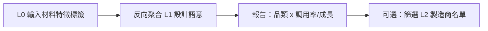
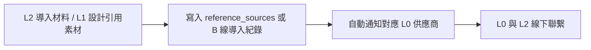

# 供應商逆向意圖檢索（規劃評估）

更新日期：2026-05-26（商機閉環：引用即通知；供應商「引用製造商清單」頁，2026-05-26 決策）  
狀態：**已評估、待排程**（📋 規劃；未實作）  
產品暱稱（內部）：**逆向意圖分析**／**材料驅動市場發現**

---

## 1. 功能定義（不含場景舉例）

**一句話**：上游**產業供應商**在平台後台輸入（或選取）自家**材料／機能特徵標籤**，系統依全站**設計者生成與語意資料**做**反向聚合**，回報「哪些品類／子分類」對該特徵的**設計調用或語意共現**正在上升；供應商可再依品類查看**已上架作品的製造商**名單。實際商機閉環以 **「被引用／被導入」** 為準：**一旦有人引用該供應商的材料，系統自動通知供應商**；**不**另做站內「合作意向」或強制站內溝通（線下自行聯繫即可）。

**方向**：一般趨勢報告是「品類 → 熱門 tag」；本功能是 **「材料 tag → 哪些品類在漲」→ 鎖定製造商**；促成交易靠 **引用事件 + 通知**，不靠額外洽談流程。

---

## 2. 商業邏輯評估

### 2.1 對平台（MatchDO）

| 面向 | 評估 |
|------|------|
| **變現** | 與 **Design Signals**（$300／$900／$1800）高度契合；逆向報告可為 **企業供應商方案** 核心賣點，或單次點數／月配額 |
| **網路效應** | 供應商為推廣自家材料，有動機**拉製造商**上傳作品、導入 `vendor_assets`／B 線目錄 → 補齊 L2 側供給 |
| **數據護城河** | 依賴累積的 `ai_tags`／`ai_tags_by_dimension`、`reference_sources`、素材標籤；越早做預聚合，越難被複製 |
| **與訂製線** | 不取代訂製者設計流；屬 **B2B 情報 + 商機**，與 A 線訂製分離（見 `docs/三角色架構與AB線說明.md`） |

### 2.2 對產業供應商（L0）

| 吸引力 | 說明 |
|--------|------|
| **跨界發現** | 看見自家材料特徵在**非傳統下游品類**的需求升溫（平台代為掃描全站設計語意） |
| **可執行行動** | 報告後查看品類內製造商名單；**實際商機**以「自家材料被引用／被導入」時的**自動通知**為主 |
| **降低業務成本** | 取代部分展會試錯；以數據選品類；線下聯繫製造商，平台不增加洽談摩擦 |

### 2.3 對製造商（L2）

| 面向 | 說明 |
|------|------|
| **使用方式** | 照常**引用／導入**供應商數位材質即可；無需填寫合作意向表單 |
| **溝通** | 與供應商聯繫方式由雙方線下處理，平台不介入對話 |

### 2.4 對設計者（L1）

| 面向 | 說明 |
|------|------|
| **間接受益** | 材料更易進入設計參考庫 |
| **隱私** | 聚合報告應**不含**可識別個人；僅統計與品類維度（見 §6） |

### 2.5 總評（是否值得做）

| 結論 | 說明 |
|------|------|
| **戰略價值：高** | 清楚區隔「生圖工具」與「產業數據／供應鏈情報」；與 `design-signals-tiered-access-plan.md` 同一產品族 |
| **時機：中後期** | 需足夠樣本 + 預聚合表 +（建議）`reference_sources`／素材標籤可關聯；**冷啟動期報告易空** |
| **與 B 線** | 理想資料源含 `supplier_catalog_items`（材料規格）；**B 線未實作前**可先用 `vendor_assets`（`asset_kind=material`）+ 設計端 `reference_sources` 作 MVP |

---

## 3. 運作閉環

### 3.1 情報面（逆向檢索）

| 步驟 | 輸入 | 輸出 |
|------|------|------|
| 1 | 供應商材料 profile（tag 集合、可選 `material_key`） | 查詢條件 |
| 2 | 預聚合趨勢 +（可選）即時共現 | 各 `category_key`／`subcategory_key` 的調用率、週成長、排名 |
| 3 | 報告 UI + 付費牆 | 可匯出／可分享的摘要（依 tier） |
| 4 | 品類 + 門檻（有作品、已認證等） | `manufacturers` 列表（**僅參考**，非必須站內洽談） |

### 3.2 商機面（引用即通知）— **產品決策，不需合作意向模組**

| 原則 | 說明 |
|------|------|
| **閉環事件** | **引用／導入**供應商旗下材料（或可追溯至 `industry_supplier_id` 的目錄項）即視為商機 |
| **必做** | 事件發生時 **自動通知供應商**（站內通知中心、Email 等，通道待 RI-4 定一種以上） |
| **必做（UI）** | 供應商後台提供 **「引用／導入我的材料的製造商」清單頁**（見 §3.3）；通知可連結至該頁 |
| **不做** | 站內「合作意向」表單、強制站內對話、代發洽談訊息 — **避免增加溝通摩擦** |
| **觸發範圍（規劃）** | ① **A 線**：`POST /api/custom-products` 之 `reference_sources` 含該供應商素材（經 `vendor_asset` → 製造商／上游供應商關聯，或 B 線導入後之 `vendor_assets.source_catalog_item_id`）② **B 線**：製造商 **導入** `supplier_catalog_items`（`manufacturer_supplier_imports`） |

**增長飛輪（紀錄重點）**：逆向報告讓 L0 看見機會 → L0 線下拉 L2 上架／導入材料 → L2／L1 **引用** → **自動通知 L0** → L0 在清單頁查看製造商並線下聯繫 → L0 付費意願與資料價值上升。**平台不靠站內洽談產品完成閉環。**

### 3.3 供應商端：引用製造商清單頁（必做）

**產品決策（2026-05-26）**：產業供應商必須能隨時查看 **「有哪些製造商引用／導入過我的材料」**，不限於單次通知；需獨立 **清單頁面**（可與通知中心互相連結）。

| 項目 | 規格 |
|------|------|
| **頁面位置（建議）** | 產業供應商控制台 **`/member/supplier/referencing-manufacturers.html`**（或 `/client/supplier-references.html`）；側欄文案例：**引用我的製造商** |
| **權限** | 僅 `industry_suppliers.user_id = 當前使用者`（或 `is_industry_supplier`）；**製造商、訂製者不可見** |
| **列表粒度** | 預設以 **製造商** 為一列（`manufacturer_id` 去重）；可展開看該廠下的引用明細 |
| **每列建議欄位** | 製造商名稱、公開頁連結（`vendor-profile`）、服務區域（若有）、**最近引用時間**、**引用次數**（期間內）、涉及 **材料／目錄項** 摘要 |
| **明細（展開或二級）** | 事件類型：`import`（B 線導入）／`design_reference`（訂製 `reference_sources`）；`vendor_asset_id` 或 `catalog_item_id`、材料標題、`category_key`、事件時間；**不**顯示訂製者個資／設計圖下載（除非日後另開權限） |
| **篩選** | 時間區間（7／30／90 天）、材料／目錄項、事件類型、品類 |
| **排序** | 預設：最近引用時間 desc；可改引用次數 |
| **與通知** | 每則「材料被引用」通知 deep link 至本頁並可帶 `manufacturer_id` 篩選 |
| **與逆向報告** | §3.1 的「品類內製造商名單」為**情報參考**；本頁為**已發生引用**的真實名單，兩者勿混為同一 API |

**API（規劃草案）**：

| 方法 | 路徑 | 說明 |
|------|------|------|
| `GET` | `/api/me/supplier/referencing-manufacturers` | Query：`from`、`to`、`catalog_item_id`、`event_type`；回傳製造商聚合列 + 可選 `events[]` |
| 資料源 | 同上 §3.2 | `supplier_reference_notifications` 或 `manufacturer_supplier_imports` + 由 `reference_sources`／`vendor_assets.source_catalog_item_id` 反查 `industry_supplier_id` |

**與 §6.2 表**：`supplier_reference_notifications` 同時支撐 **通知去重** 與 **清單頁列表**（避免每次掃 `custom_products` JSONB）。

---

## 4. 角色與現有架構對照

| 規劃用語 | MatchDO 現況 | 備註 |
|----------|--------------|------|
| **L0 產業供應商** | `industry_suppliers` + B 線 `supplier_catalog_items`（**規劃中**） | 逆向後台可掛「設計風向／供應商控制台」 |
| **L1 設計者** | 訂製者生圖 → `custom_products`；語意 `ai_tags`、`ai_tags_by_dimension` | 分析時排除 `is_vendor_self_serve` |
| **L2 製造商** | `manufacturers` + `manufacturer_portfolio` + `vendor_assets` | 名單篩選：該品類已有公開作品／素材 |

**資料線**：訂製引用素材走 **A 線** `reference_sources`；製造商採購材料走 **B 線**（規劃）。逆向檢索應**同時規劃**兩路信號，MVP 可先做「設計端語意 + 成品 tag 共現」，第二階段加「B 線導入次數」。

---

## 5. 與既有規劃的關係

| 文件 | 關係 |
|------|------|
| `docs/design-signals-tiered-access-plan.md` | **共用** `daily_trend_stats` 預聚合；逆向 = 以 **tag 集合為查詢維度** 的專用 API／報告模板 |
| `docs/design-direction-ai-advisor-plan.md` | 顧問偏「單一作品」；逆向偏「供應商材料 × 市場」；可共用 Gemini 解讀層 |
| `docs/design-analysis-material-backtrace.md` | **正向**：設計 → 從引用材料回推需求；**逆向**：材料 tag → 哪些品類在漲。互補，共用 `vendor_assets`／`reference_sources` |
| `docs/matchdo-todo.md` §4 | B 線目錄、**導入制**；導入＝引用事件之一，觸發 L0 通知（非合作意向） |
| `docs/三角色架構與AB線說明.md` | 訂製者不應看到 L0 目錄；逆向報告僅 **L0／高 tier 會員** |

---

## 6. 輕量化資料庫實作（建議）

**原則**：日間請求 **只讀預聚合**；禁止全表掃 `custom_products` JSONB（與 Design Signals §三一致）。

### 6.1 沿用／擴充

| 元件 | 用途 |
|------|------|
| **`daily_trend_stats`**（待建） | 已有草案：`category_key`、`tag_key`、`dimension`、`growth_pct_wow` 等；逆向查詢 = `WHERE tag_key IN (...)` 加總／排序品類 |
| **`custom_products`** | 僅 Cron 寫入聚合時讀；排除 `is_vendor_self_serve`、測試帳號 |
| **`reference_sources` + `vendor_assets`** | 強信號：設計**實際引用**某 `vendor_asset_id`／`material_key` 的次數（需 **MB 系列** 與引用追蹤完善） |
| **供應商材料 profile**（新表，輕量） | 例：`supplier_material_profiles`：`industry_supplier_id`、`tag_keys[]`、`material_keys[]`、`updated_at`；僅存查詢條件，不存大報告 |

### 6.2 可選小表（避免每次重算）

| 表（草案） | 說明 |
|------------|------|
| `material_tag_category_cooccurrence_daily` | `stat_date`、`tag_key`、`category_key`、`subcategory_key`、`hit_count`、`growth_pct_wow` |
| `supplier_reverse_query_log` | 供應商查詢歷史、扣點／方案權限稽核 |
| `supplier_reference_notifications`（可選，輕量） | `industry_supplier_id`、`event_type`（`import`／`design_reference`）、`actor_manufacturer_id`／`custom_product_id`、`vendor_asset_id`、`created_at`、`notified_at`；供去重與通知紀錄 |

### 6.3 製造商名單（即時查詢即可）

- 條件：`manufacturer_portfolio` 或 `vendor_assets` 的 `category_key`／`subcategory_key` 落在報告品類；`show_on_media_wall`／公開狀態依產品規則。
- **不必**為名單每日物化；結果集通常 < 數百筆。

### 6.4 AI 的角色

| 層級 | 是否必要 |
|------|----------|
| **統計層** | 必須；排名、成長率來自 SQL／預聚合 |
| **Gemini 解讀層** | 可選；把聚合結果生成「逆向意圖分析」自然語言摘要（用 `gemini_model_read`，見 `admin-ai-settings-models.md`） |
| **即時全庫掃描** | **避免**；僅在樣本不足時提示「資料不足」 |

---

## 7. 前置條件與缺口（現況）

| 項目 | 狀態 | 對逆向功能的影響 |
|------|------|------------------|
| `ai_tags`／`ai_tags_by_dimension` 覆蓋率 | 部分已寫入（生圖後 enrich） | 樣本少則報告空 |
| `reference_sources` 追蹤引用素材 | 有存欄位，**未**納入聚合 | 無法區分「標籤共現」vs「真實選料」 |
| `daily_trend_stats` + Cron | 未建 | 逆向無法上線 |
| B 線 `industry_suppliers` | 未實作 | L0 後台與材料目錄需 P0 |
| 設計風向 `product_line` | 規劃中 | 可先 `all` 或僅 `custom` |
| **引用 → 通知 L0** | **未實作** | 閉環必做；**不需**合作意向／站內洽談模組 |
| **L0「引用製造商」清單頁** | **未實作** | 與 RI-4 同批；見 §3.3 |

---

## 8. 風險與治理

| 風險 | 緩解 |
|------|------|
| 樣本太少、誤導供應商 | 最低樣本門檻；報告標示信心度；不足時不顯示成長率 |
| 廠商自產刷量 | 聚合排除 `is_vendor_self_serve` |
| 個資／設計外流 | 僅聚合；禁止匯出單一 `owner_id` 或原圖 |
| 通知過多 | L0 可關閉 Email／合併每日摘要；同一對象短時間去重 |
| tag 同義詞 | 查詢前做 tag 正規化（與 `visual-semantics` 中英標籤規則對齊） |

---

## 9. 建議實作階段（RI）

| 階段 | 內容 | 依賴 |
|------|------|------|
| **RI-0** | 規格定案：付費 tier、信號定義（共現 vs 引用）、隱私 | 本檔 |
| **RI-1** | **DS-1** `daily_trend_stats` + Cron（與 Design Signals 共用） | DS-0～DS-2 |
| **RI-2** | API：`POST /api/supplier/reverse-intent`（tag[] → 品類排名 + 成長） | RI-1 |
| **RI-3** | L0 後台 UI（設計風向／供應商區）：輸入標籤、看報告 | B 線 P0 或暫用 admin |
| **RI-4** | **引用事件寫入** + **自動通知 L0** + **清單頁**（§3.3）+ `GET /api/me/supplier/referencing-manufacturers`；通知 deep link 至清單；**不做**合作意向 UI | `reference_sources`、B 線 `manufacturer_supplier_imports`、`supplier_reference_notifications` |
| **RI-5** | 引用強信號：併入 `reference_sources`／`vendor_asset_id` 計數（逆向報告 + 通知去重） | `design-analysis-material-backtrace` MB-1+ |
| **RI-6** | Gemini 摘要層 + 匯出 PDF（$1800 tier） | AD／DS 高階 |

**建議順序**：先 **DS 預聚合** + **材料回推 MB-1**（讓「選料」可計數），再做 **RI-2～RI-3** MVP；**RI-4 可與 B 線導入／訂製儲存同步規劃**（閉環不依逆向報告上線）。勿在未聚合前做「即時 AI 掃全站」。

---

## 10. 決策紀錄（重點摘要）

1. **值得做**：強 B2B 差異化，且能驅動 L0 幫平台拉 L2。  
2. **不是獨立大系統**：應掛在 **Design Signals + B 線供應商** 上，共用 `daily_trend_stats`。  
3. **輕量 DB**：每日預聚合 + 供應商材料 profile 小表；名單即時查；報告可快取。  
4. **與「材料回推需求」互補**：正向（設計→需求）與逆向（材料→品類）共用素材語意基礎。  
5. **暫不實作**：列為後排；前置為語意覆蓋、聚合表、B 線 P0 至少可上架材料。  
6. **商機閉環（2026-05-26）**：**引用／導入即通知供應商**；**不**建合作意向或站內強制溝通；製造商與供應商線下聯繫即可。  
7. **供應商清單頁（2026-05-26）**：必做 **「引用我的製造商」** 列表頁 + API；與通知互連；有別於逆向報告的品類參考名單（§3.3）。

---

## 11. 相關文件

- `docs/matchdo-todo.md`（規格表已引用本檔）  
- `docs/design-signals-tiered-access-plan.md`  
- `docs/design-analysis-material-backtrace.md`  
- `docs/三角色架構與AB線說明.md`
