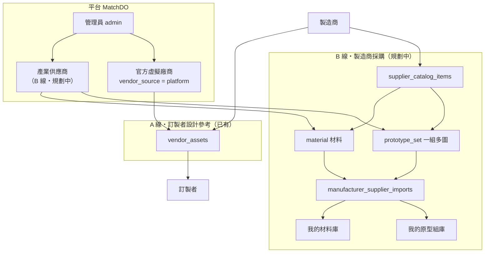
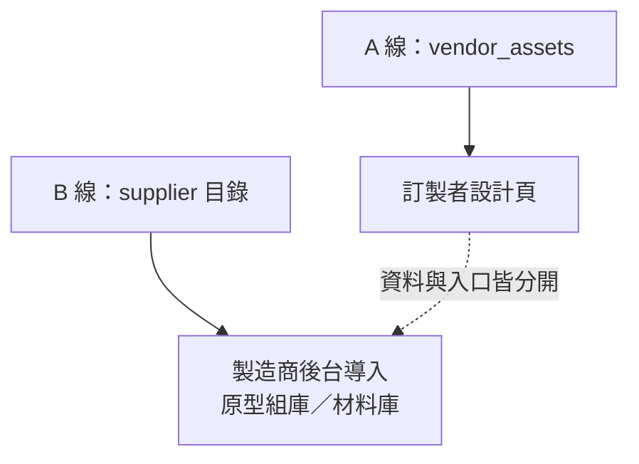

# MatchDO 三角色架構與 A／B 資料線說明

更新：2026-06-01

> **帳號與選單（必讀）**：同一登入、不分角色切換；選單不得依角色隱藏。業務限制僅兩項（免費禁上傳產品／素材；無展示案例禁匯入供應商品項）。詳見 **`docs/account-one-login-capabilities.md`**。

用途：對外／內部說明**訂製者、製造商、產業供應商（與平台官方）**的資料分工與流程（**資料角色**，非帳號身分切換）。

實作狀態：**A 線已有**；**B 線為規劃**（詳見 `docs/matchdo-todo.md` §4，暫未實作）。

---

## 1. 三個角色是誰

| 角色 | 典型帳號 | 主要用途 |
|------|----------|----------|
| **訂製者** | 一般使用者（`profiles.role = user`，未綁廠商） | 產品設計、從廠商素材庫選參考圖、媒體牆收藏 |
| **製造商** | 已建立 `manufacturers` 的帳號 | 對外提供 `vendor_assets`；對內（B 線）導入產業原型組／材料 |
| **產業供應商／平台** | 產業供應商公司；平台以「官方虛擬廠商」營運 | 上架目錄；官方範例給訂製者參考 |

**帳號原則**：不另做「訂製者／製造商」身分切換；同一登入帳號若綁了 `manufacturers` 即具製造商能力，其餘仍是一般使用者行為。僅 **admin** 為特殊管理角色。

---

## 2. 兩條資料線（必讀）

| | **A 線・訂製者設計參考** | **B 線・製造商採購參考** |
|---|--------------------------|---------------------------|
| **資料** | `vendor_assets`（數位版型） | `supplier_catalog_items`（原型組、材料）+ 導入表 |
| **誰維護** | 接單製造商、官方虛擬廠商 | 產業供應商、管理員代上架 |
| **誰使用** | **訂製者** | **製造商**（需至少 1 件 `manufacturer_portfolio`） |
| **入口** | `custom-product.html`、廠商頁「用此廠商版型設計」（`?manufacturer_id=`） | 製造商後台產業目錄、我的原型組庫／我的材料庫 |
| **與對方** | **不相通** | 不進訂製者設計頁、不接 AI 試穿／實境模擬、不因 `?manufacturer_id=` 載入 |
| **狀態** | ✅ 已實作 | ⏳ 規劃中（§4） |

**用語（製造商端）**：B 線一律用 **「導入」**、**「加入我的材料庫」**／**「加入我的原型組庫」**，不用「收藏」，避免與訂製者媒體牆收藏（`media_wall_favorites`）混淆。

---

## 3. 架構總覽



---

## 4. 三角色行為簡圖

```mermaid
flowchart LR
    subgraph R1["① 訂製者"]
        C1["產品設計頁<br/>custom-product.html"]
        C2["媒體牆收藏"]
    end

    subgraph R2["② 製造商"]
        M1["vendor_assets 對外"]
        M2["導入原型組／材料 對內"]
        M3["作品集<br/>manufacturer_portfolio"]
    end

    subgraph R3["③ 產業供應商／平台"]
        S1["上架原型組＋材料<br/>B 線"]
        S2["官方 vendor_assets<br/>A 線"]
    end

    S2 --> M1
    S2 --> C1
    M1 --> C1
    S1 --> M2
    M3 -.->|"展示／靈感牆<br/>非 B 線目錄"| C1
    C1 -.x|"不做"| M2
```

---

## 5. 三層資料對照表

| 類型 | 誰維護 | 誰用 | 資料 |
|------|--------|------|------|
| 訂製者設計參考 | 接單製造商、官方虛擬廠商 | 訂製者 | `vendor_assets` |
| 產業目錄・原型組／材料 | 產業供應商、管理員 | 製造商（有作品門檻） | `supplier_catalog_items` + 導入表 |
| 官方範例版型 | 平台 | 訂製者 | 官方 `manufacturers` + `vendor_assets` |

---

## 6. B 線兩類目錄（規劃）

| 類型 | `item_kind` | 內容 | 製造商導入後 |
|------|-------------|------|--------------|
| **產品的數位原型組** | `prototype_set` | 一組多圖（正面／背面／細節等） | 我的原型組庫 |
| **材料** | `material` | 主圖＋規格（材質、色號、幅寬等） | 我的材料庫 |

同一筆不可同時為原型組與材料；上傳表單須先選類型。

---

## 7. 種子廠商 vs 官方範例（A 線）

| | 種子廠商 `seed` | 官方範例 `platform` |
|---|-----------------|---------------------|
| 建立方式 | `/admin/seed-vendors.html` | 同上建立後，改 `vendor_source` |
| 訂製者能否在素材庫看到 | ❌ 否（僅管理員） | ✅ 是 |
| 廠商本人能否編輯素材 | ❌ 種子期間不得（平台代維護） | ✅ 可（非 seed 限制） |
| 適合用途 | 封測代建、未授權素材 | **公開官方範例、A 線測試** |

---

## 8. A 線官方帳號建議（營運）

| 帳號 | 用途 |
|------|------|
| **管理員** | 登入 `/admin/seed-vendors.html`、`/admin/user-management.html` 代建廠商、代傳素材 |
| **官方專用帳號** | 綁定 `manufacturers.user_id`（例：MatchDO 官方範例）；勿與管理員個人帳混用 |
| **訂製者測試帳** | `role = user` 且未綁廠商；驗證設計頁「從廠商素材庫選」 |

建立官方廠商後請設：`vendor_source = platform`、`expires_at = NULL`。  
操作細節見 `docs/種子廠商入駐操作手冊.md`。

---

## 9. A 線測試步驟摘要

1. 環境：`.env`、本機 `npm start`、Supabase 連線正常。  
2. 建立官方專用帳號 + 管理員代建廠商 → 改 `platform`。  
3. 管理員代傳 `vendor_assets`（或官方帳號至 `/client/manufacturer-materials.html`）。  
4. 訂製者測試帳 → `/custom-product.html` → 從廠商素材庫選圖。  
5. 可選：`/vendor-profile.html?id=...` →「用此廠商版型設計」→ 僅載入該廠 `vendor_assets`。

---

## 10. 實施順序建議

1. **先測 A 線**：官方廠商 → `vendor_assets` → 訂製者設計流程。  
2. **再實作 B 線**：`industry_suppliers`、目錄上架、製造商後台導入（`matchdo-todo.md` §4 P0～P1）。

---

## 11. 兩條線不相通（示意）



---

## 12. 相關文件

| 文件 | 說明 |
|------|------|
| `docs/matchdo-todo.md` §4 | 產業供應商、製造商採購庫、官方虛擬廠商規劃 |
| `docs/matchdo-todo.md` §5 | **會員後台**：三角色介面分離、導覽、會員中心 IA（規劃中） |
| `docs/matchdo-todo.md` §6 | **數位原型**：Gemini 自動標籤（必要）、重繪產品圖（可選）、首頁標籤搜尋＋小圖示（規劃中） |
| `docs/種子廠商入駐操作手冊.md` | 管理員代建廠商與代傳素材（A 線操作） |
| `docs/設計與開店路徑-廠商素材庫規格.md` | `vendor_assets` 規格與實作順序 |
| `docs/網站完整功能說明.md` | 全站功能與路徑一覽 |
